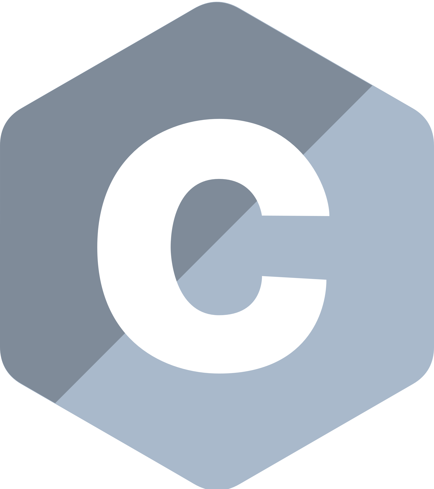
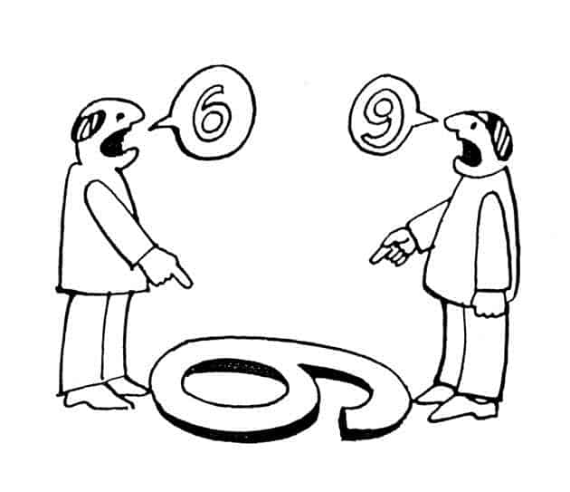
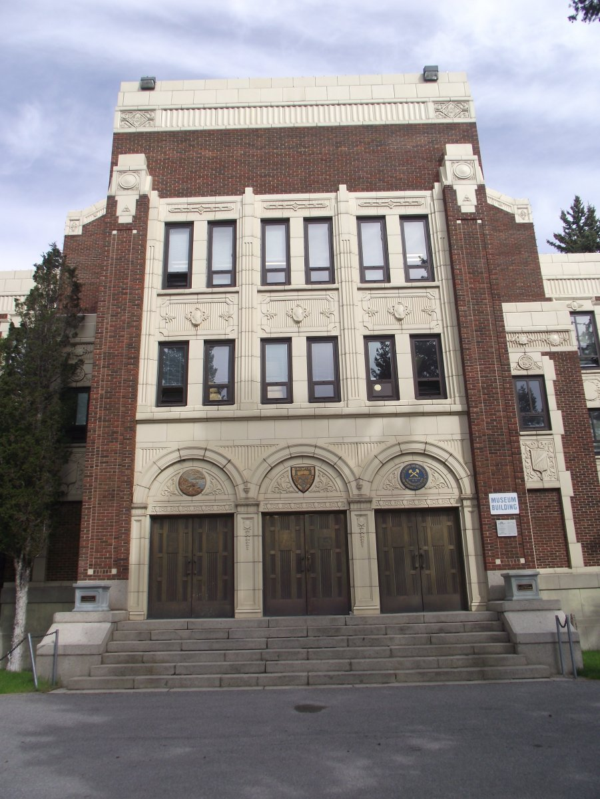
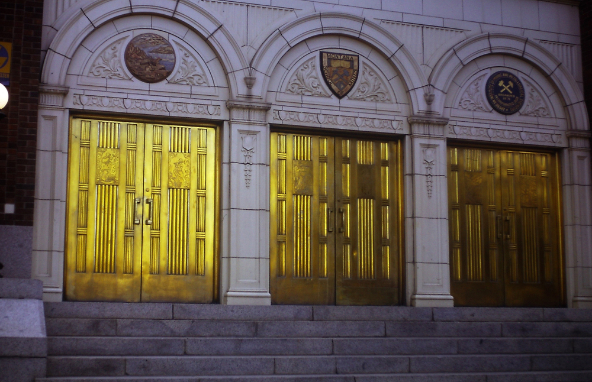
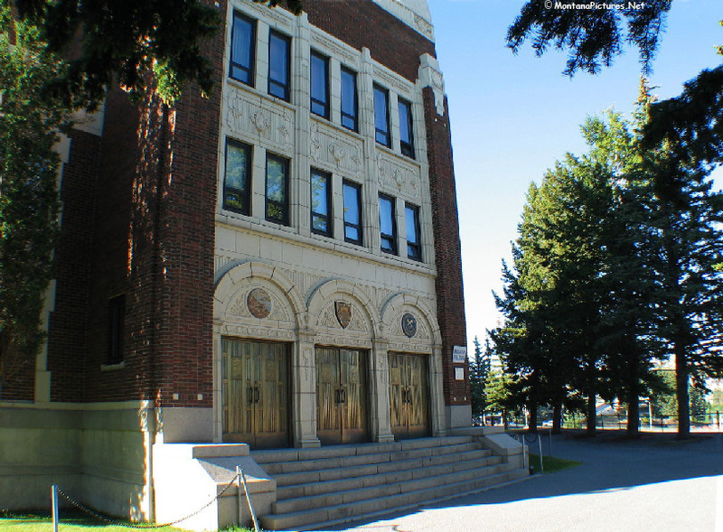

# CSCI 112  Programming with C

- Lecture 1
- Dr. Jakub L. Pach
- Fall 2025

---

---

## Outline

- Syllabus, Textbook, Canvas
- Introduction
- History of C
- Positional notation
- IDE
- Hello World
- Compiler vs Interpreter

---

## Some basic facts about the course

Course:    CSCI 112

Course Name:    Programming in C

Credit Hours:    3 credits

- 1 hour lecture twice a week
- 3 hours lab per week
- Semester: Fall 2025

Dates and Location:

- Lecture meets on Mondays and Fridays.
  - Time:
    - 12:00 pm – 12:50 pm
  - Location:
    - Science &amp; Engineering Building (S&amp;E) 308
- Lab meets on Monday
  - Time:
    - 2:00 pm – 4:50 pm
  - Location:
    - Engineering Lab/Classroom Building (ELC) 315

---

## Syllabus

- Course Description
- Textbooks
- Class Rules
- Grading
- Accommodations &amp; Academic Dishonesty
- Declaration of authorship
- You can find the syllabus and other information on Canvas.

<!-- A quick look at the syllabus … -->

---

## Syllabus - Course Description

This course provides a comprehensive introduction to structured programming using the C language. Student will gain a deep understanding of memory management techniques such as pointers and dynamic allocation. The skills acquired in this course will be essential for those who wish to pursue further studies in languages like C++, C#, and Java, as well as microcontroller programming. Additionally, this course will lay a strong foundation for understanding computer architecture.

---

## …a few words

This course is designed for students in Computer Science (CS), Software Engineering (SE), and Electronics programs. No prior programming experience is required — only basic computer literacy, such as using a web browser, email, and navigating the MS Windows environment.

<!-- This course is designed for students in **Computer Science (CS)**, **Software Engineering (SE)**, and **Electronics** programs. No prior programming experience is required — only basic computer literacy, such as using a web browser, email, and navigating the **MS Windows** environment.
The course covers the following topics:
**History and evolution of the C language**: from ANSI C89 through C99 to the latest C23 standard.
**Positional numeral systems** and data representation in binary, octal, and hexadecimal formats.
**Data types**: memory sizes, pointers, arrays, structures, unions, and enumerations.
**Operators**: arithmetic, logical, bitwise, assignment, and conditional — including precedence and associativity.
**Expressions vs. statements** and their impact on program state.
**Input/output formatting**: printf, scanf, fgets, fputs, sprintf, sscanf.
**Memory management**: dynamic allocation with malloc, calloc, realloc, free, and memory fragmentation.
**Debugging**, Makefile usage, and organizing code into .h and .c files.
**Structured programming**: functions, variable scope, and passing by value vs. by reference.
**Preprocessor directives**: #define, #include, #ifdef, #ifndef, #error, #pragma.
The course is taught with a strong emphasis on **practical understanding** of how the C language works and how it is used in **low-level and systems programming**. -->

---

## Syllabus - Textbooks

- Brian W. Kernighan, Dennis M. Ritchie. C Programming Language, 2nd Edition. Prentice Hall, 1988
- Seacord, R. C. (2024). Effective C: An Introduction to Professional C Programming. No Starch Press, Inc. (Optional)

- Dennis M. Ritchie

<!-- the co-author of this book is the creator of this language!
In the past, textbooks were the primary source of knowledge in higher education. Lectures and labs were just a small supplement to the content found in textbooks. With the advancement of technology, presentations have become the primary source of information for students, and only the most curious students seek additional content in textbooks recommended by professors. -->

---

## ANSI(C89) vs C99

- Last year, the course was taught using the oldest and most widely adopted ANSI standard — C89. This choice was made because C89 does not include many of the conveniences introduced in later versions. While these conveniences make life easier for professional programmers, they can make it harder for beginners to fully grasp the fundamentals of programming in C.
- The standard now used in our classes is **C99**, which is widely applied in embedded systems, especially in the field of electronics. This standard significantly lowers the entry barrier for beginners (for example, allowing variable declarations inside a for loop and supporting single-line comments //), while avoiding the complex and sometimes confusing features introduced in newer standards. The most recent C standard is currently C23 (2023).

---

## Syllabus Class Rules

**Class Rules:**

- This course is an in-person course.
- Attendance at every class is required.
- Excused Absences. If there is any medical or any other kind of emergency, please let the instructor know immediately. Makeup exams will only be given if you bring a valid medical documentation.
- Each task without a sample required comment (below) is worth **zero points**.

---

## Syllabus - Grading

The course grade will be determined by two equally weighted components:

- the lecture component (40%)
- the laboratory component (60%).
- The laboratory component will be evaluated based on three criteria:
  - entrance quiz (30%),
  - assignment (40%),
  - brief concluding quiz (30%).

---

## Syllabus - Grading

**Lecture:**

The lecture grade will be calculated as the average of two midterm exams. Students will have one opportunity to retake each midterm exam. The final grade for a midterm exam will be the average of the two attempts.

**Laboratory:**

Each lab may include the following components: entrance quiz, assignment, and brief concluding quiz. Not all components are guaranteed to be present in every lab session.

---

## Syllabus – Laboratory Rules

**Entrance Quiz (optional):**

If included, the entrance quiz will consist of 3 questions. To pass, a student must score at least 2 points. Failed entrance quizzes may be retaken up to two times during the semester. Only failed quizzes can be retaken.

**Assignment:**

Students will have 6 days to complete and submit their assignment.

**Brief Concluding Quiz (optional):**

If included, this quiz serves as a summative assessment component, reinforcing the material covered during the lab session.

---

## Syllabus - Details

- Accommodations:

Students who need any type of accommodation should work with Montana Tech Disability Services and provide appropriate documentation as soon as possible.

- Academic Dishonesty:

You are encouraged to work in teams and use many resources including books and the Internet.  However, each student must turn in his/her own work, and each student is responsible for understanding anything that is turned in. Refer to the Student Conduct Code for more information regarding plagiarism and cheating.

---

## Syllabus Declaration of authorship

*I acknowledge that I have worked on this assignment independently, except where explicitly noted and referenced. Any collaboration or use of external resources has been properly cited. I am fully aware of the consequences of academic dishonesty and agree to abide by the university's academic integrity policy. I understand the importance the consequences of plagiarism.*

---

## Syllabus Comments

**Comments:**

- There must be 4 lines of comments at the top of each source file. This heading should include your name, the class and semester, and the assignment number, and required statement. Source file without this comment gets **zero** points.

**Template:**

//Jakub Leszek Pach

//CSCI 112 Fall 2025

//Programming Assignment #1

//I acknowledge that I have worked on this assignment independently, except where explicitly noted and referenced. Any collaboration or use of external resources has been properly cited. I am fully aware of the consequences of academic dishonesty and agree to abide by the university's academic integrity policy. I understand the importance the consequences of plagiarism.

---

## Canvas

Lecture &amp; Laboratory:

(76078) CSCI 112 Sec 01 :Programming with C

- Check if you are registered for the course and have access to it!

---

# Introduction

---

## Meaning of words

- Sometimes, when we look at the same thing, we see entirely different things. Therefore, to avoid misunderstandings, I will spend a considerable amount of time clarifying the nuances associated with translating the meanings of the concepts we will be using in our classes.
- All the material presented in this course will be of practical use.

---

## The Pareto Principle

To illustrate my point, let's use a metaphor. You don't need to enroll in a computer science degree to learn programming. You can find online courses on YouTube and master certain programming elements quite quickly. According to the Pareto Principle:

80% of the results can be achieved in 20% of the time, However, the remaining 20% takes up 80% of the time.

What sets a professional apart from a beginner?

You'll see shortly.

---

## Highlands College (new Campus)

---

## Old Campus

---

## Highlands College &amp; Old Campus

- Doors

---

## Highlands College &amp; Old Campus

- Windows

---

## Old, but gold

---

## Conclusions

These doors and those doors serve their purpose, these windows and those windows serve their purpose, and those buildings and these buildings also serve their purpose. However, do you see the difference? The museum building has stood for 100 years and will stand for another 200. In my class, I want to show you the art, everything I have learned from over two decades of studying computer architecture and all the programming languages I have mastered. If your goal is to write correct code, great, just like the new campus building, I will teach you. If you want to understand the nuances, the reasons why certain mechanisms were designed in a certain way, and you are thirsty for knowledge, I will give you everything I have, because I am here for you, student, but ... *It takes blood, sweat, and tears.*

---

## Compiler vs Interpreter

- A compiler takes the entire source code and translates it into a machine code file, often called an executable. This executable file contains instructions that the computer's processor can directly execute. Once compiled, the program can run independently without the need for the original source code or a compiler.
- An interpreter translates the source code line by line as the program is running. It doesn't create a separate executable file. Instead, it uses a virtual machine to execute the translated code. The virtual machine provides an environment that mimics a real computer, allowing the program to run even if the underlying hardware architecture is different

Think of a compiler as a translator who translates an entire book from one language to another before you start reading it. An interpreter, on the other hand, is a translator who translates each sentence as you read it. A compiler translates the entire program at once, while an interpreter translates it line by line.

---

## History of C

Similarly, in music, we first learn to read sheet music, and only after mastering the basics can we investigate  into the history and evolution of musical notation. In this course, we'll follow a similar approach. We'll start by learning how to write code in C, and we'll save the history of the C language for later, once you have gained significant experience. Then, we can explore the origins of certain language constructs.

<!-- Sinusoidalnosc zwiazana z typami i ich brak w przodku C -->

---

## Bit &amp; Byte

- A **bit** is the smallest unit of data in a computer, representing a single binary value: either a **0** or a **1**.
- A **byte** is a group of eight bits. A single byte can represent a wide range of values, such as a single character (like the letter 'A' or the symbol '@') or an integer from 0 to 255.

---

# Positional notation

---

## Positional notation  (place-value notation, positional numeral system)

- usually means the extension to any base (2, …, 8,10,16 etc.) of the Hindu–Arabic numeral system (or decimal system).
- a positional system is a numeral system in which the contribution of a digit to the value of a number is the value of the digit multiplied by a factor determined by the position of the digit.
- In modern positional systems, such as the decimal system, the position of the digit means that its value must be multiplied by some value: in 444, the three identical symbols represent four hundreds, four tens, and four units, respectively, due to their different positions in the digit string.

<!-- In early numeral systems, such as Roman numerals, a digit has only one value: I means one, X means ten and C a hundred (however, the value may be negated if placed before another digit). -->

---

## Base of the numeral system

- In mathematical numeral systems the radix r is usually the number of unique digits, including zero, that a positional numeral system uses to represent numbers.
- The highest symbol of a positional numeral system usually has the value one less than the value of the radix of that numeral system. The standard positional numeral systems differ from one another only in the base they use.
- The radix is an integer that is greater than 1, since a radix of zero would not have any digits, and a radix of 1 would only have the zero digit.

<!-- For example, for the decimal system the radix (and base) is ten, because it uses the ten digits from 0 through 9. When a number "hits" 9, the next number will not be another different symbol, but a "1" followed by a "0". In binary, the radix is two, since after it hits "1", instead of "2" or another written symbol, it jumps straight to "10", followed by "11" and "100". -->

---

## Binary numeral system

<!-- Why do we start from position zero, not one? Because any number raised to the power of zero always equals one!
2 raised to the power of 3 is 8.
R-value with an index of 2
"123 in base ten is equal to (ten to the power of two times one) plus (ten to the power of one times two) plus (ten to the power of zero times three)" -->

---

## Converting decimal numbers to binary

Steps:

- Divide the decimal number by 2. The remainder of the division will be either 0 or 1.
- If the remainder is 0, write down a 0.
- If the remainder is 1, write down a 1.
- Repeat steps 2 and 3 until the decimal number is 0.
- Read the numbers **from bottom to top** to get the binary number.

---

## Converting decimal numbers to binary – example 12310

- 123 / 2 = 61 (remainder 1)
- Write down a 1.
- 61 / 2 = 30 (remainder 1)
- Write down a 1.
- 30 / 2 = 15 (remainder 0)
- Write down a 0.
- 15 / 2 = 7 (remainder 1)
- Write down a 1.
- 7 / 2 = 3 (remainder 1)
- Write down a 1.
- 3 / 2 = 1 (remainder 1)
- Write down a 1.
- 1 / 2 = 0 (remainder 1)
- Write down a 1.

The decimal number 123 is equal to the binary number 1111011.

<!-- Step-by-step conversion of 123 to binary:
Divide 123 (One hundred and twenty-three ) by 2. We get 61 with a remainder of 1. This means the highest power of 2 in 123 is 2^6 (or 64) and it's present once (write down a 1).
Divide 61 by 2. We get 30 with a remainder of 1. This means the next highest power of 2 in 123 is 2^5 (or 32) and it's present once (write down another 1).
We continue dividing the quotients (30, 15, 7, 3, 1) by 2, writing down a 1 if there's a remainder and a 0 if not.
Stop when the quotient is 0. This final 0 indicates that none of the remaining powers of 2 are present in 123.
Read the digits from bottom to top. T
his gives us the binary representation of 123: 1111011.
So, we converted 123 to binary by successively checking which powers of 2 are present in it, starting with the highest. Each remainder of 1 signifies a specific power of 2 and we record it as a 1 in the binary number. Remember to read the digits from the bottom up for the final conversion! -->

---

## Converting binary numbers to oct – example 1111011(2)

- 001.111.011    = 1.7.3
- 0111.1011    = 7.B

|Radix|Value|Binary Value|Symbol|
|---|---|---|---|
|Octal|0|0000|0|
|Octal|1|0001|1|
|Octal|2|0010|2|
|Octal|3|0011|3|
|Octal|4|0100|4|
|Octal|5|0101|5|
|Octal|6|0110|6|
|Octal|7|0111|7|
|Hexadecimal|8|1000|8|
|Hexadecimal|9|1001|9|
|Hexadecimal|10|1010|A|
|Hexadecimal|11|1011|B|
|Hexadecimal|12|1100|C|
|Hexadecimal|13|1101|D|
|Hexadecimal|14|1110|E|
|Hexadecimal|15|1111|F|

<!-- "Because in positional systems it doesn't matter if we add zeros to the left side, we can add as many as we need to get the appropriate length of our number. The only thing you need to do is to group your number into groups of 3 digits when you want to convert it to octal, and if you want to convert it to hexadecimal, you need to group it into groups of 4." -->

---

## Binary numeral system (Unsigned arithmetic)

|||||||||||
|---|---|---|---|---|---|---|---|---|---|
|||||||||||
|||||||||||
|-255||-127||0||127||255||

|||||||||||
|---|---|---|---|---|---|---|---|---|---|
|||||||||||
|||||||||||
|-255||-127||0||127||255||

|1|1|1|1|1|1|1|1|
|---|---|---|---|---|---|---|---|

|**S**|1|1|1|1|1|1|1|
|---|---|---|---|---|---|---|---|

most significant bit

MSB

LSB

least significant bit

**Sign-Magnitude Representation**

---

## Data in a computer can essentially be stored using two standards

- integers represented in binary,
- real (floating-point) numbers stored according to the IEEE 754 standard.

Everything else is a combination or interpretation based on these two fundamental forms of representation.

---

# Integrated development environment

---

## IDE

- Code::Blocks
- Visual Studio Code
- Visual Studio

---

## Hello World

- Code
- Preprocessor
- \#include &lt;stdio.h&gt;
- int main()
- {

char string\[12\] = "Hello world";

printf("%s", string);

- return 0;
- }

---

## Hello World

- Text preceded by # is a preprocessor section, the first line gives access to standard input and output functions, this is a header.
- Next, we have the main function defined, which returns an integer value. The {} brackets start and end the body of the main function.
- The printf function displays the string "Hello world" on the console.
- The printf function does not move the cursor to the next line, so it is necessary to add the newline character '\n'.
- \#include &lt;stdio.h&gt;
- int main()
- {

char string\[12\] = "Hello world";

printf("%s", string);

- return 0;
- }
- Hello world
- Result:

---

## Hello World

- Text preceded by # is a preprocessor section, the first line gives access to standard input and output functions, this is a header.
- Next, we have the main function defined, which returns an integer value. The {} brackets start and end the body of the main function.
- The printf function displays the string "Hello world" on the console.
- \#include &lt;stdio.h&gt;
- int main()
- {

char string\[12\] = "Hello world";

printf("%s", string);

- return 0;
- }
- Hello world
- Result:

---

## Hello World

printf() is a function and has two sides:

- Left side "%s" – format string:
  - This is the “printing plan” — text + special placeholders (%s, %d, %f, etc.) that tell printf() how to insert values into specific places.
  - In "%s", the % means “this is not just plain text,” but an instruction: “take the data from the right side and display it in the format specified on the left side — in this case, as a string.
- Right side string – data to insert:
  - This is the variable or value that printf() will “plug in” where %s is. In this example, printf() reads all the characters of the string from the first to the last.

char string\[12\] = "Hello world";

printf("%s", string);

---

## Semicolon

- In the C programming language statements for the compiler (interpreter in Python) is separated by a semicolon ;. Therefore, in C, you can write an entire program on one line...

\#include &lt;stdio.h&gt; int main(){char string\[12\] = "Hello world"; printf("%s", string); return 0;}

---

## Indentation &amp; parentheses

- \#include &lt;stdio.h&gt;
- int main()
- {

char string\[12\] = "Hello world";

printf("%s", string);

- return 0;
- }
- Proper indentation is essential for making C code readable,
- Formatting is mandatory in Python, but not required here – We are talking about the compiler, because in our classes formatting is mandatory in order to get a positive grade at all.
- opening bracket
- text indent
- closing bracket

---

## Indentation &amp; parentheses

- but...
- \#include &lt;stdio.h&gt;
- int main()
- {

char string\[12\] = "Hello world";

printf("%s", string);

- return 0;
- }
- \#include &lt;stdio.h&gt;
- int main(){

char string\[12\] = "Hello world";

printf("%s", string);

- return 0;
- }

---

## Comments

- int main()
- {

  char string\[12\] = /\* inline comment \*/  "Hello world";

  printf("%s", string);  /\* comment behind the line \*/

-   /\* a comment
-   composed of
-   a few lines \*/
-     return 0; // single-line comments
- }
- /\* comment \*/ &amp; // comment

---

# Thank you

- Jakub Leszek Pach
- <jpach@mtech.edu>

---

## Summary calego wykladu

---

<!-- pptx2marp: slide 51 has no extractable text or images -->

---

<!-- pptx2marp: slide 52 has no extractable text or images -->
