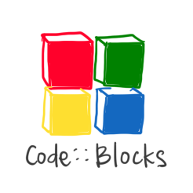
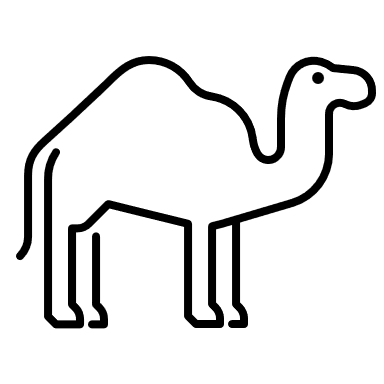
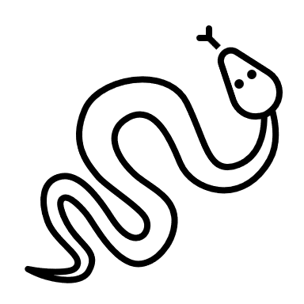

# CSCI 112  Programming with C

- Lecture 3
- Dr. Jakub L. Pach
- Fall 2025

---

---

## Outline

- Syllabus, Textbook, Canvas
- Introduction
- History of C
- Positional notation
- IDE
- Hello World
- Compiler vs Interpreter

---

# Review

---

## Bit &amp; Byte

- A **bit** is the smallest unit of data in a computer, representing a single binary value: either a **0** or a **1**.
- A **byte** is a group of eight bits. A single byte can represent a wide range of values, such as a single character (like the letter 'A' or the symbol '@') or an integer from 0 to 255.

---

## Binary numeral system

<!-- Why do we start from position zero, not one? Because any number raised to the power of zero always equals one!
2 raised to the power of 3 is 8.
R-value with an index of 2
"123 in base ten is equal to (ten to the power of two times one) plus (ten to the power of one times two) plus (ten to the power of zero times three)" -->

---

## Converting binary numbers to oct – example 1111011(2)

- 001.111.011    = 1.7.3
- 0111.1011    = 7.B

|Radix|Value|Binary Value|Symbol|
|---|---|---|---|
|Octal|0|0000|0|
|Octal|1|0001|1|
|Octal|2|0010|2|
|Octal|3|0011|3|
|Octal|4|0100|4|
|Octal|5|0101|5|
|Octal|6|0110|6|
|Octal|7|0111|7|
|Hexadecimal|8|1000|8|
|Hexadecimal|9|1001|9|
|Hexadecimal|10|1010|A|
|Hexadecimal|11|1011|B|
|Hexadecimal|12|1100|C|
|Hexadecimal|13|1101|D|
|Hexadecimal|14|1110|E|
|Hexadecimal|15|1111|F|

<!-- "Because in positional systems it doesn't matter if we add zeros to the left side, we can add as many as we need to get the appropriate length of our number. The only thing you need to do is to group your number into groups of 3 digits when you want to convert it to octal, and if you want to convert it to hexadecimal, you need to group it into groups of 4." -->

---

## Binary numeral system (Unsigned arithmetic)

|||||||||||
|---|---|---|---|---|---|---|---|---|---|
|||||||||||
|||||||||||
|-255||-127||0||127||255||

|||||||||||
|---|---|---|---|---|---|---|---|---|---|
|||||||||||
|||||||||||
|-255||-127||0||127||255||

|1|1|1|1|1|1|1|1|
|---|---|---|---|---|---|---|---|

|**S**|1|1|1|1|1|1|1|
|---|---|---|---|---|---|---|---|

most significant bit

MSB

LSB

least significant bit

**Sign-Magnitude Representation**

---

# Integrated development environment

---

## IDE

- Code::Blocks
- Visual Studio Code
- Visual Studio

---

## Hello World

- Code
- Preprocessor
- \#include &lt;stdio.h&gt;
- int main()
- {

char string\[12\] = "Hello world";

printf("%s", string);

- return 0;
- }

---

## Hello World

- Text preceded by # is a preprocessor section, the first line gives access to standard input and output functions, this is a header.
- Next, we have the main function defined, which returns an integer value. The {} brackets start and end the body of the main function.
- The printf function displays the string "Hello world" on the console.
- The printf function does not move the cursor to the next line, so it is necessary to add the newline character '\n'.
- \#include &lt;stdio.h&gt;
- int main()
- {

char string\[12\] = "Hello world";

printf("%s", string);

- return 0;
- }
- Hello world
- Result:

---

## Hello World

- Text preceded by # is a preprocessor section, the first line gives access to standard input and output functions, this is a header.
- Next, we have the main function defined, which returns an integer value. The {} brackets start and end the body of the main function.
- The printf function displays the string "Hello world" on the console.
- \#include &lt;stdio.h&gt;
- int main()
- {

char string\[12\] = "Hello world";

printf("%s", string);

- return 0;
- }
- Hello world
- Result:

---

## Hello World

printf() is a function and has two sides:

- Left side "%s" – format string:
  - This is the “printing plan” — text + special placeholders (%s, %d, %f, etc.) that tell printf() how to insert values into specific places.
  - In "%s", the % means “this is not just plain text,” but an instruction: “take the data from the right side and display it in the format specified on the left side — in this case, as a string.
- Right side string – data to insert:
  - This is the variable or value that printf() will “plug in” where %s is. In this example, printf() reads all the characters of the string from the first to the last.

char string\[12\] = "Hello world";

printf("%s", string);

---

## Semicolon

- In the C programming language statements for the compiler (interpreter in Python) is separated by a semicolon ;. Therefore, in C, you can write an entire program on one line...

\#include &lt;stdio.h&gt; int main(){char string\[12\] = "Hello world"; printf("%s", string); return 0;}

---

## Indentation &amp; parentheses

- \#include &lt;stdio.h&gt;
- int main()
- {

char string\[12\] = "Hello world";

printf("%s", string);

- return 0;
- }
- Proper indentation is essential for making C code readable,
- Formatting is mandatory in Python, but not required here – We are talking about the compiler, because in our classes formatting is mandatory in order to get a positive grade at all.
- opening bracket
- text indent
- closing bracket

---

## Indentation &amp; parentheses

- but...
- \#include &lt;stdio.h&gt;
- int main()
- {

char string\[12\] = "Hello world";

printf("%s", string);

- return 0;
- }
- \#include &lt;stdio.h&gt;
- int main(){

char string\[12\] = "Hello world";

printf("%s", string);

- return 0;
- }

---

## Comments

- int main()
- {

  char string\[12\] = /\* inline comment \*/  "Hello world";

  printf("%s", string);  /\* comment behind the line \*/

-   /\* a comment
-   composed of
-   a few lines \*/
-     return 0; // single-line comments
- }
- /\* comment \*/ &amp; // comment

---

# Symbolic Name

---

## What is an address?

- **Address of University:**
- 1300 W Park St, Butte, MT 59701

---

## What is an address?

- Address is an identifier  (symbolic name) of location
- A place to locate what we refer to
- **Address of University:**
- 1300 W Park St, Butte, MT 59701

---

## What is a name of variable?

- int main()
- {
-   char\* text = "Hello world\n";
-    printf(text);
-      return 0;
- }

In C:

- a variable name is a **symbolic name**, and when translating the code, the compiler will replace the variable name with the memory location of the data associate
- every **symbolic name** is an alias for a memory location (address) except for preprocessor instructions

---

## What is a name of variable?

In C:

- a variable name is a **symbolic name**, and when translating the code, the compiler will replace the variable name with the memory location of the data associate
- every **symbolic name** is an alias for a memory location (address) except for preprocessor instructions
- int main()
- {
-   char\* text = "Hello world\n";
-    printf(text);
-      return 0;
- }

---

## Symbolic names will be used in

- Variables:    Symbolic names will be used to identify and refer to data stored in variables. This     allows for more meaningful and descriptive code compared to using arbitrary names or      identifiers.
- Arrays:     Symbolic names will be used to identify collections of related data elements. Arrays can be used      to store multiple values of the same data type.
- Functions:    Symbolic names will be used to identify and call functions within the program. This helps in      organizing and structuring the code, making it easier to understand and maintain.
- Labels\*:    Symbolic names will be used to mark specific locations or points within the program code.      These labels can be used for various purposes, such as control flow statements, data references,      or error handling.
- \*In Python we don’t have labels.

---

## Restrictions on symbolic name

- The first character must be a letter, underscore "\_", or special character “@, #, $”\*
- The remaining characters can be letters, digits, underscores
- cannot contain spaces
- cannot be C language keywords ( for example. for, while, etc.)

\* Only variable or function names

---

## camelCase vs snake\_case for symbolic names

- camelCase starts each word with a capital letter, except for the first word.
  - For example, thisIsCamelCase.
- snake\_case uses underscores to separate words and all letters are lowercase.
  - For example, this\_is\_snake\_case.

Regardless of the specific coding style, it's common practice to start variable and function names with a lowercase letter. When using snake\_case, we use underscores to separate words, like my\_variable.

Constants, which are values that don't change, are usually written in all uppercase letters, such as MAX\_VALUE

---

## Symbolic names will be used in

- Variables:    Symbolic names will be used to identify and refer to data stored in variables. This     allows for more meaningful and descriptive code compared to using arbitrary names or      identifiers.
- \*In Python we don’t have labels.
- Arrays:     Symbolic names will be used to identify collections of related data elements. Arrays can be used      to store multiple values of the same data type.
- Functions:    Symbolic names will be used to identify and call functions within the program. This helps in      organizing and structuring the code, making it easier to understand and maintain.
- Labels\*:    Symbolic names will be used to mark specific locations or points within the program code.      These labels can be used for various purposes, such as control flow statements, data references,      or error handling.

---

# Variables

---

## Declaring and initializing variables

- int main()
- {
-   int p;        /\* Declaration of variable p with a size of 4 bytes \*/
-   int q, r, s;  /\* Simultaneous declaration of variables q, r, s using "," \*/
-   q = 2;        /\* Assignment of value to variable q - initialization \*/
-   r = q = s;    /\* Assignment of values to q and s based on r \*/
-   int t = 3;    /\* Declaration and initialization on the same line \*/
-    char v;       /\* Variable v of integer type with a size of 1 byte \*/
-   short int w;  /\* Variable w of integer type with a size of 2 bytes \*/
-   long int x;   /\* Variable x of integer type with a size of 4 bytes \*/
-   short y;      /\* Shorthand declaration for short int \*/
-   long z;       /\* Shorthand declaration for long int \*/
-    float  a = 3.16f;    /\* Variable a of floating-point type with a size of 4 bytes \*/
-   double b = a \* 3.0; /\* Variable b of floating-point type with a size of 8 bytes \*/
-   /\* Note: short float, long float, and short double do not exist in C \*/
-   long double d;      /\* Variable d of floating-point type with a size of 12 bytes \*/
- }

---

## Declaring and initializing variables

- int main()
- {
-   int p;        /\* Declaration of variable p with a size of 4 bytes \*/
-   int q, r, s;  /\* Simultaneous declaration of variables q, r, s using "," \*/
-   q = 2;        /\* Assignment of value to variable q - initialization \*/
-   r = q = s;    /\* Assignment of values to q and s based on r \*/
-   int t = 3;    /\* Declaration and initialization on the same line \*/
-   return 0; }
- int == long int

---

## Declaring and initializing variables

- int main()
- {
-   char v;              /\* Variable v of integer type with a size of 1 byte \*/
-   short int w;         /\* Variable w of integer type with a size of 2 bytes \*/
-   long int x;          /\* Variable x of integer type with a size of 4 bytes \*/
-   short y;             /\* Shorthand declaration for short int \*/
-   long z;              /\* Shorthand declaration for long int \*/
-   return 0; }
- short == short int
- long  == long int == int

---

## Declaring and initializing variables

- int main()
- {
-   float  a = 3.16f;    /\* Variable a of floating-point type with a size of 4 bytes \*/
-   double b = a \* 3.0;  /\* Variable b of floating-point type with a size of 8 bytes \*/
-                    /\* Note: short float, long float, and short double do not exist in C \*/
-   long double d;       /\* Variable d of floating-point type with a size of 12 bytes \*/
- }

---

## Declaring and initializing variables

- Any variable must be declared before use.
- Unlike Python, C requires explicit type declaration for variables\*
- to write integers we use the type char(1B), short integer(2B) or long integer(4B)
- write real numbers float(4B), double(8B) or long double(12B)
- An uninitialized variable takes the random value
- \*there is an auto keyword, but it is not allowed in the entire programming course!

---

## Two words about floating-point representation

Operations on real numbers are recorded with only a certain degree of precision, and therefore there is a very high probability that the result of (a + b – c) will not be the same as (a - c + b) ! This means that using real numbers requires careful consideration.

<!-- but more on that in another course - namely, computer architecture. -->

---

## A few words about pointers

- **POINTERS ARE TREATED AS FIRST-CLASS DATA TYPES**
- We can create a pointer to **any** data type using the \* operator between the existing data type and the symbolic name. Unary Operator &amp; returns memory locations
- A pointer in C is a reference to a specific memory location
- int main()
- {
-   short int p;        /\* Declaration of variable p with a size of 2 bytes \*/
-   short int \* q = &amp;p; /\* Declaration and initialization of pointer q with a size of 4 bytes
-                          (even though it points to short int) \*/
-   float\*r;            /\* Declaration of pointer r to float  \*/
-   char\* s;            /\* Declaration of pointer s to char  \*/
-   int t, \*v;          /\* Declaration of variable t and pointer v \*/
-   short int\* w, z;    /\* Declaration of pointer w to short int and variable z \*/
-   /\*"Note that the variable type is determined by the position of the asterisk ('\*') in the    declaration. Only the variable directly following the asterisk is considered a pointer. \*/
- }

<!-- The size of a pointer is 4 bytes on 32-bit platforms
asterisk -->

---

## Summary of memory size of data types

|Type|Memory size in bytes / bits|
|---|---|
|char|01 Bytes / 08 bits|
|bool\*|01 Bytes / 08 bits|
|short int|02 Bytes / 16 bits|
|long int|04 Bytes / 32 bits|
|float|04 Bytes / 32 bits|
|double|08 Bytes / 64 bits|
|long double|12 Bytes / 96 bits|
|pointer (char\*, short\*, long\*, int\*, float\*, double\*, long double\*, void\*, …)|04 Bytes / 32 bits|
|user defined (struct, unions, etc. )|complex|

- \*from C99

---

## Symbolic names will be used in

- Variables:    Symbolic names will be used to identify and refer to data stored in variables. This     allows for more meaningful and descriptive code compared to using arbitrary names or      identifiers.
- \*In Python we don’t have labels.
- Arrays:     Symbolic names will be used to identify collections of related data elements. Arrays can be used      to store multiple values of the same data type.
- Functions:    Symbolic names will be used to identify and call functions within the program. This helps in      organizing and structuring the code, making it easier to understand and maintain.
- Labels\*:    Symbolic names will be used to mark specific locations or points within the program code.      These labels can be used for various purposes, such as control flow statements, data references,      or error handling.

---

# Arrays

---

## Arrays

This statement reserves space in memory for 10 integers and creates an 'unchanging address of memory' that points to the beginning of this array\*. You can use this symbolic name to access individual elements of the array using square brackets and the appropriate index.

The values of array will be undefined, meaning they can hold any random value.

- int a\[10\];
- \*Array indexing starts from 0.

---

## Arrays

- When you specify the size of an array in square brackets, it is created with that exact size.
- If you omit the size but provide initial values, the compiler counts them and creates an array of that size.
- If you specify the size but don't initialize all elements, the remaining ones will have indeterminate, unpredictable values.

&lt;type&gt; symbolic\_name\[size\];

- &lt;type&gt; symbolic\_name\[\] = {value1, value2, value3};
- &lt;type&gt; symbolic\_name\[size\] = {value1, value2};

---

## Do you remember?

- Code
- Preprocessor
- \#include &lt;stdio.h&gt;
- int main()
- {

char string\[12\] = "Hello world";

printf("%s", string);

- return 0;
- }

---

## Hello World

- \#include &lt;stdio.h&gt;
- int main()
- {

char string\[12\] = "Hello world";

printf("%s", string);

- return 0;
- }

---

## Example of an array

- int main()
- {

    char string0\[12\] = "Hello world";

    char string1\[\]   = "Hello world";

    char string2\[12\] = { 72, 101, 108 ,108, 111, 32, 87, 111, 114, 108, 100, 0 };

    char string3\[\]   = { 72, 101, 108 ,108, 111, 32, 87, 111, 114, 108, 100, 0 };

    char string4\[12\] = { 'H', 'e', 'l' , 'l', 'o', ' ', 'w', 'o', 'r', 'l', 'd', '\0' };

    char string5\[\]   = { 'H', 'e', 'l' , 'l', 'o', ' ', 'w', 'o', 'r', 'l', 'd', '\0’ };

    char string6\[12\]   = { 'H', 101, 'l' , 108, 'o', ' ', 'w', 'o', 'r', 'l', 'd’, 0 };

    printf("%s\n", string0);

    printf("%s\n", string1);

    printf("%s\n", string2);

    printf("%s\n", string3);

    printf("%s\n", string4);

    printf("%s\n", string5);

    printf("%s\n", string6);     return 0;

- }
- Hello World
- Hello World
- Hello World
- Hello World
- Hello World
- Hello World
- Hello World
- Result:

---

## Arrays

- When you specify the size of an array in square brackets, it is created with that exact size.
- If you omit the size but provide initial values, the compiler counts them and creates an array of that size.
- If you specify the size but don't initialize all elements, the remaining ones will have indeterminate, unpredictable values.

&lt;type&gt; symbolic\_name\[size\];

- &lt;type&gt; symbolic\_name\[\] = {value1, value2, value3};
- &lt;type&gt; symbolic\_name\[size\] = {value1, value2};

---

## Question: How do we know which letter goes with which number?

- int main()
- {
-   char text\[\] = { 72, 101, 108 ,108, 111, 32, 87, 111, 114, 108, 100, 10, 13, 0 };
-   printf("%s", text);    return 0;
- }
- Hello World
- Result:

---

## ASCII Table

American Standard Code for Information Interchange

- is the most common character encoding format for text data in computers and on the Internet. In standard ASCII-encoded data, there are unique values for 128 alphabetic, numeric or special additional characters and control codes.
- \0 equals 0 (NULL)
- \n equals 10, 13 (n\ + \r)
- \t equals 11
- White\_Space equals 32
-  Val Char                            Val  Char     Val  Char     Val  Char
- ---------                            ---------     ---------     ----------
-   0  NUL (null)                      32  SPACE     64  @         96  \`
-   1  SOH (start of heading)          33  !         65  A         97  a
-   2  STX (start of text)             34  "         66  B         98  b
-   3  ETX (end of text)               35  #         67  C         99  c
-   4  EOT (end of transmission)       36  $         68  D        100  d
-   5  ENQ (enquiry)                   37  %         69  E        101  e
-   6  ACK (acknowledge)               38  &amp;         70  F        102  f
-   7  BEL (bell)                      39  '         71  G        103  g
-   8  BS  (backspace)                 40  (         72  H        104  h
-   9  TAB (horizontal tab)            41  )         73  I        105  i
-  10  LF  (NL line feed, new line)    42  \*         74  J        106  j
-  11  VT  (vertical tab)              43  +         75  K        107  k
-  12  FF  (NP form feed, new page)    44  ,         76  L        108  l
-  13  CR  (carriage return)           45  -         77  M        109  m
-  14  SO  (shift out)                 46  .         78  N        110  n
-  15  SI  (shift in)                  47  /         79  O        111  o
-  16  DLE (data link escape)          48  0         80  P        112  p
-  17  DC1 (device control 1)          49  1         81  Q        113  q
-  18  DC2 (device control 2)          50  2         82  R        114  r
-  19  DC3 (device control 3)          51  3         83  S        115  s
-  20  DC4 (device control 4)          52  4         84  T        116  t
-  21  NAK (negative acknowledge)      53  5         85  U        117  u
-  22  SYN (synchronous idle)          54  6         86  V        118  v
-  23  ETB (end of trans. block)       55  7         87  W        119  w
-  24  CAN (cancel)                    56  8         88  X        120  x
-  25  EM  (end of medium)             57  9         89  Y        121  y
-  26  SUB (substitute)                58  :         90  Z        122  z
-  27  ESC (escape)                    59  ;         91  \[        123  {
-  28  FS  (file separator)            60  &lt;         92  \        124  |
-  29  GS  (group separator)           61  =         93  \]        125  }
-  30  RS  (record separator)          62  &gt;         94  ^        126  ~
-  31  US  (unit separator)            63  ?         95  \_        127  DEL

<!-- ASCII: abbreviated from American Standard Code for Information Interchange, is a character encoding standard for electronic communication. ASCII codes represent text in computers, telecommunications equipment, and other devices. Because of technical limitations of computer systems at the time it was invented, ASCII has just 128 code points, of which only 95 are printable characters, which severely limited its scope. Modern computer systems have evolved to use Unicode, which has millions of code points, but the first 128 of these are the same as the ASCII set.
'5' has the int value 53 if we write '5'-'0' it evaluates to 53-48, or the int 5 if we write char c = 'B'+32; then c stores 'b' -->

---

## Multi-dimensional arrays

- One dimension:
- Two dimensions:
- Three dimensions:
- etc.

&lt;type&gt; symbolic\_name\[size\];

&lt;type&gt; symbolic\_name\[size1\]\[size2\];

&lt;type&gt; symbolic\_name\[size1\]\[size2\]\[size3\];

---

## Symbolic names will be used in

- Variables:    Symbolic names will be used to identify and refer to data stored in variables. This     allows for more meaningful and descriptive code compared to using arbitrary names or      identifiers.
- \*In Python we don’t have labels.
- Arrays:     Symbolic names will be used to identify collections of related data elements. Arrays can be used      to store multiple values of the same data type.
- Functions:    Symbolic names will be used to identify and call functions within the program. This helps in      organizing and structuring the code, making it easier to understand and maintain.
- Labels\*:    Symbolic names will be used to mark specific locations or points within the program code.      These labels can be used for various purposes, such as control flow statements, data references,      or error handling.

---

# Labels

---

## Every line of code in C can have its own label

- int main()
- {
- label1:  int x = /\* inline comment \*/ 5;
- label2:

label3:  char string\[12\] = "Hello world"; /\* comment behind the line \*/

label4:  printf("%s", string);

- label5:  /\* a comment
- composed of
- a few lines \*/
- label7:
- label8:    return 0;
- }

---

## Every line of code in C can have its own label

- int main()
- {
- label1:  int x = /\* inline comment \*/ 5;
- label2:

label3:  char string\[12\] = "Hello world"; /\* comment behind the line \*/

label4:  printf("%s", string);

- label5:  /\* a comment
- composed of
- a few lines \*/
- label7:
- label8:    return 0;
- }

---

# Basic operators and their rules

---

|Priority / Operator||Description|Associativity|Example|Result|
|---|---|---|---|---|---|
|1|(), \[\]|Parentheses; Array subscript|Left-to-right|arr\[0\] \* (x + y)|1|
||.|Structure and union member access||point.x|1|
||-&gt;|Structure and union member access through pointer||ppoint-&gt;x|1|
|2|++, --|Prefix &amp; postfix increment and decrement|Right-to-left|++x; x--; x;|6, 6, 5|
||+, -, !, ~|(Unary) plus and minus; Logical NOT and bitwise NOT||y =-y; y =+y; !x; ~;x|6, -6,0, -6|
||\*, &amp; , &amp;&amp;|Indirection (dereference); Address-of; Address-of labels||z = &amp;x; \*z;|6422276; 5|
||(type), sizeof|Cast, Size-of||(int)3.0f; sizeof(x);|3, 4|
|3|\*, /, %|Multiplication, division, and remainder|Left-to-right|6/2 % 2|1|
|4|+, -|Addition and subtraction||1 + 2; 3 - 1|3, 2|
|5|&lt;&lt;,  &gt;&gt;|Bitwise left shift and right shift||4 &lt;&lt; 1; 4 &gt;&gt; 2|8, 1|
|6|&lt;, &lt;=, &gt;, &gt;=|For relational operators &lt;, &gt; and ≤, ≥ respectively||x&lt;y; x&lt;=y; x&gt;y; x&gt;=y|1, 1, 0 ,0|
|7|==, !=|For relational = and ≠ respectively||x == y, x != 1|1, 0|
|8|&amp;|Bitwise AND||7 &amp; 3|3|
|9|^|Bitwise XOR (exclusive or)||255 ^ 0|255|
|10|\||Bitwise OR (inclusive or)||7 \| 3|7|
|11|&amp;&amp;|Logical AND||1 &amp;&amp; 0|0|
|12|\|\||Logical OR||1 \|\| 0|1|
|13|?:|Ternary conditional|Right-to-left|x  = (x &gt; y) ? y : x;|-6|
|14|=|Simple assignment||x  = y;|-6|
||+=, -=, \*=, /=, %=|Assignment by sum, difference, product, quotient, remainder||x+=1; x-=1; //etc.|6, 5|
||&lt;&lt;=, &gt;&gt;=, &amp;=, ^=, \|=|Assignment by bitwise left shift, right shift, AND, XOR, OR||3&lt;&lt;=1, 8&gt;&gt;=2 //etc.|6, 2|
|15|,|Comma|Left-to-right|x = 3, y = 1;|3|

- struct Point { int x; int y; }; int main() {struct Point point = {1,2}, \*ppoint = &amp;point;  int arr\[\] = {1,2}; int x = 5, y =-6; int \* z; float f = 3.0f; /\*code\*/}

<!-- perentysys; esiszewitiwy
Use parentheses to override order of evaluation -->

---

|Priority / Operator||Description|Associativity|Example|Result|
|---|---|---|---|---|---|
|1|()|Parentheses|Left-to-right|2 \* (x + y)|-2|
|2|++, --|Prefix &amp; postfix increment and decrement|Right-to-left|++x; x--; x;|6, 6, 5|
||\*, &amp;|Indirection (dereference); Address-of||z = &amp;x; \*z;|6422276; 5|
||(type)|Cast||(int)3.0f|3|
|3|\*, /, %|Multiplication, division, and remainder|Left-to-right|6/2 % 2|1|
|4|+, -|Addition and subtraction||1 + 2; 3 - 1|3, 2|
|6|&lt;, &lt;=, &gt;, &gt;=|For relational operators &lt;, &gt; and ≤, ≥ respectively||x&lt;y; x&lt;=y; x&gt;y; x&gt;=y|1, 1, 0 ,0|
|7|==, !=|For relational = and ≠ respectively||x == y, x != 1|1, 0|
|11|&amp;&amp;|Logical AND||1 &amp;&amp; 0|0|
|12|\|\||Logical OR||1 \|\| 0|1|
|14|=|Simple assignment|Right-to-left|x  = y;|-6|
||+=, -=, \*=, /=, %=|Assignment by sum, difference, product, quotient, remainder||x+=1; x-=1; //etc.|6, 5|
|15|,|Comma|Left-to-right|x = 3, y = 1;|3|

- int main() {
- int x = 5, y = -6; int \* z; float f = 3.0f;                 /\*code\*/
- }
- Basic operators

<!-- perentysys; esiszewitiwy
Use parentheses to override order of evaluation -->

---

# Cast

---

## Casting

Although the int and float types in C are the same length, a much larger number can be stored in a float type than in an int. This is due to a different way of encoding the bits. As a result, when it comes to casting, float is treated as a larger type than int. Therefore, if an int appears in an expression with a float, the int is always first cast to float, and only then is the result computed.

- int main()
- {

    int   a = 5;

    float b = 8.2f;

// The expression 'b + a' promotes 'a' to float automatically,     int   c = b + a;            // so the addition is done in floating-point.

//The float result is implicitly converted back to int (truncation).

    float d = b + a;

    return 0;

}

- 1
- 2
- 3
- 4
- 5
- 6
- 7
- 8
- 9
- 10
- 5
- 8.19999981
- 13.1999998
- 13

<!-- The size of a pointer is 4 bytes on 32-bit platforms
asterisk -->

---

## Two words about floating-point representation

Operations on real numbers are recorded with only a certain degree of precision, and therefore there is a very high probability that the result of (a + b – c) will not be the same as (a - c + b) ! This means that using real numbers requires careful consideration.

<!-- but more on that in another course - namely, computer architecture. -->

---

## What is Casting?

The process of converting a value of one data type to another.

There are two types of casting:

- Explicit
- Implicit

The purpose:

- To perform arithmetic operations on different data types.
- To assign a value of one type to a variable of another type.
- To access specific parts of a data structure.

---

## Explicit Casting

- int main()
- {

    int   a = 5;

    float b = 8.2f;

     int   c = (int)b + a;

    float d = b + (float)a;

  return 0;

}

- 1
- 2
- 3
- 4
- 5
- 6
- 7
- 8
- 9
- 10
- 5
- 8.19999981
- 13.1999998
- 13

If we put a data type in parentheses before a symbolic name (variable), we perform a type cast of that variable to the specified type. When casting a float to an int, the number is truncated, which can **lead to loss of information**. In the opposite case, casting to a wider type is always safe and does not cause data loss, but casting to a narrower type may result in loss of information.

- Manual conversion performed by the programmer using a cast operator.

<!-- The size of a pointer is 4 bytes on 32-bit platforms
asterisk -->

---

## Implicit Casting

- Automatic conversion performed by the compiler.
- Automatic casting will always cast to a wider type to never lose information.
- There is no automatic conversion from float to double, this is the only exception.
- Even though expressions in the return statement are always implicitly cast to the function's return type, it is considered good practice to explicitly cast the value to emphasize that this is intentional. If the programmer doesn't perform this explicit cast, the compiler will do it for them, but this is generally considered poor programming style...
- When occurs:
  - When assigning a value of a smaller type to a larger one (e.g. int to float).
  - In arithmetic expressions where different types are mixed.

---

## What’s the difference?

- int main()
- {

    int   a = 5;

    float b = 8.2f;

     int   c = b + a;

    float d = b + a;

return 0;

}

- 1
- 2
- 3
- 4
- 5
- 6
- 7
- 8
- 9
- 10
- 5
- 8.19999981
- 13.1999998
- 13
- int main()
- {

    int   a = 5;

    float b = 8.2f;

     int   c = (int)b + a;

    float d = b + (float)a;

  return 0;

}

- 1
- 2
- 3
- 4
- 5
- 6
- 7
- 8
- 9
- 10
- 5
- 8.19999981
- 13.1999998
- 13

---

# Thank you

- Jakub Leszek Pach
- <jpach@mtech.edu>
