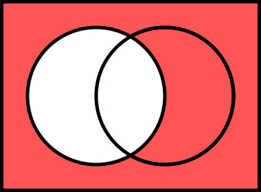
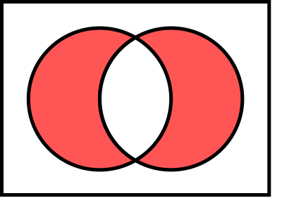

# CSCI 112  Programming with C

- Lecture 4
- Dr. Jakub L. Pach
- Fall 2025

---

---

## Outline

- Review
- Boolean algebra
- Accessing Array Elements
- Logical vs Bitwise Operators
- Operator Sizeof
- Limits
- Input / Output

---

# Review

---

## Operators

- Operators specify what is to be done to variables (also pointers or labels)
- Operators can be:
  - unary    (e. g. -, ++),
  - binary    (e. g. +, -, \*, /),
  - ternary    (?:)
- int main()
- {
-   int i = 1;
-   i = -i;                 /\* unary -                           \*/
-   i++;                 /\* unary ++                          \*/
-   i = i + 1; i = i - 1;     /\* binary +, -                      \*/
- i = i \* 1; i = i / 1;      /\* binary \*, /                      \*/
-   i ? (i &gt; 0) : 1 ; 0;     /\* ternary conditional                  \*/
- }

---

## Basics of mathematics

- Another important point is the division operator /. When used with integers, it performs integer division, meaning that 5 / 3 results in 1. If at least one operand is a floating-point number, the division produces a floating-point result, so 5 / 3 evaluates to approximately 1.6666.
- Finally, there is the modulo operator %, which returns the remainder of integer division. For example, 5 % 2 equals 1.

---

## Example - division

// Declarations

int x = 5, y = 3;

float a = 5.0, b = 3.0;

 printf("%s\n", "Integers:");

printf("x = %d\n", x);

printf("y = %d\n", y);

 printf("%s\n","Floats:");

printf("a = %f\n", a);

printf("b = %f\n", b);

 printf("Integer / Integer:\n");

printf("x / y = %d\n", x / y); // integer division

 printf("\nInteger / Float:\n");

printf("x / b = %f\n", x / b); // x promoted to float

printf("x / b with %%d = %d (wrong!)\n", x / b); // incorrect, prints garbage

 printf("\nFloat / Integer:\n");

printf("a / y = %f\n", a / y); // y promoted to float

 printf("\nFloat / Float:\n");

printf("a / b = %f\n", a / b); // normal float division

- Integers:
- x = 5
- y = 3
- Floats:
- a = 5.000000
- b = 3.000000
- Integer / Integer:
- x / y = 1
- Integer / Float:
- x / b = 1.666667
- x / b with %d = -1431655765 (wrong!)
- Float / Integer:
- a / y = 1.666667
- Float / Float:
- a / b = 1.666667
- Result:

---

## Increment (++) &amp; decrement (--) operator &amp; Assignment by sum

- Prefix increment ++ and decrement -- operators increase (decrease) the operand's value first, then use the new value.
- Postfix increment ++ and decrement -- operators use the operand's current value first, then increase (decrease) the operand's value.
- Assignment by sum refers to the process of assigning a value to a variable using the addition operator + or the addition assignment operator += to combine the assigned value with the existing value of the variable.
- int main()
- {
-   int i = 1, j = 2;
-   j++;
-   i = j++;
-   i = ++j;
-   i += j;
-   i = j = 2 + j;
- }
- int main()
- {
-   int i = 1, j = 2;
-   j = j + 1;
-   i = j;
-   j = j + 1;
-   j = j + 1;
-  i = j;
-   i = i + j;
-   j = 2 + j;
-   i = j;
- }
- \*In Python we don’t have something like that.

<!-- tu skonczylem, poprawilem blad tabilcy c -->

---

## Relational &amp; logical operators  &lt;, &lt;=, &gt;, &gt;=, ==, !=, &amp;&amp;, ||

- Relational and logical operators return 1 for a true condition and 0 for a false condition. The result type of these operators is int (integer).
- In if and while statements, the C language considers the logical value of the conditional expression. This means that any value other than 0 (including positive, negative, characters, pointers, etc.) will be treated as true, while the value 0 will be treated as false.
- The bool type is not a built-in type because it is not essential for basic programming operations. However, to use the bool type, we need to include the &lt;stdbool.h&gt; header file.
- \#include &lt;stdio.h&gt;
- \#include &lt;stdbool.h&gt;
- int main()
- {
-   bool is\_true  = true;
-   bool is\_false = false;
-   bool result = is\_true &amp;&amp; is\_false;
-   printf("%d\n", result);
-   result = 3 &gt; 1;
-   printf("%d\n", result);
- }
- 0
- 1
- Result:

---

## Null / empty statement

- A single semicolon ; in C language is a statement called a null statement or empty statement.
- A semicolons ; are used to terminate statements
- int main()
- {
-     ;                                       /\*  Empty statement    \*/
- printf("Hello world!\n");            /\*  Second statement   \*/
- printf("Hello"); printf(" world!\n");    /\*  3rd &amp; 4th statement in one line \*/
- }

<!-- In C programming, a **single line ending with a semicolon** (;) is typically referred to as an **empty statement** or **null statement**. It's a statement that doesn't perform any operation and has no effect on the program's execution. -->

---

## Block &amp; complex(compound) statements

- Block can be:
  - substitute for simple statement,
  - defined within a block (Nested blocks),
  - empty {}.
- Variables can be declared inside
- Variables declared inside a block with the same name hide access to variables outside that block
- No semicolon at end of block
- After a code block ends, all variables declared within that block cease to exist and are no longer accessible in the rest of the program

<!-- Moze kiedys dodac “Compiled as a single unit “
Statements which cannot contain other statements are *simple*; those which can contain other statements are *compound*
Simple statements are complete in themselves; these include assignments, subroutine calls, and a few statements which may significantly affect the program flow of control (e.g. goto, return, etc.)
Jak udowodnic ze instrukcje count-controlled loop, condidion – cotrolled loop and if are statement? Zmieniaja stan program to znaczy kolejna linia kodu ktora miala byc a jest inna np. Goto.
Przypisanie jest rownoczesnie statement I -->

---

## Blocks &amp; complex(compound) statements

- int main()
- {
-     char\* text = "Hello world\n";
-     printf(text);
-     {
-       char\* text = "Bye world\n";
-       printf(text);
-       {
-         char\* text = "Aloha world\n";
-         printf(text);
-       }
-     }
-     printf(text);
- }
- Hello world
- Bye world
- Aloha world
- Hello world
- Result:

---

## Statement &amp; expression

- A **statement** can modify the state of a program, such as assigning a value to a variable, calling a function, or jumping to a different part of the code.
- Statements do not produce a value on their own.
- An **expression** is a combination of variables, constants, functions, and operators that evaluates to a single value.
- Expressions themselves do not directly modify the state of the program.

---

## Consequences

|Priority / Operator||Expression|Statement|
|---|---|---|---|
|1|(), \[\]|√|×|
||.|√|×|
||-&gt;|√|×|
|2|++, --|√|√|
||+, -, !, ~ (unary)|√|×|
||\*, &amp; , &amp;&amp;  (unary)|√|×|
||(type), sizeof|√|×|
|3|\*, /, %|√|×|
|4|+, -|√|×|
|5|&lt;&lt;,  &gt;&gt;|√|×|
|6|&lt;, &lt;=, &gt;, &gt;=|√|×|
|7|==, !=|√|×|
|8|&amp;|√|×|
|9|^|√|×|
|10|\||√|×|
|11|&amp;&amp;|√|×|
|12|\|\||√|×|
|13|?:|√|×|
|14|=|√|√|
||+=, -=, \*=, /=, %=|√|√|
||&lt;&lt;=, &gt;&gt;=, &amp;=, ^=, \|=|√|√|
|15|,|√|×|

- In the Python language, there is not a single operator that is both a statement and an expression.
- Increment and decrement operators do not exist at all.
- Assignment is exclusively a statement, as is compound assignment. This has significant consequences.

<!-- Use parentheses to override order of evaluation -->

---

# Boolean algebra

---

## Boolean algebra

 

|**Symbol**|**Logical operation**|**Operator**|**Notation**|
|---|---|---|---|
||Conjunction  ("product" of x and y)|AND|x ∧ y|
||Disjunction ("sum") of x and y)|OR|x ∨ y|
||Negation ("the opposite")|NOT|¬x|
||Exclusive OR|XOR|x ⊻ y|

- **\*Watch out!** The conjunction symbol ^ from logic is **XOR** in C, not AND!

---

## AND gate

 

|**x**|**y**|**x ∧ y**|
|---|---|---|
|0|0|0|
|0|1|0|
|1|0|0|
|1|1|1|

---

## OR gate

|**x**|**y**|**x ∨ y**|
|---|---|---|
|0|0|0|
|0|1|1|
|1|0|1|
|1|1|1|

 

---

## NOT gate

 

|**x**|**¬x**|
|---|---|
|0|1|
|1|0|

---

## XOR gate

 

|**x**|**y**|**x ⊻ y**|
|---|---|---|
|0|0|0|
|0|1|1|
|1|0|1|
|1|1|0|

---

# Accessing Array Elements

---

## Accessing Array Elements

- tab\[index\] is used both to read and write values.
- Array indices in C start from 0.
- Make sure the index is within the declared size (here 0–2).
- Each element in the array is stored contiguously in memory.
- x = 5
- y = 10
- Result:

\#include &lt;stdio.h&gt;

int main()

{

    // Declare an array of 3 integers

    int tab\[3\];

    // Store values into the array

    tab\[0\] = 5;   // put 5 into the first element

    tab\[1\] = 10;  // put 10 into the second element

    tab\[2\] = 15;  // put 15 into the third element

    // Retrieve values from the array

    int x = tab\[0\];  // read the first element into variable x

    int y = tab\[1\];  // read the second element into variable y

    // Display the values

    printf("x = %d\n", tab\[0\]);  // prints 5

    printf("y = %d\n", tab\[1\]);  // prints 10

    return 0;

}

---

|Priority / Operator||Description|Associativity|Example|Result|
|---|---|---|---|---|---|
|1|()|Parentheses|Left-to-right|2 \* (x + y)|-2|
|2|++, --|Prefix &amp; postfix increment and decrement|Right-to-left|++x; x--; x;|6, 6, 5|
||\*, &amp;|Indirection (dereference); Address-of||z = &amp;x; \*z;|6422276; 5|
||(type)|Cast, sizeof()||(int)3.0f; sizeof(x);|3, 4|
|3|\*, /, %|Multiplication, division, and remainder|Left-to-right|6/2 % 2|1|
|4|+, -|Addition and subtraction||1 + 2; 3 - 1|3, 2|
|6|&lt;, &lt;=, &gt;, &gt;=|For relational operators &lt;, &gt; and ≤, ≥ respectively||x&lt;y; x&lt;=y; x&gt;y; x&gt;=y|1, 1, 0 ,0|
|7|==, !=|For relational = and ≠ respectively||x == y, x != 1|1, 0|
|11|&amp;&amp;|Logical AND||1 &amp;&amp; 0|0|
|12|\|\||Logical OR||1 \|\| 0|1|
|14|=|Simple assignment|Right-to-left|x  = y;|-6|
||+=, -=, \*=, /=, %=|Assignment by sum, difference, product, quotient, remainder||x+=1; x-=1; //etc.|6, 5|
|15|,|Comma|Left-to-right|x = 3, y = 1;|3|

- int main() {
- int x = 5, y = -6; int \* z; float f = 3.0f;                 /\*code\*/
- }
- Basic operators

<!-- perentysys; esiszewitiwy
Use parentheses to override order of evaluation -->

---

# Logical vs Bitwise Operators

---

## Logical vs Bitwise Operators

In C, Boolean logic can be used in two ways:

- Bitwise operations on variables,
- Evaluating the logical value of an expression.

In the first case (bitwise), the result is a numeric value obtained by applying the corresponding logic gate to each bit of the variables involved. The exception is the bitwise NOT (~), which inverts all bits.

In the second case (logical operators), remember that any non-zero value (including negative numbers) is treated as true (1), and zero (or NULL) is false (0). Essentially, the numeric value of each variable is first cast to 0 or 1, and then the logical expression is evaluated.

---

## Logical vs Bitwise Operators

unsigned int x = 6;             // 00000000 00000000 00000000 0000 0110 (binary)

unsigned int y = 3;             // 00000000 00000000 00000000 0000 0011 (binary)

//Bitwise AND, OR, NOT, XOR

// AND &amp;

printf("%u\n", x &amp; y);          // (00000000 00000000 00000000 0000 0010) = 2

// OR  |

printf("%u\n", x | y);          // (00000000 00000000 00000000 0000 0111)  = 7

// NOT ~ (flips all bits)

printf("%u\n", ~x);             // (11111111 11111111 11111111 1111 1001) = 4 294 967 289

// XOR ^

printf("%u\n", x ^ y);          // (00000000 00000000 00000000 0000 0101) = 5

//Logical AND, OR, NOT, XOR

// AND &amp;

printf("%d\n", x &amp;&amp; y);         // (00000000 00000000 00000000 0000 0001) = 1 (true)

// OR  |

printf("%d\n", x || y);         // (00000000 00000000 00000000 0000 0001) = 1 (true)

// NOT !

printf("%d\n", !x);             // (00000000 00000000 00000000 0000 0000) = 0 (false)

// XOR doesn't exist but =  (a || b) &amp;&amp; !(a &amp;&amp; b);

printf("%d\n", (x || y) &amp;&amp; !(x &amp;&amp; y));

                                // (00000000 00000000 00000000 0000 0000) = 0 (false) 

printf("%d\n", -1 &amp;&amp; -2);       // (00000000 00000000 00000000 0000 0001) = 1 (true)

- 2
- 7
- 4294967289
- 5
- 1
- 1
- 0
- 0
- 1
- Result:

---

# Sizeof()

---

## Summary of memory size of data types

|Type|Memory size in bytes / bits|
|---|---|
|char|01 Bytes / 08 bits|
|bool\*|01 Bytes / 08 bits|
|short int|02 Bytes / 16 bits|
|long int|04 Bytes / 32 bits|
|long long\*|08 Bytes / 64 bits|
|float|04 Bytes / 32 bits|
|double|08 Bytes / 64 bits|
|long double|12 Bytes / 96 bits|
|pointer (char\*, short\*, long\*, int\*, float\*, double\*, long double\*, void\*, …)|04 Bytes / 32 bits|
|user defined (struct, unions, etc. )|complex|

- \*from C99

---

## Operator Sizeof()

The sizeof operator returns the size of a type(requires parentheses) or variable in bytes.

- It is a unary operator, just like a cast, and has the same precedence level.
- It is easy to mistake sizeof for a function, but it is not — it is evaluated at compile time.

    long long x;

    printf("%d\n", sizeof(x));

    printf("%d\n", sizeof x );

    printf("%d\n", sizeof(long long));

    short y;

    printf("%d\n", sizeof(y));

    printf("%d\n", sizeof y );

    printf("%d\n", sizeof(short) );

    float z;

    printf("%d\n", sizeof(z));

    printf("%d\n", sizeof z );

    printf("%d\n", sizeof(float) );

- 8
- 8
- 8
- 2
- 2
- 2
- 4
- 4
- 4
- Result:

---

# Limits

---

## limits.h &amp; float.h

- To access constants defining the minimum and maximum values of integer types in C, include the header &lt;limits.h&gt;. For floating-point types, include &lt;float.h&gt;.
- Important: FLT\_MIN (and other floating-point “min” constants) does not represent the most negative value. It is the smallest positive non-zero value that can be represented. If you want the actual minimum (most negative) value, use -FLT\_MAX.

---

## limits.h &amp; float.h

printf("CHAR\_MIN           = %d\n", CHAR\_MIN);

printf("CHAR\_MAX           = %d\n", CHAR\_MAX);

printf("UCHAR\_MAX          = %u\n", UCHAR\_MAX);

// short

printf("SHRT\_MIN           = %d\n", SHRT\_MIN);

printf("SHRT\_MAX           = %d\n", SHRT\_MAX);

printf("USHRT\_MAX          = %u\n", USHRT\_MAX);

// int

printf("INT\_MIN            = %d\n", INT\_MIN);

printf("INT\_MAX            = %d\n", INT\_MAX);

printf("UINT\_MAX           = %u\n", UINT\_MAX);

//float

printf("FLT\_SMALLEST       = %e\n", FLT\_MIN);

printf("FLT\_MIN            = %f\n", -FLT\_MAX);

printf("FLT\_MAX            = %f\n", FLT\_MAX);

printf("FLT\_MAX            = %e\n", FLT\_MAX);

- CHAR\_MIN           = -128
- CHAR\_MAX           = 127
- UCHAR\_MAX          = 255
- SHRT\_MIN           = -32768
- SHRT\_MAX           = 32767
- USHRT\_MAX          = 65535
- INT\_MIN            = -2147483648
- INT\_MAX            = 2147483647
- UINT\_MAX           = 4294967295
- FLT\_SMALLEST       = 1.175494e-038
- FLT\_MIN            =
- -340282346638528859811704183484516925440.000000
- FLT\_MAX            =
- 340282346638528859811704183484516925440.000000
- FLT\_MAX            = 3.402823e+038
- Result:

---

# Input / Output

---

## Input / Output

Input and output functions in C are not available by default — you need to include the &lt;stdio.h&gt; library. The most basic functions include:

- getchar()    – reads a single character from the keyboard,
- putchar()    – displays a single ASCII character on the screen,
- printf()    – prints a formatted string to the screen,
- scanf()    – reads a formatted string from the keyboard.

---

## Input / Output

In C, it **is not** easy to explain how these functions work internally without more advanced knowledge. Therefore, we will start by using only the output functions:

- putchar() and printf().

To better understand how input works, we will first use the **getche()** function from the Windows-only 'conio.h' library. After that, we will move on to getchar() and finally to scanf().

- Getche() - (get\[ \]char\[acter with echo\])

---

## Fundamental Functions for Input and Output

- Data Output for Screen:
  - putchar\*    -    (put\[ \]char\[acter\]):    Displays a single character on the screen.
  - printf    -    (print\[\]f\[ormatted\]):    Displays a formatted string of characters.
- Data Input from Keyboard:
  - getchar\*    -    (get\[ \]char\[acter\]):    Retrieves a single character from the keyboard.
  - scanf    -    (scan\[ \]f\[ormatted):    Reads a formatted string of characters from the keyboard.
- C doesn't handle input/output on its own. You need a library called &lt;stdio.h&gt;.
- \*You can use putchar and getchar like normal functions, but they are not standard C functions but rather preprocessor macros.

<!-- \*#include &lt;stdio.h&gt; -->

---

## putchar() &amp; getche() without '\n'

- int putchar(int);
  - putchar(c) puts the character c on the standard output.
  - it returns the character printed or EOF on error(-1).
- int getche(void);
  - returns the next character from standard input.
  - it returns EOF on error.
- aaBB
- Result:
- int main()
- {

    char character;

    character = getche();   // Read a single key from the keyboard and immediately display it (echo)

    putchar(character);     // Display the value of 'character' using putchar (prints the same key again)

     character = getche();   // Read another single key (char is enough, automatic casting occurs)

    putchar(character);     // Display the second key pressed

- }

---

## putchar() &amp; getche()

- int putchar(int);
  - putchar(c) puts the character c on the standard output.
  - it returns the character printed or EOF on error(-1).
- int getche(void);
  - returns the next character from standard input.
  - it returns EOF on error.
- a
- a
- B
- B
- Result:
- int main()
- {

    char character;

    character = getche();   // Read a single key from the keyboard and immediately display it (echo)

    printf("%s", "\n");     // Print newline (CRLF) to move to the next line for clarity

    putchar(character);     // Display the value of 'character' using putchar (prints the same key again)

    printf("%s", "\n");     // Print another newline to separate outputs

 

    character = getche();   // Read another single key (char is enough, automatic casting occurs)

    printf("%s", "\n");     // Print newline to move to next line

    putchar(character);     // Display the second key pressed

    printf("%s", "\n");     // Final newline for clean output

- }

---

## char issue

- By default, char in C is signed, which means its range is -128 to 127 (two’s complement) instead of 0–255.
- When you write: char var = 255; or something greater than 255+x;
- you need to know that 255 is by default an int (4 bytes).

---

## char issue

- An automatic cast occurs here: only the lowest 8 bits are kept, and the most significant bit (MSB), which determines the sign, is overwritten. As a result, printf will show -1 because that is how these 8 bits are interpreted in signed form.
- This is an example of overflow and truncation, causing loss of information. This is also why getche()/getchar() returns an int: it can hold all possible char values plus the special EOF value -1. Using int ensures we can reliably distinguish between a real char with all bits set and an intentional EOF signal.

---

## Basics of

- The format requires a string enclosed in double quotes ("&lt;string&gt;").
- If we want to display the contents of our variables, such as int types, we must use the % symbol followed by the type. This allows displaying a value from memory interpreted as the given type and after we must provide the name of the variable that will be read. Each instance of %&lt;type&gt; will allow us to display the contents of one variable.
- int main()
- {
-   int x = 5;
-   int y = 7;
-   printf ("%s\n", "Hello world\n");
-   printf("%d\n", x);
-   printf("Value of x = %d, and value of y = %d\n", x, y);
-   printf("%d %d\n", x, y, x, x);
- }
- Hello world
- 5
- Value of x = 5, and value of y = 7
- 5 7
- Result:
- int printf (char format\[\], arg1, arg2 ,...);

<!-- While printf resembles Python's print function, and Python can utilize C-style formatting, the reverse is not true. This concept can be illustrated by the relationship between a square and a rectangle. -->

---

# Thank you

- Jakub Leszek Pach
- <jpach@mtech.edu>

---

# Can there be anything between % and &lt;type&gt;?

---

# Yep…

---

- printf(char format\[\],  arg1,  arg2 ,...)  scanf (char format\[\], \*arg1, \*arg2 ,...)

---

## printf and scanf format specification

- Optional:
  - Flags    -    modifiers that alter the formatting or scanning behavior.
  - Width    -    specifies the minimum width of the output field          or the maximum number of characters to be scanned.
  - Precision    -    controls the precision of floating-point numbers          or the maximum number of characters to be scanned for strings.
  - Modifier    -    indicates the data type size (e.g., long, short).
- Required:
  - Type    -    specifies the data type of the variable to be formatted or scanned.

Format =  %\[flags\]\[width\]\[.precision\]\[modifier\]&lt;type&gt;

---

## printf and scanf format specification

- Optional:
  - Flags    -    modifiers that alter the formatting or scanning behavior.
  - Width    -    specifies the minimum width of the output field          or the maximum number of characters to be scanned.
  - Precision    -    controls the precision of floating-point numbers          or the maximum number of characters to be scanned for strings.
  - Modifier    -    indicates the data type size (e.g., long, short).
- Required:
  - Type    -    specifies the data type of the variable to be formatted or scanned.

Format =  %\[flags\]\[width\]\[.precision\]\[modifier\]&lt;type&gt;

---

|Type &amp; Specifier||Origin|Argument type||Description||
|---|---|---|---|---|---|---|
||||**printf**|**scanf**|**printf**|**scanf**|
|integer|d|decimal|int|int \*|signed decimal notation||
||u|unsigned decimal|int|unsigned int \*|unsigned decimal notation||
||c|character|int|char \*|one unsigned character|characters are placed within the indicated memory if the specified width is greater than 1; Without ‘\0’|
||i|integer|int|int \*|signed decimal notation (also accepts octal and hexadecimal)||
||o|octal|int|int \*|octal notation (with leading 0)||
||x, X|hex|int|int \*|hexadecimal notation (with or without leading 0x or 0X)||
|string|s|string|char \*|char \*|characters from the string are printed until a ‘\0’!|string **of non-white space**; at the end will be added ‘\0’|
||\[…\]|specific string|N/A|char \*|N/A|Matches the longest non-empty string input characters from the set between brackets; A ‘\0’ is added.|
||\[^…\]|negated specific string|N/A|char \*|N/A|as above, but only excluding the characters|
|floating-point number|f|float|float|float \*|single precision floating-point number notation||
||lf|long float  (double)|double|double \*|double precision floating-point number notation||
||e, E|engineer notation|double|float \* double \*|scientific notation (single or double precision floating-point number)||
||g, G|general floating-point representation|float double|float \* double \*|scientific notation (single or double precision floating-point number)  or single or double precision floating-point number||
|pointer|p|pointer|(any)  void \*|N/A|integer value of the pointer|N/A|
|special|n|number of input characters|N/A|int \*|N/A|Writes into the argument the number of characters read so far by this call|
||%|literal %|%|N/A|Prints a literal percent sign (%)|N/A|

<!-- To know something like the back of one's hand. – miec to w malym palcu
To be able to explain something in their sleep – odpowiedziec o 4 and ranem -->

---

## Basic types

|Type &amp; Specifier||Origin|Argument type||Description||
|---|---|---|---|---|---|---|
||||**printf**|**scanf**|**printf**|**scanf**|
|integer|d|decimal|int|int \*|signed decimal notation||
||u|unsigned decimal|int|unsigned int \*|unsigned decimal notation||
||c|character|int|char \*|one unsigned character||
|string|s|string|char \*|char \*|characters from the string are printed until a ‘\0’!|string **of non-white space**; at the end will be added ‘\0’!|
|floating-point number|f|float|float|float \*|single precision floating-point number notation||
||lf|long float  (double)|double|double \*|double precision floating-point number notation||

<!-- Każdy lancuch znakowy w C jest o jeden większy od deklarowanej treści, bo na końcu jest jeszcze dopisywany znak końca \0 -->

---

## Basic types

|Type &amp; Specifier||Origin|Argument type|Example|Result|
|---|---|---|---|---|---|
|integer|d|decimal|int|printf("%d\n", x);     printf("%d\n", y);|65 -6|
||u|unsigned decimal|int|printf("%u\n", x);     printf("%u\n", y);|65 4294967290|
||c|character|int|printf("%c\n", letter);     printf("%c\n", x);     printf("%d\n", letter);|a A 97|
|string|s|string|char \*|printf("%s\n", text);|Some Text|
|floating-point number|f|float|float|printf("%f\n", fRealNumber);     printf("%f\n", dRealNumber);|3.000000 33999999999999998856806021345479952957440.000000|
||lf|long float  (double)|double|fRealNumber = dRealNumber;      printf("%lf\n", fRealNumber);     printf("%lf\n", dRealNumber);|inf 33999999999999998856806021345479952957440.000000|

- int main() {
- unsigned int x = 65;  int y = -6; char letter ='a'; char \* text = "Some Text";
- float fRealNumber = 3.0f; double dRealNumber = 3.4e40;
- }

---

## Conclusions

- *Remember that* signed *and* unsigned integers *are represented differently in computer memory. Using the wrong* format specifier *can lead to incorrect results (e.g., using* %d *for an* unsigned int*).*
- *A* char *is essentially a one-byte* integer*. Therefore, you can treat a* char *variable as either an ASCII character or a small* integer*.*
- *The* float *data type has a smaller range than* double*. Assigning a* double *value to a* float *variable can result in data loss if the value is too large or too small to be represented accurately*
- *The* lf *specifier is used for* double *values, as* d *is already reserved for decimal(*integer*).*  *It's important to remember this distinction.*

---

## printf and scanf format specification

- Optional:
  - Flags    -    modifiers that alter the formatting or scanning behavior.
  - Width    -    specifies the minimum width of the output field          or the maximum number of characters to be scanned.
  - Precision    -    controls the precision of floating-point numbers          or the maximum number of characters to be scanned for strings.
  - Modifier    -    indicates the data type size (e.g., long, short).
- Required:
  - Type    -    specifies the data type of the variable to be formatted or scanned.

Format =  %\[flags\]\[width\]\[.precision\]\[modifier\]&lt;type&gt;

---

## Width

- int main() { int x = 5, y = -6; int \* z; float f = 3.1234f; /\*code\*/ }

|Data|Type||Description|Example|Result|
|---|---|---|---|---|---|
|Numbers|integer|d|The width value for number (text) representation reserves at least as many characters as are needed to represent that number(text) in ASCII characters (digits).  If the width is smaller than the number’s (text’s) representation, the entire number (text) will be displayed.  If the width is greater than the number’s (text’s)  representation, extra spaces will be added on the left side.|printf("%1d\n", y); printf("%4d\n", y);|-6    -6|
|||u||||
|||c||printf("%c\n", letter); printf("%1c\n", letter);|a|
||floating-point number|f||printf("%3f\n", fRealNumber); printf("%9f\n", fRealNumber);|3.123400  3.123400|
|||lf||||
|Text|string|s||printf("%3s\n", text); printf("%10s\n", text);|Some Text  Some Text|

---

## printf and scanf format specification

- Optional:
  - Flags    -    modifiers that alter the formatting or scanning behavior.
  - Width    -    specifies the minimum width of the output field          or the maximum number of characters to be scanned.
  - Precision    -    controls the precision of floating-point numbers          or the maximum number of characters to be scanned for strings.
  - Modifier    -    indicates the data type size (e.g., long, short).
- Required:
  - Type    -    specifies the data type of the variable to be formatted or scanned.

Format =  %\[flags\]\[width\]\[.precision\]\[modifier\]&lt;type&gt;

---

## Precision

- int main() { int x = 5, y = -6; int \* z; float f = 3.1234f; /\*code\*/ }

|Data|Type||Description|Example|Result|
|---|---|---|---|---|---|
|Numbers|integer|d|Figure out what's happening by looking at the examples.|printf("%.1d\n", x);  printf("%.5d\n", x);|65 00065|
|||u||||
|||c||||
||floating-point number|f||printf("%.6f\n", fRealNumber);  printf("%.2f\n", fRealNumber); printf("%.0f\n", fRealNumber);|3.123400 3.12 3|
|||lf||||
|Text|string|s||printf("%.1s\n", text); printf("%.5s\n", text); printf("%.20s\n", text);|S Some Some Text|

---

## Precision

- int main() { int x = 5, y = -6; int \* z; float f = 3.1234f; /\*code\*/ }

|Data|Type||Description|Example|Result|
|---|---|---|---|---|---|
|Numbers|integer|d|precision works the same as width — it reserves a minimum field size. If the precision is greater than the ASCII character representation of the number, leading zeros are added to the left. Precision does not truncate the number! It always displays the full value.|printf("%.1d\n", x);  printf("%.5d\n", x);|65 00065|
|||u||||
|||c||||
||floating-point number|f|precision determines the number of digits after the decimal point that are displayed. If the number has more decimal places than specified by the precision, it will be truncated.|printf("%.6f\n", fRealNumber);  printf("%.2f\n", fRealNumber); printf("%.0f\n", fRealNumber);|3.123400 3.12 3|
|||lf||||
|Text|string|s|precision determines the precise number of characters to be extracted from the string. Any characters beyond the specified precision will be discarded.|printf("%.1s\n", text); printf("%.5s\n", text); printf("%.20s\n", text);|S Some Some Text|

---

## printf and scanf format specification

- Optional:
  - Flags    -    modifiers that alter the formatting or scanning behavior.
  - Width    -    specifies the minimum width of the output field          or the maximum number of characters to be scanned.
  - Precision    -    controls the precision of floating-point numbers          or the maximum number of characters to be scanned for strings.
  - Modifier    -    indicates the data type size (e.g., long, short).
- Required:
  - Type    -    specifies the data type of the variable to be formatted or scanned.

Format =  %\[flags\]\[width\]\[.precision\]\[modifier\]&lt;type&gt;

---

## Flags

- \+ : Always display the sign of a number, even if it's positive.
- \- : Left-justify the output within the given field width.
- 0 : Pad the field with zeros instead of spaces.
- \# : Use an alternative form for the conversion specifier.

<!-- **# flag:** Use an alternative form for the conversion specifier. For example, it adds a leading zero for octal numbers or a 0x or 0X prefix for hexadecimal numbers. -->

---

## Flag "+"

- int main() {unsigned int x = 65, y = -6; int \* z; float f = 3.1234f; /\*code\*/ }

|Data|Type||Description|Example|Result|
|---|---|---|---|---|---|
|Numbers|integer|d|Always display the sign of a number, even if it's positive.|printf("%+d\n", x); printf("%+d\n", y);|+65 -6|
|||u||||
|||c||||
||floating-point number|f||printf("%+f\n", fRealNumber);|+3.123400|
|||lf||||
|Text|string|s|None|None|None|

---

## Flag "-"

- int main() {unsigned int x = 65, y = -6; int \* z; float f = 3.1234f; /\*code\*/ }

|Data|Type||Description|Example|Result|
|---|---|---|---|---|---|
|Numbers|integer|d|Left-justify the output within the given field width.|printf("%7d", x); printf("\_next\n"); printf("%-7d", x); printf("\_next\n");|65\_next 65     \_next|
|||u||||
|||c||||
||floating-point number|f||printf("%13f", fRealNumber); printf("\_next\n"); printf("%-13f", fRealNumber); printf("\_next\n");|3.123400\_next 3.123400     \_next|
|||lf||||
|Text|string|s||printf("%20s", text);    printf("\_next\n"); printf("%-20s", text); printf("\_next\n");|Some Text\_next Some Text           \_next|

<!-- To understand recursion, you must first understand recursion -->

---

## Flag "0"

- int main() {unsigned int x = 65, y = -6; int \* z; float f = 3.1234f; /\*code\*/ }

|Data|Type||Description|Example|Result|
|---|---|---|---|---|---|
|Numbers|integer|d|Pad the field with zeros instead of spaces.|printf("%07d\n", x);|0000065\_next|
|||u||||
|||c||||
||floating-point number|f||printf("%013f\n", fRealNumber);|000003.123400\_next|
|||lf||||
|Text|string|s||printf("%020s", text);|00000000000Some Text|

<!-- To understand recursion, you must first understand recursion -->

---

## Flag "#"

- To understand recursion, you must first understand recursion.
- This will be explained in the future, because...

---

## printf and scanf format specification

- Optional:
  - Flags    -    modifiers that alter the formatting or scanning behavior.
  - Width    -    specifies the minimum width of the output field          or the maximum number of characters to be scanned.
  - Precision    -    controls the precision of floating-point numbers          or the maximum number of characters to be scanned for strings.
  - Modifier    -    indicates the data type size (e.g., long, short).
- Required:
  - Type    -    specifies the data type of the variable to be formatted or scanned.

Format =  %\[flags\]\[width\]\[.precision\]\[modifier\]&lt;type&gt;

---

## Modifies

- int main() { short int x = 65;  int y = -69000;    float fRealNumber = 3.1234f; double dRealNumber = 3.4e50; /\*code\*/ }

|Data|Type||Description|Example|Result|
|---|---|---|---|---|---|
|Numbers|integer|d|Modifier, h and l specify how many bytes should be formatted as a variable. Therefore, if we use short (h - 1 bit) on a normal int (long - 32 bit), we will get an incorrect result because printf will take only 16 bits and build a number representation from it.|printf("%0hd\n", x); printf("%0hd\n", y); printf("%0ld\n", x); printf("%0ld\n", y);|65 -3464 65 -69000|
|||u||||
|||c||||
||floating-point number|f|Since there's no such thing as hf (as hf is simply f), the compiler ignores h, and l represents a double. As you can see, there's no lf type, only f with the l modifier.|printf("%0hf\n", fRealNumber); printf("%0lf\n", fRealNumber); printf("%0hf\n", dRealNumber); printf("%0lf\n", dRealNumber);|3.123400 3.123400 33999999... 339999999999999984402842591433794782958910267457536.000000|
|||lf||||
|Text|string|s|None|None|None|

---

## printf and scanf format specification

- Optional:
  - Flags    -    modifiers that alter the formatting or scanning behavior.
  - Width    -    specifies the minimum width of the output field          or the maximum number of characters to be scanned.
  - Precision    -    controls the precision of floating-point numbers          or the maximum number of characters to be scanned for strings.
  - Modifier    -    indicates the data type size (e.g., long, short).
- Required:
  - Type    -    specifies the data type of the variable to be formatted or scanned.

Format =  %\[flags\]\[width\]\[.precision\]\[modifier\]&lt;type&gt;

---

# Do you think it is all?

---

|Type &amp; Specifier||Origin|Argument type||Description||
|---|---|---|---|---|---|---|
||||**printf**|**scanf**|**printf**|**scanf**|
|integer|d|decimal|int|int \*|signed decimal notation||
||u|unsigned decimal|int|unsigned int \*|unsigned decimal notation||
||c|character|int|char \*|one unsigned character|characters are placed within the indicated memory if the specified width is greater than 1; Without ‘\0’|
||i|integer|int|int \*|signed decimal notation (also accepts octal and hexadecimal)||
||o|octal|int|int \*|octal notation (with leading 0)||
||x, X|hex|int|int \*|hexadecimal notation (with or without leading 0x or 0X)||
|string|s|string|char \*|char \*|characters from the string are printed until a ‘\0’!|string **of non-white space**; at the end will be added ‘\0’|
||\[…\]|specific string|N/A|char \*|N/A|Matches the longest non-empty string input characters from the set between brackets; A ‘\0’ is added.|
||\[^…\]|negated specific string|N/A|char \*|N/A|as above, but only excluding the characters|
|floating-point number|f|float|float|float \*|single precision floating-point number notation||
||lf|long float  (double)|double|double \*|double precision floating-point number notation||
||e, E|engineer notation|double|float \* double \*|scientific notation (single or double precision floating-point number)||
||g, G|general floating-point representation|float double|float \* double \*|scientific notation (single or double precision floating-point number)  or single or double precision floating-point number||
|pointer|p|pointer|(any)  void \*|N/A|integer value of the pointer|N/A|
|special|n|number of input characters|N/A|int \*|N/A|Writes into the argument the number of characters read so far by this call|
||%|literal %|%|N/A|Prints a literal percent sign (%)|N/A|

<!-- To know something like the back of one's hand. – miec to w malym palcu
To be able to explain something in their sleep – odpowiedziec o 4 and ranem -->

---

## Declaring and initializing arrays

- int main()
- {
-   int a\[5\];
-   /\* Declare an integer array named a with 5 elements \*/
-   int b\[\] = {1, 2, 3, 4};
-   /\*Declare an integer array named b with 4 elements,
-     initialized with values 1, 2, 3, and 4            \*/
-   int c\[10\] = {9, 8, 7, 6, 5};
-   /\*Declare an integer array named c with 10 elements,
-     the first 5 elements are initialized with values 9, 8, 7, 6, and 5,
-     the remaining elements are initialized to 0                 \*/
-   int d\[100\] = {0};
-   /\*Declare an integer array named d with 100 elements, all initialized to 0\*/
-   int x, y = 2;
-   printf("First element (index 0) of array a equals %d.\n", a\[0\]);
-   /\*Print the value of the first element of array a(undefined value)\*/
-   printf("Second(index 1) element of array b equals %d.\n", b\[1\]);
-   /\*Print the value of the second element of array b (which is 2)\*/
-   printf("Second(index 1) element of array b equals %d.\n", \*(b+1) );
-   /\*Print the value of the second element of array b using pointer arithmetic\*/
-   printf("Sixth(index 5) element of array c equals %d.\n", c\[5\]);
-   /\*Print the value of the sixth element of array c (which is 0)\*/
-   x = b\[0\];   /\*Assign the value of the first element of array b (which is 1) to variable x\*/
-   a\[1\] = y;   /\*Assign the value of variable y (which is 2) to the second element of array a\*/
- }
- First element (index 0) of array a equals 4201200.
- Second(index 1) element of array b equals 2.
- Second(index 1) element of array b equals 2.
- Sixth(index 5) element of array c equals 0.
- Result:

---

## Basics of

- The important difference between printf and scanf is that scanf requires its arguments to be pointers (location in memory) .
- int main()
- {
-   int x = 5;                      /\* Declaration of variable x and assigning its value 5 \*/
-   int \* p;                      /\* Declaration of pointer p \*/
-   p = &amp;x;                       /\* Assigning the address value of the p variable to the pointer p \*/
-   printf("Enter x value : ");         /\* there is no end of line character here! \*/
-   scanf("%d", &amp;x);                 /\* To get a pointer (memory address) \*/
-   printf("Value of x = %d\n", x);     /\* we use a &amp; before the variable name p \*/
-   printf("Enter x value again : ");
-   scanf("%d", p);                     /\*scanf does not work the same as in python, \*/
-   printf("Value of x = %d\n", x);   /\*you have to use printf and scanf separately \*/
- }
- Enter x value : 1
- Value of x = 1
- Enter x value again : 2
- Value of x = 2
- Result:
- int printf (char format\[\],  arg1,  arg2 ,...);
- int scanf  (char format\[\], \*arg1, \*arg2 ,...);
- The ampersand operator &amp; is a unary operator that returns the memory address, which is the location in memory where a variable is stored.

<!-- This line is where the magic happens. It assigns the address of the variable x to the pointer pointer. The &amp; symbol is the "address-of" operator. So, pointer now holds the memory location where the value 5 for x is stored. -->

---

## Notice

Recently, during my lab work, I made a mistake. It wasn't the development environment's fault, but mine. It was related to the scanf function. Because I'm currently working with Python, C, C++, C#, and MATLAB, I mixed up the behavior of the scanf function. You need to know that the scanf function has one drawback: it doesn't clear the buffer of characters entered from the keyboard. This means that after pressing Enter to confirm the data entered from the keyboard, our variable also contains the Enter character, which is that extra line you asked me to use to clear the buffer. To understand its operation, you need to understand today's new material.
