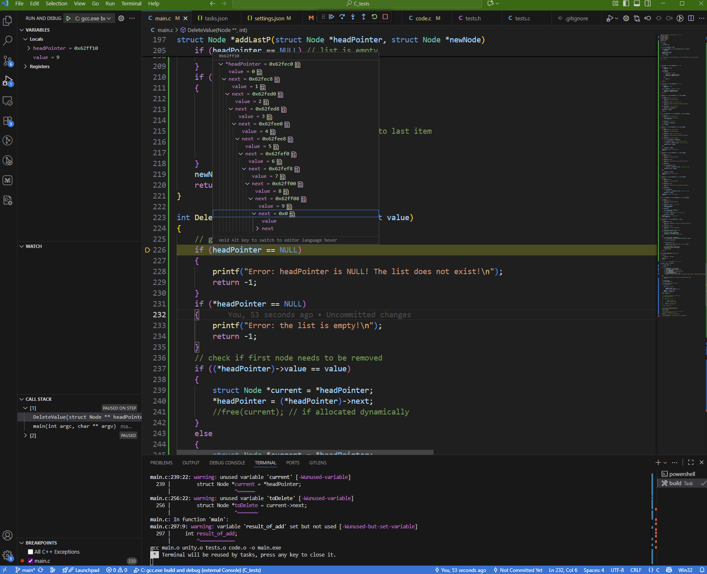
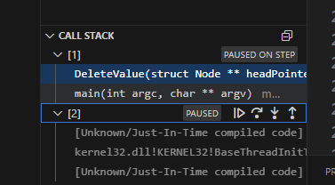
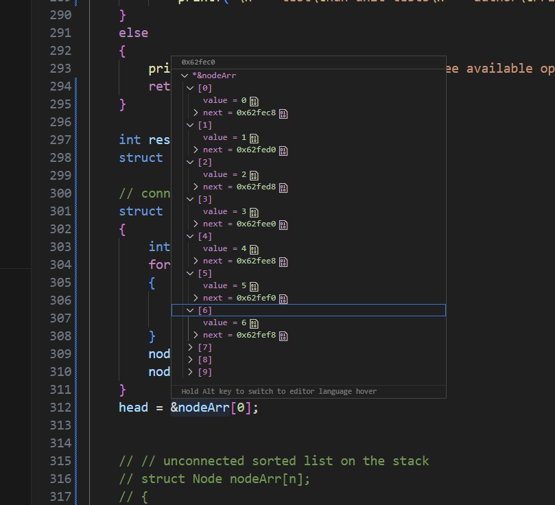

# Data Structures &amp; Algorithms

*Lecture 4*

---

## In 136, we covered

- Objects and classes, Abstract Data Types – lots of coverage.  I required class and header files in most assignments
- Time and Space complexity – a discussion was included in each exercise.  Good coverage of constant time, linear, n2, n3, with loops and nested loops.  Didn’t do any of the math.
- Arrays and 2D arrays, and “2D” vectors, along with Big-O and execution time tests with larger structures.  Students had a LOT of coverage
- Linked List and Sorted Linked List – students had to write their own class/header files and driver for each
- Stack and Queue – students were given .h files, had to write the class and member functions and driver
- Maze using stack and queue in Python – students were given classes, had to write DFS and BFS with much assistance and examples
- Lecture coverage of memory allocation, memory usage, static variables, compilation, memory leaks, dangling pointers, comparison of C and C++, binary search, examples of object-oriented programming and ADT’s in C++, Python, Java
- Parameter passing, command line arguments, scope – good coverage
- Pointers – medium coverage, mostly with parameter passing.  We didn’t use them in any useful way.
- Recursion – weak coverage
- Visual Studio – all the time

---

## My 8 Best Practices for Working with

- Pointers and Linked Lists in C

---

## When working with linked lists in C, it’s important to follow a few key principles to avoid logical and memory-related errors

- First, decide how your functions should operate. You have two common strategies. The first one is to return an integer value that indicates whether an operation succeeded or failed. In this case, you need to pass a **double pointer** (for example, Node \*\*head) to allow the function to modify the head of the list directly. Remember that when calling such a function, you must pass the **address of the pointer** using the &amp; operator.
- The second strategy is to make your function return a pointer to the head of the list after the operation. This function should return either a valid pointer or NULL if something goes wrong. If you use this approach, always check the return value before overwriting your current head pointer. This prevents losing access to your list when an operation fails.
- Next, remember that working with pointers is similar to accessing array elements: before you use them, you must make sure the address is valid. Dereferencing a NULL or invalid pointer will cause a segmentation fault. If your head pointer is NULL, the list is empty. With a double pointer, the outer pointer itself may still be valid, but the value it points to (\*head) can be NULL. Understanding this difference between single and double pointers is essential.
- Never call free() on a structure that was created on the stack. Only memory allocated on the heap with malloc() or similar functions should be freed. Calling free() on stack memory leads to undefined behavior, and the program may crash or behave unpredictably. When you test your code using stack-based structures, simply comment out or skip any calls to free().
- In Visual Studio Code, you can use the **Call Stack** panel to inspect what happens in your program during debugging. If you have an array of nodes in main() and you pass it to a function, you can switch between function contexts in the debugger to observe how the list changes step by step.
- Also remember that pointers such as head, tail, or current are just references — they only point to existing elements. You should never call free() directly on them. Instead, always free the nodes one by one as you traverse the list.
- To make your code more readable, use parentheses when chaining pointer references. For example, (current-&gt;next)-&gt;next is easier to understand than current-&gt;next-&gt;next. It may look redundant, but it helps keep your logic clear.
- If the syntax of double pointers feels too complex at first, simplify it. You can assign a local single pointer to the value of the dereferenced double pointer and work with it. This makes your code easier to follow. Once you get used to the concept, you’ll see that double pointers are not difficult — they’re actually a clean and efficient way to manage linked lists.

---

## 1. Designing Pointer-Based Linked Lists

**When working with linked lists, you must clearly define your function design strategy:**

- Will your function return information (e.g., success/failure)?
- Or will it directly modify the global pointer to the list (e.g., head)?

**Two main conventions:**

- Use a double pointer (Node \*\*head) when you want to modify the global list pointer.
- Or return a pointer to the head node, checking for NULL after the function call.

// Example: function returns the new head

struct Node \*addFront(struct Node \*head, int value);

// Example: function modifies the head using double pointer

int addFront(struct Node \*\*head, int value);

---

## 2. Passing by Reference vs Returning Head

**When using a double pointer:**

- Pass the address of the head pointer: addFront(&amp;head, 10);
- Inside the function, dereference with \*head.

**When returning the new head:**

- Simply assign the return value: head = addFront(head, 10);
- Always check for NULL before overwriting or dereferencing.

if (head != NULL)

{

    head = addFront(head, 5);

}

---

## 3. Validating Pointer Access

- Before accessing memory via a pointer, **ensure it’s valid**:
  - Just like checking array bounds before accessing an index.
  - If you dereference an invalid pointer → **Segmentation fault**.
- With double pointers, the outer pointer can exist while the inner one (\*head) may still be NULL.

if (head == NULL)

{

    printf("List is empty.\n");

    return;

}

printf("First element: %d\n", head-&gt;value);

---

## 4. Stack vs Heap Memory

**Never call free() on a variable allocated on the stack:**

- Doing so causes undefined behavior.

**Only use free() for dynamically allocated memory from:**

- malloc() / calloc() / realloc().

struct Node n;     // Stack allocation – DO NOT free()

struct Node \*p = malloc(sizeof(struct Node)); // Heap allocation – must free()

free(p);

---

## 5. Passing by Reference vs Returning Head

**During debugging, use the Call Stack panel:**

- Switch context between functions (e.g., main() ↔ insertNode()).
- You can inspect how pointer values change between stack frames.

**Example:**

- In main(), you have an array of Node elements.
- In a function, you pass it by pointer.
- After modification, return to main() and inspect the list contents.

---

## 6. Head and Tail Are Just References

**Remember:**

- head, tail, and all node pointers are references to memory.
- They do not own the data.

**Never call free() on the head pointer directly:**

- Always free the nodes themselves, not the pointer variable.

while (head != NULL)

{

    struct Node \*temp = head;

    head = head-&gt;next;

    free(temp);

}

---

## 7. Improving Code Readability

- Use parentheses to clarify nested pointer access:
- instead of:
- This helps beginners understand pointer chaining more clearly.

(current-&gt;next)-&gt;next

current-&gt;next-&gt;next

---

## 8. Simplifying Double Pointers

- When double pointers feel too abstract, use a **temporary single pointer** to step through logic:
- After understanding this, using \*\* directly becomes intuitive.
- Double pointers are more powerful and flexible, especially for insertion and deletion operations at the head of the list.

struct Node \*tempPointer = \*headPointer;

tempPointer-&gt;next = newNode; 

---

## X. printIntArrayBackward

void printIntArrayBackward(int \*arr, int N)

{

    while (N)

    {

        printf("%d ", arr\[--N\]);

    }

    printf("\n");

    return;

}

---

## Best Practices for Working with

- Pointers and Linked Lists in C

---

## 1. A node is independent — never confuse it with the head

- The head is a pointer to the first node, not the node itself.

struct Node \*head = NULL;  // head is a pointer, not a Node

---

## 2. Use -&gt; for pointers, . for structures

- If you have a pointer to a struct, use -&gt;. If you have a struct object, use ..

    node-&gt;value;   // pointer to struct

    node.value;    // struct object

---

## 3. Always allocate memory for a new node

- Don’t create a node as a local variable if it needs to persist.

    struct Node \*newNode = malloc(sizeof(struct Node));

---

## 4. Always check the result of malloc()

- Never assume memory was successfully allocated.
  - if (newNode == NULL)
  - {
  -     // handle allocation failure
  - }

---

## 5. Use a double pointer (Node \*\*) when modifying the head

- To change the head inside a function, you need its address.

void insertAtBeginning(struct Node \*\*head, int value);

---

## 6. Always free memory when done

- Every malloc() should have a corresponding free().

free(node);

---

## 7. Never dereference a NULL pointer

- Always check before accessing pointer contents.

    if (node != NULL)

    {

        printf("%d\n", node-&gt;value);

    }

---

## 8. Draw the list on paper when debugging

- Visualizing the structure helps understand pointer behavior.

---

## 9. Copying a pointer does not copy the data

- It only copies the address — both pointers refer to the same memory.

    Node \*a = head;

    Node \*b = a;  // both point to the same node

---

## 11. Debugging Linked Lists in C

*Debugging linked lists is difficult when you only have a pointer to the head. But if you create an array of Node structures and pass it by pointer, you retain full access to all elements from the context of main, which drastically simplifies code analysis.* *Even temporarily, you can create a local array of Node inside a function to aid debugging. Once everything works, you can replace it with malloc — the behavior will be exactly the same, since you're accessing nodes via the -&gt; operator.*

**Why this helps:**

- You can **see all nodes at once** in memory.
- You avoid **memory management issues** during early development.
- You can **step through the list** easily in a debugger or with print statements.
- You maintain **pointer-based logic**, so switching to dynamic allocation later is seamless.

---

## 12. Designing Functions for Linked Lists in C — Two Approaches

**Approach 1: Return the new head (single-level pointer)**

- The function receives a pointer to the current head (Node \*head) and returns a pointer to the new head.
- This allows the caller to update the head after the operation.
- If something goes wrong, the function returns NULL.

**Important**: The caller must check the return value before overwriting the original head — otherwise, the list may be lost.

// Usage:

head = insertAtBeginning(head, newNode);

if (head == NULL)

{

    // handle error

}

struct Node \* insertAtBeginning(struct Node \*head, struct Node \*newNode)

{

    if (newNode == NULL)

        return NULL;

    newNode-&gt;next = head;

    return newNode;

}

---

## 12. Designing Functions for Linked Lists in C — Two Approaches

**Approach 2: Modify the head directly (double pointer)**

- The function receives a **pointer to the head pointer** (Node \*\*head) — typically passed as &amp;head.
- This allows the function to modify the caller’s head directly.
- Inside the function, use \*head to access or update the actual head.
- You rarely need \*\*head — use -&gt; to access fields safely.
- The function returns an int status code: 0 for success, -1 for failure.

// Usage:

if (insertAtBeginning(&amp;head, newNode) != 0)

{

    // handle error

}

int insertAtBeginning(struct Node \*\*head, struct Node \*newNode)

{

    if (head == NULL || newNode == NULL)

        return -1;

    newNode-&gt;next = \*head;

    \*head = newNode;

    return 0;

}

---

## 12. Designing Functions for Linked Lists in C — Two Approaches

|Feature|Return Head|Modify via Double Pointer|
|---|---|---|
|Head passed as|Node \*head|Node \*\*head|
|Head updated by|return value|dereferencing \*head|
|Error handling|return NULL|return status code|
|Risk|overwriting head without checking|safer, direct update|
|Use case|simple insertions|insert/delete/search with head updates|

---

## Code

---

struct Node

{

    int value;

    struct Node \*next;

};

 

struct Node \*CreateNode(int value)

{

    struct Node \*newNode = (struct Node \*)malloc(sizeof(struct Node));

    if (!newNode)

        return NULL;

 

    newNode-&gt;value = value;

    newNode-&gt;next = NULL;

    return newNode;

}

---

int printList(struct Node \*headPointer) // or void

{

    // guards

    if (headPointer == NULL)

        return -1;

 

    int repeat = 1;

    while (repeat)

    {

        if (headPointer) // not NULL

        {

            printf("%d\n", headPointer-&gt;value);

            headPointer = headPointer-&gt;next;

        }

        else

        {

            repeat = 0;

        }

    }

    return 0;

}

---

int printList2(struct Node \*headPointer) // or void

{

    // guards

    if (headPointer == NULL)

        return -1;

 

    while (headPointer) // headPointer != NULL

    {

        printf("%d\n", headPointer-&gt;value);

        headPointer = headPointer-&gt;next;

    }

    return 0;

}

---

int addFirst(struct Node \*\*headPointer, struct Node \*newNode)

{

    // guards

    if (newNode == NULL) // nothing to do

    {

        printf("Error: nothing to add!\n");

        return -1;

    }

    if (headPointer == NULL) // list doesn't exist

    {

        printf("Error: head is NULL! The list does not exist!\n");

        return -1;

    }

    if (\*headPointer) // list is NOT empty

    {

        newNode-&gt;next = \*headPointer;

    }

    \*headPointer = newNode;

 

    return 0;

}

---

struct Node \*addFirst2(struct Node \*headPointer, struct Node \*newNode)

{

    // guards

    if (newNode == NULL) // nothing to do

    {

        printf("Error: nothing to add!\n");

        return headPointer;

    }

 

    if (headPointer) // list exists

    {

        newNode-&gt;next = headPointer;

    }

    return newNode;

}

---

int addLast(struct Node \*\*headPointer, struct Node \*newNode)

{

    // guards

    if (newNode == NULL) // nothing to do

    {

        printf("Error: nothing to add!\n");

        return -1;

    }

    if (headPointer == NULL) // list doesn't exist

    {

        printf("Error: head is NULL! The list does not exist!\n");

        return -1;

    }

    if (\*headPointer) // list is NOT empty

    {

        struct Node \*tempPointer = \*headPointer;

 

        while (tempPointer-&gt;next) // tempPointer-&gt;next != NULL

        {

            tempPointer = tempPointer-&gt;next; // move to last item

        }

        tempPointer-&gt;next = newNode;

    }

    else

    {

        \*headPointer = newNode;

    }

    newNode-&gt;next = NULL; // good practice

    return 0;

}

---

int addLast2(struct Node \*\*headPointer, struct Node \*newNode)

{

    // guards

    if (newNode == NULL)

    {

        printf("Error: nothing to add!\n");

        return -1;

    }

    if (headPointer == NULL)

    {

        printf("Error: head is NULL! The list does not exist!\n");

        return -1;

    }

    if (\*headPointer)

    {

        while ((\*headPointer)-&gt;next)

        {

            headPointer = &amp;(\*headPointer)-&gt;next; // move to last item

        }

        (\*headPointer)-&gt;next = newNode;

    }

    else

    {

        \*headPointer = newNode;

    }

    newNode-&gt;next = NULL; // good practice

    return 0;

}

---

int addLast3(struct Node \*\*headPointer, struct Node \*newNode)

{

    // guards

    if (newNode == NULL)

    {

        printf("Error: nothing to add!\n");

        return -1;

    }

    if (headPointer == NULL)

    {

        printf("Error: head is NULL! The list does not exist!\n");

        return -1;

    }

    if (\*headPointer)

    {

        while (\*headPointer)

        {

            headPointer = &amp;(\*headPointer)-&gt;next; // move to last item

        }

        \*headPointer = newNode;

    }

    newNode-&gt;next = NULL; // good practice

    return 0;

}

---

struct Node \*addLastP(struct Node \*headPointer, struct Node \*newNode)

{

    // guards

    if (newNode == NULL)

    {

        printf("Error: nothing to add!\n");

        return NULL;

    }

    if (headPointer == NULL) // list is empty

    {

        headPointer = newNode;

        return headPointer;

    }

    if (headPointer)

    {

        struct Node \*current = headPointer;

        while (current-&gt;next)

        {

            current = current-&gt;next; // move to last item

        }

        current-&gt;next = newNode;

    }

    newNode-&gt;next = NULL; // good practice

    return headPointer;

}

---

int DeleteValue(struct Node \*\*headPointer, int value)

{

    // guards

    if (headPointer == NULL)

    {

        printf("Error: headPointer is NULL! The list does not exist!\n");

        return -1;

    }

    if (\*headPointer == NULL)

    {

        printf("Error: the list is empty!\n");

        return -1;

    }

    // check if first node needs to be removed

    if ((\*headPointer)-&gt;value == value)

    {

        struct Node \*current = \*headPointer;

        \*headPointer = (\*headPointer)-&gt;next;

        //free(current); // if allocated dynamically

    }

    else

    {

        struct Node \*current = \*headPointer;

        while (current-&gt;next != NULL &amp;&amp; (current-&gt;next)-&gt;value != value)

        {

            current = current-&gt;next;

        }

        if (current-&gt;next == NULL)

        {

            printf("Warning: value %d not found in list.\n", value);

            return 0; // not found

        }

        struct Node \*toDelete = current-&gt;next;

        current-&gt;next = (current-&gt;next)-&gt;next;

        //free(toDelete);

        //toDelete = NULL;

    }

    return 1;

}

---

    // unconnected sorted list on the stack

    struct Node nodeArr\[n\];

    {

        int i = 0;

        for (; i &lt; n - 1; i++)

        {

            nodeArr\[i\].value = i;

            nodeArr\[i\].next = NULL;

        }

        nodeArr\[n - 1\].next = NULL;

        nodeArr\[n - 1\].value = i;

    }

    head = &amp;nodeArr\[0\];

---

---

---

## Questions?

---

## Thank

- You
