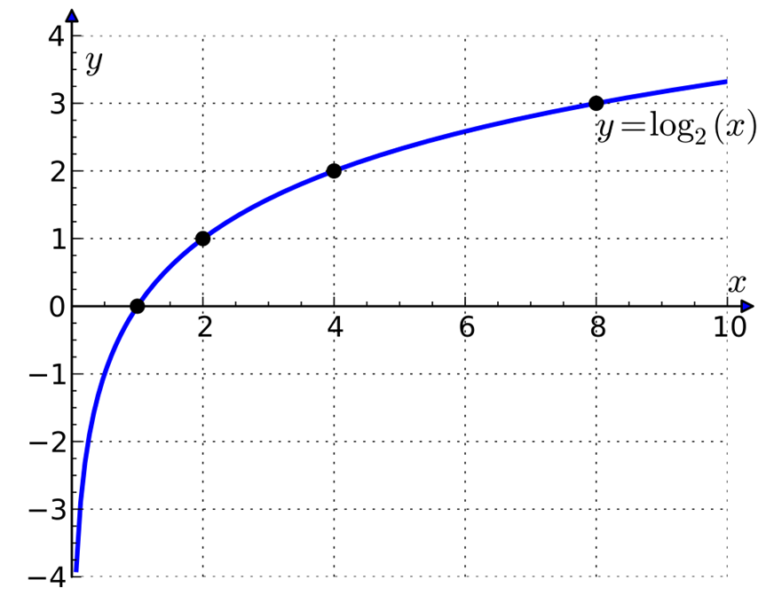
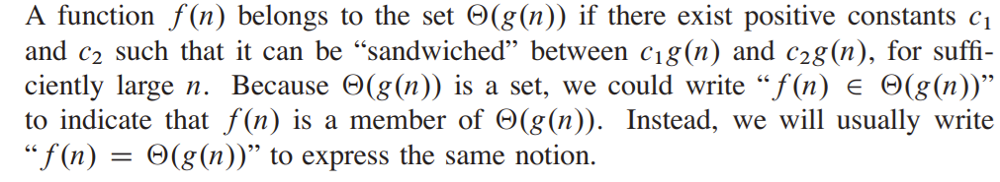
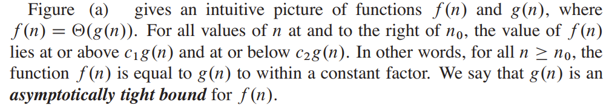
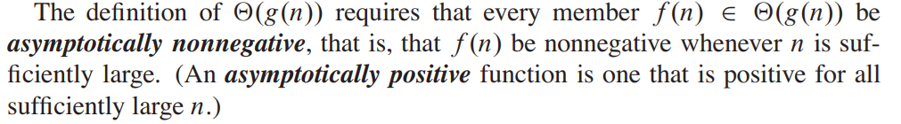
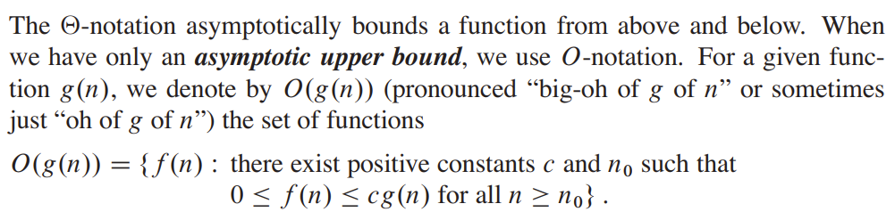
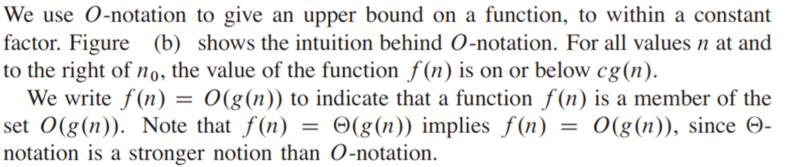
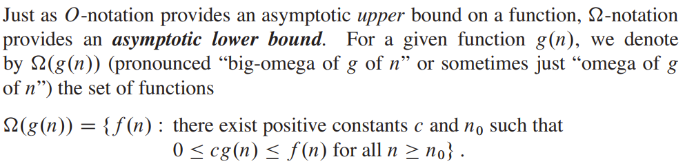
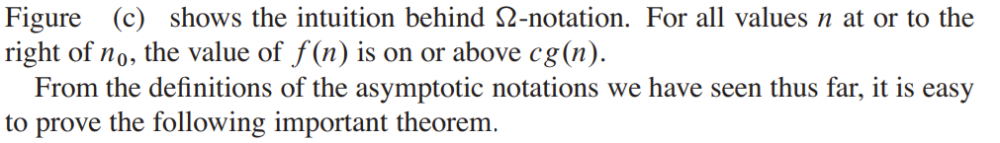

# Data Structures &amp; Algorithms

*Lecture 11*

---

## In 136, we covered

- Objects and classes, Abstract Data Types – lots of coverage.  I required class and header files in most assignments
- Time and Space complexity – a discussion was included in each exercise.  Good coverage of constant time, linear, n2, n3, with loops and nested loops.  Didn’t do any of the math.
- Arrays and 2D arrays, and “2D” vectors, along with Big-O and execution time tests with larger structures.  Students had a LOT of coverage
- Linked List and Sorted Linked List – students had to write their own class/header files and driver for each
- Stack and Queue – students were given .h files, had to write the class and member functions and driver
- Maze using stack and queue in Python – students were given classes, had to write DFS and BFS with much assistance and examples
- Lecture coverage of memory allocation, memory usage, static variables, compilation, memory leaks, dangling pointers, comparison of C and C++, binary search, examples of object-oriented programming and ADT’s in C++, Python, Java
- Parameter passing, command line arguments, scope – good coverage
- Pointers – medium coverage, mostly with parameter passing.  We didn’t use them in any useful way.
- Recursion – weak coverage
- Visual Studio – all the time

---

## Today’s Agenda

- Logarithmic and Exponential Rules
- Asymptote
- Asymptotic notation
  - Θ-notation
  - Ω-notation

---

## Logarithmic and Exponential

- Rules

---

## Binary logarithm

<!-- log base 2 of x
x to the power of y
x raised to the power of y
x to the y
x is the **argument**
y is the **function value** -->

---

## Logarithmic and Exponential Rules (The Fundamentals)

<!-- **The Product Rule:** The logarithm of a product of two numbers, a and c, is equal to the **sum** of the logarithms of those numbers.
**The Quotient Rule:** The logarithm of a quotient (a division) is equal to the **difference** between the logarithms of the numerator (a) and the denominator (c).
**The Power Rule:** When the number inside the logarithm (a) is raised to a power (c), that exponent can be moved and multiplied **in front** of the logarithm.
**The Change-of-Base Formula:** This formula allows you to convert a logarithm from an existing base (b) to a new, more convenient base (c). This is done by taking the logarithm of the original number (a) and dividing it by the logarithm of the old base (b), both using the new base c.
**Logarithmic Exponential Identity:** This identity shows that when raising a base b to a logarithm with a different base c, you can swap the original base b with the logarithm's argument a, and the result remains the same.
**The Power of a Power Rule:** When an exponential expression (ba) is raised to another power (c), you keep the base (b) and **multiply** the exponents (a and c).
**The Product Rule for Exponents:** To multiply two powers with the same base (b), you keep the base and **add** the exponents (a and c).
**The Quotient Rule for Exponents:** To divide two powers with the same base (b), you keep the base and **subtract** the exponent of the denominator (c) from the exponent of the numerator (a). -->

---

## Examples

<!-- The logarithm of  equals one plus log n plus log log n. //The logarithm of two times n times log n equals one plus log n plus log log n. Here, we use the rule that the log of a product equals the sum of logs. Since when the base is 2, we replace it with 1. Remember that in computer science, if the base is not written, we usually assume it’s base 2.
The logarithm of n divided by 2 equals log n minus log 2, which is log n minus one. Again, we assume base 2, so .
The logarithm of the square root of n equals one-half times log n. We use the power rule — the exponent moves in front of the log.
The logarithm of log of square root n equals log log n minus one. We again used the division rule, because means dividing by 2, and log 2 equals 1 in base 2.
The logarithm of n in base 4 equals log n divided by log 4. Since log 4 equals 2 in base 2, we get log n over 2.
The logarithm of 2 to the power n equals n. That’s because the base and the number inside the log are the same.
Two to the power of two times log n equals n squared. We move the 2 inside as a power of n using the power rule.
Four to the power n equals two to the power 2n. We express 4 as 2 squared, then multiply the exponents.
n times 2 to the power of 3 log n equals n to the fifth. We use , then multiply by .
Four to the power n divided by two to the power 2n simplifies to two to the power n. When we divide powers with the same base, we subtract exponents. -->

---

## Asymptote

---

## Asymptote

- An asymptote is a line that a curve approaches as it tends towards infinity or a specific value, but never actually touches.
- YOU SHALL
- NOT PASS!

---

## Polynomial

- **Weierstrass approximation theory**
- Any continuous function on a closed interval can be approximated uniformly by a polynomial to any desired degree of accuracy.
- In other words, we can find a polynomial that will 'draw' the graph of our function as closely as we want on that interval.

<!-- According to the **Weierstrass** approximation theorem, -->

---

## A linear function

- A linear function is a special case of a polynomial function
- -5
- 0
- 5
- **f(x)**
- The slope (gradient) of a linear function is directly influenced by the coefficient of the x-term.
- The greater the absolute value of slope, the steeper the graph of the function will be.

---

## A quadratic function &amp; cubic polynomial

- -5
- 0
- 5
- -5
- 0
- 5
- **f(x)**
- -5
- 0
- 5
- -5
- 0
- 5
- **f(x)**
- As the coefficient increases, the rate of growth of the values will accelerate.

---

## Multiplication of a function by a constant c

- -5
- 0
- 5
- -5
- 0
- 5
- **f(x)**
- -5
- 0
- 5
- -5
- 0
- 5
- **f(x)**
- -5
- 0
- 5
- -5
- 0
- 5
- **f(x)**

---

## Asymptotic notation

---

## Asymptotic notation

- The order of growth of the running time of an algorithm, gives a simple characterization of the algorithm’s efficiency and also allows us to compare the relative performance of alternative algorithms.
- When we look at input sizes large enough to make only the order of growth of the running time relevant, we are studying the asymptotic efficiency of algorithms.
- That is, we are concerned with how the running time of an algorithm increases with the size of the input in the limit, as the size of the input increases without bound. Usually, an algorithm that is asymptotically more efficient will be the best choice for all but very small inputs.

---

## Asymptotic notation

---

## Asymptotic notation

<!-- Big Theta of g of n equals the set of functions f of n such that there exist positive constants c one, c two, and n zero, such that zero is less than or equal to c one times g of n, which is less than or equal to f of n, which is less than or equal to c two times g of n, for all n greater than or equal to n zero. -->

---

## Asymptotic notation

- Θ-notation

---

## Θ-notation

<!-- Θ(n²) “theta of n squared”    Θ(g(n))  theta of g of n     c₁ “c sub one ; c one”    c₁g(n) c one times g of n    f(n) “F OF N”
A function f(n) belongs to the set Θ(g(n)) if there exist positive constants c1 and c2 such that it can be “sandwiched” between c₁g(n)  and c2g(n) , for sufficiently large n. Because Θ(g(n)) is a set, we could write “f .n/ 2 ‚.g.n//” to indicate that f .n/ is a member of ‚.g.n//. Instead, we will usually write “f .n/ D ‚.g.n//” to express the same notion. You might be confused because we abuse equality in this way, but we shall see later in this section that doing so has its advantages -->

---

## Θ-notation

<!-- Θ(n²) “theta of n squared”    Θ(g(n))  theta of g of n     c₁ “c sub one ; c one”    c₁g(n) c one times g of n    f(n) “F OF N”
A function f(n) belongs to the set Θ(g(n)) if there exist positive constants c1 and c2 such that it can be “sandwiched” between c₁g(n)  and c2g(n) , for sufficiently large n. Because Θ(g(n)) is a set, we could write “f .n/ 2 ‚.g.n//” to indicate that f .n/ is a member of ‚.g.n//. Instead, we will usually write “f .n/ D ‚.g.n//” to express the same notion. You might be confused because we abuse equality in this way, but we shall see later in this section that doing so has its advantages -->

---

## Θ-notation

- a)

<!-- Function **f of n is an element of Big Theta of g of n**.
Θ(n²) “theta of n squared”    Θ(g(n))  theta of g of n     c₁ “c sub one ; c one”    c₁g(n) c one times g of n    f(n) “F OF N” -->

---

## Θ-notation

<!-- Function **f of n is an element of Big Theta of g of n**.
Θ(n²) “theta of n squared”    Θ(g(n))  theta of g of n     c₁ “c sub one ; c one”    c₁g(n) c one times g of n    f(n) “F OF N” -->

---

## O-notation

- b)

<!-- Θ(n²) “theta of n squared”    Θ(g(n))  theta of g of n     c₁ “c sub one ; c one”    c₁g(n) c one times g of n    f(n) “F OF N” -->

---

## O-notation

- b)

<!-- Θ(n²) “theta of n squared”    Θ(g(n))  theta of g of n     c₁ “c sub one ; c one”    c₁g(n) c one times g of n    f(n) “F OF N” -->

---

## Asymptotic notation

- Ω-notation

---

## Ω-notation

- c)

<!-- Θ(n²) “theta of n squared”
Θ(g(n))  theta of g of n
c₁ “c sub one ; c one”
c₁g(n) c one times g of n
f(n) “F OF N”
A function f(n) belongs to the set Θ(g(n)) if there exist positive constants c1 and c2 such that it can be “sandwiched” between c₁g(n)  and c2g(n) , for sufficiently large n. Because Θ(g(n)) is a set, we could write “f .n/ 2 ‚.g.n//” to indicate that f .n/ is a member of ‚.g.n//. Instead, we will usually write “f .n/ D ‚.g.n//” to express the same notion. You might be confused because we abuse equality in this way, but we shall see later in this section that doing so has its advantages -->

---

## Ω-notation

- c)

<!-- Θ(n²) “theta of n squared”    Θ(g(n))  theta of g of n     c₁ “c sub one ; c one”    c₁g(n) c one times g of n    f(n) “F OF N” -->

---

## Example

---

## Efficiency – an example

<!-- For a concrete example -->

---

## Efficiency – an example

<!-- For a concrete example -->

---

## Efficiency – an example

By using an algorithm whose running time grows more slowly, even with a poor compiler, computer **B** runs more than 17 times faster than computer **A**! The advantage of merge sort is even more pronounced when we sort 100 million numbers: where insertion sort takes more than 23 days, merge sort takes under four hours. In general, as the problem size increases, so does the relative advantage of merge sort.

<!-- For a concrete example -->

---

## Questions?

---

## Thank

- You

---

## Algorithm notation systems
