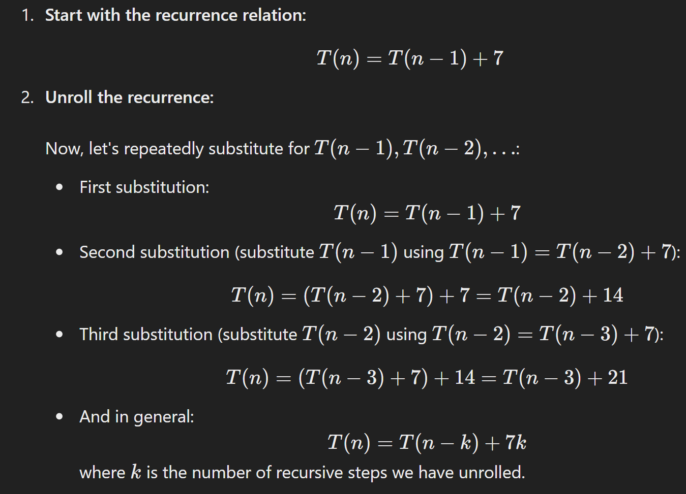
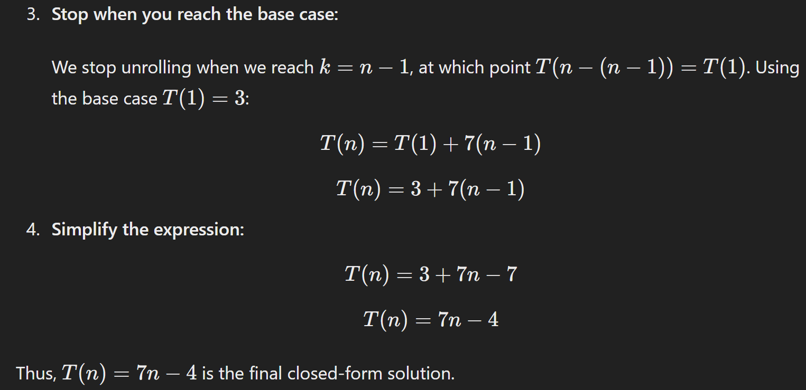
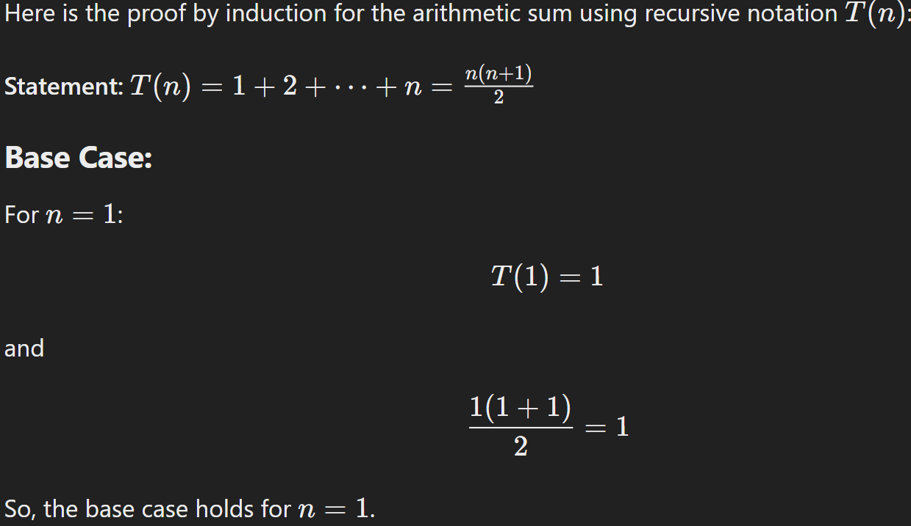
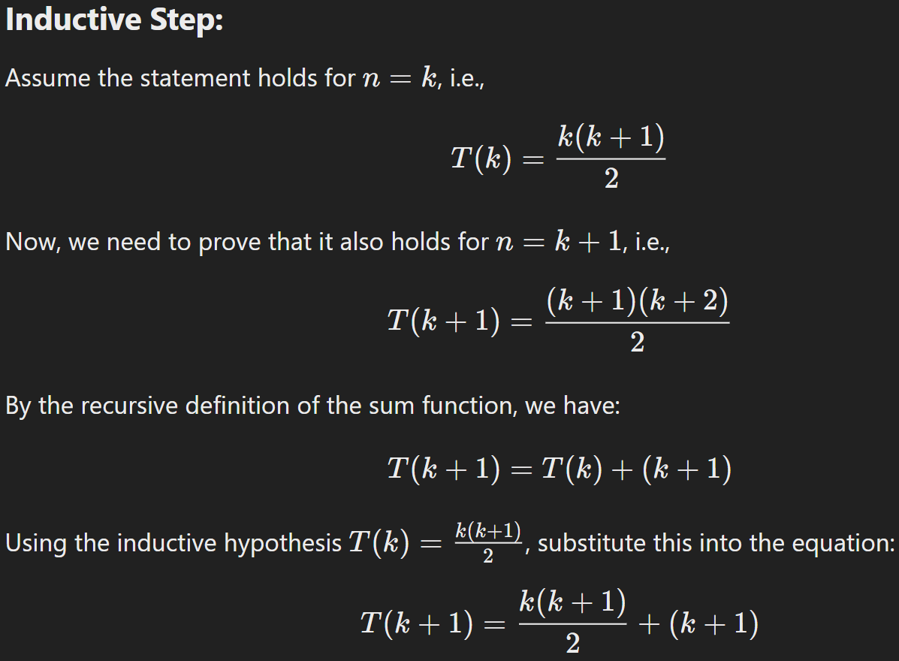
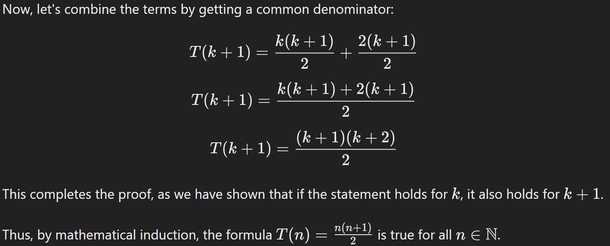
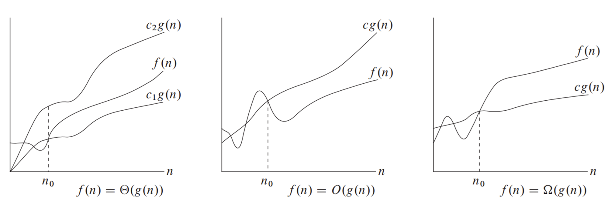
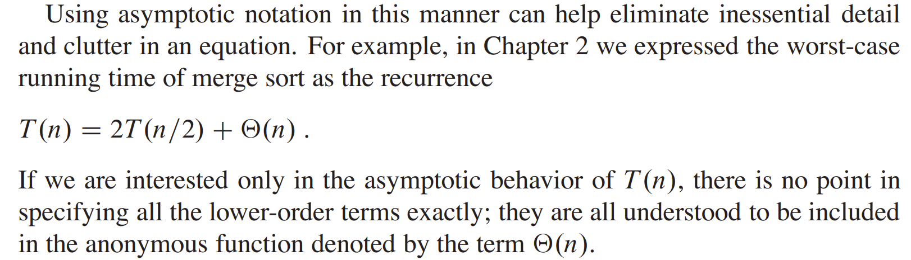
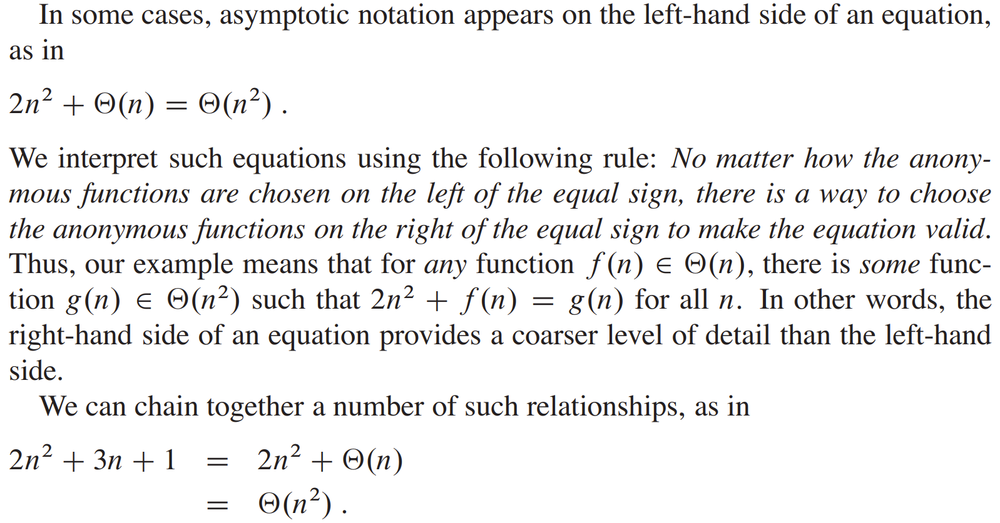
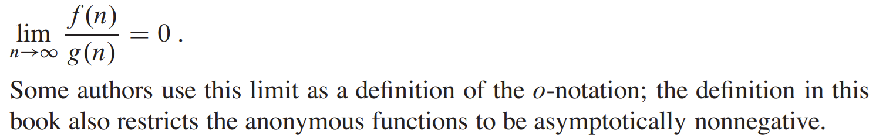
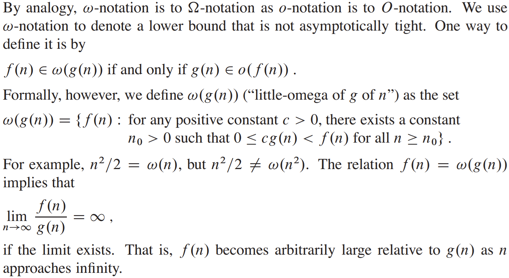

# CSCI 232 <br>Data Structures &amp; Algorithms

*Lecture 13*

- Dr. Jakub L. Pach

---

## Outline

- Syllabus, Textbook, Moodle
- Something about me
- IDE

---

# Analyzing algorithms

---


---

```c
class TwoWayNode
{
public:
    TwoWayNode(int Value, TwoWayNode* Previous, TwoWayNode* Next)
    {
        this->Value = Value;
        this->Next = Next;
        this->Previous = Previous;
    }
    TwoWayNode(int Value)
    {
        this->Value = Value;
        Next = NULL;
        Previous = NULL;
    }
    int Value;
    TwoWayNode* Next;
    TwoWayNode* Previous;
};
```

<!-- chooseAndSwapArrayWithLargerFirstElement(&amp;arr1, &amp;arr2); -->

---

- Mathematical induction - example
- hypothesis
- **Base** Case
- **n+1 step**

---

```c
int arrayMax(int A[], int n)
{
    int currentMax = A[0];
    for (int i = 1; i < n; i++)
    {
        if( currentMax < A[i] )
            currentMax = A[i];
    }
    return currentMax;
}
```

```c
Algorithm arrayMax(A, n):
	Input: An array A storing n ≥ 1 integers.
	Output: The maximum element in A.
	currentMax ← A[0]
	for i ← 1 to n - 1 do
	if currentMax < A[i] then
	currentMax ← A[i]
	return currentMax
```

- Searching for the maximum value in an array

<!-- chooseAndSwapArrayWithLargerFirstElement(&amp;arr1, &amp;arr2); -->

---

```c
int recursiveMax(int arr[], int n)
{
    // Base case:
    if (n == 1)
    {
        return arr[0];
    }
    return max( recursiveMax(arr, n - 1) , arr[n - 1]);
}
```

```c
Algorithm recursiveMax(A, n):
	Input: An array A storing n ≥ 1 integers.
	Output: The maximum element in A.
	if n = 1 then
		return A[0]
	return max( recursiveMax(A, n-1), A[n-1] )
```

- Analyzing recursive algorithms

<!-- chooseAndSwapArrayWithLargerFirstElement(&amp;arr1, &amp;arr2); -->

---

```c
Algorithm recursiveMax(A, n):
	Input: An array A storing n ≥ 1 integers.
	Output: The maximum element in A.
	if n = 1 then
		return A[0]
	return max( recursiveMax(A, n-1), A[n-1] )
```

- Analyzing recursive algorithms
- Iteration is not the only interesting way of solving a problem. Another useful technique, which is employed by many algorithms, is to use **recursion**.
- In this technique, we define a procedure **P** that is allowed to make calls to itself as a subroutine, provided those calls to **P**  are for solving subproblems of smaller size. The subroutine calls to **P** on smaller instances are called ***recursive calls***. A recursive procedure should always define a **base case**, which is small enough that the algorithm can solve it directly without using recursion.

<!-- chooseAndSwapArrayWithLargerFirstElement(&amp;arr1, &amp;arr2); -->

---

```c
Algorithm recursiveMax(A, n):
	Input: An array A storing n ≥ 1 integers.
	Output: The maximum element in A.
	if n = 1 then
		return A[0]
	return max( recursiveMax(A, n-1), A[n-1] )
```

- Analyzing recursive algorithms
- This algorithm first checks if the array contains just a single item, which in this case must be the maximum; hence, in this simple base case we can immediately solve the problem. Otherwise, the algorithm recursively computes the maximum of the first **n-1** elements in the array and then returns the maximum of this value and the last element in the array.

<!-- chooseAndSwapArrayWithLargerFirstElement(&amp;arr1, &amp;arr2); -->

---

```c
Algorithm recursiveMax(A, n):
	Input: An array A storing n ≥ 1 integers.
	Output: The maximum element in A.
	if n = 1 then
		return A[0]
	return max( recursiveMax(A, n-1), A[n-1] )
```

- Analyzing recursive algorithms
- As with this example, recursive algorithms are often quite elegant. Analyzing the running time of a recursive algorithm takes a bit of additional work, however. In particular, to analyze such a running time, we use a **recurrence equation**, which defines mathematical statements that the running time of a recursive algorithm must satisfy. We introduce a function *T(n)* that denotes the running time of the algorithm on an input of size *n*, and we write equations that *T(n)* must satisfy. For example, we can characterize the running time, *T(n)*, of the recursiveMax algorithm as

<!-- chooseAndSwapArrayWithLargerFirstElement(&amp;arr1, &amp;arr2); -->

---

```c
Algorithm recursiveMax(A, n):
	Input: An array A storing n ≥ 1 integers.
	Output: The maximum element in A.
	if n = 1 then
		return A[0]
	return max( recursiveMax(A, n-1), A[n-1] )
```

- Analyzing recursive algorithms
- assuming that we count each comparison, array reference, recursive call, max() calculation, or return as a single primitive operation. Ideally, we would like to characterize a recurrence equation like that above in closed form, where no references to the function T appear on the righthand side. For the recursiveMax algorithm, it isn't too hard to see that a closed form would be ***T(n) = 7(n-1) + 3 = 7n - 4***. In general, determining closed form solutions to recurrence equations can be much more challenging than this, and we study some specific examples of recurrence equations in the future.

<!-- chooseAndSwapArrayWithLargerFirstElement(&amp;arr1, &amp;arr2); -->

---

## The random access machine (RAM) model

- If we wish to analyze a particular algorithm without performing experiments on its running time, we can take the following more analytic approach directly on the high-level code or pseudocode. We define a set of high-level **primitive operations** that are largely independent from the programming language used and can be identified also in the pseudocode. Primitive operations include the following:
- **c1    Assigning a value to a variable**
- **c2    Calling a method**
- **c3    Performing an arithmetic operation**
- **c4    Comparing two numbers**
- **c5    Indexing into an array**
- **c6    Following an object reference**
- **c7    Returning from a method.**

---

## Counting primitive operations

```c
Algorithm recursiveMax(A, n):
	Input: An array A storing n ≥ 1 integers.
	Output: The maximum element in A.
	if n = 1 then
		return A[0]
	return max( recursiveMax(A, n-1), A[n-1] )
```

- n is compared with 1 (one primitive operation, comparing).
- **c1    Assigning a value to a variable**
- **c2    Calling a method**
- **c3    Performing an arithmetic operation**
- **c4    Comparing two numbers**
- **c5    Indexing into an array**
- **c6    Following an object reference**
- **c7    Returning from a method.**
- Base case

<!-- why is n? because conditional will be one more times than everything else
normalnie jest n+1 -->

---

## Counting primitive operations

```c
Algorithm recursiveMax(A, n):
	Input: An array A storing n ≥ 1 integers.
	Output: The maximum element in A.
	if n = 1 then
		return A[0]
	return max( recursiveMax(A, n-1), A[n-1] )
```

- **Returning** the value of A\[0\] is considered a single primitive operation, but given that **accessing an element of an array by index** is also a primitive operation, we can argue that there are two primitive operations involved: indexing into the array and returning the value.
- **c1    Assigning a value to a variable**
- **c2    Calling a method**
- **c3    Performing an arithmetic operation**
- **c4    Comparing two numbers**
- **c5    Indexing into an array**
- **c6    Following an object reference**
- **c7    Returning from a method.**
- Base case

<!-- why is n? because conditional will be one more times than everything else
normalnie jest n+1 -->

---

## Counting primitive operations

```c
Algorithm recursiveMax(A, n):
	Input: An array A storing n ≥ 1 integers.
	Output: The maximum element in A.
	if n = 1 then
		return A[0]
	return max( recursiveMax(A, n-1), A[n-1] )
```

- **c1    Assigning a value to a variable**
- **c2    Calling a method**
- **c3    Performing an arithmetic operation**
- **c4    Comparing two numbers**
- **c5    Indexing into an array**
- **c6    Following an object reference**
- **c7    Returning from a method.**
- *A***\[n-1\]**
- n &gt; 1 - recurrence relation

<!-- why is n? because conditional will be one more times than everything else
normalnie jest n+1 -->

---

## Counting primitive operations

```c
Algorithm recursiveMax(A, n):
	Input: An array A storing n ≥ 1 integers.
	Output: The maximum element in A.
	if n = 1 then
		return A[0]
	return max( recursiveMax(A, n-1), A[n-1] )
```

- **c1    Assigning a value to a variable**
- **c2    Calling a method**
- **c3    Performing an arithmetic operation**
- **c4    Comparing two numbers**
- **c5    Indexing into an array**
- **c6    Following an object reference**
- **c7    Returning from a method.**
- *A***\[n-1\]**
- **n-1**
- n &gt; 1 - recurrence relation

<!-- why is n? because conditional will be one more times than everything else
normalnie jest n+1 -->

---

## Counting primitive operations

```c
Algorithm recursiveMax(A, n):
	Input: An array A storing n ≥ 1 integers.
	Output: The maximum element in A.
	if n = 1 then
		return A[0]
	return max( recursiveMax(A, n-1), A[n-1] )
```

- **c1    Assigning a value to a variable**
- **c2    Calling a method**
- **c3    Performing an arithmetic operation**
- **c4    Comparing two numbers**
- **c5    Indexing into an array**
- **c6    Following an object reference**
- **c7    Returning from a method.**
- *A***\[n-1\]**
- **n-1**
- **recursiveMax()**
- n &gt; 1 - recurrence relation

<!-- why is n? because conditional will be one more times than everything else
normalnie jest n+1 -->

---

## Counting primitive operations

```c
Algorithm recursiveMax(A, n):
	Input: An array A storing n ≥ 1 integers.
	Output: The maximum element in A.
	if n = 1 then
		return A[0]
	return max( recursiveMax(A, n-1), A[n-1] )
```

- **c1    Assigning a value to a variable**
- **c2    Calling a method**
- **c3    Performing an arithmetic operation**
- **c4    Comparing two numbers**
- **c5    Indexing into an array**
- **c6    Following an object reference**
- **c7    Returning from a method.**
- *A***\[n-1\]**
- **n-1**
- **recursiveMax()**
- **max()**
- n &gt; 1 - recurrence relation

<!-- why is n? because conditional will be one more times than everything else
normalnie jest n+1 -->

---

## Counting primitive operations

```c
Algorithm recursiveMax(A, n):
	Input: An array A storing n ≥ 1 integers.
	Output: The maximum element in A.
	if n = 1 then
		return A[0]
	return max( recursiveMax(A, n-1), A[n-1] )
```

- **c1    Assigning a value to a variable**
- **c2    Calling a method**
- **c3    Performing an arithmetic operation**
- **c4    Comparing two numbers**
- **c5    Indexing into an array**
- **c6    Following an object reference**
- **c7    Returning from a method.**
- *A***\[n-1\]**
- **n-1**
- **recursiveMax()**
- **max()**
- **return**
- n &gt; 1 - recurrence relation

<!-- why is n? because conditional will be one more times than everything else
normalnie jest n+1 -->

---

## Counting primitive operations

```c
Algorithm recursiveMax(A, n):
	Input: An array A storing n ≥ 1 integers.
	Output: The maximum element in A.
	if n = 1 then
		return A[0]
	return max( recursiveMax(A, n-1), A[n-1] )
```

- **c1    Assigning a value to a variable**
- **c2    Calling a method**
- **c3    Performing an arithmetic operation**
- **c4    Comparing two numbers**
- **c5    Indexing into an array**
- **c6    Following an object reference**
- **c7    Returning from a method.**
- n &gt; 1 - recurrence relation
- *A***\[n-1\]**
- **n-1**
- **recursiveMax()**
- **max()**
- **return**
- **n = 1**

<!-- why is n? because conditional will be one more times than everything else
normalnie jest n+1 -->

---

## How?

- from **recurrence equation** to **closed form**

---




---


---


---



---

## Proof by induction for the arithmetic sum using recursive notation T(n)

---







---

# Review

---

## Asymptotic notation

---

## Asymptotic notation

---

## Θ-notation




<!-- Θ(n²) “theta of n squared”
Θ(g(n))  theta of g of n
c₁ “c sub one ; c one”
c₁g(n) c one times g of n
f(n) “F OF N”
A function f(n) belongs to the set Θ(g(n)) if there exist positive constants c1 and c2 such that it can be “sandwiched” between c₁g(n)  and c2g(n) , for sufficiently large n. Because Θ(g(n)) is a set, we could write “f .n/ 2 ‚.g.n//” to indicate that f .n/ is a member of ‚.g.n//. Instead, we will usually write “f .n/ D ‚.g.n//” to express the same notion. You might be confused because we abuse equality in this way, but we shall see later in this section that doing so has its advantages -->

---

## Multiplication of a function by a constant c

- -5
- 0
- 5
- -5
- 0
- 5
- **f(x)**
- -5
- 0
- 5
- -5
- 0
- 5
- **f(x)**
- -5
- 0
- 5
- -5
- 0
- 5
- **f(x)**

---

## O &amp; Ω-notation


- For example, the best-case running time of bubble sort is *Ω(n)*, which implies that the running time of bubble sort is *Ω(n)*.

<!-- For example, the best-case running time of bubble sort is Ω(n), which implies that the running time of bubble sort is Ω(n). -->

---

## O &amp; Ω-notation


<!-- Θ(n²) “theta of n squared”
Θ(g(n))  theta of g of n
c₁ “c sub one ; c one”
c₁g(n) c one times g of n
f(n) “F OF N”
A function f(n) belongs to the set Θ(g(n)) if there exist positive constants c1 and c2 such that it can be “sandwiched” between c₁g(n)  and c2g(n) , for sufficiently large n. Because Θ(g(n)) is a set, we could write “f .n/ 2 ‚.g.n//” to indicate that f .n/ is a member of ‚.g.n//. Instead, we will usually write “f .n/ D ‚.g.n//” to express the same notion. You might be confused because we abuse equality in this way, but we shall see later in this section that doing so has its advantages -->

---

## Asymptotic notation in equations and inequalities


---

## Asymptotic notation in equations and inequalities



---

## Asymptotic notation in equations and inequalities



---

## o-notation




---

## ω-notation



---

## Analogy between the asymptotic comparison of two functions *f* and *g* and the comparison of two real numbers *a* and *b*


---

```c
{
    int n = 5;
    for (int i = 0; i < n; i++)
    {
        /* code */
    }
            for (int i = 0; i <= n-1; i++)
    {
        /* code */
    }
}
```

<!-- chooseAndSwapArrayWithLargerFirstElement(&amp;arr1, &amp;arr2); -->

---

## pasuje

- 0
- 1
- 2
- 3
- 4
- 5
- 6
- 7
- 0
- 1
- 2
- 3
- 4
- 5
- 6
- 7
- f(n²) = Θ(n²)

---

## bubble sort

- 1
- 2
- 3
- 4
- 5
- 6
- 1
- 2
- 3
- 4
- 5
- 6

---

czyli slownie powiedziane Θ() znacza "asymtotycznie dokladne"

- The term "asymptotically tight bound" is used to emphasize the precision of Θ notation.

---

- When we say that a function f(n) is Θ(g(n)), in simpler terms, it means that function f(n) grows at exactly the same rate as function g(n) for large values of n. There are no "upper bounds" or "lower bounds" here - it's a precise description of the function's growth rate.
- Θ(g(n)) means that function f(n) has an asymptotically tight bound of g(n). Θ(g(n)) is the strongest form of asymptotic notation because it provides us with the most information about the growth rate of the function.

---

- Okay, but if we have a bubble sort function, in the worst case scenario we have O(n^2), and for a sorted array we have Ω(n), so can we say that bubble sort is Θ(n^2)?

---

Your observation is very accurate and often leads to some confusion in the case of sorting algorithms like bubble sort.

Why can't we say that bubble sort is Θ(n²)?

Θ notation represents an asymptotically tight bound: It means that the function grows exactly as fast as the function described in the notation, for both best and worst cases. Bubble sort has different complexities for different input cases:

Worst case: When the array elements are sorted in reverse order, bubble sort performs the maximum number of comparisons and swaps, leading to a time complexity of O(n²).

Best case: When the array is already sorted, bubble sort performs only one iteration, resulting in a time complexity of Ω(n).

Conclusion:

Since bubble sort has different asymptotic bounds for different input cases, we cannot use Θ notation to describe its overall time complexity.

What can we say about bubble sort?

Upper bound: In the worst case, bubble sort is O(n²). Lower bound: In the best case, bubble sort is Ω(n). In summary:

When we say that bubble sort is O(n²), we mean that it will not exceed this complexity, but it may be significantly faster for some inputs. Conversely, Ω(n) means that bubble sort will be at least as fast, but it may be slower in other cases.

When can we use Θ notation for sorting algorithms?

Algorithms that have the same time complexity for all input cases: For example, counting sort or merge sort have a complexity of Θ(n log n) for all possible inputs. In the case of bubble sort, the most precise description is to give both the upper and lower bounds.

**Note:** I've tried to keep the translation as close to the original meaning as possible, while ensuring clarity and readability.

---

- **Small omega (ω) notation and its application in the context of bubble sort**
- Small omega (ω) notation is used to determine the asymptotic lower bound of a function. This means that the function grows at least as fast as the function described in the notation. In other words, it is a kind of opposite of big O notation.
- In the context of bubble sort:
- ω(n): This means that the algorithm runs significantly faster than linear time. However, for bubble sort, even in the best case (sorted array), the algorithm must go through the entire array at least once to determine if it is already sorted. Therefore, bubble sort is not ω(n).
- **In summary:**
- Bubble sort is Ω(n) and O(n²). Bubble sort is not ω(n) nor Θ(n²).
- **Why can't we use Θ(n²) for bubble sort?**
- Because Θ(n²) means that the function grows exactly as fast as n². However, bubble sort can run much faster for some inputs (e.g., for an already sorted array), which contradicts the definition of Θ(n²).
- **Small o (o) notation:**
- Small o (o) notation means that the function grows significantly slower than the function described in the notation. Bubble sort is not o(n²): Since in the worst case bubble sort has a complexity of O(n²), it cannot be o(n²).
- **When do we use different notations?**
- O(n): Upper bound - the algorithm will not run longer than the specified function. Ω(n): Lower bound - the algorithm will run at least as long as the specified function. Θ(n): Exact bound - the algorithm runs exactly as long as the specified function. o(n): Significantly smaller bound - the algorithm runs significantly faster than the specified function. ω(n): Significantly larger bound - the algorithm runs significantly slower than the specified function.
- **In summary:**
- The choice of the appropriate notation depends on what we want to express: whether we are interested in the upper, lower, or exact bound of the algorithm's complexity. For bubble sort, the most precise description is to give both the upper and lower bounds, i.e., O(n²) and Ω(n).
- Would you like to discuss other sorting algorithms or other aspects of asymptotic notation?"
- **Key points covered in the translation:**
- **Clear and concise explanation** of small omega notation and its relationship to bubble sort.
- **Comparison** of small omega, big O, and theta notations.
- **Examples** to illustrate the concepts.
- **Summary** of the key points.
- **Invitation** to discuss further topics.
- This translation aims to provide a comprehensive and accurate explanation of the topic, making it accessible to a wider audience.

---

- When is a notation not asymptotically tight?
- O(g(n)) is not asymptotically tight if f(n) grows significantly slower than g(n). For example, if f(n) = log(n) and g(n) = n, then O(n) is an upper bound for f(n), but it is not asymptotically tight because f(n) grows significantly slower than n.
- Ω(g(n)) is not asymptotically tight if f(n) grows significantly faster than g(n). For example, if f(n) = 2^n and g(n) = n^2, then Ω(n^2) is a lower bound for f(n), but it is not asymptotically tight because f(n) grows significantly faster than n^2.
- O(g(n)) is not asymptotically tight when the function grows significantly slower than the bound.
- Ω(g(n)) is not asymptotically tight when the function grows significantly faster than the bound.

---

- **Ograniczenie asymptotycznie dokładne:** f(n) = Θ(g(n)) ⇔ f(n) = O(g(n)) ∧ f(n) = Ω(g(n))

---

- 0
- 5
- 10
- 15
- 20
- 0
- 5
- 10
- 15
- 20
- **f(n) = n**
- **g(n) = n^2**
- **h(n) = log(n)**
- Asymptotic notation is used to describe how fast a function grows as its argument tends to infinity.
- **Big O (O):** Means that the function grows **at most** as fast as the function given in the notation. For example, f(n) = O(n^2) tells us that f(n) grows at most as fast as a quadratic function.
- **Little o (o):** Is more restrictive. It means that the function grows **significantly slower** than the function given in the notation. For example, f(n) = 2n is o(n^2), because a linear function always grows slower than a quadratic function.
- **Example:** Imagine a car race. If we say that car A is going "at most" as fast as car B, it can go as fast or slower. But if we say that car A is going "significantly slower" than car B, then it will never catch up to B."

---

# Thank You

---

<!-- pptx2marp: slide 54 has no extractable text or images -->

---

<!-- pptx2marp: slide 55 has no extractable text or images -->

---

||second (10^6)|
|---|---|
|lg n|lg n = 10^6 =&gt; 2^10^6 =&gt; 10^301030|
|Sqrt(n) == n^1/2|n^1/2 = 10^6 =&gt; 10^12|
|n|n = 10^6 =&gt; n = 10^6|
|n \* lg n|n =&gt; 62746|
|n^2|n^2 = 10^6 =&gt; n = 10^3|
|n^3|n^3 = 10^6 =&gt; n = 10^2|
|2^n|10^6 =&gt; N = 6\*lg 10=19|
|n!|10^6=&gt;N=9|

- For each function f .n/ and time t in the following table, determine the largest size n of a problem that can be solved in time t, assuming that the algorithm to solve the problem takes f .n/ microseconds

---

## Algorithm

---

## Insertion sort

---

- z moim obserwacji to niezmiennik petli (loop invariant) to warunek jakby miedzy “kodem/zdaniami” ktory jest spelniony przed wywolaniem naszej petli i jest spelniony rowniez po wykonaniu calej petli. zwykle jest to podzbior od a\[0\]...a\[i-1\] z tego co zauwazylem.

---

- dodawanie dwoch liczb binarnych z podrecznika 2.1-4

```c
int * binadd(int arrA[], int arrB[], int n)
{
    int * arrC = (int *) calloc( sizeof(int) * (n + 1) );
    int i, temp;
    for ( i = 0; i < n; i++)
    {
        temp = arrA[i] + arrB[i] + arrC[i];
        if (temp == 3) //3
        {
            arrC[i] = 1;
            arrC[i + 1] = 1;
        }
        if(temp == 2) //2
        {
            arrC[i] = 0;
            arrC[i + 1] = 1;
        }
        if (temp == 1) //1
        {
            arrC[i] = 1;
        }
    }
    return arrC;
}
```

---

## Analyzing algorithms

- For most of this course, we shall assume a generic one processor, **random-access machine** (RAM) model of computation as our implementation technology and understand that our algorithms will be implemented as computer programs. In the RAM model, **instructions are executed one after another**, with no concurrent operations.
- The data types in the RAM model are integer and floating point (for storing real numbers).
- We also assume a limit on the size of each word of data. For example, when working with inputs of size n, we typically assume that integers are represented by c lg n bits for some constant c  1. We require c  1 so that each word can hold the value of n, enabling us to index the individual input elements, and we restrict c to be a constant so that the word size does not grow arbitrarily.

---

## Analyzing algorithms

Real computers contain instructions not listed above, and such instructions represent a gray area in the RAM model.

For example, is exponentiation a constant time instruction? In the general case, no; it takes several instructions to compute x\*y when x and y are real numbers. In restricted situations, however, exponentiation is a constant-time operation. Many computers have a “shift left” instruction, which in constant time shifts the bits of an integer by k positions to the left. In most computers, shifting the bits of an integer by one position to the left is equivalent to multiplication by 2, so that shifting the bits by k positions to the left is equivalent to multiplication by 2\*k.

Therefore, such computers can compute 2k in one constant-time instruction by shifting the integer 1 by k positions to the left, as long as k is no more than the number of bits in a computer word. We will endeavor to avoid such gray areas in the RAM model, but we will treat computation of 2k as a constant-time operation when k is a small enough positive integer.

---

## The best notion for input size

The best notion for **input size** depends on the problem being studied. For many problems, such as sorting or computing discrete Fourier transforms, the most natural measure is **the number of items in the input**—for example, the array size n for sorting.

For many other problems, such as multiplying two integers, the best measure of input size is **the total number of bits needed to represent the input in ordinary binary notation**. Sometimes, it is more appropriate to describe the size of the input **with two numbers rather than one**. For instance, if the input to an algorithm is a graph, the input size can be described by the numbers of **vertices and edges in the graph**. We shall indicate which input size measure is being used with each problem we study.

---

## Running time

The best notion for **input size** depends on the problem being studied. For many problems, such as sorting or computing discrete Fourier transforms, the most natural measure is **the number of items in the input**—for example, the array size n for sorting.

For many other problems, such as multiplying two integers, the best measure of input size is **the total number of bits needed to represent the input in ordinary binary notation**. Sometimes, it is more appropriate to describe the size of the input **with two numbers rather than one**. For instance, if the input to an algorithm is a graph, the input size can be described by the numbers of **vertices and edges in the graph**. We shall indicate which input size measure is being used with each problem we study.

---

## loop invariant

- Loop condition that always holds
- Loop truth
- Loop property
- Loop assertion

---

- zrobic slajd z pseudokodem
- zrobic program ktory, ktory mierzy czas jego dzialania, poszukac w c++ funkcji ktora ten czas mierzy,
- uwzglednic
- podzial przedzialu na m = l + (r -1)/2; // gdzie l jest minimalnym indeksem, a r jest maksymalnym, daje nam przesuniecie o 1 w prawo wzgledem (l + r) /2 i chroni nas przed przepelnieniem przy indeksach bliskich rozmiarowi typu int.

---

<!-- pptx2marp: slide 67 has no extractable text or images -->
