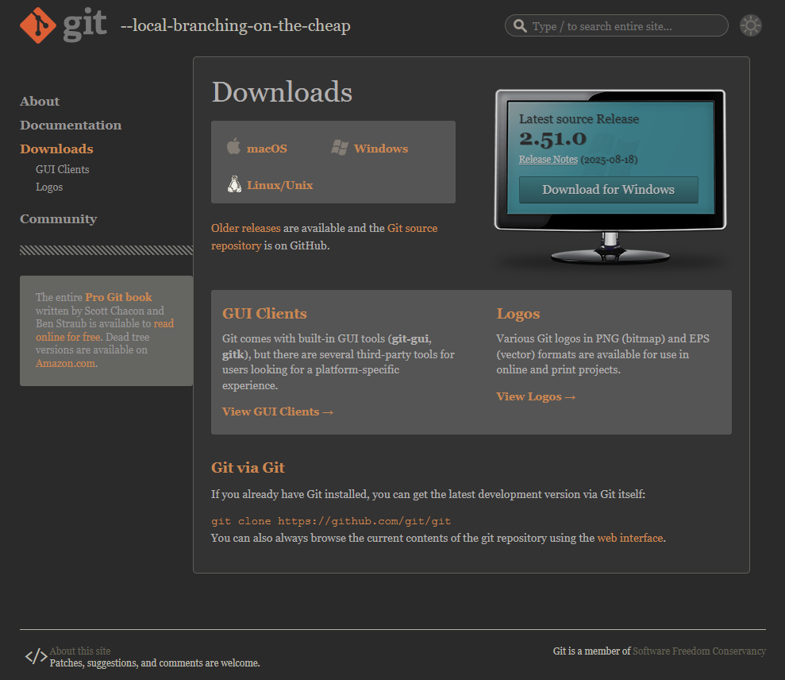
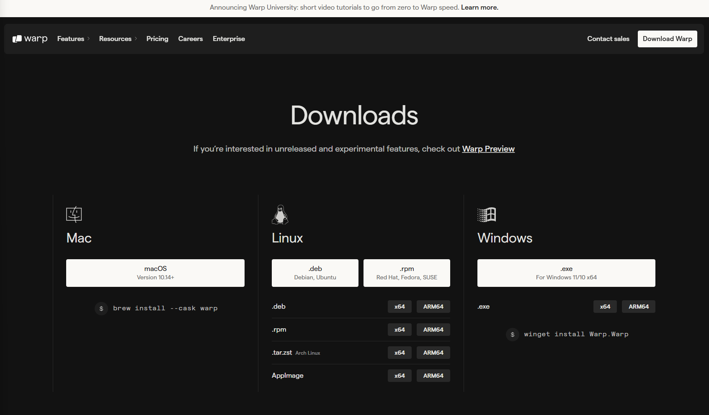
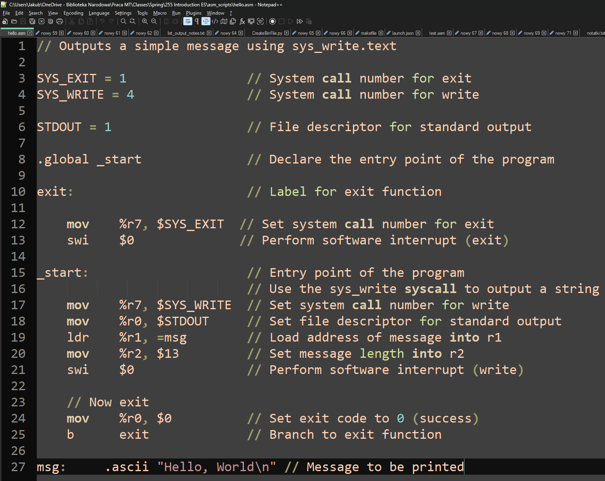

# Software Engineering

*Lecture 2*

---

## Today’s Agenda

- History of GIT
- GIT
- Review of Navigating the Command Line and Bash
- Git Settings

---

## Where we are now

- Road Trip
  - Programmer’s Toolbox
    - Git
      - Repository creation
      - Commit
      - Branching
      - Merging
      - Refactoring
      - Pull requests

---

# A Brief History of

*Version Control Systems and the Birth of Git*

---

## 1. CVS – Concurrent Versions System (c. 1990–2008)

One of the first widely used version control systems.

**Characteristics:**

- Managed versions of **individual files**, not entire projects.
- **Centralized model** – a single main repository.

**Limitations:**

- Poor branching support.
- No strong data integrity.
- Slow operations.
- Used in early open-source projects, including Linux in its early stages.

---

## 2. BitKeeper (2000–2018)

A **commercial**, distributed version control system known for speed.

From 2002, it was **free for the Linux community** under a special license.

**Why it mattered:**

- Linus Torvalds used it to manage the Linux kernel codebase.

**Crisis in 2005:**

- Andrew Tridgell created a tool called **SourcePuller** by reverse-engineering BitKeeper’s protocol.
- BitMover (Larry McVoy’s company) considered this a license violation and **revoked free access**.

**What happened next:**

- In 2016, BitKeeper was open-sourced under the Apache 2.0 license.
- Last release: **2018**.
- Today, it’s practically abandoned—Git completely replaced it.

---

## 3. The Birth of Git (2005)

After losing BitKeeper, Linus Torvalds set requirements for a new tool:

- **Free and open source**.
- **Distributed** (every user has the full history).
- **Extremely fast** (apply a patch in &lt;3 seconds).
- **Resilient to corruption**.

**Timeline:**

- April 3, 2005 – development begins.
- June 2005 – first release.

**The name 'Git':**

- “Global Information Tracker” (when it works well).
- “Goddamn Idiotic Truckload of \*\*\*\*” (when it doesn’t).
- Officially: “the stupid content tracker.”

---

## Git - Global Information Tracker

- Git is a free and open source distributed version control system designed to handle everything from small to very large projects with speed and efficiency.
- Git is easy to learn and has a tiny footprint with lightning fast performance. It outclasses SCM tools like Subversion, CVS, Perforce, and ClearCase with features like cheap local branching, convenient staging areas, and multiple workflows.
- <https://git-scm.com/doc>

---

## What is Git? (Simple Definition for Beginners)

Git is a version control system. Its main job is to track every change in your code and allow you to go back to previous versions if needed. It also lets you compare changes between versions.

But Git does more than that:

- It allows multiple developers to work on the same project at the same time by creating alternative versions of the code, called branches.
- These branches can later be merged back together. If two people changed the same part of the code, Git will show a conflict that needs to be resolved.
- This makes Git perfect for collaborative work and for projects that evolve quickly.

In Agile development, where code changes often and quality can drop over time, Git helps by making refactoring and merging much easier. In more rigid, plan-driven approaches, branching and merging might be less frequent, but Git is still useful for tracking history and avoiding mistakes.

---

## Materials I based my work on

- [https://www.youtube.com/watch?v=zTjRZNkhiEU&amp;t=11983s](https://www.youtube.com/watch?v=zTjRZNkhiEU&t=11983s)
- [https://www.youtube.com/watch?v=7tOLcNZfPso&amp;list=PLRAV69dS1uWT4v4iK1h6qejyhGObFH9\_o&amp;ab\_channel=HiteshChoudhary](https://www.youtube.com/watch?v=7tOLcNZfPso&list=PLRAV69dS1uWT4v4iK1h6qejyhGObFH9_o&ab_channel=HiteshChoudhary)
- [https://www.youtube.com/watch?v=8JJ101D3knE&amp;ab\_channel=ProgrammingwithMosh](https://www.youtube.com/watch?v=8JJ101D3knE&ab_channel=ProgrammingwithMosh)

---

## Download and install GIT ( Homework )

- <https://git-scm.com/downloads>



---

## Download and install warp ( Homework )

- <https://www.warp.dev/download>



---

- Create and log in in GitHub account
- Please turn of AI


---

# Review

*Navigating the Command Line*

---

# Navigating the Command Line

---

## Navigating the Command Line: Windows vs. Linux<br>Slide 1: Opening the Command Prompt

- Windows:
  - Cmd: The most commonly used command to open the command prompt.
  - To obtain the username and device name, we use the whoami command.
- Linux:
  - Terminal: A generic term for the window where commands are typed.
  - To obtain the current directory path, we use the pwd command.

**Notes**:

- Up/down arrows: Browse command history.
- Tab: Autocompletes filenames, directories, and commands.

---

## Navigating the Command Line: Windows vs. Linux<br>Slide 1: Opening the Command Prompt - Example

```
jacob@raspberrypi:~ $ pwd
/home/jacob
jacob@raspberrypi:~ $


```

```
Microsoft Windows [Version 10.0.22631.4602]
(c) Microsoft Corporation. All rights reserved.

C:\Users\Jacob> whoami
notebooki7\Jacob
C:\Users\Jacob>


```

- From the Start menu:
  - Click the Start button in the lower left corner of the screen.
  - Type 'cmd' and press Enter.
- From the Run dialog box
  - Simultaneously press the Windows key and R.
  - In the opened window, type 'cmd' press Enter.
- From the Start menu:
  - Click the Start button in the lower left corner of the screen.
  - Click the Accessories.
  - Click the Terminal.
- Keyboard shortcut:
  - The most commonly used shortcut is Ctrl+Alt+T.

<!-- This shortcut is universal and works in many Linux distributions, including Raspbian. Pressing this shortcut should open a new terminal. -->

---

## Differences in Command Prompt Messages Between Windows and Linux

The command prompt in different operating systems displays various information, which stems from differences in their architecture and design philosophy.

**Windows**

- Default message: Typically displays the full path to the currently open directory.
- Example: C:\Users\User\Documents Purpose: Provides the exact location of the user within the file system hierarchy.

**Linux** Default message:

- Most often presents the username and hostname (device name).
- Example: user@computer:~$ Purpose: Informs about the currently logged-in user and the machine they are working on.

```
 C:\Users\Jacob>


```

```
 jacob@raspberrypi:~ $


```

---

## Navigating the Command Line: Windows vs. Linux<br>Slide 2: Basic Navigation and Directory Management

- Windows:
  - dir:    Lists files and directories in the current directory.
  - cd:    Changes the current directory.
  - cd..:    Moves up one directory level.
- Linux:
  - ls:    Lists files and directories in the current directory.
  - cd:    Changes the current directory.
  - cd ..:    Moves up one directory level.

**Notes**:

- Both dir and ls are used to list directory contents in both different systems.
- In Linux, 'cd ..' requires a space between the dots, Windows does not.

---

## Navigating the Command Line: Windows vs. Linux<br>Slide 2: Basic Navigation and Directory Management – Example(dir)

- dir:    Lists files and directories in the current directory.

```
jacob@raspberrypi:~ $ ls
Bookshelf  Desktop  Documents  Downloads  Music  Pictures  Public  Templates  Videos
jacob@raspberrypi:~ $ dir
Bookshelf  Desktop  Documents  Downloads  Music  Pictures  Public  Templates  Videos
jacob@raspberrypi:~ $


```

```
C:\Users\Jacob>dir
12/19/2024  12:14 PM    <DIR>          .
09/05/2023  09:06 AM    <DIR>          ..
10/05/2022  11:55 PM    <DIR>          Contacts
01/04/2025  08:29 AM    <DIR>          Desktop
09/07/2024  08:51 AM    <DIR>          Documents
01/03/2025  05:47 PM    <DIR>          Downloads
10/05/2022  11:55 PM    <DIR>          Favorites
10/05/2022  11:55 PM    <DIR>          Links
07/16/2023  07:09 AM    <DIR>          Music
12/06/2024  02:21 PM    <DIR>          Pictures
12/19/2024  11:34 AM    <DIR>          Videos
               4 File(s)            818 bytes
              42 Dir(s)  62,825,164,800 bytes free
C:\Users\Jacob>ls
ls
'ls' is not recognized as an internal or external command,
operable program or batch file.
C:\Users\Jacob>


```

- ls:    Lists files and directories in the current directory.

\*Windows PowerShell supports ls, but cmd doesn’t.

---

## Navigating the Command Line: Windows vs. Linux<br>Slide 2: Basic Navigation and Directory Management – Example(cd/cd..)

- cd:    Changes the current directory.
- cd..:    Moves up one directory level.

```
jacob@raspberrypi:~ $ cd Desktop
jacob@raspberrypi:~/Desktop $ cd ..
jacob@raspberrypi:~ $ cd Desktop
jacob@raspberrypi:~/Desktop $ cd..
-bash: cd..: command not found
jacob@raspberrypi:~/Desktop $cd /
jacob@raspberrypi:/ $ pwd
/
jacob@raspberrypi:/ $


```

```
C:\Users\Jacob>cd Desktop
C:\Users\Jacob\Desktop>cd..
C:\Users\Jacob>cd Desktop
C:\Users\Jacob\Desktop>cd ..
C:\Users\Jacob>cd /
C:\>


```

- cd:    Changes the current directory.
- cd ..:    Moves up one directory level.

---

- C:\
- Program Files(x86)
- Program Files
- Users
- Windows
- ...
- Jacob
- AppData
- Desktop
- Documents
- Music
- Pictures
- Videos
- ...
- Adobe
- Microsoft Office
- ...
- Microsoft Visual Studio
- Windows Defender
- Cheat Engine 7.5
- MATLAB
- Notepad++
- ...
- D:\ (ESD-USB)
- efi
- My Computer
- support
- boot
- sources
- 'System Volume Information'
- ...
- ...
- /
- bin
- dev
- etc
- home
- lib
- sys
- usr
- ...
- Jacob
- Desktop
- Documents
- Downloads
- Music
- Pictures
- Videos
- share
- ...
- vlc
- (Visual Studio Code)
- ....
- media
- Jacob
- efi
- support
- boot
- sources
- 'System Volume Information'
- ...
- ESD-USB

---

## Navigating the Command Line: Windows vs. Linux<br>Slide 3: Text Manipulation and Output

- Windows:
  - echo: Displays a message on the screen.
- Linux:
  - echo: Displays a message on the screen.

**Note**: Both echo commands have similar functionality, but there might be slight variations in options and behavior.

---

## Navigating the Command Line: Windows vs. Linux<br>Slide 3: Text Manipulation and Output - Example

- echo: Displays a message on the screen.

```
jacob@raspberrypi:~ $ echo Hello World!
Hello World!
jacob@raspberrypi:~ $ echo "Hello World!"
Hello World!
jacob@raspberrypi:~ $echo

jacob@raspberrypi:~ $echo.
-bash: echo.: command not found
jacob@raspberrypi:~ $


```

```
C:\Users\Jacob>echo Hello World!
Hello World!
C:\Users\Jacob> echo "Hello World!"
"Hello World!"
C:\Users\Jacob>echo.

C:\Users\Jacob>echo
ECHO is on.
C:\Users\Jacob>


```

- echo: Displays a message on the screen.

---

## Navigating the Command Line: Windows vs. Linux<br>Slide 4: Hello, World! and Redirection

- Windows:
  - echo Hello, world!
  - To redirect output to a file: echo Hello, world! &gt; myfile.txt
- Linux:
  - echo Hello, world!
  - To redirect output to a file: echo Hello, world! &gt; myfile.txt

**Note:** Redirection works similarly in both systems, using the &gt; symbol to overwrite a file and &gt;&gt; to append to a file.

---

## Navigating the Command Line: Windows vs. Linux<br>Slide 4: Hello, World! and Redirection - Example

- The simplest way to create a new file.
- Redirection works similarly in both systems, using the &gt; symbol to overwrite a file and &gt;&gt; to append to a file.

```
jacob@raspberrypi:~ echo Hello world! > myfile.txt
jacob@raspberrypi:~ $


```

```
C:\Users\Jacob>echo Hello world! > myfile.txt
C:\Users\Jacob>


```

```
Hello world!


```

myfile.txt

---

## Navigating the Command Line: Windows vs. Linux<br>Slide 5: Creating and Deleting Files and Directories

- Windows:
  - copy:    Copies files.
  - del:    Deletes files.
  - md:    Makes a new directory.
- Linux:
  - cp:    Copies files.
  - rm:    Removes files or directories.
  - mkdir:    Makes a new directory.

---

## Navigating the Command Line: Windows vs. Linux<br>Slide 5: Creating and Deleting Files and Directories – Example(copies, deletes, makes)

- copy:    Copies files.
- del:    Deletes files.
- md:    Makes a new directory.
- cp:    Copies files.
- rm:    Removes files or directories.
- mkdir:    Makes a new directory.

```
jacob@raspberrypi:~ $ mkdir Folder
jacob@raspberrypi:~ $ ls
Bookshelf  Desktop  Documents  Downloads  Folder  Music  Pictures  Public  Templates  Videos


```

```
jacob@raspberrypi:~ $ cd Folder
jacob@raspberrypi:~/Folder $ echo > empty.txt
jacob@raspberrypi:~/Folder $ cp empty.txt copyEmpty.txt
```

```
jacob@raspberrypi:~/Folder $ ls
copyEmpty.txt  empty.txt


```

```
jacob@raspberrypi:~/Folder $ rm copyEmpty.txt
jacob@raspberrypi:~/Folder $
```

```
C:\Users\Jacob>md Folder
C:\Users\Jacob>dir
...
01/04/2025  10:06 AM    <DIR>          Folder
10/05/2022  11:55 PM    <DIR>          Links
07/16/2023  07:09 AM    <DIR>          Music
...
```

```
C:\Users\Jacob> cd Folder
C:\Users\Jacob\Folder> echo. > empty.txt
C:\Users\Jacob\Folder> copy empty.txt copyEmpty.txt
```

```
C:\Users\Jacob\Folder> dir
...
01/04/2025  12:22 PM    <DIR>          .
01/04/2025  10:08 AM    <DIR>          ..
01/04/2025  12:19 PM                 3 copyEmpty.txt
01/04/2025  12:19 PM                 3 empty.txt
...
```

```
C:\Users\Jacob\Folder> del copyEmpty.txt
C:\Users\Jacob\Folder>
```

---

## Navigating the Command Line: Windows vs. Linux<br>Slide 6: Executing Compiled Programs

- Windows:
  - To run a compiled program, you usually just type the program name, followed by the .exe extension: program\_name.exe.
  - Windows will automatically add the .exe extension if it is omitted.
- Linux:
  - To run a compiled program, you typically use the following syntax: ./program\_name.
  - The ./ part specifies that the program should be executed in the current directory.

---

## Navigating the Command Line: Windows vs. Linux<br>Slide 6: Executing Compiled Programs – Example

- To run a compiled program, you usually just type the program name, followed by the .exe extension: program\_name.exe.

```
jacob@raspberrypi:~ $cd /
jacob@raspberrypi:/ $ cd /usr/bin
jacob@raspberrypi:/usr/bin $ ./ping www.google.com

PING www.google.com (172.217.14.228) 56(84) bytes of data.
64 bytes from sea30s02-in-f4.1e100.net (172.217.14.228): icmp_seq=1 ttl=115 time=16.2 ms
64 bytes from sea30s02-in-f4.1e100.net (172.217.14.228): icmp_seq=2 ttl=115 time=16.0 ms
64 bytes from sea30s02-in-f4.1e100.net (172.217.14.228): icmp_seq=3 ttl=115 time=16.1 ms
64 bytes from sea30s02-in-f4.1e100.net (172.217.14.228): icmp_seq=4 ttl=115 time=16.0 ms
64 bytes from sea30s02-in-f4.1e100.net (172.217.14.228): icmp_seq=5 ttl=115 time=16.0 ms
^C
--- www.google.com ping statistics ---
5 packets transmitted, 5 received, 0% packet loss, time 4006ms
rtt min/avg/max/mdev = 16.013/16.068/16.192/0.069 ms

jacob@raspberrypi:/usr/bin $
```

```
C:\Users\Jacob>cd C:\Windows\System32
C:\Windows\System32>ping.exe www.google.com

Pinging www.google.com [172.217.14.228] with 32 bytes of data:
Reply from 172.217.14.228: bytes=32 time=16ms TTL=113
Reply from 172.217.14.228: bytes=32 time=16ms TTL=113
Reply from 172.217.14.228: bytes=32 time=16ms TTL=113
Reply from 172.217.14.228: bytes=32 time=16ms TTL=113

Ping statistics for 172.217.14.228:
    Packets: Sent = 4, Received = 4, Lost = 0 (0% loss),
Approximate round trip times in milli-seconds:
    Minimum = 16ms, Maximum = 16ms, Average = 16ms

C:\Windows\System32>


```

- To run a compiled program, you typically use the following syntax: ./program\_name.

---

## Navigating the Command Line: Windows vs. Linux<br>Slide 7: Additional tools

Windows:                             Linux:

cls                                 clear

rename                            mv

/h -h                                --h

- Instead of copying a file to a new name, you can use a command to rename the file. The syntax is identical to that of copying.
- To clear the console/terminal window, use the appropriate command, such as cls or clear.
- To obtain additional assistance on using the application, please type the program name followed by a space and -h or -h.

---

## Navigating the Command Line: Windows vs. Linux<br>Slide 8: Basic Text Editing

- Windows:
  - notepad/notepad++:
    - A simple text editor.
- Linux:
  - nano/Vim:
    - A simple, console-based text editor (often included in Linux distributions).

**Note:** There are many other text editors available for both Windows and Linux.

---

## Navigating the Command Line: Windows vs. Linux<br>Slide 8: Basic Text Editing Windows: notepad/notepad++:         Linux: nano:




---

## Navigating the Command Line: Windows vs. Linux<br>Slide 9: IP address

An IP address is like a unique mailing address for every device connected to the internet. It allows computers to locate and communicate with each other. Think of it as a numerical label assigned to each device, making it possible for data to be sent to the correct destination.

- Windows:
  - ipconfig
- Linux:
  - ip addr

---

## Navigating the Command Line: Windows vs. Linux<br>Slide 9: IP address – How you can get your IP address

- ipconfig

```
jacob@raspberrypi:~ $ ip addr
1: lo: <LOOPBACK,UP,LOWER_UP> mtu 65536 qdisc noqueue state UNKNOWN group default qlen 1000
    link/loopback 00:00:00:00:00:00 brd 00:00:00:00:00:00
    inet 127.0.0.1/8 scope host lo
       valid_lft forever preferred_lft forever
    inet6 ::1/128 scope host
       valid_lft forever preferred_lft forever
2: eth0: <BROADCAST,MULTICAST,UP,LOWER_UP> mtu 1500 qdisc pfifo_fast state UP group default qlen 1000
    link/ether b8:27:eb:dc:64:a3 brd ff:ff:ff:ff:ff:ff
    inet 10.38.32.256/24 brd 10.38.32.255 scope global dynamic noprefixroute eth0
       valid_lft 525094sec preferred_lft 438694sec
    inet6 fe80::d8c5:56d0:e193:bd13/64 scope link
       valid_lft forever preferred_lft forever
3: wlan0: <NO-CARRIER,BROADCAST,MULTICAST,UP> mtu 1500 qdisc pfifo_fast state DOWN group default qlen 1000
    link/ether b8:27:eb:89:31:f6 brd ff:ff:ff:ff:ff:ff
jacob@raspberrypi:~
```

```
C:\Users\Jacob>ipconfig
...
Ethernet adapter Ethernet 4:

   Connection-specific DNS Suffix  . : butte.campus
   Link-local IPv6 Address . . . . . : fe80::813a:b45d:4cd4:63fb%26
   IPv4 Address. . . . . . . . . . . : 10.38.32.232
   Subnet Mask . . . . . . . . . . . : 255.255.255.0
   Default Gateway . . . . . . . . . : 10.38.32.254
...
C:\Users\Jacob>


```

- ip addr

---

## Windows Consoles vs Linux Command Conventions

In Windows command-line environments such as Command Prompt (cmd) (and the more modern PowerShell), you typically run programs by typing their name, for example:

ping

This actually runs ping.exe (the operating system automatically appends the .exe or .com extension). After the command, you add parameters separated by spaces.

In Windows, parameters are usually preceded by / (slash) or sometimes - (hyphen).

---

## Windows Consoles vs Linux Command Conventions

```
The traditional way to get help for a command is by using /? or -h or /h. For example:
ping /?
dir /?
This displays the available options for that command.

```

```
C:\>ping /?

Usage: ping [-t] [-a] [-n count] [-l size] [-f] [-i TTL] [-v TOS]
            [-r count] [-s count] [[-j host-list] | [-k host-list]]
            [-w timeout] [-R] [-S srcaddr] [-c compartment] [-p]
            [-4] [-6] target_name

Options:
    -t             Ping the specified host until stopped.
                   To see statistics and continue - type Control-Break;
                   To stop - type Control-C.
    -a             Resolve addresses to hostnames.
    -n count       Number of echo requests to send.
```

```
C:\>ping -h

Usage: ping [-t] [-a] [-n count] [-l size] [-f] [-i TTL] [-v TOS]
            [-r count] [-s count] [[-j host-list] | [-k host-list]]
            [-w timeout] [-R] [-S srcaddr] [-c compartment] [-p]
            [-4] [-6] target_name

Options:
    -t             Ping the specified host until stopped.
                   To see statistics and continue - type Control-Break;
                   To stop - type Control-C.
    -a             Resolve addresses to hostnames.
    -n count       Number of echo requests to send.
```

---

## Windows Consoles vs Linux Command Conventions

In Linux/Unix systems, a different convention is used:

- Parameters are preceded by - (single dash) for short options (usually **one letter**), and these can often be combined.
- Parameters are preceded by -- (double dash) for long, descriptive options, which cannot be combined.

```
student@pi5v:~ $ ping -h

Usage
  ping [options] <destination>

Options:
  <destination>      dns name or ip address
  -a                 use audible ping
  -A                 use adaptive ping
  -B                 sticky source address
  -c <count>         stop after <count> replies
...
```

```
student@pi5v:~ $ ping --help

Usage
  ping [options] <destination>

Options:
  <destination>      dns name or ip address
  -a                 use audible ping
  -A                 use adaptive ping
  -B                 sticky source address
  -c <count>         stop after <count> replies
...
```

---

## Summary

- Windows uses / for options in classic CMD, and - is also accepted in some tools.
- /? is the standard help flag in CMD; -h is common in Unix/Linux, but some Windows tools also support it.
- Linux uses - for short options and -- for long options (POSIX standard).
- Git follows the Unix/Linux convention because it was created for Linux.

|Feature|Windows CMD|Linux/Unix|
|---|---|---|
|Help command|/? or -h or|-h or --help|
|Option prefix|/ or -|- or --|

---

## Why Git Works on Multiple Consoles in Windows

- Since Git was originally developed to manage the Linux kernel and is open source, the Windows version of Git can run in at least three different command-line environments:
- Git Bash
  - A Linux-like shell that recognizes common Linux commands such as ls, touch, mkdir, etc.
- Command Prompt (cmd)
  - The classic Windows command line, compatible with MS-DOS conventions.
- PowerShell
  - A powerful Windows shell, significantly different from cmd. It supports some Linux-like commands, but there are important differences between PowerShell and Bash, which often confuse beginners when using Git in PowerShell.

Regardless of which console you use, Git follows the Linux/Unix convention for command-line options:

- A single dash (-) for short, single-letter options (which can often be combined).
- A double dash (--) for long, descriptive options (which cannot be combined).

|Console|Typical Use|Linux Commands Supported?|
|---|---|---|
|Git Bash|Yes|Fully supported|
|CMD|Yes|No|
|PowerShell|Yes|Partially (aliases)|

---

## You should see…

- After opening **Command Prompt**, type:
- If you get the message:
- 'git' is not recognized as an internal or external command, operable program or batch file.
- it means Git is not installed on your computer. Please raise your hand, and I’ll come to help you.

```
Microsoft Windows [Version 10.0.26100.4946]
(c) Microsoft Corporation. All rights reserved.

C:\Users\jakub>git -v
git version 2.43.0.windows.1

```

---

## Git Settings

- Let’s start by configuring Git. Every user—whether on Windows or Linux—has their own local Git settings. Here are the key commands:

```

git config --global user.name "Jacob Pach"       # Sets your name for commits
git config --global user.email "jpach@mtech.edu" # Sets your email for commits
git config --global core.editor "code --wait"    # Sets VS Code as the default editor
git config --global -e                           # Opens the global config file for editing
git config --global core.autocrlf true           # Handles line endings (important on Windows)

```

---

- Touch!

---

# Thank

*You!*
