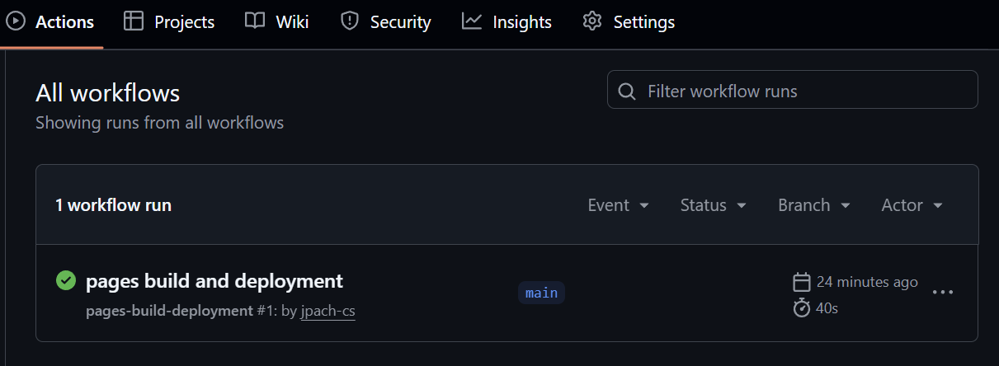
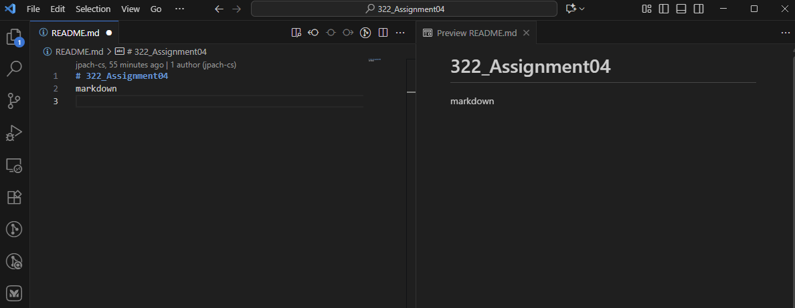
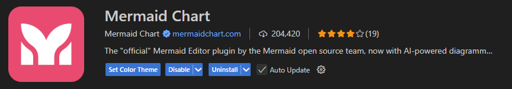
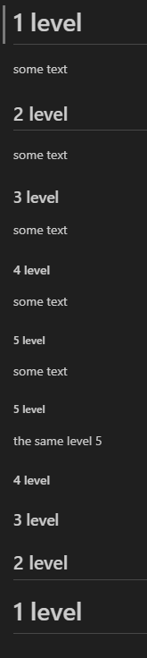
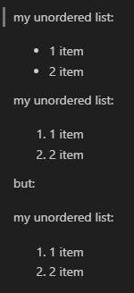
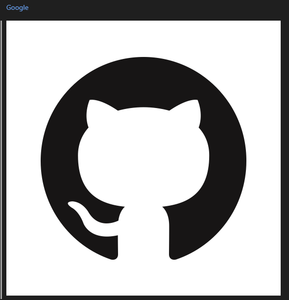
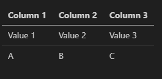
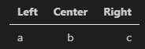
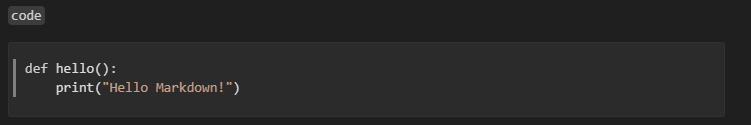

# Software Engineering

*Lecture 10*

---

## Today’s Agenda

- GitHub Pages
- Markdown

---

# GitHub Pages

---

## Setting Up GitHub Pages with Markdown

**Create a Repository**

- Go to **GitHub** and click **New Repository**.
- Give it a name (e.g., assignment04).
- Initialize with a README.md.

---

## Setting Up GitHub Pages with Markdown

**Add a Static Markdown Page**

- Write something simple in README.md :
- or index.md

```
# Welcome to Assignment 04
This is my first GitHub Pages project.

```

---

## Setting Up GitHub Pages with Markdown

**Add Jekyll Configuration**

- Create a file called \_config.yml in the repo root.
- Example content:
- theme gallery: [GitHub Pages Themes](https://docs.github.com/en/pages/setting-up-a-github-pages-site-with-jekyll/adding-a-theme-to-your-github-pages-site-using-jekyll?utm_source=chatgpt.com)

<https://docs.github.com/en/pages/setting-up-a-github-pages-site-with-jekyll/adding-a-theme-to-your-github-pages-site-using-jekyll>

```
title: Assignment 04
show_downloads: false
theme: jekyll-theme-minimal
description: MarkDown
```

---

## Setting Up GitHub Pages with Markdown

**Configure GitHub Pages**

- Go to Settings → Pages.
- Under Build and Deployment, select Deploy from branch.
- Choose main and / (root).Save — your site will be live at:

<https://username.github.io/assignment04/>

---

## Setting Up GitHub Pages with Markdown

**Check Your Page**

After updating the changes in the \_config.yml and README.md files, GitHub’s server needs to generate the HTML, CSS, and other files based on them. If the page does not appear after refreshing the link, there are two possibilities: either the build is still in progress (marked in yellow, so you need to wait a moment), or there is a syntax error, in which case the last action will fail.

- Go to Actions
- Visit your site link again and refresh.
- You should now see the applied theme.



---

## Clone your repo

- After creating the repository, clone it locally,
- open the folder in Visual Studio Code,
- install the Mermaid Chart extension,
- right-click on README.md and select *Preview*.
- You can now split the window to edit and preview at the same time.





---

# Markdown

---

## Introduction to Markdown

**What is Markdown?**

- A **lightweight markup language** for formatting text.
- Created by **John Gruber in 2004** with help from Aaron Swartz.
- Goal: make documents easy to read in plain text, but convertible to HTML.

---

## Introduction to Markdown

**Markdown and CommonMark**

- CommonMark = a formal specification of Markdown (2014).
- Ensures consistency across tools.
- GitHub uses GitHub Flavored Markdown (GFM) → extends CommonMark with:
  - Task lists (- \[ \], - \[x\])
  - Tables
  - Code fencing with language highlighting
  - Mentions (@username) and issue links

---

## Core Markdown Features

- Headings: #, ##, ###
- Lists:
  - Unordered: - item
  - Ordered: 1. item
- Links: \[text\](url)Images: !\[alt\](url)
- Tables ||
- Code:
  - Inline: \`code\`
  - Block: triple backticks

---

## Core Markdown Features

- Headings: #, ##, ###
- Headings in Markdown work very similarly to headings in MS Word.
- By default, Markdown supports 5 levels of headings.
- However, there is a general rule of text organization that applies independently of Word or Markdown:
  - if you divide text into chapters and subchapters, a subchapter cannot consist of only one item, because such a division makes no sense. On the other hand,
  - if subchapters differ drastically in length or content, it usually means that the structure was poorly designed.
  - There is also an unwritten rule that you should avoid using more than three levels of subdivision.

```
# 1 level
some text
## 2 level
some text
### 3 level
some text
#### 4 level
some text
##### 5 level
some text
##### 5 level
the same level 5
#### 4 level
### 3 level
## 2 level
# 1 level
```



---

## Core Markdown Features

Lists:

- **Lists in Markdown** work similarly to those in MS Word. There are two main types: **ordered** and **unordered**.
- For unordered lists, Markdown expects a **dash (-)** before each item.
- For ordered lists, you use **numbers followed by a dot**.
- **Keep in mind**: in Markdown it doesn’t matter what number you type—Markdown will **automatically renumber** the items correctly in sequence.

```
my unordered list:
- 1 item
- 2 item

my unordered list:
1. 1 item
1. 2 item

but:

my unordered list:
1. 1 item
3. 2 item
```



---

## Core Markdown Features

Links and Images:

- \[text\](url):
  - text → the word that will be clickable
  - url → the website address
- !\[alt\](url):
  - alt → alternative text (displayed if the image cannot load)
  - url → the path or link to the image

```
[Google](https://www.google.com)


```



---

## Core Markdown Features

Tables

- | separates columns
- --- defines a header row
- : can align text (left, center, right)

Note: Markdown itself does not support cell merging; for that, you need to embed HTML within the .md file.

```
| Column 1 | Column 2 | Column 3 |
|----------|----------|----------|
| Value 1  | Value 2  | Value 3  |
| A        | B        | C        |

```



```
| Column 1 | Column 2 | Column 3 |
|:---------|:--------:|---------:|
| Value 1  | Value 2  | Value 3  |
| A        | B        | C        |

```



---

## Core Markdown Features

Code:

- Inline code:
  - \`code\`
- Code block (multi-line):
  - &lt;pre&gt; \`\`\`language your code here \`\`\` &lt;/pre&gt;

Note: After three tildes, you can inform Markdown what language the code is in for syntax highlighting, but this only works for code blocks.

```
`code`

```

````
```c
def hello():
    print("Hello Markdown!")
````



---

# Thank

*You!*
