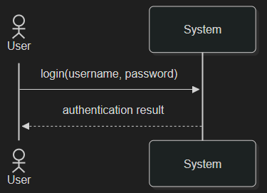
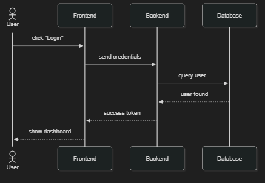
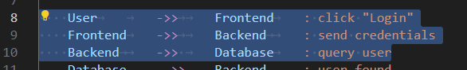
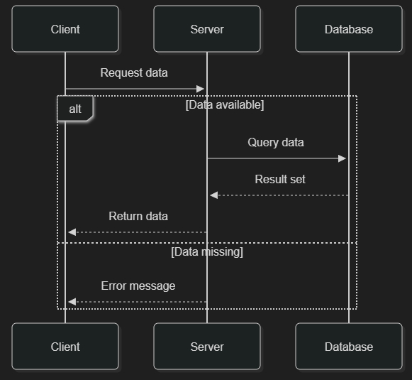

# Software Engineering

*Lecture 22*

---

## Today’s Agenda

- UML Sequence diagrams

---

## From The author of textbook

…I therefore concentrate on these five UML diagram types here:

- **Activity diagrams**
  - which show the activities involved in a process or in data processing.
- **Use case diagrams**
  - which show the interactions between a system and its environment.
- **Sequence diagrams**
  - which show interactions between actors and the system and between system components.
- **Class diagrams**
  - which show the object classes in the system and the associations between these classes.
- **State diagrams**
  - which show how the system reacts to internal and external events.

---

# UML Sequence diagrams

---

## Introduction — What Are Sequence Diagrams?

- Sequence diagrams are one of the **interaction diagrams** in UML.<br>They show **how processes, objects, and actors interact over time** to accomplish a specific behavior in a system.
- They are most commonly used to **visualize scenarios derived from use cases**, and are therefore a natural continuation of activity diagrams and class diagrams.
- **Definition (from UML 2.5.1 / OMG):**

*A sequence diagram shows process interactions arranged in a time sequence. It depicts the objects involved and the sequence of messages exchanged as needed to carry out the functionality.*

---

## Connection to Use Cases and the 4+1 Model

- Sequence diagrams are **typically associated with use case realizations** within the **4+1 architectural view model**.
- They realize the *Use Case View* by showing how actors and the system cooperate to achieve the main success scenario.
- Each diagram corresponds to a **specific scenario** (main or alternative path).
- Because of this, sequence diagrams are sometimes called **event diagrams** or **event scenarios**.

This means:

- ***Use Case*** *= what happens*
- ***Sequence Diagram*** *= how it happens step-by-step between objects.*

---

## Sequence diagrams emphasize

- **Order of events in time**
- **Messages exchanged** between actors and system components
- **System boundaries**
- Optional conditions (loops, alternatives)
- and, in more advanced UML, **combined fragments** for concurrency and branching.

Each diagram starts at the top (first message) and proceeds downward in time.<br>Each vertical **lifeline** represents one participant (actor, object, or subsystem).<br>Messages (horizontal arrows) show who communicates with whom, and in which order.

---

## Core Elements of Sequence Diagrams (UML vs Mermaid)

|**Concept**|**UML Description**|**Mermaid Syntax Equivalent**|
|---|---|---|
|**Actor**|External user or system interacting with the system|actor User|
|**Lifeline**|Vertical dashed line representing object/participant over time|participant ObjectName|
|**Message (Synchronous)**|Solid arrowhead → waits for response|A-&gt;&gt;B: message|
|**Message (Asynchronous)**|Open arrowhead → does not wait|A--&gt;&gt;B: message|
|**Return Message**|Dashed arrow showing response|B--&gt;&gt;A: response|
|**Self-call**|Message to the same object (stacked activation box)|A-&gt;&gt;A: internal process|
|**Activation Box**|Thin rectangle on lifeline showing active execution|*Automatically drawn in Mermaid*|
|**Creation**|Object created by another|create participant ObjectName|
|**Destruction**|Lifeline ends with X|destroy ObjectName|
|**Note**|Comments attached to lifelines|Note right of A: comment|
|**Alt / Opt block**|Conditional execution|alt condition ... end / opt optional ... end|
|**Loop block**|Iteration|loop description ... end|
|**Parallel (par)**|Parallel combined fragment|par ... and ... end|
|**Gate / Found Message**|Entry or exit point of message flow|*Not directly supported in Mermaid* (can simulate with notes)|

---

## Mermaid Class Diagram Syntax

- All class diagrams must start with this directive.
- For vsc

````
```mermaid
sequenceDiagram
````

````
```mermaid
sequenceDiagram
    actor User
    participant System

    User->>System: login(username, password)
    System-->>User: authentication result
````

Unlike the **Graph** (Flowchart) diagram, you cannot change the rendering direction for a **sequence Diagram**.



---

## Mermaid Class Diagram Syntax Sequence diagrams ignore whitespace between actors, objects, and other elements. This means you can freely add tabs and spaces to improve readability.

````
```mermaid
sequenceDiagram
    actor User
    participant Frontend
    participant Backend
    participant Database

    User->>Frontend: click "Login"
    Frontend->>Backend: send credentials
    Backend->>Database: query user
    Database-->>Backend: user found
    Backend-->>Frontend: success token
    Frontend-->>User: show dashboard
````

````
```mermaid
sequenceDiagram
    actor       User
    participant Frontend
    participant Backend
    participant Database

    User        ->>     Frontend    : click "Login"
    Frontend    ->>     Backend     : send credentials
    Backend     ->>     Database    : query user
    Database    -->>    Backend     : user found
    Backend     -->>    Frontend    : success token
    Frontend    -->>    User        : show dashboard
````





---

## Another example

````
```mermaid
sequenceDiagram
    participant Client
    participant Server
    participant Database


    Client->>Server: Request data
    alt Data available
        Server->>Database: Query data
        Database-->>Server: Result set
        Server-->>Client: Return data
    else Data missing
        Server-->>Client: Error message
    end
````



---

# Thank

*You!*
