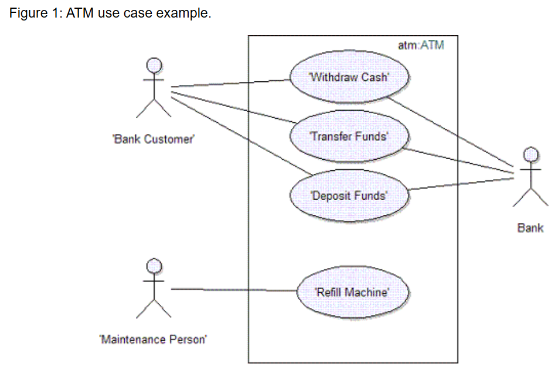
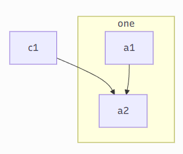
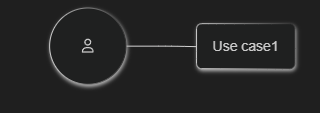
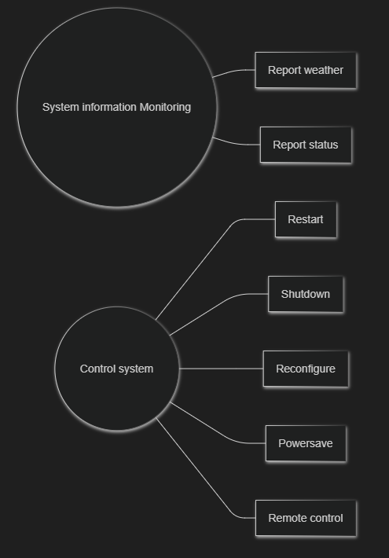
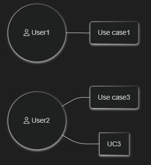
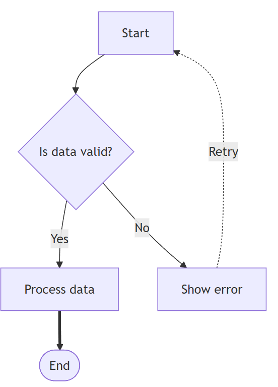

# Software Engineering

*Lecture 23*

---

## Today’s Agenda

- UML Use case diagrams

---

## From The author of textbook

…I therefore concentrate on these five UML diagram types here:

- **Activity diagrams**
  - which show the activities involved in a process or in data processing.
- **Use case diagrams**
  - which show the interactions between a system and its environment.
- **Sequence diagrams**
  - which show interactions between actors and the system and between system components.
- **Class diagrams**
  - which show the object classes in the system and the associations between these classes.
- **State diagrams**
  - which show how the system reacts to internal and external events.

---

# UML Use case diagrams 

---

## Introduction — What Are Use Case Diagrams?

- Use Case Diagrams belong to the **behavioral** category of UML. They describe *what* the system does from an external perspective — not how it works internally.
- A **use case** models an interaction between an **actor** and the **system**, producing a meaningful result.
- Use cases help you:
  - capture functional requirements,
  - define interactions with users and external systems,
  - document expected system behavior.

---

## Core UML Definitions

- **2.1 Use Case (UML)**
  - A use case represents a set of behaviors performed by the system that deliver observable value to an actor.
- **2.2 Actor (UML)**
  - An actor is a role played by a user or external system that interacts with the system.
- Important:
  - an actor is a *role*, not necessarily a person,
  - a single user may perform multiple actor roles.

---

## Core UML Definitions

- **2.3 System Boundary**
  - Defines what belongs to the system and what is external. Use cases always sit **inside** the boundary.
- **2.4 UML Relationships**
  - **Association** – actor interacts with a use case
  - **Include** – mandatory inclusion of another use case
  - **Extend** – optional extension under certain conditions
  - **Generalization** – inheritance of actors or use cases

---

## Use Case Diagrams vs User Stories

- **User Story (Agile)**

A short description of a user need:

- *As a \[role\], I want to \[goal\], so that \[value\].*
- Characteristics:
  - informal,
  - concise,
  - used in Agile planning.
- **Use Case (UML)**

Formal model describing complete interactions:

- main success scenario,
- alternate flows,
- preconditions,
- postconditions,
- triggers.

**Relationship:**

- A single user story may map to **one or multiple use cases**.

---

## Systems Engineering vs Software Engineering Use Cases

- **Systems Engineering (INCOSE)**
  - High-level operational view
  - Actors may include machines, organizations, or workflows
  - Focus: system operations in the real world
- **Software Engineering (UML)**
  - Focus on software functionality
  - Actors mainly users or external systems
  - Greater detail and functional granularity

---

## Systems Engineering vs Software Engineering Use Cases

|Aspect|Systems Engineering|Software Engineering|
|---|---|---|
|Scope|Entire socio-technical system|Software application|
|Actor Types|Human, machine, organization|User role or software system|
|Goal|Operational behavior|Functional requirements|
|Detail Level|High-level|More detailed|

---

## Scenarios and Flows

- **Use Case**
  - A full set of possible interactions.
- **Scenario**
  - One concrete path (main or alternate).
- **Main Success Flow**
  - Standard, expected sequence.
- **Alternate / Exception Flow**
  - Optional or error-handling paths.

---

## How to Create Use Case Diagrams (Step-by-Step)

- Identify actors
- Identify goals (these become use cases)
- Draw the system boundary
- Connect actors to use cases (associations)
- Identify shared behavior (include)
- Identify optional behavior (extend)
- Add generalizations (optional)
- Review for correctness and clarity

---

# examples

---

## Transfer-data use case

- A use case in the Mentcare system

<!-- pptx2marp: image2.emf is a EMF file; many browsers cannot render it inline. Re-export from PowerPoint as PNG/SVG if this slide looks blank. -->

<!-- Figure 5.3 shows a use case from the Mentcare system that represents the task of uploading data from the Mentcare system to a more general patient record system. This more general system maintains summary data about a patient rather than data about each consultation, which is recorded in the Mentcare system. Notice that there are two actors in this use case—the operator who is transferring the data and the patient record system. The stick figure notation was originally devel oped to cover human interaction, but it is also used to represent other external sys tems and hardware. Formally, use case diagrams should use lines without arrows as arrows in the UML indicate the direction of flow of messages. Obviously, in a use case, messages pass in both directions. However, the arrows in Figure 5.3 are used informally to indicate that the medical receptionist initiates the transaction and data is transferred to the patient record system. -->

---

## Use cases in the Mentcare system involving the role ‘Medical Receptionist’

<!-- pptx2marp: image3.emf is a EMF file; many browsers cannot render it inline. Re-export from PowerPoint as PNG/SVG if this slide looks blank. -->

<!-- For example, Figure 5.5 shows all of the use cases in the Mentcare system in which the actor “Medical Receptionist” is involved. Each of these should be accompanied by a more detailed description. The UML includes a number of constructs for sharing all or part of a use case in other use case diagrams. While these constructs can sometimes be helpful for system designers, Author say: “my experience is that many people, especially end-users, find them difficult to understand.” For this reason, these constructs are not described here. -->

---

## Weather station use cases

<!-- pptx2marp: image4.emf is a EMF file; many browsers cannot render it inline. Re-export from PowerPoint as PNG/SVG if this slide looks blank. -->

---

## Mermaid Use Case Syntax

- “Use case diagrams require custom shapes and manual layout. Mermaid’s engine is not designed for this. “(Issue #2872, Issue #240)
- “We will not add use case diagrams. They are out of scope for Mermaid’s goals.”
- However, we can simulate the Use Case quite faithfully using a flowchart.

---

## But…

- We can use a subgraph, employing a rectangle to represent the 'system’;

- <https://www.utm.mx/~caff/doc/OpenUPWeb/openup/guidances/concepts/use_case_BB199D1B.html>

\`\`\`mermaid

flowchart TB

    c1--&gt;a2

    subgraph ide1 \[one\]

    a1--&gt;a2

    end

---

## But…

- We are able to use icons to represent the actors.

- <https://www.utm.mx/~caff/doc/OpenUPWeb/openup/guidances/concepts/use_case_BB199D1B.html>

ACTOR1(("\*\*fa:fa-user\*\*"))

---

## So…

<!-- pptx2marp: image4.emf is a EMF file; many browsers cannot render it inline. Re-export from PowerPoint as PNG/SVG if this slide looks blank. -->

\`\`\`mermaid

graph LR 

    A((System information Monitoring))

    B((Control system))

 

    UC1\[Report weather\]

    UC2\[Report status\]

    UC3\[Restart\]

    UC4\[Shutdown\]

    UC5\[Reconfigure\]

    UC6\[Powersave\]

    UC7\[Remote control\] 

    A --- UC1

    A --- UC2 

    B --- UC3

    B --- UC4

    B --- UC5

    B --- UC6

    B --- UC7

---

## And…

\`\`\`mermaid

flowchart LR

    ACTOR1(("\*\*fa:fa-user\*\* User1"))

    ACTOR2(("\*\*fa:fa-user\*\* User2"))

    UC1("Use case1")

    UC2("Use case2")

    UC2("Use case3") 

    ACTOR1 --- UC1

    ACTOR2 --- UC2

    ACTOR2 --- UC3

---

## Recommended Practice: IDs and Separate Connections

\`\`\`mermaid

graph TD

A\[Start\] --&gt; B{Is data valid?}

B -- Yes --&gt; C\[Process data\]

B -- No --&gt; D\[Show error\]

C ==&gt; E(\[End\])

D -. Retry .-&gt; A

\`\`\`mermaid

graph TD

A\[Start\]

B{Is data valid?}

C\[Process data\]

D\[Show error\]

E(\[End\])

 

A --&gt; B

B -- Yes --&gt; C

B -- No --&gt; D

C ==&gt; E

D -. Retry .-&gt; A

- Although Mermaid allows defining nodes and connections in one line
- (e.g. A\[Start\] --&gt; B\[Process\]), it is often clearer to **separate definitions**:
- This approach improves clarity, maintainability, and consistency — particularly in larger diagrams.
- Labels describe the condition or reason for a flow, especially for decision nodes.

---

# Thank

*You!*
