# Software Engineering

*Lecture 24*

---

## Today’s Agenda

- UML state \[machine\] diagrams

---

## From The author of textbook

…I therefore concentrate on these five UML diagram types here:

- **Activity diagrams**
  - which show the activities involved in a process or in data processing.
- **Use case diagrams**
  - which show the interactions between a system and its environment.
- **Sequence diagrams**
  - which show interactions between actors and the system and between system components.
- **Class diagrams**
  - which show the object classes in the system and the associations between these classes.
- **State diagrams**
  - which show how the system reacts to internal and external events.

---

# UML state \[machine\] diagrams 

---

## State diagram of a microwave oven

<!-- pptx2marp: image2.emf is a EMF file; many browsers cannot render it inline. Re-export from PowerPoint as PNG/SVG if this slide looks blank. -->

---

## State diagram of a microwave oven

<!-- pptx2marp: image2.emf is a EMF file; many browsers cannot render it inline. Re-export from PowerPoint as PNG/SVG if this slide looks blank. -->

---

## Occam's razor

- While the State Diagram displaying an explicit **do: action** within a state is a valid, though relatively rare, feature of strict UML modeling, **Mermaid often does not handle this specific syntax reliably**.
- In standard documentation, diagrams are frequently simplified: the **state** is represented by a rounded rectangle, and the **transition arrow** includes text that defines the action (or event) that must occur to move to the **next state**. This is the most common and robust way to model basic state changes in Mermaid.

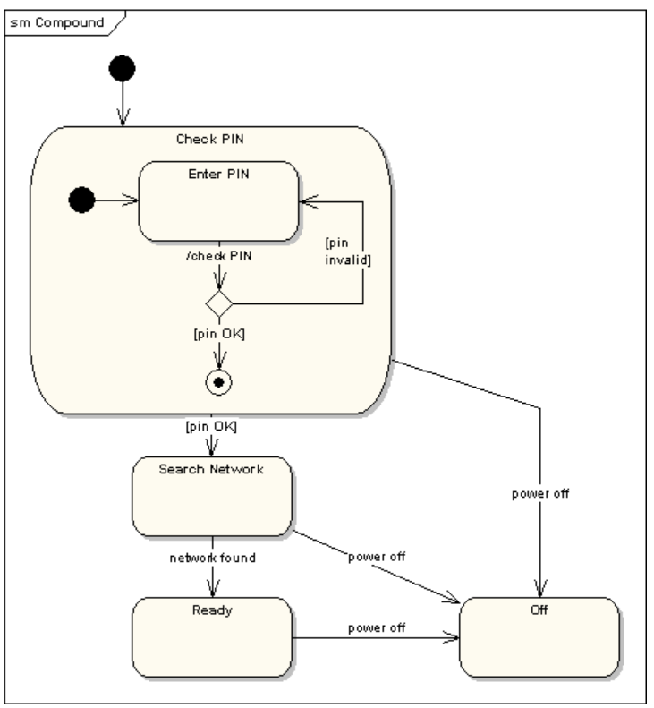

---

## Introduction — What Are state machine Diagrams?

- State Diagrams (formally **State Machine Diagrams** in UML) are crucial for modeling the **dynamic** **behavior** of a single object or component(or system), illustrating the sequence of states an object goes through in response to events.
- *UML Fundamentals: The Purpose of State Diagrams:*
  - *A State Diagram models an object's life cycle. It answers the question: "What is the object doing right now, and how does it react to external/internal events?"*

---

## Introduction to State Machine Diagrams (UML)

State diagrams (also called **State Machine Diagrams** in UML) model the **lifecycle of an object** by describing:

- **states** the object can be in,
- **events** that cause transitions,
- **actions** performed during transitions,
- **entry / exit actions**,
- **internal behavior** (do-activities),
- **initial and final states**,
- **composite states**,
- **choice / junction nodes** (in UML),
- **orthogonal regions** (advanced).

---

## Introduction to State Machine Diagrams (UML)

**What they are used for**

State diagrams are perfect when modeling systems where:

- behavior depends on *history* (e.g., "device is ON or OFF"),
- you have *reactive systems* responding to events,
- the object changes behavior over time.

---

## Introduction to State Machine Diagrams (UML)

**Typical real examples**

- ATM (Idle → Card Inserted → PIN Entered → Transaction → Eject Card)
- Door (Closed → Opening → Open → Closing)
- TCP Connection (LISTEN → SYN-RCVD → ESTABLISHED → …)
- Authentication flow (LoggedOut ↔ LoggedIn)

---

## Introduction to State Machine Diagrams (UML)

**In UML, states have:**

- **Name**
- Optional **entry**, **exit**, **do** activities
- Optional **substates**
- Optional **transitions** with:     event \[guard\] / action

---

## Core UML Definitions

**UML Definition:** ***State Machine***

- A *State Machine* in UML is defined as:
- ***A behavior specification that specifies the sequences of states an object or an interaction goes through in response to events, together with its responses and actions.***

(*UML 2.5.1, Chapter 14 — StateMachines*)

**UML Definition:** ***State***

- UML defines a *State* as:
- ***A situation during which some invariant condition holds; A State models a condition or situation in the life of an object during which it satisfies some condition, performs some activity, or waits for some event.***

(*UML 2.5.1, section 14.2.3*)

---

## Core UML Definitions

**UML Definition:** ***Transition***

- ***A Transition is a directed relationship between two states that specifies that the object in the first State will enter the second State when specified events occur and conditions are satisfied.*** (*UML 2.5.1, section 14.2.3*)

**UML Definition:** ***Event***

- ***An Event is a noteworthy occurrence that triggers a state transition.***

---

## Mermaid state \[machine\] Diagram Syntax

- All class diagrams must start with this directive.
- For vsc
- \`\`\`mermaid
- stateDiagram-v2

\`\`\`mermaid

stateDiagram-v2

    \[\*\] --&gt; Idle

    Idle --&gt; Running: start

    Running --&gt; Idle: stop

    Running --&gt; Error: fail

    Error --&gt; Idle: reset

- Like the **Graph** (Flowchart) diagram, you can change the rendering direction for a **state Diagram (**  e.g.  direction LR **)**.
- There is also a first version, stateDiagram, that is no longer used in Mermaid.

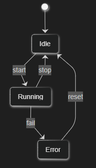

---

## Supported in Mermaid

|Feature|Supported?|Syntax|
|---|---|---|
|States|✔|StateName|
|Transitions|✔|A --&gt; B|
|Labels on transitions|✔|A --&gt; B: event|
|Initial state|✔|\[\*\] --&gt; State|
|Final state|✔|State --&gt; \[\*\]|
|Composite (nested) states|✔|state X { ... }|
|Entry/Exit actions|✔|State: entry/ exit/ do/|
|Choice / Junction node|✔|state c &lt;&lt;choice&gt;&gt;|
|Fork / Join|✔|state f &lt;&lt;fork&gt;&gt;|
|Notes|✔|note right of State|
|Parallel states|✔|state "Reg1" as R1 etc. (regions, simulated)|

---

## NOT Supported in Mermaid

|UML Feature|Mermaid replacement|
|---|---|
|Orthogonal regions (true concurrency)|*Can be simulated via multiple substates but not true UML semantics*|
|Explicit history states (H / H\*)|Not available|
|Deep history|Not available|
|Complex guards with conditions|Only textual labels|

- For most documentation purposes, **Mermaid is sufficient**. However, if you need to model highly complex systems involving **true concurrency** and the full **history semantics**, Mermaid cannot fully replace specification-compliant UML tools.

---

## Mermaid State Diagram Overview (1)

- Initial and Final States
- Transition with event

\`\`\`mermaid

stateDiagram-v2

    \[\*\] --&gt; A       %% initial

    A --&gt; \[\*\]       %% final

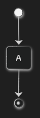

\`\`\`mermaid

stateDiagram-v2

    A --&gt; B: eventName

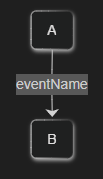

---

## Mermaid State Diagram Overview (2)

- Composite (Nested) State
- Entry / Exit / Do Activities

\`\`\`mermaid

stateDiagram-v2

state LoggedIn {

    \[\*\] --&gt; Dashboard

    Dashboard --&gt; Settings: openSettings

    Settings --&gt; Dashboard: back

}

\`\`\`mermaid

stateDiagram-v2

state Downloading {

    \[\*\] --&gt; Start

    Start: entry/ beginDownload()

    Start: do/ downloading()

    Start: exit/ finalize()

}

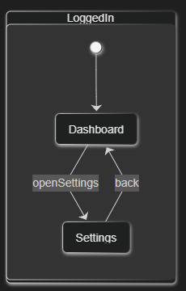

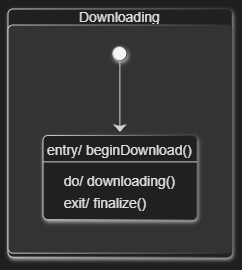

---

## Mermaid State Diagram Overview (3)

- Notes
- Choice Pseudo-state

\`\`\`mermaid

    stateDiagram-v2

    A: entry/ initialize

    note right of A

        This state prepares resources

    end note

\`\`\`mermaid

    stateDiagram-v2

    state decision &lt;&lt;choice&gt;&gt;

 

    Idle --&gt; decision

    decision --&gt; Work: taskFound

    decision --&gt; Idle: noTask

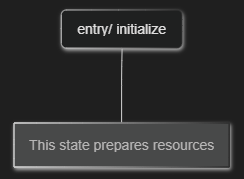

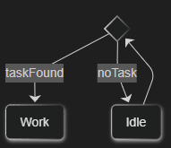

---

## Mermaid State Diagram Overview (4)

- Fork / Join

\`\`\`mermaid

    stateDiagram-v2

    state fork1 &lt;&lt;fork&gt;&gt;

    state join1 &lt;&lt;join&gt;&gt;

 

    A --&gt; fork1

    fork1 --&gt; B

    fork1 --&gt; C

    B --&gt; join1

    C --&gt; join1

    join1 --&gt; D

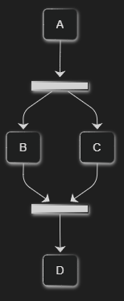

---

## Full Example (UML-style State Machine)

**UML concepts used:**

- initial/final states
- composite state
- entry/do/exit actions
- choice node
- transitions with events
- nested behavior

\`\`\`mermaid

    stateDiagram-v2 

    \[\*\] --&gt; LoggedOut

    LoggedOut --&gt; Authenticating: login

    Authenticating --&gt; LoggedIn: success

    Authenticating --&gt; LoggedOut: failure 

    state LoggedIn {

        \[\*\] --&gt; Dashboard

        Dashboard --&gt; Settings: openSettings

        Settings --&gt; Dashboard: back

        Dashboard: entry/ loadUserData()

    }

    LoggedIn --&gt; LoggedOut: logout

    LoggedOut --&gt; \[\*\]

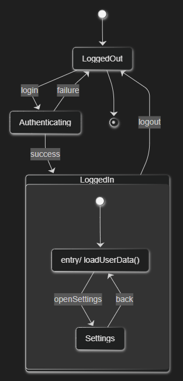

---

## Practical Tips

- **When to use state diagrams?**
  - When system behavior depends on **current state**.
  - When transitions are triggered by **events**.
  - When modeling **protocols**, **workflows**, **device states**, **authentication**, **error recovery**.
- **When** ***not*** **to use state diagrams?**
  - For data structures    →    class diagram
  - For interactions between actors    →    sequence diagram
  - For business logic without internal state    →    activity diagram
  - For system boundaries    →    use case diagram
- **Best practices**
  - Keep states **simple and meaningful**.
  - A state must represent a **stable condition**.
  - Transitions should be caused by **observable events**.
  - Avoid “spaghetti transitions”.

---

## but

\`\`\`mermaid

stateDiagram-v2

 

\[\*\] --&gt; s2

s2 --&gt; \[\*\]

 

state "Start" as s2

 

s2: entry #58; beginDownload()

s2: do#58; downloading()

s2: exit #58; finalize()

- The stateDiagram in Mermaid presents an issue: if you use an identifier alone, the states will not have a proper label, and the entry, do, and exit actions will appear in the place of the state's label. To solve this problem, you need to explicitly assign a label to the state using the syntax: state "label" as id.
- Once labeled, you can safely add actions/events to the state. Furthermore, to make the output look exactly like standard UML (where internal actions are often preceded by a colon), you can use the character code for the colon: **#58;** (semicolon + hash + 58 + semicolon). Using #58; ensures that we adhere to the Mermaid syntax while allowing the state actions to look just like in UML.

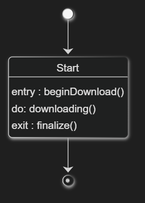

---

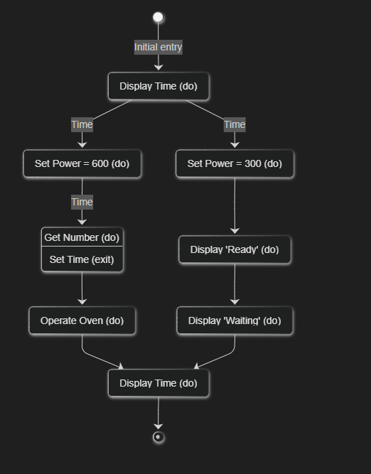

\`\`\`mermaid

stateDiagram-v2

    %%direction TB

 

    %% Initial and Final States

    \[\*\] --&gt; Waiting1 : Initial entry

    Waiting2 --&gt; \[\*\]

 

    %% 1. Definicje Stanów i ich "Akcji" (jako etykiety)

    Waiting1 : Display Time (do)

    SetTime : Get Number (do)

    SetTime : Set Time (exit)

 

    Operation : Operate Oven (do)

    FullPower : Set Power = 600 (do)

 

    HalfPower : Set Power = 300 (do)

 

    Enabled : Display 'Ready' (do)

 

    Disabled : Display 'Waiting' (do)

    Waiting2 : Display Time (do)

 

    %% 2. Definicje Przejść

    Waiting1 --&gt; FullPower : Time

    FullPower --&gt; SetTime : Time

 

    SetTime --&gt; Operation

    Operation --&gt; Waiting2

 

    Waiting1 --&gt; HalfPower : Time

    HalfPower --&gt; Enabled

 

    Enabled --&gt; Disabled

    Disabled --&gt; Waiting2

---

<!-- pptx2marp: slide 26 has no extractable text or images -->

---

# Thank

*You!*
