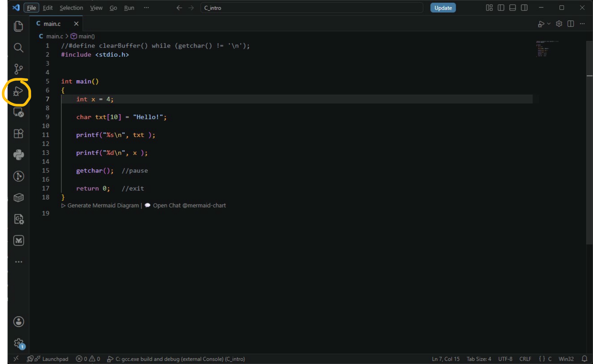
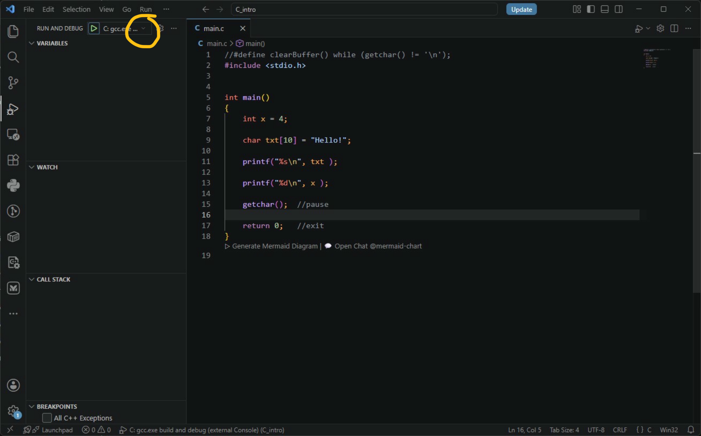
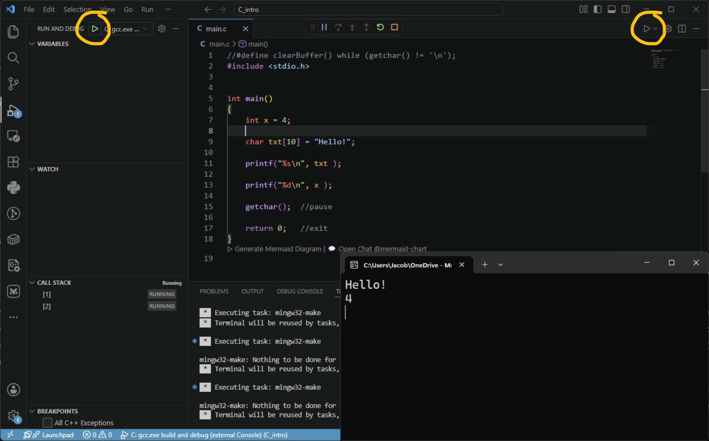
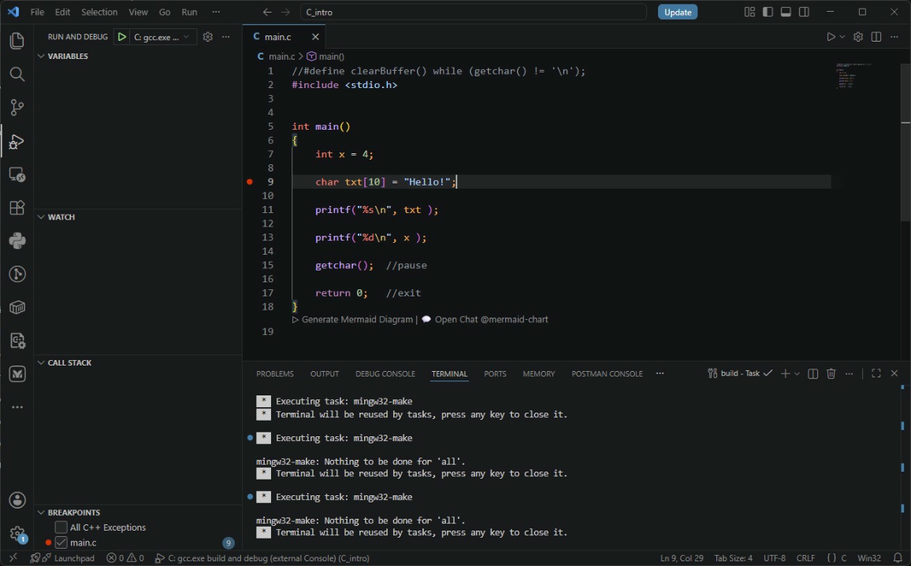
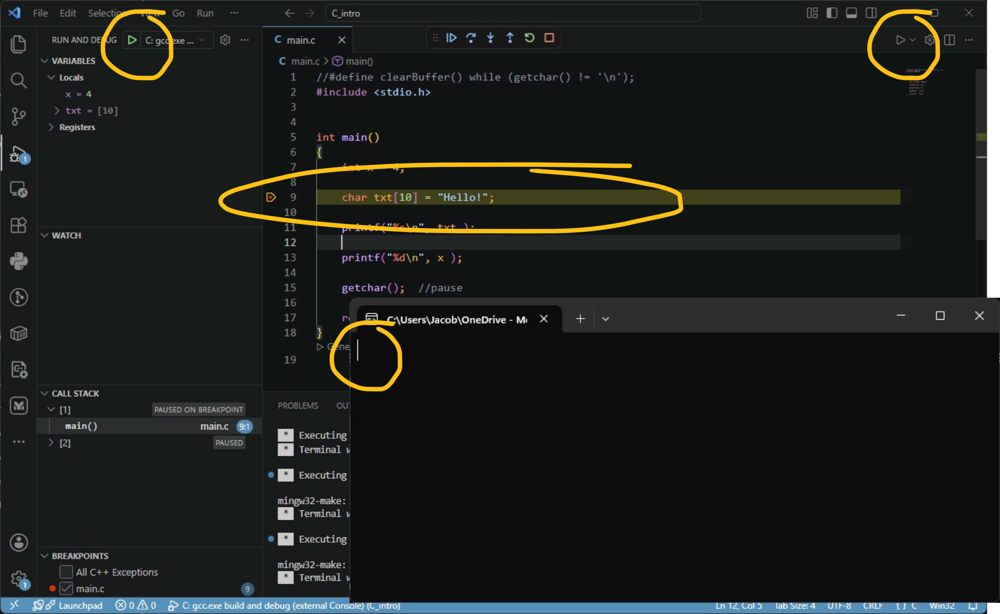

<!-- _class: lead -->

<!-- _paginate: skip -->

# CSCI 112

## Programming with C

### Laboratory: 02

J. L. Pach

---

# Outline:

- Anatomy and Philosophy of Debugging
- Git

<!--
TUTAJ WPISZ TO, CO CHCESZ POWIEDZIEĆ:
- Przywitaj studentów CSCI 112.
- Podkreśl, że IDE to nie tylko edytor, ale cały ekosystem.
- Wspomnij o debuggerze jako narzędziu, które oszczędza godziny pracy.
-->

---

<!-- blank slide in the source -->

---

<!-- _class: caption-slide -->

<!-- _paginate: skip -->

# Anatomy

## and Philosophy of Debugging

---

# What is debugging and where did it come from?

- **Definition:** Debugging is the process of identifying, analyzing, and removing errors (bugs) in source code.
  
- **Where does the name come from?** The term **bug** in computing was popularized by pioneer programmer Grace Hopper in 1947. While working on the Harvard Mark II computer, a literal moth was found stuck in an electromechanical relay. Although the term existed earlier in engineering, this event became a permanent legend in computer science.

---

# How does the CPU execute code?

## (Hardware perspective)

- **Sequencing:** The computer's processor executes instructions one after another (sequentially), step by step (with rare exceptions like jumps or interrupts).
- **The magic of the breakpoint:** We can place a **breakpoint** at specific executable locations in our code. This gives us the ability to halt the processor's execution right at the fragment of the program we are interested in and switch to step-by-step mode.
- **Note**: A "statement" in C **is not always equal to a single line** of text in your editor. One line can contain multiple statements, or one statement can span multiple lines!

---

# What is a Breakpoint?

- A breakpoint is a **marker or request for the debugger** (which is a separate program overseeing our code) specifying the exact place where it should pause the program's execution.
- The program does not "know" it is approaching a breakpoint – for it, a moment simply arrives where control is momentarily taken over by the monitoring tool.

---

# The Principle of Frozen Time

- When a program is paused at a breakpoint, **from its perspective, time simply stands still**.
- The application has no awareness that someone is watching it, or that an external user can modify its states (variables, memory) at that moment without its "knowledge."
- This gives us a completely safe space to analyze what is happening "under the hood."

---

# Controlling Execution

The standard set of debugger controls is divided into classic controls and environment-specific additions.

## Classic flow control:

- **Continue (`F5`):** Resume free execution of the program until the next breakpoint or program termination.
- **Step Over (`F10`):** Execute the current statement and stop at the next one. If the line contains a function call, **we do not step into it** – we treat it as a single operation.
- **Step Into (`F11`):** Step inside the called function. A crucial tool for tracking the exact logic flow step by step.
- **Step Out (`Shift + F11`):** Finish executing instructions in the current function, step out of it, and stop at the place it was called from.

---

# Visual Studio Code additions

- **Restart (`Ctrl + Shift + F5`):** A quick reset and restart of the debugging session.
- **Stop (`Shift + F5`):** Abruptly stop / kill the process.

## ⚠️ IMPORTANT RULE FOR BEGINNERS

- Avoid hastily using the **Stop-button** as an *emergency exit*. Killing the process acts like abruptly pulling the plug from the socket. While the operating system will reclaim memory, the program itself is denied the chance to perform its normal cleanup operations (like closing files gracefully or saving states).
- In hardware programming (e.g., controlling GPIO pins in courses like CS 255), abruptly killing a process might leave a physical pin active. Leaving hardware components powered on without software control can lead to unexpected behavior or even physical hardware damage! Always strive for a graceful exit.

---

<!-- _class: caption-slide -->

<!-- _paginate: skip -->

# Practice

## exercise

---

# 1. Open the Run and Debug View

(Click the **Run and Debug** icon on the left Activity Bar to open the debugging panel).

---

# 2. Expand the Configuration Dropdown

(Click the dropdown menu at the top of the panel to see available execution tasks).

---

# 3. Select the Execution Task

(Choose the first option from the list – standard execution without stopping).

---

# 4. Start Normal Execution (F5)

(Click the green Play button or press F5 to run the program from start to finish).

## Press Enter

---

# 5. Set Your First Breakpoint

(Left-click in the gutter to the left of the line numbers. ).

---

# 6. Set Your First Breakpoint

( A solid red dot will appear and stay there).

---

# 7. Restart in Debug Mode

(Press F5 again. Because a breakpoint is set, the program will now pause execution exactly at the red dot).

---

# 8. Inspect Variables via Hover

(Move your mouse cursor over any variable name in the code to reveal its current value).

---

# 9. Step Over (F10) to the Next Statement

(Press F10 to execute the highlighted line and safely move to the next statement in your code).

---

# Visual Cues in the Interface

- **Yellow highlight:** When the program stops at a breakpoint, the line of code **BEFORE** which the pause occurred is clearly highlighted in yellow. This means: *"This is the instruction that is about to be executed"*.
- **Hover preview:** If you hover your mouse cursor over any variable name in the paused code, VS Code will display a small popup with its current value at that exact fraction of a second.

---

# Program State Tracking Panes 1/2

During debugging, the VS Code sidebar provides four fundamental tools to inspect the program's state:

1. **Variables:**
   - Shows a breakdown into local variables (available in the current function scope) and global variables.
   - Allows you to observe in real-time how values change as you step through subsequent lines of code.
2. **Watch:**
   - A place where you can manually drag or type specific variables or arithmetic expressions to keep an eye on them in one place.

---

# Program State Tracking Panes 2/2

1. **Memory (sneak peek):**
   - The debugger doesn't just read variable names; it can look directly into the raw computer memory.
   - *Note*: We will explore memory inspection deeply when we introduce pointers!
2. **Call Stack:**
   - Shows history – "who called whom" (the chain of functions leading to the current location in the code).
   - *Note:* This topic will be covered in detail when we learn to write and divide programs into our own functions.

---

<!-- _class: caption-slide -->

<!-- _paginate: skip -->

# Thank

## You
