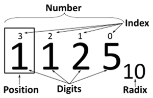
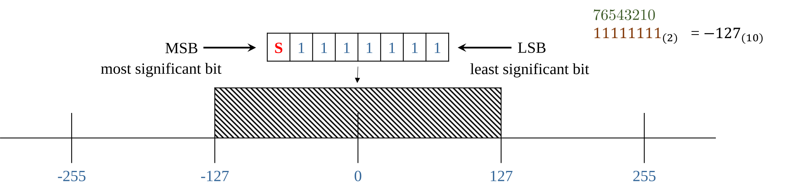

<!-- _class: lead -->

<!-- _paginate: skip -->

# CSCI 112

## Programming with C

### Lecture: 1

J. L. Pach

---

# Outline:

- Syllabus, Textbook, Canvas
- Introduction
- History of C
- Positional notation
- IDE
- Hello World
- Compiler vs Interpreter

---

<!-- _class: caption-slide -->

<!-- _paginate: skip -->

# Syllabus

<!--
## Subtitle
-->

---

# Some basic facts about the course

<div class="columns">

<div class="card">

## Course Name:

- Programming with C (CSCI 112)

## Credit Hours:

- 3 credits
- 1 hour lecture twice a week
- 3 hours lab per week

</div>

<div class="card">

## Lecture (Mondays and Fridays)

- 12:00 – 12:50 PM.
- Science & Engineering Building (S&E) 308

## Lab (Mondays)

- 2:00 – 4:50 PM
- Engineering Lab/Classroom Building (ELC) 315

</div>

</div>

---

# Syllabus

- Course Description

- Textbooks

- Class Rules

- Grading

- Accommodations & Academic Dishonesty

- Declaration of authorship

<!--
TUTAJ WPISZ TO, CO CHCESZ POWIEDZIEĆ:
- Przywitaj studentów CSCI 112.
- Podkreśl, że IDE to nie tylko edytor, ale cały ekosystem.
- Wspomnij o debuggerze jako narzędziu, które oszczędza godziny pracy.
-->

---

# Course Description

<div class="card justify">

##

This course provides a comprehensive introduction to structured programming using the C language. Student will gain a deep understanding of memory management techniques such as pointers and dynamic allocation. The skills acquired in this course will be essential for those who wish to pursue further studies in languages like C++, C#, and Java, as well as microcontroller programming. Additionally, this course will lay a strong foundation for understanding computer architecture.

</div>

---

# …a few words

<div class="card justify">

##

*This course is designed for students in:*

- Computer Science (CS),

- Software Engineering (SE),

- Electronics programs.

*No prior programming experience is required — only basic computer literacy, such as using a web browser, email, and navigating the MS Windows environment.*

</div>

---

# Textbooks

*Brian W. Kernighan, Dennis M. Ritchie. C Programming Language, 2nd Edition. Prentice Hall, 1988*

<div class="columns">

<div>


Dennis M. Ritchie

</div>

<div>


</div>

</div>

---

# ANSI(C89) vs C99

<div class="justify">

- Last year, the course was taught using the oldest and most widely adopted ANSI standard — C89. This choice was made because C89 does not include many of the conveniences introduced in later versions. While these conveniences make life easier for professional programmers, they can make it harder for beginners to fully grasp the fundamentals of programming in C.

- The standard now used in our classes is **C99**, which is widely applied in embedded systems, especially in the field of electronics. This standard significantly lowers the entry barrier for beginners (for example, allowing variable declarations inside a for loop and supporting single-line comments //), while avoiding the complex and sometimes confusing features introduced in newer standards.

</div>

---

<div class="justify">

# Grading Breakdown

The final course grade will be determined by two equally weighted components:

- Lecture Component: 40%
- Laboratory Component: 60%

The Laboratory Component is evaluated according to the following criteria:

- Entrance Quiz: 30%
- Assignments: 40%
- Brief Concluding Quiz: 30%

Not every laboratory session will necessarily include an entrance quiz or a concluding quiz. When scheduled, these assessments will count toward the corresponding laboratory component.

</div>

---

<div class="justify">

# In-Person Format

This is strictly an in-person course. Regular attendance and active participation are expected.

## Attendance Policy

- Attendance at every class is required.
- Students are allowed up to two unexcused absences during the semester without penalty.

**Each additional unexcused absence beyond this two-absence allowance will result in a 1 percentage-point deduction from the final course grade.**

</div>

---

<div class="justify lh-20">

# Excused Absences & Emergencies

- Official university-excused absences, university-sanctioned activities, serious personal emergencies, and documented medical circumstances will not count toward the unexcused absence allowance.
- Students should notify the instructor as soon as reasonably possible when an emergency or officially excused absence occurs.

</div>

---

<div class="justify lh-25">

# Laboratory Rules

## Entrance Quiz

- When an entrance quiz is scheduled, it will consist of three questions.
- A score of at least 2 out of 3 is required to pass.
- A failed entrance quiz may be retaken up to two times during the semester. Only failed entrance quizzes may be retaken.

</div>

---

<div class="justify">

# Assignments & Deadline

- Students will have six calendar days to complete and submit each assignment.
- The deadline is strict. Once the six-day submission period has closed, the normal submission path will be closed and late or makeup submissions will not be accepted, except where an official University policy, documented emergency, or approved accommodation requires otherwise.
- Students are responsible for submitting their work before the deadline. Students should not wait until the final minutes before the deadline to submit an assignment.

## Brief Concluding Quiz

- When scheduled, the concluding quiz is a short summative assessment covering the material addressed during the laboratory session.

</div>

---

<div class="justify">

# Code Formatting, Authorship & Declaration

- Every submitted source file must begin with exactly four lines of comments containing the required authorship declaration.
- The following template must be used:

```c
// Your Name
// CSCI 112 Fall 2026
// Programming Assignment #1
// I declare that I am the author of this work, take full responsibility for it, and have disclosed any material external assistance.
```

</div>

---

<div class="justify">

# Authorship Requirement

- The four-line declaration is **mandatory**.
- A source file submitted without the required declaration will receive **0 points**.
- If a student submits an assignment before the deadline but accidentally omits the required declaration, the instructor may allow the student to resubmit **the same code with the declaration added** after the deadline as a correction of an administrative omission.
- This correction is limited strictly to adding the required declaration. No modification, improvement, debugging, or other change to the submitted code is permitted after the original deadline.
- Repeated failure to include the required declaration may be treated as failure to comply with the assignment requirements.

</div>

---

# Academic Integrity, Collaboration & External Resources

<div class="justify">

Students are encouraged to use appropriate external resources to learn and solve problems. Such resources may include:

- textbooks and other books;
- official programming documentation;
- technical websites and documentation;
- Stack Overflow and similar technical resources;
- ChatGPT, Gemini, GitHub Copilot, and other AI-assisted tools.

**The use of an external resource does not, by itself, constitute academic misconduct.** However, students remain fully responsible for the work they submit.

</div>

---

<div class="justify">

# Disclosure of External Assistance

- Students must disclose **material external assistance** that contributed to their submitted work.
- Such assistance may include, but is not limited to, substantial assistance from another person, technical resources, or generative AI tools.
- The disclosure should be made in an appropriate comment in the source code.

For example:

```
// I used the C standard library documentation to verify the behavior of strtok().
```

or:

```
// I used ChatGPT to help explain pointer arithmetic.
// I wrote, tested, and verified the submitted implementation myself.
```

</div>

---

# Disclosure of External Assistance

<div class="justify lh-30">

The purpose of this requirement is not to prohibit the use of external resources. Its purpose is to ensure that the origin of significant assistance is honestly acknowledged.
Students are **not required to document ordinary searches or routine consultation of documentation** that do not materially contribute to the submitted work.

</div>

---

# Responsibility for Submitted Work

- Regardless of what resources were used during the development process, each student is fully responsible for understanding the work submitted under their name.
- Assignments may be reviewed orally by the instructor.
- During such a review, the instructor may ask the student to:
  - explain specific lines of code, how an algorithm works;
  - explain why a particular implementation was chosen;
  - predict what the program will do for a particular input;
  - identify or explain an error;
  - modify part of the submitted code;
  - demonstrate the operation of the submitted program.

---

<div class="justify lh-20">

# Responsibility for Submitted Work

The purpose of such a review is to establish that the student understands and is responsible for the submitted work.
A student's inability to explain substantial portions of submitted work, particularly after reasonable questioning and clarification, may be considered as evidence when determining whether the work was genuinely authored by the student. Such evidence will be evaluated together with the other available evidence in accordance with the Montana Tech Student Code of Conduct.

</div>

---

# Declaration of Responsibility

By submitting an assignment, the student declares that:

1. I am the author of the work I am submitting.
2. I have disclosed any material external assistance used in preparing this work.
3. I understand the code and other work that I am submitting.
4. I take full responsibility for the submitted work.
5. I understand that submitting work that is not my own, or concealing material external assistance, may constitute academic misconduct and may be referred to the appropriate University authority.

**The four-line source-file declaration constitutes the student's acknowledgment of these requirements.**

---

# University Accommodations

<div class="justify lh-20">

- Students who require academic accommodations should work directly with Montana Tech Disability Services and provide the appropriate documentation to the instructor as soon as possible.
- Approved accommodations will be provided in accordance with University policy.

</div>

---

# Canvas

## Lecture & Laboratory:

### (72494) CSCI 112 Sec 01 :Programming with C

## Check if you are registered for the course and have access to it!

---

<!-- _class: caption-slide -->

<!-- _paginate: skip -->

# Introduction

<!--
## Subtitle
-->

---

# Meaning of words

<div class="justify lh-20">

Sometimes, when we look at the same thing, we see entirely different things. Therefore, to avoid misunderstandings, I will spend a considerable amount of time clarifying the nuances associated with translating the meanings of the concepts we will be using in our classes. All the material presented in this course will be of practical use.


</div>

---

# Compiler

<div class="justify lh-20">

1. A compiler takes the entire source code and translates it into a machine code file, often called **an executable**.

2. This executable file contains instructions that the computer's processor can directly execute.

3. Once compiled, the program can run independently without the need for the original source code or a compiler.

</div>

---

# Interpreter

<div class="justify lh-20">

1. An interpreter translates the source code **line by line** as the program is running.

2. It doesn't create a separate executable file. Instead, it uses a virtual machine to execute the translated code.

3. The virtual machine provides an environment that mimics a real computer, allowing the program to run even if the underlying hardware architecture is different.

</div>

---

# Compiler vs Interpreter

<div class="justify lh-25">

Think of a compiler as a translator who translates an entire book from one language to another before you start reading it. An interpreter, on the other hand, is a translator who translates each sentence as you read it. A compiler translates the entire program at once, while an interpreter translates it line by line.

</div>

---

# History of C

<div class="justify lh-25">

Similarly, in music, we first learn to read sheet music, and only after mastering the basics can we investigate into the history and evolution of musical notation. In this course, we'll follow a similar approach. We'll start by learning how to write code in C, and we'll save the history of the C language for later, once you have gained significant experience. Then, we can explore the origins of certain language constructs.

</div>

---

<!-- _class: caption-slide -->

<!-- _paginate: skip -->

# Bit & Byte

<!--
## Subtitle
-->

---

# Bit & Byte

<div class="justify lh-25">

**A bit** is the smallest unit of data in a computer, representing a single binary value: either a **0** or a **1**.

**A byte** is a group of eight bits. A single byte can represent a wide range of values, such as a single character (like the letter **'A'** or the symbol '@') or an integer from **0 to 255**.

</div>

---

<!-- _class: caption-slide -->

<!-- _paginate: skip -->

# Positional notation

<!--
## Subtitle
-->

---

# Positional notation

<div class="justify lh-15">

- Usually means the extension to any base (2, …, 8,10,16 etc.) of the Hindu–Arabic numeral system (or decimal system).
- A positional system is a numeral system in which the contribution of a digit to the value of a number is the value of the digit multiplied by a factor determined by the position of the digit.
- In modern positional systems, such as the decimal system, the position of the digit means that its value must be multiplied by some value: in 444, the three identical symbols represent four hundreds, four tens, and four units, respectively, due to their different positions in the digit string.

</div>

---

# Base of the numeral system 

<div class="justify lh-20">

- In mathematical numeral systems the radix r is usually the number of unique digits, including zero, that a positional numeral system uses to represent numbers.
- The highest symbol of a positional numeral system usually has the value one less than the value of the radix of that numeral system. The standard positional numeral systems differ from one another only in the base they use.
- The radix is an integer that is greater than 1, since a radix of zero would not have any digits, and a radix of 1 would only have the zero digit.

</div>

---

# Binary numeral system 

$$A = \sum_{i=0}^{n-1} R^i \cdot d_i$$

$$\overset{\scriptstyle 2\ \ 1\ \ 0}{123}_{(10)} = (10^2 \cdot 1) + (10^1 \cdot 2) + (10^0 \cdot 3)$$

$$\overset{\scriptstyle 7\ \ 6\ \ 5\ \ 4\ \ 3\ \ 2\ \ 1\ \ 0}{\mathtt{0\,1\,1\,1\,1\,0\,1\,1}}_{(2)} = (2^7 \cdot 0) + (2^6 \cdot 1) + (2^5 \cdot 1) + (2^4 \cdot 1) + (2^3 \cdot 1) + (2^2 \cdot 0) + (2^1 \cdot 1) + (2^0 \cdot 1) = 123_{(10)}$$

---

# Converting decimal numbers to binary

## Steps:

<div class="justify lh-20">

1. Divide the decimal number by 2. The remainder of the division will be either 0 or 1.
2. If the remainder is 0, write down a 0.
3. If the remainder is 1, write down a 1.
4. Repeat steps 2 and 3 until the decimal number is 0.
5. Read the numbers **from bottom to top** to get the binary number.

</div>

---

# Example

$123_{10}$

<div class="columns">

<div class="card">

- 123 / 2 = 61 (remainder 1)
- Write down a 1.
- 61 / 2 = 30 (remainder 1)
- Write down a 1.
- 30 / 2 = 15 (remainder 0)
- Write down a 0.
- 15 / 2 = 7 (remainder 1)
- Write down a 1.

</div>

<div class="card">

- 7 / 2 = 3 (remainder 1)
- Write down a 1.
- 3 / 2 = 1 (remainder 1)
- Write down a 1.
- 1 / 2 = 0 (remainder 1)
- Write down a 1.

</div>

</div>

---

<style scoped>
table tbody td { padding:0!important }
table { width:100%; margin:0.8em 0; font-size:16px }
</style>

# Converting binary numbers to oct

$1111011_2$

<div class="columns">

<div>

| Radix | Value | Binary Value | Symbol |
| --- | --- | --- | --- |
| Octal | 0 | 0000 | 0 |
| Octal | 1 | 0001 | 1 |
| Octal | 2 | 0010 | 2 |
| Octal | 3 | 0011 | 3 |
| Octal | 4 | 0100 | 4 |
| Octal | 5 | 0101 | 5 |
| Octal | 6 | 0110 | 6 |
| Octal | 7 | 0111 | 7 |
| Hexadecimal | 8 | 1000 | 8 |
| Hexadecimal | 9 | 1001 | 9 |
| Hexadecimal | 10 | 1010 | A |
| Hexadecimal | 11 | 1011 | B |
| Hexadecimal | 12 | 1100 | C |
| Hexadecimal | 13 | 1101 | D |
| Hexadecimal | 14 | 1110 | E |
| Hexadecimal | 15 | 1111 | F |

</div>

001.111.011 = 1.7.3
0111.1011 = 7.B

</div>

---

# Unsigned Representation


---

# Sign-Magnitude Representation



---

# Data in a computer

## can essentially be stored using two standards:

1. integers represented in binary,

2. real (floating-point) numbers stored according to the IEEE 754 standard.

Everything else is a combination or interpretation based on these two fundamental forms of representation.

---

<!-- _class: caption-slide -->

<!-- _paginate: skip -->

# IDE

## Integrated development environment

---

# Integrated development environment

<div class="card justify lh-20">

An Integrated Development Environment (IDE) is a comprehensive software application that consolidates the essential tools needed for software development into a single graphical user interface. It typically combines:

1. a source **code editor** for writing code
2. a **compiler** and **linker** to transform that code into an executable program.
3. a built-in **debugger** to help developers identify and resolve logical errors

efficiently during the programming process.

</div>

---

# Integrated development environment


---

<!-- _class: caption-slide -->

<!-- _paginate: skip -->

# Thank

## You
