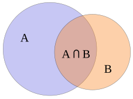
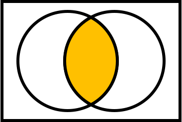
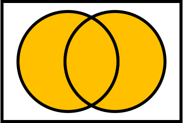
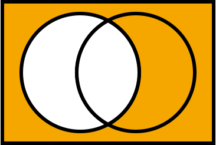
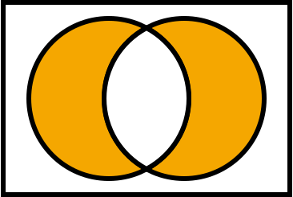
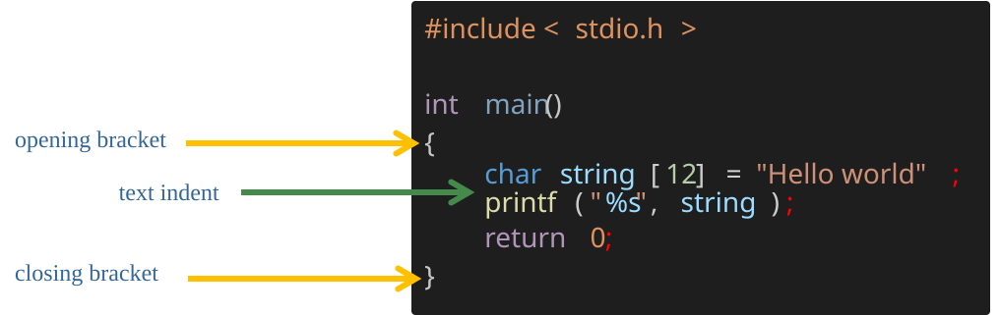

<!-- _class: lead -->

<!-- _paginate: skip -->

# CSCI 112

## Programming with C

### Lecture: 2

J. L. Pach

---

# Outline:

- Boolean logic
- Introduction to C: Hello World
- Indentation & parentheses
- Comments
- Symbolic Name
  - Variables
  - Arrays
  - Labels
  - Functions
- ASCII

---

<!-- _class: caption-slide -->

<!-- _paginate: skip -->

# Boolean

## logic

<!--
## Subtitle
-->

---

# George Boole

<div class="card justify">

- **Boolean logic** is a fundamental subset of algebra used for binary variables, representing **true** and **false** values through operations like `AND`, `OR`, and `NOT`. It's essential in computer science for circuit design, programming, and digital computations.

- **George Boole** was a 19th-century English mathematician who laid the groundwork for Boolean logic, revolutionizing mathematics and computer science. Fascinatingly, Boole died from pneumonia after being soaked in a rainstorm and treated with controversial cold-water therapy. His life and work are detailed in his biography, "*The Life and Work of George Boole*", which offers great insights into his contributions to modern technology.

</div>

---

<style scoped>
table tbody td { padding:0!important }
table { width:100%; margin:0.2em 0; font-size:26px }
.columns { display:flex; align-items:center; gap:30px }
.column-left { flex:0 0 auto }
.column-right { flex:1; font-size:0.52em; line-height:1.35 }
.column-right p { margin-bottom:12px }
.footer-summary { font-size:0.6em; margin-top:15px }
</style>

# Boolean logic

<div class="columns">

<div class="column-left">

| **Symbol** | **Logical operation** | **Operator** | **Notation** |
| --- | --- | --- | --- |
|  | Conjunction <br>("product" of x and y) | AND | x ∧ y |
|  | Disjunction<br>("sum") of x and y) | OR | x ∨ y |
|  | Negation<br>("the opposite") | NOT | ¬x |
|  | Exclusive OR | XOR | x ⊻ y |

</div>

<div class="column-right justify lh-30">



</div>

</div>

**\*Watch out!** The conjunction symbol ^ from logic is **XOR** in C, not AND!

---

<style scoped>
table { margin:0.2em 0; font-size:26px }
.columns { align-items:center }
.column-right { line-height:1.35 }
</style>

# AND gate

<div class="columns">

<div class="column-left">

| x | y | x ∧ y |
| --- | --- | --- |
| 0 | 0 | 0 |
| 0 | 1 | 0 |
| 1 | 0 | 0 |
| 1 | 1 | 1 |

</div>

<div class="column-right">



</div>

</div>

---

<style scoped>
table { margin:0.2em 0; font-size:26px }
.columns { align-items:center }
.column-right { line-height:1.35 }
</style>

# OR gate

<div class="columns">

<div class="column-left">

| **x** | **y** | **x ∨ y** |
| --- | --- | --- |
| 0 | 0 | 0 |
| 0 | 1 | 1 |
| 1 | 0 | 1 |
| 1 | 1 | 1 |

</div>

<div class="column-right">



</div>

</div>

---

<style scoped>
table { margin:0.2em 0; font-size:26px }
.columns { align-items:center }
.column-right { line-height:1.35 }
</style>

# NOT gate

<div class="columns">

<div class="column-left">

| **x** | **¬x** |
| --- | --- |
| 0 | 1 |
| 1 | 0 |

</div>

<div class="column-right">



</div>

</div>

---

<style scoped>
table { margin:0.2em 0; font-size:26px }
.columns { align-items:center }
.column-right { line-height:1.35 }
</style>

# XOR gate

<div class="columns">

<div class="column-left">

| **x** | **y** | **x ⊻ y** |
| --- | --- | --- |
| 0 | 0 | 0 |
| 0 | 1 | 1 |
| 1 | 0 | 1 |
| 1 | 1 | 0 |

</div>

<div class="column-right">



</div>

</div>

---

<!-- _class: caption-slide -->

<!-- _paginate: skip -->

# Introduction

## to C: Hello World

<!--
## Subtitle
-->

---

<!-- _class: code-description -->

# Hello World

```c
#include <stdio.h>

int main()
{
  char string[12] = "Hello world";
  printf("%s", string);
  return 0;
}

```

- Text preceded by `#` is a preprocessor section, the first line gives access to standard input and output functions, this is a header.
- Next, we have the main function defined, which returns an integer value. The `{}` brackets start and end the body of the main function.
- The `printf` function displays the string `Hello world` on the console.

<div class="result-box">

<div class="result-header">

Result

</div>

<div class="result-content">

Hello world

</div>

</div>

---

# `printf()` is a function and has two sides:

```c
char string[12] = "Hello world";
printf("%s", string);
```

<div class="justify lh-10">

- Left side `"%s"` – format string:
  - This is the *printing plan* — text + special placeholders (`%s`, `%d`, `%f`, etc.) that tell `printf()` how to insert values into specific places.
  - In `"%s"`, the `%` means *this is not just plain text*, but an instruction:
    - *take the data from the right side and display it in the format specified on the left side* — in this case, as a string.

</div>

---

# `printf()` is a function and has two sides:

```c
char string[12] = "Hello world";
printf("%s", string);
```

<div class="justify lh-25">

- Right side string – data to insert:
  - This is the variable or value that `printf()` will *plug in* where `%s` is. In this example, `printf()` reads all the characters of the string from the first to the last.

</div>

---

# Semicolon `;`

```c


#include <stdio.h> int main(){char string[12] = "Hello world"; printf("%s", string); return 0;}
```

<div class="justify lh-25">

- In the C programming language statements for the compiler (interpreter in Python) is separated by a semicolon `;`.
- Therefore, in C, you can write an entire program on one line...

</div>

---

# Indentation & parentheses



<div class="justify lh-10">

- Proper indentation is essential for making C code readable,
- Formatting is mandatory in Python, but not required here – We are talking about the compiler, because in our classes formatting is mandatory in order to get a positive grade at all.

</div>

---

# Indentation & parentheses but...

```c
#include <stdio.h>

int main()
{
	char string[12] = "Hello world";
	printf("%s", string);
	return 0;
}
```

```c
#include <stdio.h>

int main(){
	char string[12] = "Hello world";
	printf("%s", string);
	return 0;
}
```

---

# Comments

```c
int main()
{

  char string[12] = /* inline comment */  "Hello world";

  printf("%s", string);  /* comment behind the line */

  /* a comment
  composed of
  a few lines */

  /* comment */ int x = 2; // comment

    return 0; // single-line comments
}
```

---

<!-- _class: caption-slide -->

<!-- _paginate: skip -->

# Symbolic

## Name

---

# What is an address?

**Address of University:**

- 1300 W Park St, Butte, MT 59701


---

# What is an address?

**Address of University:**

- 1300 W Park St, Butte, MT 59701


- Address is an identifier
  (**symbolic name**) of location
- A place to locate what we refer to

---

# What is a name of variable?

```c
int main()
{
  char* text = "Hello world\n";

  printf(text);

    return 0;
}
```

<div class="justify lh-10">

- a variable name is a **symbolic name**, and when translating the code, the compiler will replace the variable name with the memory location of the data associate
- every **symbolic name** is an alias for a memory location (address) except for preprocessor instructions

</div>

---

# Symbolic names will be used in:

<div class="justify lh-10">

- **Variables**: Symbolic names will be used to identify and refer to data stored in variables. This allows for more meaningful and descriptive code compared to using arbitrary names or identifiers.
- **Arrays**: Symbolic names will be used to identify collections of related data elements. Arrays can be used to store multiple values of the same data type.
- **Functions**: Symbolic names will be used to identify and call functions within the program. This helps in organizing and structuring the code, making it easier to understand and maintain.
- **Labels**\*: Symbolic names will be used to mark specific locations or points within the program code. These labels can be used for various purposes, such as control flow statements, data references, or error handling.

</div>

---

# Restrictions on symbolic name

<div class="justify lh-25">

- The first character must be a letter, underscore `_`, or special character `@`, `#`, `$`\*
- The remaining characters can be letters, digits, underscores
- cannot contain spaces
- cannot be C language keywords ( for example. `for`, `while`, etc.)

\* *Only variable or function names*

</div>

---

# Symbolic naming convention

## `camelCase`  vs `snake_case` 

- `camelCase` starts each word with a capital letter, except for the first word.
  - For example, `thisIsCamelCase`.
- `snake_case` uses underscores to separate words and all letters are lowercase.
  - For example, `this_is_snake_case`.

Regardless of the specific coding style, it's common practice to start variable and function names with a lowercase letter. When using `snake_case`, we use underscores to separate words, like `my_variable`.

Constants, which are values that don't change, are usually written in all uppercase letters, such as `MAX_VALUE`

---

# Symbolic names will be used in:

<div class="justify lh-25">

- **Variables**: Symbolic names will be used to identify and refer to data stored in variables. This allows for more meaningful and descriptive code compared to using arbitrary names or identifiers.

- Arrays

- Functions

- Labels

</div>

---

<!-- _class: caption-slide -->

<!-- _paginate: skip -->

# Variables

---

# Declaring and initializing variables 1/3

```c
int main()
{
  int p;        /* Declaration of variable p with a size of 4 bytes */
  int q, r, s;  /* Simultaneous declaration of variables q, r, s using "," */
  q = 2;        /* Assignment of value to variable q - initialization */
  r = q = s;    /* Assignment of values to q and s based on r */
  int t = 3;    /* Declaration and initialization on the same line */

  return 0;
}
```

---

# Declaring and initializing variables 2/3

```c
int main()
{
  char v;              /* Variable v of integer type with a size of 1 byte */
  short int w;         /* Variable w of integer type with a size of 2 bytes */
  long int x;          /* Variable x of integer type with a size of 4 bytes */
  short y;             /* Shorthand declaration for short int */
  long z;              /* Shorthand declaration for long int */

  return 0;

  // short == short int
  // long  == long int == int
}
```

---

# Declaring and initializing variables 3/3

```c
int main()
{
  float  a = 3.16f;    /* Variable a of floating-point type with a size of 4 bytes */
  double b = a * 3.0;  /* Variable b of floating-point type with a size of 8 bytes */
  long double d;       /* Variable d of floating-point type with a size of 12 bytes */

  /* Note: short float, long float, and short double do not exist in C */
}
```

---

# Declaring and initializing variables

<div class="justify lh-25">

- Any variable must be declared before use.
- Unlike Python, C requires explicit type declaration for variables\*
- to write integers we use the type `char`(1B), `short integer`(2B) or `long integer`(4B)
- write real numbers `float`(4B), `double`(8B) or `long double`(12B)
- An uninitialized variable takes the random value

\*there is an auto keyword, but it is not allowed in the entire programming course!

</div>

---

# Two words about floating-point representation

<div class="justify lh-30">

Operations on real numbers are recorded with only a certain degree of precision, and therefore there is a very high probability that the result of `a + b – c` will not be the same as `a - c + b` ! This means that using real numbers requires careful consideration.

</div>

<!--
but more on that in another course - namely, computer architecture.
-->

---

# POINTERS ARE TREATED AS FIRST-CLASS DATA TYPES

```c
int main()
{
  short int p;        /* Declaration of variable p with a size of 2 bytes */
  short int * q = &p; /* Declaration and initialization of pointer q with a size of 4 bytes
                         (even though it points to short int) */
  float*r;            /* Declaration of pointer r to float  */
  char* s;            /* Declaration of pointer s to char  */
  int t, *v;          /* Declaration of variable t and pointer v */
  short int* w, z;    /* Declaration of pointer w to short int and variable z */

/* "Note that the variable type is determined by the position of the asterisk ('*') in the declaration.
Only the variable directly following the asterisk is considered a pointer. */
}
```

<div class="justify lh-10">

We can create a pointer to **any** data type using the `*` operator between the existing data type and the symbolic name. Unary Operator `&` returns memory locations. A pointer is a reference to a specific memory location

</div>

<!--
The size of a pointer is 4 bytes on 32-bit platforms
asterisk
-->

---

<style scoped>
table tbody td { padding:0!important }
table { width:80%; margin:0.6em 0; font-size:23px }
</style>

# Summary of memory size of data types

| Type | Memory size in bytes / bits |
| --- | --- |
| `char` | 01 Bytes / 08 bits |
| `bool`\* | 01 Bytes / 08 bits |
| `short int` | 02 Bytes / 16 bits |
| `long int` | 04 Bytes / 32 bits |
| `float` | 04 Bytes / 32 bits |
| `double` | 08 Bytes / 64 bits |
| `long double` | 12 Bytes / 96 bits |
| pointer (`char`\*, `short`\*, `long`\*, `int`\*, `float`\*, `double`\*, `long double`\*, `void`\*, …) | 04 Bytes / 32 bits |
| user defined (`struct`, `union`, etc. ) | complex |

\*from C99

---

# Symbolic names will be used in:

<div class="justify lh-25">

- Variables
- **Arrays**: Symbolic names will be used to identify collections of related data elements. Arrays can be used to store multiple values of the same data type.
- Functions:
- Labels

</div>

---

<!-- _class: caption-slide -->

<!-- _paginate: skip -->

# Arrays

---

# Arrays - reserves space in memory

```c

int a[10];
```

<div class="justify lh-20">

- This statement reserves space in memory for 10 integers and creates an '*unchanging address of memory*' that points to the beginning of this array\*. You can use this symbolic name to access individual elements of the array using square brackets and the appropriate index.

- The values of array will be undefined, meaning they can hold any random value.

**\*Array indexing starts from 0.**

</div>

---

# Arrays

<div class="justify lh-10">

```text
<type> symbolic_name[size];
```

- When you specify the size of an array in square brackets, it is created with that exact size.

```text
<type> symbolic_name[] = {value1, value2, value3};
```

- If you omit the size but provide initial values, the compiler counts them and creates an array of that size.

```text
<type> symbolic_name[size] = {value1, value2};
```

- If you specify the size but don't initialize all elements, the remaining ones will have indeterminate, unpredictable values.

</div>

---

# Do you remember?

```c
#include <stdio.h>

int main()
{
	char string[12] = "Hello world";
	printf("%s", string);
	return 0;
}
```

---

# Example of an array

```c
int main()
{
	char string0[12] = "Hello world";
	char string1[]  = "Hello world";
	char string2[12] = { 72, 101, 108 ,108, 111, 32, 87, 111, 114, 108, 100, 0 };
	char string3[]  = { 72, 101, 108 ,108, 111, 32, 87, 111, 114, 108, 100, 0 };
	char string4[12] = { 'H', 'e', 'l' , 'l', 'o', ' ', 'w', 'o', 'r', 'l', 'd', '\0' };
	char string5[]  = { 'H', 'e', 'l' , 'l', 'o', ' ', 'w', 'o', 'r', 'l', 'd', '\0' };
	char string6[12]  = { 'H', 101, 'l' , 108, 'o', ' ', 'w', 'o', 'r', 'l', 'd', 0 };
	printf("%s\n", string0); 	printf("%s\n", string1);
	printf("%s\n", string2); 	printf("%s\n", string3);
	printf("%s\n", string4); 	printf("%s\n", string5);
	printf("%s\n", string6); 	return 0;
}
```

---

<!-- _class: code-description -->

# Example of an array

```c

int main()
{
	char string0[12] = "Hello world";

	char string1[]  = "Hello world";

	char string2[12] = { 72, 101, 108 ,108, 111, 32, 87, 111, 114, 108, 100, 0 };

	char string3[]  = { 72, 101, 108 ,108, 111, 32, 87, 111, 114, 108, 100, 0 };

	char string4[12] = { 'H', 'e', 'l' , 'l', 'o', ' ', 'w', 'o', 'r', 'l', 'd', '\0' };

	char string5[]  = { 'H', 'e', 'l' , 'l', 'o', ' ', 'w', 'o', 'r', 'l', 'd', '\0' };

	char string6[12]  = { 'H', 101, 'l' , 108, 'o', ' ', 'w', 'o', 'r', 'l', 'd', 0 };

	printf("%s\n", string0);
	printf("%s\n", string1);
	printf("%s\n", string2);
	printf("%s\n", string3);
	printf("%s\n", string4);
	printf("%s\n", string5);
	printf("%s\n", string6);

	return 0;

}
```

- Text preceded by `#` is a preprocessor section, the first line gives access to standard input and output functions, this is a header.
- Next, we have the main function defined, which returns an integer value. The `{}` brackets start and end the body of the main function.
- The `printf`
  function
  displays
  the string
  `Hello world`
  on the console.

<div class="result-box">

<div class="result-header">

Result

</div>

<div class="result-content">

Hello World
Hello World
Hello World
Hello World
Hello World
Hello World
Hello World

</div>

</div>

---

# Arrays

<div class="justify lh-10">

```text
<type> symbolic_name[size];
```

- When you specify the size of an array in square brackets, it is created with that exact size.

```text
<type> symbolic_name[] = {value1, value2, value3};
```

- If you omit the size but provide initial values, the compiler counts them and creates an array of that size.

```text
<type> symbolic_name[size] = {value1, value2};
```

- If you specify the size but don't initialize all elements, the remaining ones will have indeterminate, unpredictable values.

</div>

---

# Question

## How do we know which letter goes with which number?

```c
int main()
{
  char text[] = { 72, 101, 108 ,108, 111, 32, 87, 111, 114, 108, 100, 10, 13, 0 };
  printf("%s", text);
  return 0;
}
```

```text
Result:
-----------
Hello World
```

---

<!-- _class: code-description -->

# ASCII

```text
 Val Char                            Val  Char     Val  Char     Val  Char
---------                            ---------     ---------     ----------
  0  NUL (null)                      32  SPACE     64  @         96  `
  1  SOH (start of heading)          33  !         65  A         97  a
  2  STX (start of text)             34  "         66  B         98  b
  3  ETX (end of text)               35  #         67  C         99  c
  4  EOT (end of transmission)       36  $         68  D        100  d
  5  ENQ (enquiry)                   37  %         69  E        101  e
  6  ACK (acknowledge)               38  &         70  F        102  f
  7  BEL (bell)                      39  '         71  G        103  g
  8  BS  (backspace)                 40  (         72  H        104  h
  9  TAB (horizontal tab)            41  )         73  I        105  i
 10  LF  (NL line feed, new line)    42  *         74  J        106  j
 11  VT  (vertical tab)              43  +         75  K        107  k
 12  FF  (NP form feed, new page)    44  ,         76  L        108  l
 13  CR  (carriage return)           45  -         77  M        109  m
 14  SO  (shift out)                 46  .         78  N        110  n
 15  SI  (shift in)                  47  /         79  O        111  o
 16  DLE (data link escape)          48  0         80  P        112  p
 17  DC1 (device control 1)          49  1         81  Q        113  q
 18  DC2 (device control 2)          50  2         82  R        114  r
 19  DC3 (device control 3)          51  3         83  S        115  s
 20  DC4 (device control 4)          52  4         84  T        116  t
 21  NAK (negative acknowledge)      53  5         85  U        117  u
 22  SYN (synchronous idle)          54  6         86  V        118  v
 23  ETB (end of trans. block)       55  7         87  W        119  w
 24  CAN (cancel)                    56  8         88  X        120  x
 25  EM  (end of medium)             57  9         89  Y        121  y
 26  SUB (substitute)                58  :         90  Z        122  z
 27  ESC (escape)                    59  ;         91  [        123  {
 28  FS  (file separator)            60  <         92  \        124  |
 29  GS  (group separator)           61  =         93  ]        125  }
 30  RS  (record separator)          62  >         94  ^        126  ~
 31  US  (unit separator)            63  ?         95  _        127  DEL
```

- American Standard Code for Information Interchange
- is the most common character encoding format for text data in computers and on the Internet. In standard ASCII-encoded data, there are unique values for 128 alphabetic, numeric or special additional characters and control codes.
- `\0` equals 0 (NULL)
- `\n` equals 10, 13 (n\ + \r)
- `\t` equals 11
- `White_Space` equals 32

<!--
ASCII: abbreviated from American Standard Code for Information Interchange, is a character encoding standard for electronic communication. ASCII codes represent text in computers, telecommunications equipment, and other devices. Because of technical limitations of computer systems at the time it was invented, ASCII has just 128 code points, of which only 95 are printable characters, which severely limited its scope. Modern computer systems have evolved to use Unicode, which has millions of code points, but the first 128 of these are the same as the ASCII set.
'5' has the int value 53 if we write '5'-'0' it evaluates to 53-48, or the int 5 if we write char c = 'B'+32; then c stores 'b'
-->

---

# Multi-dimensional arrays

- One dimension:

```text
<type> symbolic_name[size];
```

- Two dimensions:

```text
<type> symbolic_name[size1][size2];
```

- Three dimensions:

```text
<type> symbolic_name[size1][size2][size3];
```

- etc.

---

# Symbolic names will be used in:

<div class="justify lh-25">

- Variables
- Arrays
- Functions
- **Labels**\*: Symbolic names will be used to mark specific locations or points within the program code. These labels can be used for various purposes, such as control flow statements, data references, or error handling.

</div>

---

<!-- _class: caption-slide -->

<!-- _paginate: skip -->

# Labels

---

# Every line of code in C can have its own label.

```c
int main()
{
label1:  int x = /* inline comment */ 5;
label2:
label3:  char string[12] = "Hello world"; /* comment behind the line */
label4:  printf("%s", string);
label5:  /* a comment
         composed of
         a few lines */
label7:
label8:    return 0;
}
```

---

<!-- _class: caption-slide -->

<!-- _paginate: skip -->

# Thank

## You
