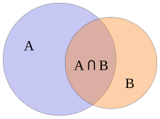
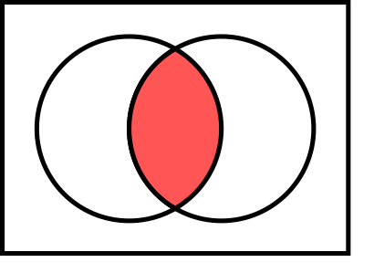
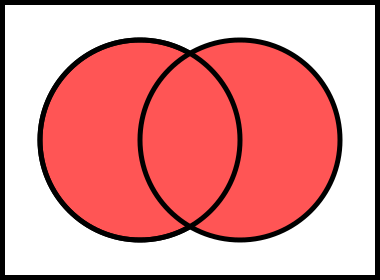

<!-- _class: lead -->

# CSCI 112<br><br>Programming with C

- Lecture 4
- Dr. Jakub L. Pach
- Fall 2025

---

<!-- _class: fit-90 -->

# Outline

- Review
- Boolean algebra
- Accessing Array Elements
- Logical vs Bitwise Operators
- Operator Sizeof
- Limits
- Input / Output

---

# Review

---

# Operators

- Operators specify what is to be done to variables (also pointers or labels)
- Operators can be:
  - unary    (e. g. -, ++),
  - binary    (e. g. +, -, \*, /),
  - ternary    (?:)

```c
int main()
{
  int i = 1;
  i = -i;				 /* unary -  						 */
  i++;				 /* unary ++ 						 */
  i = i + 1; i = i - 1;	 /* binary +, - 					 */
  i = i * 1; i = i / 1; 	 /* binary *, / 					 */
  i ? (i > 0) : 1 ; 0;	 /* ternary conditional 				 */
}
```

---

# Basics of mathematics

- Another important point is the division operator /. When used with integers, it performs integer division, meaning that 5 / 3 results in 1. If at least one operand is a floating-point number, the division produces a floating-point result, so 5 / 3 evaluates to approximately 1.6666.
- Finally, there is the modulo operator %, which returns the remainder of integer division. For example, 5 % 2 equals 1.

---

# Example - division

```c
// Declarations
int x = 5, y = 3;
float a = 5.0, b = 3.0;

printf("%s\n", "Integers:");
printf("x = %d\n", x);
printf("y = %d\n", y);

printf("%s\n","Floats:");
printf("a = %f\n", a);
printf("b = %f\n", b);

printf("Integer / Integer:\n");
printf("x / y = %d\n", x / y); // integer division

printf("\nInteger / Float:\n");
printf("x / b = %f\n", x / b); // x promoted to float
printf("x / b with %%d = %d (wrong!)\n", x / b); // incorrect, prints garbage

printf("\nFloat / Integer:\n");
printf("a / y = %f\n", a / y); // y promoted to float

printf("\nFloat / Float:\n");
printf("a / b = %f\n", a / b); // normal float division
```

Result:

```text
Integers:
x = 5
y = 3
Floats:
a = 5.000000
b = 3.000000
Integer / Integer:
x / y = 1

Integer / Float:
x / b = 1.666667
x / b with %d = -1431655765 (wrong!)

Float / Integer:
a / y = 1.666667

Float / Float:
a / b = 1.666667
```

---

<!-- _class: fit-90 -->

# Increment (++) & decrement (--) operator & Assignment by sum

- Prefix increment ++ and decrement -- operators increase (decrease) the operand's value first, then use the new value.
- Postfix increment ++ and decrement -- operators use the operand's current value first, then increase (decrease) the operand's value.
- Assignment by sum refers to the process of assigning a value to a variable using the addition operator + or the addition assignment operator += to combine the assigned value with the existing value of the variable.

```c
int main()
{
  int i = 1, j = 2;

  j++;

  i = j++;


  i = ++j;


  i += j;

  i = j = 2 + j;

}
```

```c
int main()
{
  int i = 1, j = 2;

  j = j + 1;

  i = j;
  j = j + 1;

  j = j + 1;
  i = j;

  i = i + j;

  j = 2 + j;
  i = j;
}
```

- \*In Python we don’t have something like that.

<!-- tu skonczylem, poprawilem blad tabilcy c -->

---

# Relational & logical operators <br>&lt;, &lt;=, &gt;, &gt;=, ==, !=, &&, ||

- Relational and logical operators return 1 for a true condition and 0 for a false condition. The result type of these operators is int (integer).
- In if and while statements, the C language considers the logical value of the conditional expression. This means that any value other than 0 (including positive, negative, characters, pointers, etc.) will be treated as true, while the value 0 will be treated as false.
- The bool type is not a built-in type because it is not essential for basic programming operations. However, to use the bool type, we need to include the &lt;stdbool.h&gt; header file.

```c
#include <stdio.h>
#include <stdbool.h>

int main()
{
  bool is_true  = true;
  bool is_false = false;
  bool result = is_true && is_false;
  printf("%d\n", result);
  result = 3 > 1;
  printf("%d\n", result);
}
```

Result:

```text
0
1
```

---

# Null / empty statement;

- A single semicolon ; in C language is a statement called a null statement or empty statement.
- A semicolons ; are used to terminate statements

```c
int main()
{
    ;   									/*  Empty statement    */
	printf("Hello world!\n");			/*  Second statement   */
	printf("Hello"); printf(" world!\n");	/*  3rd & 4th statement in one line */
}
```

<!-- In C programming, a **single line ending with a semicolon** (;) is typically referred to as an **empty statement** or **null statement**. It's a statement that doesn't perform any operation and has no effect on the program's execution. -->

---

# Block & complex(compound) statements

- Block can be:
  - substitute for simple statement,
  - defined within a block (Nested blocks),
  - empty {}.
- Variables can be declared inside
- Variables declared inside a block with the same name hide access to variables outside that block
- No semicolon at end of block
- After a code block ends, all variables declared within that block cease to exist and are no longer accessible in the rest of the program

<!-- Moze kiedys dodac “Compiled as a single unit “
Statements which cannot contain other statements are *simple*; those which can contain other statements are *compound*
Simple statements are complete in themselves; these include assignments, subroutine calls, and a few statements which may significantly affect the program flow of control (e.g. goto, return, etc.)
Jak udowodnic ze instrukcje count-controlled loop, condidion – cotrolled loop and if are statement? Zmieniaja stan program to znaczy kolejna linia kodu ktora miala byc a jest inna np. Goto.
Przypisanie jest rownoczesnie statement I -->

---

# Blocks & complex(compound) statements

```c
int main()
{
    char* text = "Hello world\n";
    printf(text);
    {
      char* text = "Bye world\n";
      printf(text);
      {
        char* text = "Aloha world\n";
        printf(text);
      }
    }
    printf(text);
}
```

Result:

```text
Hello world
Bye world
Aloha world
Hello world
```

---

# Statement & expression

- A **statement** can modify the state of a program, such as assigning a value to a variable, calling a function, or jumping to a different part of the code.
- Statements do not produce a value on their own.
- An **expression** is a combination of variables, constants, functions, and operators that evaluates to a single value.
- Expressions themselves do not directly modify the state of the program.

---

# Consequences

|Priority / Operator||Expression|Statement|
|---|---|---|---|
|1|(), \[\]|√|×|
||.|√|×|
||-&gt;|√|×|
|2|++, --|√|√|
||+, -, !, ~ (unary)|√|×|
||\*, & , &&  (unary)|√|×|
||(type), sizeof|√|×|
|3|\*, /, %|√|×|
|4|+, -|√|×|
|5|&lt;&lt;,  &gt;&gt;|√|×|
|6|&lt;, &lt;=, &gt;, &gt;=|√|×|
|7|==, !=|√|×|
|8|&|√|×|
|9|^|√|×|
|10|\||√|×|
|11|&&|√|×|
|12|\|\||√|×|
|13|?:|√|×|
|14|=|√|√|
||+=, -=, \*=, /=, %=|√|√|
||&lt;&lt;=, &gt;&gt;=, &=, ^=, \|=|√|√|
|15|,|√|×|

- In the Python language, there is not a single operator that is both a statement and an expression.
- Increment and decrement operators do not exist at all.
- Assignment is exclusively a statement, as is compound assignment. This has significant consequences.

<!-- Use parentheses to override order of evaluation -->

---

# Boolean algebra

---

# Boolean algebra

<br>

|**Symbol**|**Logical operation**|**Operator**|**Notation**|
|---|---|---|---|
||Conjunction <br>("product" of x and y)|AND|x ∧ y|
||Disjunction<br>("sum") of x and y)|OR|x ∨ y|
||Negation<br>("the opposite")|NOT|¬x|
||Exclusive OR|XOR|x ⊻ y|



- **\*Watch out!** The conjunction symbol ^ from logic is **XOR** in C, not AND!

---

# AND gate

<br>

|**x**|**y**|**x ∧ y**|
|---|---|---|
|0|0|0|
|0|1|0|
|1|0|0|
|1|1|1|



---

# OR gate

|**x**|**y**|**x ∨ y**|
|---|---|---|
|0|0|0|
|0|1|1|
|1|0|1|
|1|1|1|

<br>



---

# NOT gate

<br>

|**x**|**¬x**|
|---|---|
|0|1|
|1|0|


---

# XOR gate

<br>

|**x**|**y**|**x ⊻ y**|
|---|---|---|
|0|0|0|
|0|1|1|
|1|0|1|
|1|1|0|


---

# Accessing Array Elements

---

# Accessing Array Elements

- tab\[index\] is used both to read and write values.
- Array indices in C start from 0.
- Make sure the index is within the declared size (here 0–2).
- Each element in the array is stored contiguously in memory.

```c
#include <stdio.h>
int main()
{
    // Declare an array of 3 integers
    int tab[3];
    // Store values into the array
    tab[0] = 5;   // put 5 into the first element
    tab[1] = 10;  // put 10 into the second element
    tab[2] = 15;  // put 15 into the third element
    // Retrieve values from the array
    int x = tab[0];  // read the first element into variable x
    int y = tab[1];  // read the second element into variable y
    // Display the values
    printf("x = %d\n", tab[0]);  // prints 5
    printf("y = %d\n", tab[1]);  // prints 10
    return 0;
}
```

Result:

```text
x = 5
y = 10
```

---

# Basic operators

|Priority / Operator||Description|Associativity|Example|Result|
|---|---|---|---|---|---|
|1|()|Parentheses|Left-to-right|2 \* (x + y)|-2|
|2|++, --|Prefix & postfix increment and decrement|Right-to-left|++x; x--; x;|6, 6, 5|
||\*, &|Indirection (dereference); Address-of||z = &x; \*z;|6422276; 5|
||(type)|Cast, sizeof()||(int)3.0f; sizeof(x);|3, 4|
|3|\*, /, %|Multiplication, division, and remainder|Left-to-right|6/2 % 2|1|
|4|+, -|Addition and subtraction||1 + 2; 3 - 1|3, 2|
|6|&lt;, &lt;=, &gt;, &gt;=|For relational operators &lt;, &gt; and ≤, ≥ respectively||x&lt;y; x&lt;=y; x&gt;y; x&gt;=y|1, 1, 0 ,0|
|7|==, !=|For relational = and ≠ respectively||x == y, x != 1|1, 0|
|11|&&|Logical AND||1 && 0|0|
|12|\|\||Logical OR||1 \|\| 0|1|
|14|=|Simple assignment|Right-to-left|x  = y;|-6|
||+=, -=, \*=, /=, %=|Assignment by sum, difference, product, quotient, remainder||x+=1; x-=1; //etc.|6, 5|
|15|,|Comma|Left-to-right|x = 3, y = 1;|3|

```c
int main()
{
	int x = 5, y = -6; int * z; float f = 3.0f; 				/*code*/
}
```

<!-- perentysys; esiszewitiwy
Use parentheses to override order of evaluation -->

---

# Logical vs Bitwise Operators

---

<!-- _class: fit-80 -->

# Logical vs Bitwise Operators

In C, Boolean logic can be used in two ways:

- Bitwise operations on variables,
- Evaluating the logical value of an expression.

In the first case (bitwise), the result is a numeric value obtained by applying the corresponding logic gate to each bit of the variables involved. The exception is the bitwise NOT (~), which inverts all bits.

In the second case (logical operators), remember that any non-zero value (including negative numbers) is treated as true (1), and zero (or NULL) is false (0). Essentially, the numeric value of each variable is first cast to 0 or 1, and then the logical expression is evaluated.

---

# Logical vs Bitwise Operators

```c
unsigned int x = 6;             // 00000000 00000000 00000000 0000 0110 (binary)
unsigned int y = 3;             // 00000000 00000000 00000000 0000 0011 (binary)
//Bitwise AND, OR, NOT, XOR
// AND &
printf("%u\n", x & y);          // (00000000 00000000 00000000 0000 0010) = 2
// OR  |
printf("%u\n", x | y);          // (00000000 00000000 00000000 0000 0111)  = 7
// NOT ~ (flips all bits)
printf("%u\n", ~x);             // (11111111 11111111 11111111 1111 1001) = 4 294 967 289
// XOR ^
printf("%u\n", x ^ y);          // (00000000 00000000 00000000 0000 0101) = 5
//Logical AND, OR, NOT, XOR
// AND &
printf("%d\n", x && y);         // (00000000 00000000 00000000 0000 0001) = 1 (true)
// OR  |
printf("%d\n", x || y);         // (00000000 00000000 00000000 0000 0001) = 1 (true)
// NOT !
printf("%d\n", !x);             // (00000000 00000000 00000000 0000 0000) = 0 (false)
// XOR doesn't exist but =  (a || b) && !(a && b);
printf("%d\n", (x || y) && !(x && y));
                                // (00000000 00000000 00000000 0000 0000) = 0 (false)

printf("%d\n", -1 && -2);       // (00000000 00000000 00000000 0000 0001) = 1 (true)
```

Result:

```text
2
7
4294967289
5
1
1
0
0
1
```

---

# Sizeof()

---

# Summary of memory size of data types

|Type|Memory size in bytes / bits|
|---|---|
|char|01 Bytes / 08 bits|
|bool\*|01 Bytes / 08 bits|
|short int|02 Bytes / 16 bits|
|long int|04 Bytes / 32 bits|
|long long\*|08 Bytes / 64 bits|
|float|04 Bytes / 32 bits|
|double|08 Bytes / 64 bits|
|long double|12 Bytes / 96 bits|
|pointer (char\*, short\*, long\*, int\*, float\*, double\*, long double\*, void\*, …)|04 Bytes / 32 bits|
|user defined (struct, unions, etc. )|complex|

- \*from C99

---

# Operator Sizeof()

The sizeof operator returns the size of a type(requires parentheses) or variable in bytes.

- It is a unary operator, just like a cast, and has the same precedence level.
- It is easy to mistake sizeof for a function, but it is not — it is evaluated at compile time.

```c
    long long x;
    printf("%d\n", sizeof(x));
    printf("%d\n", sizeof x );
    printf("%d\n", sizeof(long long));
    short y;
    printf("%d\n", sizeof(y));
    printf("%d\n", sizeof y );
    printf("%d\n", sizeof(short) );
    float z;
    printf("%d\n", sizeof(z));
    printf("%d\n", sizeof z );
    printf("%d\n", sizeof(float) );
```

Result:

```text
8
8
8
2
2
2
4
4
4
```

---

# Limits

---

# limits.h & float.h

- To access constants defining the minimum and maximum values of integer types in C, include the header &lt;limits.h&gt;.<br>For floating-point types, include &lt;float.h&gt;.
- Important: FLT\_MIN (and other floating-point “min” constants) does not represent the most negative value.<br>It is the smallest positive non-zero value that can be represented.<br>If you want the actual minimum (most negative) value, use -FLT\_MAX.

---

# limits.h & float.h

```c
printf("CHAR_MIN           = %d\n", CHAR_MIN);
printf("CHAR_MAX           = %d\n", CHAR_MAX);
printf("UCHAR_MAX          = %u\n", UCHAR_MAX);
// short
printf("SHRT_MIN           = %d\n", SHRT_MIN);
printf("SHRT_MAX           = %d\n", SHRT_MAX);
printf("USHRT_MAX          = %u\n", USHRT_MAX);
// int
printf("INT_MIN            = %d\n", INT_MIN);
printf("INT_MAX            = %d\n", INT_MAX);
printf("UINT_MAX           = %u\n", UINT_MAX);
//float
printf("FLT_SMALLEST       = %e\n", FLT_MIN);
printf("FLT_MIN            = %f\n", -FLT_MAX);
printf("FLT_MAX            = %f\n", FLT_MAX);
printf("FLT_MAX            = %e\n", FLT_MAX);
```

Result:

```text
CHAR_MIN           = -128
CHAR_MAX           = 127
UCHAR_MAX          = 255
SHRT_MIN           = -32768
SHRT_MAX           = 32767
USHRT_MAX          = 65535
INT_MIN            = -2147483648
INT_MAX            = 2147483647
UINT_MAX           = 4294967295
FLT_SMALLEST       = 1.175494e-038
FLT_MIN            =
-340282346638528859811704183484516925440.000000
FLT_MAX            =
 340282346638528859811704183484516925440.000000
FLT_MAX            = 3.402823e+038
```

---

# Input / Output

---

# Input / Output

Input and output functions in C are not available by default — you need to include the &lt;stdio.h&gt; library. The most basic functions include:

- getchar()    – reads a single character from the keyboard,
- putchar()    – displays a single ASCII character on the screen,
- printf()    – prints a formatted string to the screen,
- scanf()    – reads a formatted string from the keyboard.

---

<!-- _class: fit-90 -->

# Input / Output

In C, it **is not** easy to explain how these functions work internally without more advanced knowledge. Therefore, we will start by using only the output functions:

- putchar() and printf().

To better understand how input works, we will first use the **getche()** function from the Windows-only 'conio.h' library. After that, we will move on to getchar() and finally to scanf().

```text
Getche() - (get[ ]char[acter with echo])
```

---

# Fundamental Functions for Input and Output

- Data Output for Screen:
  - putchar\*    -    (put\[ \]char\[acter\]):    Displays a single character on the screen.
  - printf    -    (print\[\]f\[ormatted\]):    Displays a formatted string of characters.
- Data Input from Keyboard:
  - getchar\*    -    (get\[ \]char\[acter\]):    Retrieves a single character from the keyboard.
  - scanf    -    (scan\[ \]f\[ormatted):    Reads a formatted string of characters from the keyboard.
- C doesn't handle input/output on its own. You need a library called &lt;stdio.h&gt;.
- \*You can use putchar and getchar like normal functions, but they are not standard C functions but rather preprocessor macros.

<!-- \*#include &lt;stdio.h&gt; -->

---

<!-- _class: fit-90 -->

# putchar() & getche() without '\n'

```c
int putchar(int);
putchar(c) puts the character c on the standard output.
it returns the character printed or EOF on error(-1).
int getche(void);
returns the next character from standard input.
it returns EOF on error.
```

```c
int main()
{
    char character;
    character = getche();   // Read a single key from the keyboard and immediately display it (echo)
    putchar(character);     // Display the value of 'character' using putchar (prints the same key again)

    character = getche();   // Read another single key (char is enough, automatic casting occurs)
    putchar(character);     // Display the second key pressed
}
```

Result:

```text
aaBB
```

---

<!-- _class: fit-90 -->

# putchar() & getche()

```c
int putchar(int);
    putchar(c) puts the character c on the standard output.
    it returns the character printed or EOF on error(-1).
int getche(void);
    returns the next character from standard input.
    it returns EOF on error.
```

```c
int main()
{
    char character;
    character = getche();   // Read a single key from the keyboard and immediately display it (echo)
    printf("%s", "\n");     // Print newline (CRLF) to move to the next line for clarity
    putchar(character);     // Display the value of 'character' using putchar (prints the same key again)
    printf("%s", "\n");     // Print another newline to separate outputs


    character = getche();   // Read another single key (char is enough, automatic casting occurs)
    printf("%s", "\n");     // Print newline to move to next line
    putchar(character);     // Display the second key pressed
    printf("%s", "\n");     // Final newline for clean output
}
```

Result:

```text
a
a
B
B
```

---

# char issue

- By default, char in C is signed, which means its range is -128 to 127 (two’s complement) instead of 0–255.
- When you write: char var = 255; or something greater than 255+x;
- you need to know that 255 is by default an int (4 bytes).

---

<!-- _class: fit-90 -->

# char issue

- An automatic cast occurs here: only the lowest 8 bits are kept, and the most significant bit (MSB), which determines the sign, is overwritten. As a result, printf will show -1 because that is how these 8 bits are interpreted in signed form.
- This is an example of overflow and truncation, causing loss of information. This is also why getche()/getchar() returns an int: it can hold all possible char values plus the special EOF value -1.<br>Using int ensures we can reliably distinguish between a real char with all bits set and an intentional EOF signal.

---

# Basics of

- The format requires a string enclosed in double quotes ("&lt;string&gt;").
- If we want to display the contents of our variables, such as int types, we must use the % symbol followed by the type. This allows displaying a value from memory interpreted as the given type and after we must provide the name of the variable that will be read. Each instance of %&lt;type&gt; will allow us to display the contents of one variable.

```c
int main()
{
  int x = 5;
  int y = 7;
  printf ("%s\n", "Hello world\n");
  printf("%d\n", x);
  printf("Value of x = %d, and value of y = %d\n", x, y);
  printf("%d %d\n", x, y, x, x);
}
```

Result:

```text
Hello world
5
Value of x = 5, and value of y = 7
5 7
```

```c
int printf (char format[], arg1, arg2 ,...);
```

<!-- While printf resembles Python's print function, and Python can utilize C-style formatting, the reverse is not true. This concept can be illustrated by the relationship between a square and a rectangle. -->

---

# Thank you

- Jakub Leszek Pach
- <jpach@mtech.edu>
