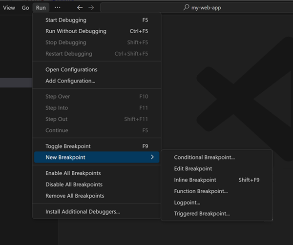
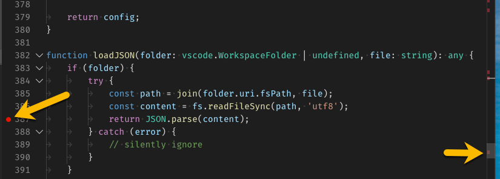
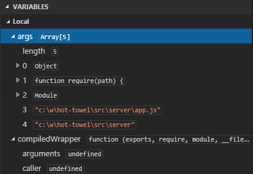
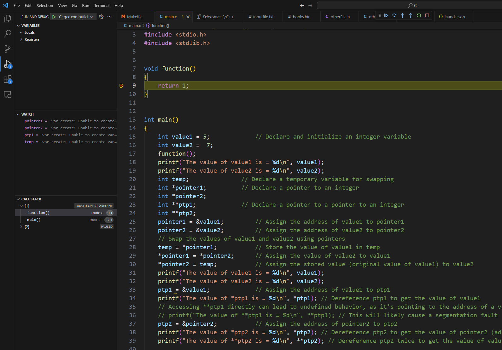

<!-- _class: lead -->

# CSCI 112<br><br>Programming with C

- Lecture 13
- Dr. Jakub L. Pach
- Fall 2025

---


---

# Outline

- Review
- Sscanf &amp; sprint
- Unit Tests
- Debugging

---

# Review

---

# Bitwise left shift(&lt;&lt;) and right shift(&gt;&gt;)

Result:

```text
a >> b = 1
a << b = 16


```

```c
int main()
{
    int a = 4;
    int b = 2;
    int result = a >> b;
    printf("a >> b = %d\n", result);
    result = a << b;
    printf("a << b = %d\n", result);

}
```

---

# Bitwise Left Shift &amp; Right Shift - summary

- The left shift &lt;&lt; moves all bits in a number to the left by a specified number of positions.→ Each shift left multiplies the value by 2.
- The right shift &gt;&gt; moves all bits to the right by a specified number of positions.→ Each shift right divides the value by 2 (for unsigned types).
- **Applications**:
  - Fast multiplication or division by powers of two
  - Bit masking and flag operations
  - Extracting or packing bits into specific positions
  - Embedded systems, hardware control, and data compression
- Can be combined in **expressions** with arithmetic, logical, and assignment operators: x = (a &lt;&lt; 3) | (b &amp; 0x0F);
- Shifting beyond the bit width of the type → undefined behavior,
- Right shift of signed values may perform arithmetic or logical shift depending on the compiler.

---

# typedef keyword

- C provides a facility called typedef for creating new data type names.
- typedef can be used with functions and structs etc.

Syntax:

```c
typedef <type> Symbolic_name
```

```c
#include <stdio.h>
typedef char * String;
typedef char Letter;
int strCmp( String one, String two )
{
    int i;
    for (i = 0; one[i] != '\0' && two[i] != '\0'; i++)
        if(one[i] > two[i])
            return 1;
        else if(one[i] < two[i])
            return -1;
    return 0;
}
int main(int argc, char *argv[])
{
    String text1 = "Some text\n"; /* read only! */
    String text2 = "Some text\n";
    printf( "%d", strCmp(text1, text2) );
    Letter letter = 'A';
    printf( "%c", letter );
    return 0;
}
```

Result:

```text
0A

```

---

# Function pointer

```c
int (*operation)(int, int);
```

*Function pointers are used to store the memory address of a function. For a function pointer to be correctly used, the signature of the function it points to must exactly match the signature of the pointer itself. This means the return type and the list of arguments (including their types and order) must be identical.*

```c
return-type function-name (only type of parameter declarations, if any);
```

```c
return-type (*function-name-pointer) (only type of parameter declarations, if any);
```

---

# Function pointer with typdef

```c
#include <stdio.h>
int add(int, int);
int subtract(int, int);

int add(int a, int b)
{
  return a + b;
}
int subtract(int a, int b)
{
  return a - b;
}

int main()
{
  int x = 5, y = 3;
  int (*peration)(int,int);
  operation = add;
  int result = operation(x, y);
  printf("Result of addition: %d\n", result);
  operation = subtract;
  result = operation(x, y);
  printf("Result of subtraction: %d\n", result);

  return 0;
}
```

Result:

```text
Result of addition: 8
Result of subtraction: 2
```

```c
#include <stdio.h>
int add(int, int);
int subtract(int, int);

int add(int a, int b)
{
  return a + b;
}
int subtract(int a, int b)
{
  return a - b;
}
typedef int (*Operation)(int,int);
int main()
{
  int x = 5, y = 3;
  Operation operation = add;
  int result = operation(x, y);
  printf("Result of addition: %d\n", result);
  operation = subtract;
  result = operation(x, y);
  printf("Result of subtraction: %d\n", result);

  return 0;
}
```

- When you use **typedef** with the syntax for a function pointer, you are not creating any pointer.
- You are simply defining <br>a type alias, which means this type does not exist in main until you actually declare <br>a variable of that type!!!

---

# Structures

- Structures are user-defined data types that group together variables of different data types.
- A structure is a collection of one or more variables, possibly of different types, grouped together under single symbolic\_name for convenient handling.

Syntax:

```c
struct symbolic_name1
{
	<statement1>
}<symbolic_name2, ...>;
```

- Everything that is in angle brackets &lt;&gt; is optional.

---

# An example

```c
#include <stdio.h>
struct MyStruct
{
    int value;
}*p, s; /* like struct MyStruct  * sPointer; struct MyStruct myStructure;*/

struct MyStruct  * sPointer; /* global pointer */
struct MyStruct myStructure; /* global variable */

struct MyStruct function( struct MyStruct temp )
{
    temp.value += 5;
    return temp;
}
int main(int argc, char *argv[])
{
    struct MyStruct localStruct; /* local variable */
    localStruct.value = 1;
    struct MyStruct * localStructPointer; /* local pointer */
    localStructPointer = &localStruct;
    printf( "%d\n", localStruct.value );
    localStructPointer->value = 2;
    printf( "%d\n", localStructPointer->value );
    printf( "%d\n", (*localStructPointer).value ); /*Equivalent to the previous line*/
    p = & s;
    (*p).value = 2;
    printf( "%d\n", s.value );
    printf( "%d\n", p->value );

    printf( "%d\n", myStructure.value );
    myStructure = function( *localStructPointer );
    printf( "%d\n", myStructure.value );
    return 0;
}
```

Result:

```text
1
2
2
2
2
0
7

```

To access members of a structure, we use the dot operator. When accessing a member through a pointer, we must use the dereferencing operator (\*) followed by the member access operator (.), enclosed in parentheses: (\*symbolic\_name).field. Alternatively, we can use the arrow operator (-&gt;), which is equivalent to symbolic\_name-&gt;field.

---

# A summary

- Structures are user-defined data types that group together variables of different data types. They provide a way to create custom data types tailored to specific needs.
- **Components:** Structures consist of members (or fields), which can be of different data types.
- **Member access:**
  - **Direct:** To access members of a structure directly, use the dot operator (.).
  - **Indirect (through a pointer):** To access members through a pointer, use either:
    - the dereferencing operator (\*) followed by the member access operator (.), enclosed in parentheses: (\*pointer).member,
    - the arrow operator (-&gt;): pointer-&gt;member.
- **Pointers to structures:** You can create pointers to structures, similar to other data types. This allows dynamic memory allocation for structures and passing them as function arguments.
- **Global vs. local variables:** Structures can be declared as global variables (accessible from anywhere in the program) or local variables (accessible only within a specific block of code). You can also create pointers to structures for more flexible memory management.

---

# typedef &amp; struct

Normally, when we define a struct, we can also declare global variables or pointers immediately after the closing brace:

- The variables p1 and ptr are global objects of this structure type.

We can also **omit the structure tag name** to make it **anonymous**, preventing multiple instances from being created:

- Here, config is the **only instance** of this unnamed structure type.

```c
struct Point
{
    int x, y;
} p1, *ptr;
```

```c
struct
{
    int id;
    float value;
} config;
```

Alternatively, we can use **typedef** to create an **alias** for a structure type:

- Now we can declare variables as Point p1; — no need for the keyword struct.
- The name after the definition (Point) is a type alias, not a variable.
- This alias does not prevent creating multiple instances — it simply simplifies the syntax.

```c
typedef struct
{

    int x, y;

} Point;
```

```c

Point symbolic_name;

```

---

# Padding

- **What is padding in structures?**
  - Padding is extra space (or "padding") that a compiler adds to a structure to align its members on specific memory addresses. This alignment is often done to improve memory access performance, especially for data types like integers and floating-point numbers.
- **Why do compilers add padding?**
  - **Performance:**
    - Most processors are optimized to access memory in chunks (like 4 or 8 bytes). Aligning data on these boundaries can significantly speed up memory access.
  - **Hardware architecture:**
    - Different hardware architectures have specific alignment requirements.

---

# An example - padding

```c
#include <stdio.h>
struct Example1
{
    char c;
    int i;
    short s;
};
struct Example2
{
    short s;
    char c;
    int i;
};
int main(int argc, char *argv[])
{
    printf( "Size of a struct Example is = %d\n", sizeof(struct Example1) );
    printf( "Size of a struct Example is = %d\n", sizeof(struct Example2) );
    struct Example1 example1;
    printf( "Struct Example1:\n" );
    printf( "Address of variable c = %d\n", &example1.c );
    printf( "Address of variable i = %d\n", &example1.i );
    printf( "Address of variable s = %d\n", &example1.s );
    struct Example2 example2;
    printf( "Struct Example2:\n" );
    printf( "Address of variable s = %d\n", &example2.s );
    printf( "Address of variable c = %d\n", &example2.c );
    printf( "Address of variable i = %d\n", &example2.i );
    return 0;
}
```

Result:

```text
Size of a struct Example is = 12
Size of a struct Example is = 8
Struct Example1:
Address of variable c = 6487828
Address of variable i = 6487832
Address of variable s = 6487836
Struct Example2:
Address of variable s = 6487820
Address of variable c = 6487822
Address of variable i = 6487824
```

---

# A summary on padding

- Even though memory was scarce when the C language was invented and every byte was precious, processors were even slower. Every machine instruction that could be saved while maintaining program functionality sped up the program. Therefore, the padding mechanism is a compromise between memory efficiency and program speed. Instead of calculating the memory address and saving one byte, it was better to perform a simple shift trick to make the variable addresses multiples of two. This is because, instead of multiplying (which is a relatively expensive operation for a processor), a bitwise shift can be used, which is extremely cheap. Thus, padding allows for an increase in the required space for storing a structure, but significantly speeds up access to structure members.
- Another important point is that the sizeof() operator does not return the minimum size of the structure, but the actual size after taking into account the padding mechanism. To counteract memory waste, you can change the order of variable declarations in the structure as shown in the example.

---

# Sscanf &amp; sprintf

<!-- These functions are closely related to printf and scanf, but they operate on strings rather than standard input or output. Let's start by understanding what each function does. -->

---

# sprintf

- What is sprintf?
  - Writing formatted data to a string
- Purpose:
  - Formats data according to the format specifier and stores the result in a character array.
- The sprintf function is incredibly useful when you need to create custom strings dynamically. The format specifiers work similarly to printf, allowing you to format numbers, strings, and other data types.

```c
#include <stdio.h>
int main(int argc, char *argv[])
{
    char buffer[50];
    int age = 30;
    sprintf(buffer, "I am %d years old.", age);
    printf(buffer);

    return 0;
}
```

Result:

```text
I am 30 years old.

```

---

# sscanf

- What is sscanf?
  - Reading formatted data from a string
- Purpose:
  - Reads formatted data from a string into variables.
- The sscanf is like the opposite of sprintf. It allows you to extract specific pieces of data from a string based on a format specifier. This is particularly useful when parsing data from files or user input.

```c
#include <stdio.h>
int main(int argc, char *argv[])
{
    char str[] = "My age is 30";
    int age;
    sscanf(str, "My age is %d", &age);
    printf("%d", age);

    return 0;
}
```

Result:

```text
30

```

---

# gets, puts

- puts():
  - This function writes a string followed by a newline to stdout.
  - The puts function in C automatically appends a newline character \n at the end of the string it outputs.
  - Here, it is used to display a prompt and greet the user after getting their input.
- gets():
  - This function reads a line of text from stdin and stores it in the specified character array (name in this example).
  - However, gets is unsafe because it doesn't check for buffer overflow; it's recommended to use fgets instead in modern C for safer input handling.

```c
#include <stdio.h>
int main()
{
    char name[50];

    /* Using puts toob display a message */
    puts("Please enter your name:");

    /* Using gets to read a line of text from the user */
    gets(name);

    /* Displaying the input using puts */
    puts("Hello, ");
    puts(name);
    return 0;
}
```

Result:

```text
Please enter your name:
Jacob
Hello,
Jacob
```

---

# Result of ...sscanf

- Return value:
  - Number of successfully assigned values:
    - If sscanf successfully assigns values to all specified variables, it returns the number of assignments.
  - 0:
    - If no conversion is performed or if a conversion error occurs.
  - EOF:
    - If an end-of-file condition is reached before any conversion.

```c
#include <stdio.h>
int main(int argc, char *argv[])
{
    char str[] = "Age: 30";
    int age;
    int result = sscanf(str, "Age: %d", &age);
    if (result == 1)
        printf("Read age: %d\n", age);
    else
        printf("Error reading age\n");

    return 0;
}
```

Result:

```text
30

```

---

# Summary

While sprintf and printf are very useful for formatting text, they suffer from a significant drawback: they lack built-in safeguards against buffer overflows. This is because the representation of data, particularly for floating-point numbers %f and integers %d, can be longer with formatting than the allocated memory buffer. Consequently, it's crucial to implement precise formatting for all elements (e.g., %s, %d, %f) to accurately calculate the required character count and ensure that the data fits within the allocated array.

---

# Summary

Conclusion: While sprintf and printf are powerful tools for parsing formatted input, they pose a significant risk of buffer overflows if not used carefully. These functions do not inherently enforce bounds checking, meaning that if the input data is larger than the allocated buffer, it can overwrite adjacent memory locations, leading to unpredictable behavior and potential security vulnerabilities. To mitigate this risk, it's essential to:

- Specify precise format specifiers: By using accurate format specifiers like %s, %d, and %f, you can precisely calculate the required space for each data element.
- Verify buffer sizes: Ensure that the allocated buffer is large enough to accommodate the parsed data, including any potential formatting characters.

---

# Unit Tests

---

# What are Unit Tests

Unit tests are automated checks of small parts of a program (such as functions or procedures) to verify that they work correctly. The idea is to test whether a given function returns the correct result for specific input values.

- Why use unit tests?
  - You catch bugs faster.
  - You don’t have to manually test your code every time.
  - You gain confidence that changes in the code don’t break other parts (this is called regression prevention).

---

# Introduction to Unity Test in C

When we write programs, we need a way to check if our code works correctly. There are two common tools for this in C:

- Assertions (assert)
- Unit testing frameworks (like Unity Test)

---

# What is an assert?

- Assert() is a built-in tool in C. (#include &lt;assert.h&gt;)
- It is mainly used by the programmer while writing code to check if assumptions are correct.
- If the condition in assert is false, the program immediately stops (crashes). Example:
- Good for debugging, **but not suitable for automated testing**, because once it fails, the program cannot continue.

```c
#include <assert.h>
int divide(int a, int b)
{
    assert(b != 0);  // program will stop if b == 0
    return a / b;
}
```

---

# Word – 'assert'

- In structurally or imperatively oriented programming, function names are typically nouns — for example, sum(), pow(), or strlen().
- In object-oriented programming, we create instances of objects represented by nouns, but the methods invoked on those objects are usually verbs, describing actions performed on the instance — for example, trash.clean().
- In the C language, the function assert() is an exception. Unlike typical function names, it is a verb, reflecting the programmer’s intention to assert — to strongly claim — that a certain condition holds true.

Conceptually, it’s as if the programmer is saying: “I assert that x equals 1”

```c
assert(x==1);
```

---

# Word – 'assert'

- The original intent behind assert() was to allow developers to write code like:

```c
sum(a, b);
assert(a > 0);
```

- These statements were meant to halt program execution if the condition was not met. In short, they served as additional safeguards to help speed up debugging.
- Over time, **most programming languages adopted dedicated unit testing frameworks** — even C, thanks to the Unity library. Unity was designed with **a plan-driven** approach in mind, enabling developers to write tests before implementing the actual code.

---

# Exit code / return code / status code

- The program returned exit code 0, which means it ran successfully.
- A non-zero exit code usually indicates an error or failure.

```c
int main(int argc, char *argv[])
{
    return 0; // cmd/powershell:  echo $LASTEXITCODE
}
```

```console
C:>main.exe
C:>echo $LASTEXITCODE
0
C:>
```

---

# What is Unity Test?

- Unity Test is a unit testing framework for C.
- It allows us to test functions in a safe and controlled way.
- Unlike assert, Unity Test does not stop the program when a test fails. Instead, it records the failure and continues with other tests.
- This way we get a summary of all passed and failed tests at the end. Example test with Unity:

```c
#include "unity.h"
void test_addition(void)
{
    TEST_ASSERT_EQUAL(4, 2 + 2);  // this will pass
    TEST_ASSERT_EQUAL(5, 2 + 2);  // this will fail, but program continues
}
```

---

# The difference: assert vs. Unity Test

- Assert() → for the programmer, during development, to catch bugs early.
- Unity Test → for systematic testing of finished functions, with clear reports.

---

# Error handling in C

- C has no exceptions (like in Java or Python).
- Instead, functions use special return values to signal errors:
  - Functions returning int often use -1 to mean “something went wrong.”
  - Functions returning pointers use NULL to mean “failure.”
  - At the program level, the exit code follows the same rule:
  - 0 = success
  - non-zero = error

```c
int findElement(int arr[], int size, int target)
{
    for(int i = 0; i < size; i++)
    {
        if(arr[i] == target)
            return i;  // found, return index
    }
    return -1;  // not found → error
}
```

---

# Summary

- Use assert inside your code while developing → catches programmer mistakes early.
- Use Unity Test to run proper unit tests on your functions.
- Handle errors with special return values (-1 for int, NULL for pointers), so tests can check failures without crashing the program.

---

# Introduction to Unity Test Framework in C

Unity is a lightweight testing framework for the C language. It allows us to write **unit tests** that check whether our functions work as expected.

When using Unity, every test file usually has three important parts:

- **setUp()** – a function that runs before each test. You can use it to prepare data or reset variables.
- **tearDown()** – a function that runs after each test. You can use it to clean up resources.
- **UNITY\_BEGIN(); RUN\_TEST(...); return UNITY\_END();** – this is the main pattern for starting Unity, running all tests, and reporting the results.

---

# Common Unity Assertions

Assertions are the heart of testing. They compare the expected result with the actual result and tell us if the test passed or failed. Some of the most common are:

- TEST\_ASSERT\_EQUAL(expected, actual)
  - – check if two integers are the same.
- TEST\_ASSERT\_NULL(ptr) / TEST\_ASSERT\_NOT\_NULL(ptr)
  - – check if a pointer is NULL or not.
- TEST\_ASSERT\_TRUE(condition) / TEST\_ASSERT\_FALSE(condition)
  - – check if a condition is true or false.
- TEST\_ASSERT\_FLOAT\_WITHIN(delta, expected, actual)
  - – check if two floating-point numbers are equal within a tolerance.
- TEST\_ASSERT\_EQUAL\_STRING(expected, actual)
  - – check if two strings are equal.
- TEST\_ASSERT\_GREATER\_THAN(threshold, actual)
  - – custom/extended check if a value is greater than a threshold.

---

# Common Unity Assertions

- TEST\_ASSERT\_EQUAL(expected, actual)
  - – check if two integers are the same.
- TEST\_ASSERT\_NULL(ptr) / TEST\_ASSERT\_NOT\_NULL(ptr)
  - – check if a pointer is NULL or not.
- TEST\_ASSERT\_TRUE(condition) / TEST\_ASSERT\_FALSE(condition)
  - – check if a condition is true or false.

---

# Common Unity Assertions

- TEST\_ASSERT\_FLOAT\_WITHIN(delta, expected, actual)
  - – check if two floating-point numbers are equal within a tolerance.
- TEST\_ASSERT\_EQUAL\_STRING(expected, actual)
  - – check if two strings are equal.
- TEST\_ASSERT\_GREATER\_THAN(threshold, actual)
  - – custom/extended check if a value is greater than a threshold.

---

# Understanding setUp() and tearDown()

In Unity, the function setUp() is always called before each test. You use it to prepare the environment: initialize variables, reset arrays, or allocate memory.

The function tearDown() is always called after each test. At first, this may look unnecessary. In modern languages with a garbage collector (like Java or Python), developers rarely think about memory allocation and cleanup, so they might wonder: “Why do I need tearDown() if setUp() can just reset the data again?”

The answer is that in C and C++ we often use dynamic memory. If a test uses malloc() (or new in C++), we must free that memory after the test, otherwise we create memory leaks. That’s why tearDown() is important—it ensures that all resources used by a test are properly released, no matter if the test passed or failed.

So the pattern is:

- setUp() → prepare everything a test needs.
- tearDown() → clean up, especially for dynamic memory.

This makes every test independent, safe, and repeatable.

---

# Debugging

---

# Debugging

- Debugging is an integral part of programming, and understanding its fundamental principles will significantly speed up your software development process. While different development environments may have varying keyboard shortcuts or interfaces, the core concepts of debugging remain universal.
- Basic debugging principles:
  - Setting breakpoints: This is the simplest way to pause program execution at a specific point and inspect the values of variables. This allows you to step through your code line by line.
  - Step-by-step execution:
    - Step Over: Executes the next instruction, skipping function calls.
    - Step Into: Enters a called function, allowing you to follow its execution line by line.
    - Step Out: Executes the remaining instructions in the current function and returns to the calling point.

---

# Debugging

- Inspecting variables:
  - While debugging, you can observe the values of variables, which helps quickly identify logical errors.
- Call stack:
  - Tracking the call stack allows you to understand how the program reached a particular point and which functions are currently active.
- Breakpoints with conditions:
  - You can set breakpoints that will only be triggered when a specific condition is met (e.g., when a variable reaches a certain value).
- Logging:
  - Adding print statements to your code can help track program execution, especially in larger projects.

---

# Visual Studio / Visual Studio Code

Debug actions

|**Action**|**Explanation**|
|---|---|
|**Continue / Pause**<br>F5|**Continue**: Resume normal program/script execution (up to the next breakpoint).<br>**Pause**: Inspect code executing at the current line and debug line-by-line.|
|**Step Over**<br>F10|Execute the next method as a single command without inspecting or following its component steps.|
|**Step Into**<br>F11|Enter the next method to follow its execution line-by-line.|
|**Step Out**<br>Shift+F11|When inside a method or subroutine, return to the earlier execution context by completing remaining lines of the current method as though it were a single command.|
|**Restart**<br>Ctrl+Shift+F5<br>Stop<br>Shift+F5|Terminate the current program execution and start debugging again using the current run configuration.|

- <https://code.visualstudio.com/docs/editor/debugging>

---

# Visual Studio / Visual Studio Code




---

# Visual Studio / Visual Studio Code

Breakpoints



---

# Visual Studio / Visual Studio Code

Variables




---

# Visual Studio / Visual Studio Code

Call stack



---

# Thank you

- Jakub Leszek Pach
- <jpach@mtech.edu>
