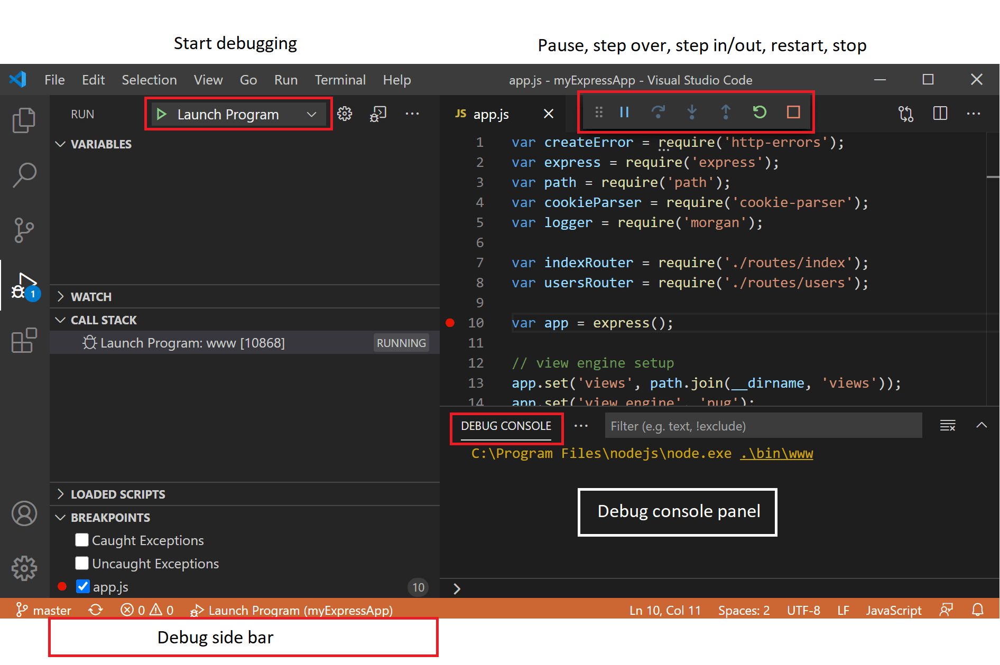
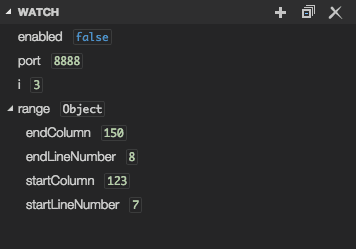

<!-- _class: lead -->

# CSCI 112<br><br>Programming with C

- Lecture 14
- Dr. Jakub L. Pach
- Fall 2025

---

# Outline

- Unit Tests - example
- Debugging

---

# Project Structure<br>Unit Tests

<!-- These functions are closely related to printf and scanf, but they operate on strings rather than standard input or output. Let's start by understanding what each function does. -->

---

# Project Structure - Modular C Program with Unit Tests

- Separate logic, tests, and headers for clarity.
- Unity is a lightweight, header-based testing framework — ideal for C projects.
- This structure allows easy maintenance and clear organization.

```text
C project/
│
├── code.c              ← function implementations
├── code.h              ← function declarations and globals
│
├── main.c              ← main program entry point
│
├── tests.c             ← unit tests implementation
├── tests.h             ← declaration for test runner
│
├── unity.c / unity.h   ← Unity testing framework
│
└── Makefile            ← build automation
```

---

# main.c

```c
//#define clearBuffer() while (getchar() != '\n');
#include <stdio.h>
#include <stdlib.h>
#include <stdbool.h>
#include <string.h>
#include "tests.h"
#include "code.h"
// ----------------- MAIN PROGRAM -----------------
int main(int argc, char *argv[])
{
    int failed_tests = 0;
    if (argc > 1)
    {
        if (strcmp(argv[1], "--test") == 0)
            failed_tests = run_unity_tests();
        else if (strcmp(argv[1], "--author") == 0)
            printf(AUTHOR_NAME);
        else if (strcmp(argv[1], "--authorship") == 0)
            printf(AUTHOR_AUTHORSHIP);
        else if (strcmp(argv[1], "--help") == 0)
            printf("\n  --test\...\n\n");
    }
    else
    {
        printf("Wrong parameter. Use --help to see available options.\n");
        return 1;
    }
    //failed_tests = run_unity_tests();
    getchar(); // pause before exit (Windows)
    return failed_tests; // cmd/powershell: echo $LASTEXITCODE
}
```

---

# code.h

```c
// code.h
#ifndef CODE_H // include guard prevents multiple inclusion
#define CODE_H

// comments
extern char * AUTHOR_NAME;
extern char * AUTHOR_AUTHORSHIP;

// ----------------- DATA STRUCTURES -----------------
// Declaration of a simple test struct

struct TestStruct
{
    int var;
};
// ----------------- GLOBAL VARIABLES -----------------
// Note: use of globals is generally discouraged but okay for small demos
int a;      // test variable 'a'
int * p;    // pointer used in tests


// ----------------- FUNCTION PROTOTYPES -----------------
int multiply(int x, int y);    // multiplies two integers
int addOne(int * pointer);     // increments value pointed to by pointer


#endif


```

---

# code.c

```c
char * AUTHOR_NAME = (char *) "Jakub Pach";
char * AUTHOR_AUTHORSHIP = (char *) "I acknowledge that I have worked on this assignment independently, except where explicitly noted and referenced. Any collaboration or use of external resources has been properly cited. I am fully aware of the consequences of academic dishonesty and agree to abide by the university's academic integrity policy. I understand the seriousness and implications of plagiarism.";

// --------- FUNCTION IMPLEMENTATIONS ------------
#include <stdio.h>

int addOne(int * pointer)
{
    // check pointer validity and positive value
    if(!(*pointer >= 0))
    {
        fprintf(stderr, "Error: (*pointer) has to be greater or equal zero!\n");
        return -1;   // special error value
    }
    (*pointer)++;
    return *pointer;
}

int multiply(int x, int y)
{
    return x * y;
}
```

---

# tests.h

```c
// tests.h
#ifndef TESTS_H
#define TESTS_H


// prototype for running all Unity tests
int run_unity_tests(void);


#endif // TESTS_H


```

---

# tests.c

```c
//#include <assert.h>   // commented out, not needed
#include "code.h"
#include "tests.h"
#include "unity.h"
int result; // global variable for test results
// ----------------- UNITY SETUP / TEARDOWN -----------------
void setUp()
{
    a = 4;
    p = (int*) malloc(sizeof(int));
    *p = 5;
    result = 0;
}
void tearDown()
{
    free(p);
    result = 0;
}
// ----------------- TEST FUNCTIONS -----------------
void test_multiply_basic()
{
    result = multiply(a, *p);
    TEST_ASSERT_EQUAL(20, result);
}
void test_multiply_with_zero()
{
    *p = 0;
    result = multiply(a, *p);
    TEST_ASSERT_EQUAL(0, result);
}
void test_multiply_negative()
{
    *p = -3;
    result = multiply(a, *p);
    TEST_ASSERT_EQUAL(-12, result);
}
```

```c
void test_addOne_basic()
{
    result = addOne(p);
    TEST_ASSERT_EQUAL(6, result);
}
void test_addOne_negative()
{
    *p = -3;
    result = addOne(p);
    TEST_ASSERT_EQUAL(-1, result); // tests proper error handling
}
// ----------------- RUN ALL TESTS -----------------
int run_unity_tests(void)
{
    UNITY_BEGIN();
    RUN_TEST(test_multiply_basic);
    RUN_TEST(test_multiply_with_zero);
    RUN_TEST(test_multiply_negative);
    RUN_TEST(test_addOne_basic);
    RUN_TEST(test_addOne_negative);
    return UNITY_END();
}


```

---

# code.c and code.h – Functional Module

- code.h declares the interface.
- code.c contains the implementation.

```c
int multiply(int x, int y);    // multiplies two integers
int addOne(int * pointer);     // increments value pointed to by pointer
```

```c
int addOne(int * pointer)
{
    // check pointer validity and positive value
    if(!(*pointer >= 0))
    {
        fprintf(stderr, "Error: (*pointer) has to be greater or equal zero!\n");
        return -1;   // special error value
    }
    (*pointer)++;
    return *pointer;
}
int multiply(int x, int y)
{
    return x * y;
}
```

- addOne() checks input validity → demonstrates defensive programming.Simple, testable logic → perfect for unit testing.
- The Logic Module

---

# main.c – Program Entry Point

- The program supports several command-line arguments.
- --test runs all unit tests.
- The same executable can run in:
  - normal mode (program logic)
  - test mode (verification)
- Demonstrates separation of logic and testing.

```c
int main(int argc, char *argv[])
{
    int failed_tests = 0;
    if (argc > 1)
    {
        if (strcmp(argv[1], "--test") == 0)
            failed_tests = run_unity_tests();
        else if (strcmp(argv[1], "--author") == 0)
            printf(AUTHOR_NAME);
        else if (strcmp(argv[1], "--authorship") == 0)
            printf(AUTHOR_AUTHORSHIP);
        else if (strcmp(argv[1], "--help") == 0)
            printf("\n  --test\...\n\n");
    }
    else
    {
        printf("Wrong parameter. Use --help to see available options.\n");
        return 1;
    }
    //failed_tests = run_unity_tests();
    getchar(); // pause before exit (Windows)
    return failed_tests; // cmd/powershell: echo $LASTEXITCODE
}
```

- The Main Program and Command Interface

---

# Unit Testing with Unity - Writing Tests with Assertions

- Each test\_\* function verifies one behavior.
- TEST\_ASSERT\_EQUAL(expected, actual) checks correctness.
- Assertion = a condition that must be true for the test to pass.
- Failures are automatically reported by Unity.

```c
void test_multiply_basic()
{
    result = multiply(a, *p);
    TEST_ASSERT_EQUAL(20, result);
}
void test_multiply_with_zero()
{
    *p = 0;
    result = multiply(a, *p);
    TEST_ASSERT_EQUAL(0, result);
}
void test_multiply_negative()
{
    *p = -3;
    result = multiply(a, *p);
    TEST_ASSERT_EQUAL(-12, result);
}
```

---

# Unit Testing with Unity - Setup and Teardown Functions

- setUp() runs before each test → initializes variables.
- tearDown() runs after each test → cleans up memory.
- Ensures tests run independently and do not affect each other.
- Mimics a controlled test environment.
- Preparing and Cleaning the Test Environment

```c
void setUp()
{
    a = 4;
    p = (int*) malloc(sizeof(int));
    *p = 5;
    result = 0;
}
void tearDown()
{
    free(p);
    result = 0;
}
```

---

# Function pointer

```c
int (*operation)(int, int);
```

*Function pointers are used to store the memory address of a function. For a function pointer to be correctly used, the signature of the function it points to must exactly match the signature of the pointer itself. This means the return type and the list of arguments (including their types and order) must be identical.*

```c
return-type function-name (only type of parameter declarations, if any);
```

```c
return-type (*function-name-pointer) (only type of parameter declarations, if any);
```

---

# Unit Testing with Unity - Running and Reporting Tests

- Each test is executed via RUN\_TEST().
- Unity reports all results in a readable format.
- Helps trace logical errors quickly and accurately.

```c
void test_addOne_basic()
{
    result = addOne(p);
    TEST_ASSERT_EQUAL(6, result);
}
void test_addOne_negative()
{
    *p = -3;
    result = addOne(p);
    TEST_ASSERT_EQUAL(-1, result); // tests proper error handling
}
// ----------------- RUN ALL TESTS -----------------
int run_unity_tests(void)
{
    UNITY_BEGIN();
    RUN_TEST(test_multiply_basic);
    RUN_TEST(test_multiply_with_zero);
    RUN_TEST(test_multiply_negative);
    RUN_TEST(test_addOne_basic);
    RUN_TEST(test_addOne_negative);
    return UNITY_END();
}


```

Result:

```text
tests.c:53:test_multiply_basic:PASS
tests.c:54:test_multiply_with_zero:PASS
tests.c:55:test_multiply_negative:PASS
tests.c:56:test_addOne_basic:PASS
Error: (*pointer) has to be greater or equal zero!
tests.c:57:test_addOne_negative:PASS

-----------------------
5 Tests 0 Failures 0 Ignored
OK
```

---

# Summary and Best Practices

- Modular structure simplifies maintenance and testing
- Unity enables lightweight, automated unit testing
- Assertions verify expected behavior directly in code
- Separate logic (code.c) from tests (tests.c)
- Reproducible builds with Makefile automation

---

<!-- _class: fit-90 -->

# Summary and Best Practices

- Every time a program encounters an error or *undefined behavior (UB)* during execution — such as an invalid array index (out of range), an attempt to modify a constant variable through a pointer, accessing non-existent memory (NULL), division by zero, etc. — the program immediately terminates with an **exit code** that indicates the problem. In unit testing, we must create test functions that handle **only one case at a time**, for example: void test\_multiply\_basic(void)
- Each test function verifies one specific behavior. If a test fails and the program attempts to terminate abnormally, all remaining instructions in that test function are skipped — similar to how a break statement exits a loop. That’s why each case is written as a separate test function.

---

<!-- _class: fit-90 -->

# Summary and Best Practices

- Why do all these test functions have no parameters and return void? Because their **function signature** must match what Unity expects — the function’s address is passed to the macro: RUN\_TEST(test\_multiply\_basic); inside the run\_unity\_tests() function.
- If all tests run successfully, UNITY\_END() returns the number of **failed tests**.<br>This allows us to conveniently pass that information to the operating system using: return UNITY\_END(); in main.c, since main.c contains:

```c
failed_tests = run_unity_tests();
return failed_tests;
```

---

# Review

---

# sprintf

- What is sprintf?
  - Writing formatted data to a string
- Purpose:
  - Formats data according to the format specifier and stores the result in a character array.
- The sprintf function is incredibly useful when you need to create custom strings dynamically. The format specifiers work similarly to printf, allowing you to format numbers, strings, and other data types.

```c
#include <stdio.h>
int main(int argc, char *argv[])
{
    char buffer[50];
    int age = 30;
    sprintf(buffer, "I am %d years old.", age);
    printf(buffer);

    return 0;
}
```

Result:

```text
I am 30 years old.

```

---

# sscanf

- What is sscanf?
  - Reading formatted data from a string
- Purpose:
  - Reads formatted data from a string into variables.
- The sscanf is like the opposite of sprintf. It allows you to extract specific pieces of data from a string based on a format specifier. This is particularly useful when parsing data from files or user input.

```c
#include <stdio.h>
int main(int argc, char *argv[])
{
    char str[] = "My age is 30";
    int age;
    sscanf(str, "My age is %d", &age);
    printf("%d", age);

    return 0;
}
```

Result:

```text
30

```

---

# gets, puts

- puts():
  - This function writes a string followed by a newline to stdout.
  - The puts function in C automatically appends a newline character \n at the end of the string it outputs.
  - Here, it is used to display a prompt and greet the user after getting their input.
- gets():
  - This function reads a line of text from stdin and stores it in the specified character array (name in this example).
  - However, gets is unsafe because it doesn't check for buffer overflow; it's recommended to use fgets instead in modern C for safer input handling.

```c
#include <stdio.h>
int main()
{
    char name[50];

    /* Using puts toob display a message */
    puts("Please enter your name:");

    /* Using gets to read a line of text from the user */
    gets(name);

    /* Displaying the input using puts */
    puts("Hello, ");
    puts(name);
    return 0;
}
```

Result:

```text
Please enter your name:
Jacob
Hello,
Jacob
```

---

# Function pointer with typdef

```c
#include <stdio.h>
int add(int, int);
int subtract(int, int);

int add(int a, int b)
{
  return a + b;
}
int subtract(int a, int b)
{
  return a - b;
}

int main()
{
  int x = 5, y = 3;
  int (*peration)(int,int);
  operation = add;
  int result = operation(x, y);
  printf("Result of addition: %d\n", result);
  operation = subtract;
  result = operation(x, y);
  printf("Result of subtraction: %d\n", result);

  return 0;
}
```

Result:

```text
Result of addition: 8
Result of subtraction: 2
```

```c
#include <stdio.h>
int add(int, int);
int subtract(int, int);

int add(int a, int b)
{
  return a + b;
}
int subtract(int a, int b)
{
  return a - b;
}
typedef int (*Operation)(int,int);
int main()
{
  int x = 5, y = 3;
  Operation operation = add;
  int result = operation(x, y);
  printf("Result of addition: %d\n", result);
  operation = subtract;
  result = operation(x, y);
  printf("Result of subtraction: %d\n", result);

  return 0;
}
```

- When you use **typedef** with the syntax for a function pointer, you are not creating any pointer.
- You are simply defining <br>a type alias, which means this type does not exist in main until you actually declare <br>a variable of that type!!!

---

# Exit code / return code / status code

- The program returned exit code 0, which means it ran successfully.
- A non-zero exit code usually indicates an error or failure.

```c
int main(int argc, char *argv[])
{
    return 0; // cmd/powershell:  echo $LASTEXITCODE
}
```

```console
C:>main.exe
C:>echo $LASTEXITCODE
0
C:>
```

---

# Error handling in C

- C has no exceptions (like in Java or Python).
- Instead, functions use special return values to signal errors:
  - Functions returning int often use -1 to mean “something went wrong.”
  - Functions returning pointers use NULL to mean “failure.”
  - At the program level, the exit code follows the same rule:
  - 0 = success
  - non-zero = error

```c
int findElement(int arr[], int size, int target)
{
    for(int i = 0; i < size; i++)
    {
        if(arr[i] == target)
            return i;  // found, return index
    }
    return -1;  // not found → error
}
```

---

# What are Unit Tests

Unit tests are automated checks of small parts of a program (such as functions or procedures) to verify that they work correctly. The idea is to test whether a given function returns the correct result for specific input values.

- Why use unit tests?
  - You catch bugs faster.
  - You don’t have to manually test your code every time.
  - You gain confidence that changes in the code don’t break other parts (this is called regression prevention).

---

# What is Unity Test?

- Unity Test is a unit testing framework for C.
- It allows us to test functions in a safe and controlled way.
- Unlike assert, Unity Test does not stop the program when a test fails. Instead, it records the failure and continues with other tests.
- This way we get a summary of all passed and failed tests at the end. Example test with Unity:

```c
#include "unity.h"
void test_addition(void)
{
    TEST_ASSERT_EQUAL(4, 2 + 2);  // this will pass
    TEST_ASSERT_EQUAL(5, 2 + 2);  // this will fail, but program continues
}
```

---

<!-- _class: fit-90 -->

# Introduction to Unity Test Framework in C

Unity is a lightweight testing framework for the C language. It allows us to write **unit tests** that check whether our functions work as expected.

When using Unity, every test file usually has three important parts:

- **setUp()** – a function that runs before each test. You can use it to prepare data or reset variables.
- **tearDown()** – a function that runs after each test. You can use it to clean up resources.
- **UNITY\_BEGIN(); RUN\_TEST(...); return UNITY\_END();** – this is the main pattern for starting Unity, running all tests, and reporting the results.

---

# Common Unity Assertions

- TEST\_ASSERT\_EQUAL(expected, actual)
  - – check if two integers are the same.
- TEST\_ASSERT\_NULL(ptr) / TEST\_ASSERT\_NOT\_NULL(ptr)
  - – check if a pointer is NULL or not.
- TEST\_ASSERT\_TRUE(condition) / TEST\_ASSERT\_FALSE(condition)
  - – check if a condition is true or false.

---

# Common Unity Assertions

- TEST\_ASSERT\_FLOAT\_WITHIN(delta, expected, actual)
  - – check if two floating-point numbers are equal within a tolerance.
- TEST\_ASSERT\_EQUAL\_STRING(expected, actual)
  - – check if two strings are equal.
- TEST\_ASSERT\_GREATER\_THAN(threshold, actual)
  - – custom/extended check if a value is greater than a threshold.

---

<!-- _class: fit-50 -->

# Understanding setUp() and tearDown()

In Unity, the function setUp() is always called before each test. You use it to prepare the environment: initialize variables, reset arrays, or allocate memory.

The function tearDown() is always called after each test. At first, this may look unnecessary. In modern languages with a garbage collector (like Java or Python), developers rarely think about memory allocation and cleanup, so they might wonder: “Why do I need tearDown() if setUp() can just reset the data again?”

The answer is that in C and C++ we often use dynamic memory. If a test uses malloc() (or new in C++), we must free that memory after the test, otherwise we create memory leaks. That’s why tearDown() is important—it ensures that all resources used by a test are properly released, no matter if the test passed or failed.

So the pattern is:

- setUp() → prepare everything a test needs.
- tearDown() → clean up, especially for dynamic memory.

This makes every test independent, safe, and repeatable.

---

# Debugging

---

# Debugging

- Debugging is an integral part of programming, and understanding its fundamental principles will significantly speed up your software development process. While different development environments may have varying keyboard shortcuts or interfaces, the core concepts of debugging remain universal.
- Basic debugging principles:
  - Setting breakpoints: This is the simplest way to pause program execution at a specific point and inspect the values of variables. This allows you to step through your code line by line.
  - Step-by-step execution:
    - Step Over: Executes the next instruction, skipping function calls.
    - Step Into: Enters a called function, allowing you to follow its execution line by line.
    - Step Out: Executes the remaining instructions in the current function and returns to the calling point.

---

# Debugging

- Inspecting variables:
  - While debugging, you can observe the values of variables, which helps quickly identify logical errors.
- Call stack:
  - Tracking the call stack allows you to understand how the program reached a particular point and which functions are currently active.
- Breakpoints with conditions:
  - You can set breakpoints that will only be triggered when a specific condition is met (e.g., when a variable reaches a certain value).
- Logging:
  - Adding print statements to your code can help track program execution, especially in larger projects.

---

# Visual Studio / Visual Studio Code

Debug actions

|**Action**|**Explanation**|
|---|---|
|**Continue / Pause**<br>F5|**Continue**: Resume normal program/script execution (up to the next breakpoint).<br>**Pause**: Inspect code executing at the current line and debug line-by-line.|
|**Step Over**<br>F10|Execute the next method as a single command without inspecting or following its component steps.|
|**Step Into**<br>F11|Enter the next method to follow its execution line-by-line.|
|**Step Out**<br>Shift+F11|When inside a method or subroutine, return to the earlier execution context by completing remaining lines of the current method as though it were a single command.|
|**Restart**<br>Ctrl+Shift+F5<br>Stop<br>Shift+F5|Terminate the current program execution and start debugging again using the current run configuration.|

- <https://code.visualstudio.com/docs/editor/debugging>

---

# Visual Studio / Visual Studio Code




---

# Visual Studio / Visual Studio Code

Breakpoints


---

# Visual Studio / Visual Studio Code

Variables




---

# Visual Studio / Visual Studio Code

Call stack


---

# Thank you

- Jakub Leszek Pach
- <jpach@mtech.edu>
