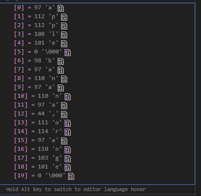

<!-- _class: lead -->

# CSCI 112<br><br>Programming with C

- Lecture 17
- Dr. Jakub L. Pach
- Fall 2025

---


---

# Outline

- Review
- Standard C Library Overview
  - ctype.h
  - string.h

---

# Review

---

# Opening and closing files

```text
Function: fopen()
Syntax:
	FILE *fopen(const char *filename, const char *mode);
Error Handling:
Always check if fopen() returned NULL, indicating failure (e.g., file not found).
Function: fclose()
Syntax:
	int fclose(*FILE);
Error Handling:
Always check if fclose() returned NULL, indicating failure (e.g., file not found).
```

- In the context of file access, the fopen() and fclose() functions serve a role analogous to curly braces {, } in defining a code block. Opening a file with fopen() is akin to entering a new scope of operations on that file, similar to how an opening curly brace signals the beginning of a new block of statements. Conversely, fclose() marks the end of this scope, closing the file and thus concluding the block, much like a closing curly brace.
- While the compiler ensures that code blocks are properly closed, it is the programmer's responsibility to ensure files are closed correctly. An unclosed file is like an unclosed curly brace - it can lead to unexpected errors and hinder further operations.

---

# const char \*filename

- The const char \*filename argument in the fopen() function can specify three types of file locations:
- File Name Only:
  - When only the file name is provided, fopen() attempts to open the file in the same directory as the currently executing program.
  - Example: fopen("data.txt", "rt") will try to open the file "data.txt" in the directory where the program is located.
- Relative Path:
  - A relative path specifies the location of the file relative to the current working directory.
  - Example: fopen("data/results.txt", "wt")\* will try to open the file "results.txt" in a subdirectory named "data" within the current working directory.
- Absolute Path:
  - An absolute path provides the complete path to the file, starting from the root directory of the file system.
  - Example: fopen("/home/user/documents/project/data.txt", "at") will open the file "data.txt" in the specified directory, regardless of the current working directory.
- \*Platform-specific path separators: The specific character used to separate directories in a path (e.g., / in Unix-like systems, \ \ in Windows) depends on the operating system.

---

# File Access Modes in C

**Access Modes:**

|Mode|Description|
|---|---|
|r|Opens an existing file for reading only.|
|w|Opens a file for writing. Creates a new file or clears the content of an existing one.|
|a|Opens a file for appending data. Creates the file if it does not already exist.|
|x|Creates the file if it does not already exist. Fails if the file already exists.|
|+|Combined with r, w, a, or x, allows both reading and writing.|

**File Types:**

|Type Modifier|Description|
|---|---|
|t|Text mode (default). Treats file as a sequence of characters.|
|b|Binary mode. Treats file as a sequence of bytes with no translation.|

<!-- najpierw on bibliotece i EOF i ile wynosi ( stala symboliczna i wartosc wynosi -1 -->

---

# Binary File I/O Functions

```text
For reading blocks of binary data.
Syntax:
int fread(void *ptr, int size, int count, FILE *stream);
For writing blocks of binary data.
Syntax:
int fwrite(const void *ptr, int size, int count, FILE *stream);
```

ptr:    Pointer to the data you want to write(read).

size:    Size, in bytes, of each element to be written(read).

count:    Number of elements to write(read), which is the third argument.

stream:    File pointer to the open file where data should be written(read).

---

# An example – Binary file

```c
#include <stdio.h>
int main(int argc, char *argv[])
{
    FILE *file;
    file =  fopen("binaryFile.bin", "wb");
    if(file)
    {
        int x = 5;
        _ =  fwrite(&x, sizeof(x), 1, file);

        char text[10] = "Some text";
        _ =  fwrite(text, sizeof(*text), 10, file);

        float fnumber = 3.14f;
        _ =  fwrite(&fnumber, sizeof(fnumber), 1, file);
        fclose(file);
    }
    else
        printf("Error");
    return 0;
}
```

**binaryFile.bin:**

```text
   Some text ĂőH@
```

**Result:**

```text
15 Some text 3.140000
```

```c
#include <stdio.h>
int main(int argc, char *argv[])
{
    FILE *file;
    file =  fopen("binaryFile.bin", "rb");
    if(file)
    {
        int x;
        _ =  fread(&x, sizeof(x), 1, file);

        char text[10];
        _ =  fread(text, sizeof(*text), 10, file);

        float fnumber;
        _ =  fread(&fnumber, sizeof(fnumber), 1, file);

        fclose(file);

        printf("%d %s %f", x, text, fnumber);
    }
    else
        printf("Error");
    return 0;
}
```

---

# fseek() function

```text
The function fseek() moves the file pointer to a specified location, allowing you to read from or write to a specific part of the file.
Syntax:
int fseek(FILE *stream, long offset, int origin);
```

stream:     A pointer to the FILE object that identifies the file.

offset:     The number of bytes to move the file pointer.

origin:     The starting position for the offset; it can be one of the following constants:

SEEK\_SET:    Start from the beginning of the file (0).

SEEK\_CUR:     Start from the current position of the file pointer (1).

SEEK\_END:     Start from the end of the file(2).

---

# ftell() and rewind() functions

```text
The function ftell() returns the current file position as a long integer. If an error occurs, it returns -1.
Syntax:
long ftell(FILE *stream);
```

- Unlike fseek() and ftell(), rewind() is simpler to use and is intended to reset the file pointer to the beginning of the file.
**Syntax:**

```c
void rewind(FILE *stream);
```

---

# 1 example – fseek()

```c
#include <stdio.h>
int main(int argc, char *argv[])
{
    FILE *file;
    file =  fopen("binaryFile.bin", "rb");
    if(file)
    {
    /* Move to the 5th byte from the beginning */
    fseek(file, 5, SEEK_SET);
    printf("Position after fseek: %ld\n", ftell(file));

    /* Move forward by 10 bytes from the current position */
    fseek(file, 10, SEEK_CUR);
    printf("Position after another fseek: %ld\n", ftell(file));

    /* Move to the end of the file */
    fseek(file, 0, SEEK_END);
    printf("Position at the end of file: %ld\n", ftell(file));
    fclose(file);
    }
    else
        printf("Error");
    return 0;
}
```

**Result:**

```text
Position after fseek: 5
Position after another fseek: 15
Position at the end of file: 18
```

---

# 2 example – fseek(), ftell()

```c
#include <stdio.h>
int main(int argc, char *argv[])
{
    FILE *file;
    file =  fopen("binaryFile.bin", "rb");
    if(file)
    {
        int x; int position;
        position = ftell(file);
        printf("The position in file = %d\n", position);
        _ =  fread(&x, sizeof(x), 1, file);
        position = ftell(file);
        printf("The position in file = %d\n", position);
        char text[10];
        _ =  fread(text, sizeof(*text), 10, file);
        position = ftell(file);
        printf("The position in file = %d\n", position);
        float fnumber;
        _ =  fread(&fnumber, sizeof(fnumber), 1, file);
        position = ftell(file);
        printf("The position in file = %d\n", position);
        printf("%d %s %f\n", x, text, fnumber);
        /* Move to the 0th byte from the beginning */
        fseek(file, 0, SEEK_SET);
        printf("Position after fseek(): %ld\n", ftell(file));
        x = 0;
        _ =  fread(&x, sizeof(x), 1, file);
        printf("%d\n", x);
        fclose(file);
    }
    else
        printf("Error");
    return 0;
}
```

**Result:**

```text
The position in file = 0
The position in file = 4
The position in file = 14
The position in file = 18
5 Some text 3.140000
Position after fseek(): 0
5
```

---

# Text File I/O Functions

```text
For reading text from file:
fgetc():	Reads a single character from a file.
fgets():	Reads a line from a file.
fscanf(): 	Reads formatted input from a file (similar to scanf()).
For writing text for file:
fputc():	Writes a single character to a file.
fputs():	Writes a string to a file.
fprintf():	Prints formatted output to a file (similar to printf()).
```

---

# Reading Text from a file

```text
int fgetc(FILE *stream)
Description:	Reads a single character from the specified file stream.
Return Type:	Returns the character read as an unsigned char cast to an int, or EOF on end of file or error.
Example: 	int ch = fgetc(file_pointer);
char *fgets(char *str, int n, FILE *stream)
Description:	Reads a line from the file and stores it in the character array str.
Return Type:	Returns str on success, or NULL on error or when end of file occurs.
Example:	 char *result = fgets(buffer, sizeof(buffer), file_pointer);
int fscanf(FILE *stream, const char *format, ...)
Description:	Reads formatted input from a file based on the format string, similar to scanf.
Return Type:	Returns the number of items successfully read, or EOF if an error or end of file occurs before any items are matched.
Example: 	int read_count = fscanf(file_pointer, "%d %f", &int_var, &float_var);
```

---

# Writing Text to a file

```text
int fputc(int char, FILE *stream)
Description:	Writes a single character to the specified file stream.
Return Type:	Returns the written character as an unsigned char cast to an int, or EOF on error.
Example: 	int result = fputc('A', file_pointer);
int fputs(const char *str, FILE *stream)
Description:	Writes a string to the file.
Return Type:	Returns a non-negative number on success, or EOF on error.
Example: 	int result = fputs("Hello, World!\n", file_pointer);
int fprintf(FILE *stream, const char *format, ...)
Description:	Writes formatted output to the specified file stream, similar to printf().
Return Type:	Returns the number of characters written, or a negative value if an error occurs.
Example: 	int chars_written = fprintf(file_pointer, "Integer: %d, Float: %f\n", int_var, float_var);
```

---

# Lists

---

# Creating and Linking Nodes

Through xPtr, we can modify x itself, for example:

The same idea applies to headPtr. Let’s create our first node:

Now let’s create a second node:

We can now **connect** our elements into a list:

```c
int x = 5;
int *xPtr = &x;   // xPtr does not create a new variable; it only points to x
```

```c
*xPtr = 2;
```

```c
Node node_1;
node_1.value = 5;          // or shorter: Node node_1 = {5, NULL};
node_1.nextPtr = NULL;     // currently, our node does not point to anything
```

```c
Node node_2 = {7, NULL};
```

```c
headPtr = &node_1;       // same idea as with &x
node_1.nextPtr = &node_2;
```

```c
typedef struct
{
    int value;
    struct Node *nextPtr;
} Node;
```

---

# Traversing the List

Now we can move through the list using the pointer headPtr and read the elements just like we did with an array. For an array, we might do:

For our list, we can do:

```c
for (int i = 0; i < n; i++)
    printf("%d\n", arr[i]);
```

```c
for (Node *current = headPtr; current != NULL; current = current->nextPtr)
    printf("%d\n", current->value);
//Node *current = headPtr;  a copy of the pointer to the first element
```

---

# What Happens in the Loop

- Let’s explain what happens here:
- We start by assigning the first element to current.
- The loop continues **as long as** current is not NULL.
- Each iteration assigns current to current-&gt;nextPtr, i.e., moves to the next element.
- The last element of the list has its nextPtr set to NULL, so when we reach it, the condition fails and the loop stops.
- We must use the **arrow operator (-&gt;)** instead of the dot (.) because we are accessing fields of a structure **through a pointer**. For example, these are equivalent:

```text
current->value
(*current).value
```

---

# Why We Use current Instead of headPtr

- *Why didn’t we use headPtr directly in the loop?*
- Because if we overwrite headPtr, we lose access to the previous elements. That’s why headPtr is usually reserved as a reference to the head of the list, used primarily for reading or accessing the start of the list.
- We use current as a temporary pointer to safely traverse the list.

---

# Stack vs Heap

- So far, we created our elements on the stack. However, later, when we learn about dynamic memory allocation using malloc() and free(), we will create lists on the heap instead of the stack so that their elements can persist even after the function that created them ends.
- The headPtr always points to the beginning of the list, so we never modify it inside the loop — otherwise, we would lose the list entirely. Instead, we use its copy (current) to move through the elements safely.

---

# Standard C Library Overview<br> (MinGW / C Standard)

---

# Standard C Library Overview

- Character Classification and Conversion (&lt;ctype.h&gt;)
- String Handling (&lt;string.h&gt;)
- Memory Handling (&lt;string.h&gt;)
- Input / Output Functions (&lt;stdio.h&gt;)
- Conversion Functions (&lt;stdlib.h&gt;)
- Math Functions (&lt;math.h&gt;)
- Utility Functions (&lt;stdlib.h&gt;)
- Diagnostics and Assertions (&lt;assert.h&gt;)
- Time and Date Functions (&lt;time.h&gt;)
- Variable Argument Lists (&lt;stdarg.h&gt;)

---

# Character Classification and Conversion

---

# 1. Character Classification and Conversion (&lt;ctype.h&gt;)

Used for testing and converting characters.

|Function|Description|Example|
|---|---|---|
|isalpha(c)|Checks if character is a letter (A–Z, a–z).|if (isalpha(c)) ...|
|isdigit(c)|Checks if character is a decimal digit.|if (isdigit(c)) ...|
|isalnum(c)|Checks if character is alphanumeric.|if (isalnum(c)) ...|
|iscntrl(c)|Checks if character is a control character.|if (iscntrl(c)) ...|
|islower(c)|Checks if character is lowercase.|if (islower(c)) ...|
|isupper(c)|Checks if character is uppercase.|if (isupper(c)) ...|
|isspace(c)|Checks for whitespace (space, tab, newline, etc.).|if (isspace(c)) ...|
|isprint(c)|Checks if character is printable.|if (isprint(c)) ...|
|ispunct(c)|Checks if character is punctuation. <br>(. , ; : ! ? ( ) \[ \] { } ‚ „ + - \* / % # @ $ &amp; = ^ ~ \| &lt; &gt;)|if (ispunct(c)) ...|
|tolower(c)|Converts uppercase to lowercase.|tolower('A') → 'a'|
|toupper(c)|Converts lowercase to uppercase.|toupper('b') → 'B'|

---

# isalpha() – Checks if the character is a letter

```text
Header: <ctype.h>
```

**Result:**

```text
A is a letter.
```

```c
#include <stdio.h>
#include <string.h>

int main(void)
{
    char c = 'A';
    if (isalpha(c)) // character is a letter (A–Z or a–z).
        printf("%c is a letter.\n", c);
    return 0;
}
```

---

# isdigit() – Checks if the character is a digit

```text
Header: <ctype.h>
```

**Result:**

```text
7 is a digit.
```

```c
#include <stdio.h>
#include <string.h>

int main(void)
{
    char c = '7';
    if (isdigit(c))
        printf("%c is a digit.\n", c);
    return 0;
}
```

---

# isalnum() – Checks if the character is alphanumeric

```text
Header: <ctype.h>
```

**Result:**

```text
x is alphanumeric.
```

```c
#include <stdio.h>
#include <string.h>

int main(void)
{
    char c = 'x';
    if (isalnum(c))
        printf("%c is alphanumeric.\n", c);
    return 0;
}
```

---

# iscntrl() – Checks if the character is a control character

```text
Header: <ctype.h>
```

**Result:**

```text
This is a control character.
```

```c
#include <stdio.h>
#include <string.h>

int main(void)
{
    char c = '\n';
    if (iscntrl(c))
        printf("This is a control character.\n");
    return 0;
}
```

- (like newline \n, tab \t, etc.).

---

# islower() – Checks if the character is lowercase (a–z)

```text
Header: <ctype.h>
```

**Result:**

```text
g is lowercase.
```

```c
#include <stdio.h>
#include <string.h>

int main(void)
{
    char c = 'g';
    if (islower(c))
        printf("%c is lowercase.\n", c);
    return 0;
}
```

---

# isupper() – Checks if the character is uppercase (A–Z)

```text
Header: <ctype.h>
```

**Result:**

```text
M is uppercase.
```

```c
#include <stdio.h>
#include <string.h>

int main(void)
{
    char c = 'M';
    if (isupper(c))
        printf("%c is uppercase.\n", c);
    return 0;
}
```

---

# isspace() – Checks if the character is a whitespace

```text
Header: <ctype.h>
```

**Result:**

```text
Whitespace detected.
```

```c
#include <stdio.h>
#include <string.h>

int main(void)
{
    char c = ' ';
    if (isspace(c))
        printf("Whitespace detected.\n");
    return 0;
}
```

- space ' ', tab \t, newline \n, etc.

---

# isprint() - Checks if the character is printable

```c
int x = 5;
char * oneByte = (char*) &x;
oneByte[1] = 97;
printf("%d %d %d %d\n",oneByte[0], oneByte[1], oneByte[2], oneByte[3] );

printf("%d\n",  isprint( oneByte[0]) );
printf("%d\n",  isprint( oneByte[1]) ); //97 = 'a'
getchar();
```

**Result:**

```text
5 97 0 0
0
2
```

- (not a control character).

---

# ispunct() – Checks if the character is a punctuation mark

```text
Header: <ctype.h>
```

**Result:**

```text
? is punctuation.
```

```c
#include <stdio.h>
#include <string.h>

int main(void)
{
    char c = '?';
    if (ispunct(c))
        printf("%c is punctuation.\n", c);
    return 0;
}
```

- (any printable symbol that’s not alphanumeric or space)

---

# tolower() – Converts a letter to lowercase (if possible)

```text
Header: <ctype.h>
```

**Result:**

```text
Lowercase: g.
```

```c
#include <stdio.h>
#include <string.h>

int main(void)
{
    char c = 'G';
    printf("Lowercase: %c\n", tolower(c));
    return 0;
}
```

---

# toupper() – Converts a letter to uppercase (if possible)

```text
Header: <ctype.h>
```

**Result:**

```text
Uppercase: M
```

```c
#include <stdio.h>
#include <string.h>

int main(void)
{
    char c = 'm';
    printf("Uppercase: %c\n", toupper(c));
    return 0;
}
```

---

# Mini practical example

```text
Header: <ctype.h>
```

**Result:**

```text
Letters: 10
Digits: 3
Spaces: 2
Punctuation: 2
```

```c
#include <stdio.h>
#include <string.h>
int main(void)
{
    char text[] = "Hello, World! 123\n";
    int letters = 0, digits = 0, spaces = 0, punctuation = 0;
    for (int i = 0; text[i] != '\0'; i++)
    {
        if (isalpha(text[i])) letters++;
        else if (isdigit(text[i])) digits++;
        else if (isspace(text[i])) spaces++;
        else if (ispunct(text[i])) punctuation++;
    }
    printf("Letters: %d\nDigits: %d\nSpaces: %d\nPunctuation: %d\n",
           letters, digits, spaces, punctuation);
    return 0;
}
```

---

# caesarCipher() + ctype.h

```c
int caesarCipher(char input_text[], int shift)
{
    if( input_text == NULL || *input_text == NULL )
        return -1;
    shift = shift % 26;  // reduce magnitude
    if(shift ==0)
        return 0;
    if (shift < 0)
        shift += 26;
    for (int i = 0; input_text[i] != '\0'; i++)
    {
        if ((input_text[i] >= 'A' && input_text[i] <= 'Z') )
        {
            input_text[i] += 32;
        }
        if(input_text[i] >= 'a' && input_text[i] <= 'z')
        {
            input_text[i] = ((input_text[i] - 'a' + shift) % 26) + 'a';
        }
    }
    return 0;
}
```

```c
int caesarCipher2(char input_text[], int shift)
{
    if( input_text == NULL || *input_text == NULL )
        return -1;
    shift = shift % 26;  // reduce magnitude
    if(shift ==0)
        return 0;
    if (shift < 0)
        shift += 26;
    for (int i = 0; input_text[i] != '\0'; i++)
    {
        if( isalpha(input_text[i]) )
        {
            input_text[i] = tolower(input_text[i]);
            input_text[i] = ((input_text[i] - 'a' + shift) % 26) + 'a';
        }
    }


    return 0;
}
```

---

# String Handling

---

# 2. String Handling (&lt;string.h&gt;)

Used for manipulating null-terminated character arrays.

|Function|Description|Example|
|---|---|---|
|strcpy(dest, src)|Copies a string.|strcpy(name, "Alice");|
|strncpy(dest, src, n)|Copies up to n characters.|strncpy(buf, input, 10);|
|strcat(dest, src)|Concatenates two strings.|strcat(full, last);|
|strncat(dest, src, n)|Concatenates up to n characters.|strncat(buf, ext, 4);|
|strcmp(a, b)|Compares two strings.|if (strcmp(a,b)==0)|
|strlen(s)|Returns string length.|len = strlen(name);|
|strchr(s, c)|Finds first occurrence of c.|p = strchr(s, 'x');|
|strrchr(s, c)|Finds last occurrence of c.|p = strrchr(s, '.');|
|strstr(hay, needle)|Finds substring.|p = strstr(text, "cat");|
|strtok(s, delim)|Splits string into tokens (destructive!).|token = strtok(str, ",");|

---

# strcpy() – copy a string

- **Header:** &lt;string.h&gt;
- Use: copies the entire string including '\0’
- Caution: No bounds checking — make sure the destination is large enough.

**Result:**

```text
Copied string: Hello, world!
```

```c
#include <stdio.h>
#include <string.h>

int main(void)
{
    char src[] = "Hello, world!";
    char dest[50];
    strcpy(dest, src);  // copy src → dest
    printf("Copied string: %s\n", dest);
    return 0;
}
```

---

# strncpy() – copy with length limit

- **Header:** &lt;string.h&gt;
- Use: safer version of strcpy(),
- You must add the null terminator manually.

**Result:**

```text
Copied safely: This is a
```

```c
#include <stdio.h>
#include <string.h>

int main(void)
{
    char src[] = "This is a long message";
    char dest[10];
    strncpy(dest, src, sizeof(dest) - 1);
    dest[sizeof(dest) - 1] = '\0';  // always terminate manually
    printf("Copied safely: %s\n", dest);
    return 0;
}
```

---

# strcmp() – compare strings

- **Header:** &lt;string.h&gt;
- **Use:** appends one string to another (requires enough space)

**Result:**

```text
Result: Hello, world!
```

```c
#include <stdio.h>
#include <string.h>

int main(void)
{
    char text[50] = "Hello";
    strcat(text, ", world!");
    printf("Result: %s\n", text);
    return 0;
}
```

---

# strcmp() – compare strings

- **Header:** &lt;string.h&gt;
- **Use:** returns 0 if equal, negative/positive if lexicographically smaller/larger.

**Result:**

```text
Passwords match!
```

```c
#include <stdio.h>
#include <string.h>

int main(void)
{
    char pass1[] = "secret";
    char pass2[] = "secret";
    if (strcmp(pass1, pass2) == 0)
        printf("Passwords match!\n");
    else
        printf("Passwords differ.\n");
    return 0;
}
```

---

# strlen() – get string length

- **Header:** &lt;string.h&gt;
- **Use:** returns the number of visible characters (not counting '\0').

**Result:**

```text
Length: 12
```

```c
#include <stdio.h>
#include <string.h>

int main(void)
{
    char text[] = "Montana Tech";
    printf("Length: %zu\n", strlen(text));  // prints 12 (no '\0')
    return 0;
}
```

---

# strchr() and strrchr() – find a character in a string

- **Header:** &lt;string.h&gt;
- strchr(str, c) → finds first occurrence
- strrchr(str, c) → finds last occurrence

**Result:**

```text
File extension: docx
```

```c
#include <stdio.h>
#include <string.h>

int main(void)
{    //Example: finding a file extension
    char filename[] = "report.final.docx";
    char *dot = strrchr(filename, '.');  // find last '.'
    if (dot != NULL)
        printf("File extension: %s\n", dot + 1);
    else
        printf("No extension found.\n");
    return 0;
}
```

---

# strstr() – find substring

- **Header:** &lt;string.h&gt;
- **Use:** returns pointer to first occurrence of substring or NULL if not found.

**Result:**

```text
Found substring: Montana Tech!
```

```c
#include <stdio.h>
#include <string.h>

int main(void)
{
    char text[] = "Welcome to Montana Tech!";
    char *found = strstr(text, "Montana");
    if (found)
        printf("Found substring: %s\n", found);
    else
        printf("Substring not found.\n");
    return 0;
}
```

---

# strtok() – split string into tokens

- **Header:** &lt;string.h&gt;
- Use: splits a string using delimiters
- Caution: modifies the original string and uses internal static memory — not thread-safe..

**Result:**

```text
Token: apple
Token: banana
Token: orange
```

```c
#include <stdio.h>
#include <string.h>

int main(void)
{
    char text[] = "apple,banana,orange";
    char *token = strtok(text, ",");  // split by comma
    while (token != NULL)
    {
        printf("Token: %s\n", token);
        token = strtok(NULL, ",");
    }
}
```



It *does* look like “magic” in procedural C, because it’s **one of the few standard library functions that stores hidden state (via a static variable)**.<br>That’s why strtok() is **convenient but also tricky**, and many developers avoid it in production code.

---

# A simplified version (conceptually) looks something like this

```c
char *strtok(char *str, const char *delim)
{
    static char *context = NULL;  // ← stores state between calls
    if (str != NULL)
        context = str;  // first call — remember the start address
    if (context == NULL)
        return NULL;    // no more text to process
    // skip delimiters
    while (*context && strchr(delim, *context))
        context++;
    if (*context == '\0')
        return NULL;
    // find end of token
    char *token_start = context;
    while (*context && !strchr(delim, *context))
        context++;
    // terminate token with null
    if (*context)
        *context++ = '\0';
    return token_start;
}
```

---

# A simplified version (conceptually) looks something like this

**What this means**

The first call:

```c
strtok(text, ",");
```

— sets context to the beginning of the text.

The following call:

```c
strtok(NULL, ",");
```

— uses the **last remembered position in context** as the new starting point.

---

# A simplified version (conceptually) looks something like this

**Limitations**

- Because context is **static**:
  - only **one tokenization sequence** can be active at a time,
  - the function is **not thread-safe**,
  - if you try to tokenize two strings at once, one will overwrite the other’s state.
- That’s why safer variants exist:
  - strtok\_r() (POSIX)
  - strtok\_s() (Microsoft) — these **don’t use static context**; instead, you pass your own context pointer.

**In summary**

- You are absolutely right — it *does* look like “magic” in procedural C, because it’s **one of the few standard library functions that stores hidden state (via a static variable)**.<br>That’s why strtok() is **convenient but also tricky**, and many developers avoid it in production code.

---

# Thank you

- Jakub Leszek Pach
- <jpach@mtech.edu>

---

# 3. Memory Handling (&lt;string.h&gt;)

Used for working with raw memory blocks.

|Function|Description|Example|
|---|---|---|
|memcpy(dest, src, n)|Copies n bytes.|memcpy(buf2, buf1, n);|
|memmove(dest, src, n)|Safe copy (handles overlap).|memmove(a, b, 5);|
|memcmp(a, b, n)|Compares n bytes.|if (memcmp(a,b,4)==0)|
|memset(ptr, val, n)|Fills memory with byte value.|memset(buf, 0, 10);|
|memchr(ptr, val, n)|Finds a byte in memory.|p = memchr(buf, 'x', 20);|

---

# 4. Input / Output Functions (&lt;stdio.h&gt;)

Work with files and streams.

|Function|Description|Example|
|---|---|---|
|fopen(name, mode)|Opens a file.|fp = fopen("data.txt","r");|
|freopen(name, mode, fp)|Reopens an existing stream.|freopen("log.txt","w",stdout);|
|fclose(fp)|Closes file.|fclose(fp);|
|fflush(fp)|Forces buffer write to file.|fflush(stdout);|
|fread(buf, size, count, fp)|Reads from file.|fread(data,1,10,fp);|
|fwrite(buf, size, count, fp)|Writes to file.|fwrite(data,1,10,fp);|
|fseek(fp, offset, origin)|Moves file position.|fseek(fp, 0, SEEK\_SET);|
|ftell(fp)|Returns current position.|pos = ftell(fp);|
|rewind(fp)|Moves position to start.|rewind(fp);|
|remove(name)|Deletes file.|remove("old.txt");|
|rename(old, new)|Renames file.|rename("a.txt","b.txt");|
|tmpfile()|Opens temporary file.|FILE \*fp = tmpfile();|
|tmpnam(buf)|Generates unique temp name.|tmpnam(name);|
|feof(fp)|Checks end-of-file.|while(!feof(fp))...|
|ferror(fp)|Checks read/write error.|if (ferror(fp))...|
|clearerr(fp)|Clears EOF/error flags.|clearerr(fp);|
|perror(msg)|Prints system error message.|perror("File open failed");|

---

# 5. Conversion Functions (&lt;stdlib.h&gt;)

Convert strings to numbers.

|Function|Description|Example|
|---|---|---|
|atoi(str)|Converts to int.|x = atoi("123");|
|atol(str)|Converts to long.|y = atol("12345");|
|atof(str)|Converts to double.|z = atof("3.14");|
|strtol(str, end, base)|String → long, supports base.|val = strtol(s, NULL, 16);|
|strtoul(str, end, base)|String → unsigned long.|val = strtoul(s, NULL, 10);|
|strtod(str, end)|String → double.|d = strtod(s, NULL);|

---

# 6. Math Functions (&lt;math.h&gt;)

Convert strings to numbers.

|Function|Description|Example|
|---|---|---|
|abs(x)|Absolute value (int).|abs(-5) → 5|
|labs(x)|Absolute (long).|labs(-100L)|
|fabs(x)|Absolute (float/double).|fabs(-3.2)|
|sqrt(x)|Square root.|sqrt(9) → 3.0|
|pow(a,b)|Exponentiation.|pow(2,3) → 8.0|
|sin(x), cos(x)|Trigonometric.|sin(3.14)|
|ceil(x), floor(x), round(x)|Rounding operations.|ceil(3.2) → 4.0|
|fmod(a,b)|Floating-point remainder.|fmod(7.5,2) → 1.5|
|hypot(x,y)|√(x²+y²).|hypot(3,4) → 5.0|

---

# 7. Utility Functions (&lt;stdlib.h&gt;)

Convert strings to numbers.

|Function|Description|Example|
|---|---|---|
|abs(x)|Absolute value (int).|abs(-5) → 5|
|labs(x)|Absolute (long).|labs(-100L)|
|fabs(x)|Absolute (float/double).|fabs(-3.2)|
|sqrt(x)|Square root.|sqrt(9) → 3.0|
|pow(a,b)|Exponentiation.|pow(2,3) → 8.0|
|sin(x), cos(x)|Trigonometric.|sin(3.14)|
|ceil(x), floor(x), round(x)|Rounding operations.|ceil(3.2) → 4.0|
|fmod(a,b)|Floating-point remainder.|fmod(7.5,2) → 1.5|
|hypot(x,y)|√(x²+y²).|hypot(3,4) → 5.0|

---

# 8. Diagnostics and Assertions (&lt;assert.h&gt;)

Useful for debugging and safety.

|Function / Macro|Description|Example|
|---|---|---|
|assert(expr)|Stops program if condition is false.|assert(ptr != NULL);|
|\_\_FILE\_\_, \_\_LINE\_\_|Preprocessor macros with file and line info.|printf("%s:%d", \_\_FILE\_\_, \_\_LINE\_\_);|

---

# 9. Time and Date Functions (&lt;time.h&gt;)

Work with clocks and timestamps.

|Function|Description|Example|
|---|---|---|
|time(NULL)|Current time (seconds since epoch).|t = time(NULL);|
|clock()|CPU time used.|clock();|
|difftime(t1,t2)|Difference in seconds.|difftime(t1,t2);|
|mktime(&amp;tm)|Converts struct tm → time\_t.|mktime(&amp;local);|
|asctime(&amp;tm)|Converts struct tm to string.|asctime(localtime(&amp;t));|
|localtime(&amp;t)|Converts to local time struct.|localtime(&amp;t);|
|ctime(&amp;t)|Converts directly to human string.|ctime(&amp;t);|
|strftime(buf, n, fmt, &amp;tm)|Formats time as text.|strftime(s, 20, "%H:%M", &amp;tm);|

---

# 10. Variable Argument Lists (&lt;stdarg.h&gt;)

For functions that accept a variable number of parameters.

|Macro|Description|Example|
|---|---|---|
|va\_start(list, last)|Initializes argument list.|va\_start(args, n);|
|va\_arg(list, type)|Retrieves next argument.|sum += va\_arg(args, int);|
|va\_end(list)|Cleans up argument list.|va\_end(args);|

---

# 1. Character Classification and Conversion (&lt;ctype.h&gt;)

Used for testing and converting characters.

|Function|Description|Example|
|---|---|---|
|isalpha(c)|Checks if character is a letter (A–Z, a–z).|if (isalpha(c)) ...|
|isdigit(c)|Checks if character is a decimal digit.|if (isdigit(c)) ...|
|isalnum(c)|Checks if character is alphanumeric.|if (isalnum(c)) ...|
|iscntrl(c)|Checks if character is a control character.|if (iscntrl(c)) ...|
|islower(c)|Checks if character is lowercase.|if (islower(c)) ...|
|isupper(c)|Checks if character is uppercase.|if (isupper(c)) ...|
|isspace(c)|Checks for whitespace (space, tab, newline, etc.).|if (isspace(c)) ...|
|isprint(c)|Checks if character is printable.|if (isprint(c)) ...|
|ispunct(c)|Checks if character is punctuation. <br>(. , ; : ! ? ( ) \[ \] { } ‚ „ + - \* / % # @ $ &amp; = ^ ~ \| &lt; &gt;)|if (ispunct(c)) ...|
|tolower(c)|Converts uppercase to lowercase.|tolower('A') → 'a'|
|toupper(c)|Converts lowercase to uppercase.|toupper('b') → 'B'|

---

# Most Common System Libraries in Windows (WinAPI)

These headers are provided with the Windows SDK and are available in compilers such as MinGW, MSVC, and others for the Windows platform.

|Library|Description|Typical Functions|
|---|---|---|
|**windows.h**|The main gateway to the Windows API – contains basic type definitions, macros, and core system functions.|CreateFile(), ReadFile(), Sleep(), MessageBox()|
|**winuser.h**|Part of the Windows API responsible for creating and managing windows, messages, and user interface elements.|CreateWindow(), ShowWindow(), GetMessage()|
|**wincon.h**|Provides access to the Windows console (terminal) and its properties.|SetConsoleTextAttribute(), GetConsoleScreenBufferInfo()|
|**processthreadsapi.h**|Manages processes and threads.|CreateProcess(), ExitProcess(), GetCurrentThreadId()|
|**synchapi.h**|Synchronization mechanisms such as mutexes, semaphores, and events.|CreateMutex(), WaitForSingleObject()|
|**fileapi.h**|Handles file and directory operations.|CreateFile(), ReadFile(), WriteFile()|
|**timeapi.h**|Provides system time and timer-related functions.|timeGetTime(), Sleep()|
|**winsock2.h**|Networking (sockets) – TCP/IP interface for Windows.|socket(), connect(), send(), recv()|
|**shellapi.h**|Integrates applications with the Windows shell (opening files, shortcuts, icons).|ShellExecute(), ExtractIcon()|
|**commdlg.h**|Provides standard dialog boxes (open/save file, color picker, font selection).|GetOpenFileName(), ChooseColor()|
