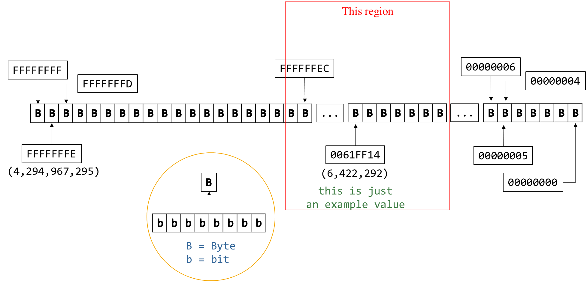

<!-- _class: lead -->

# CSCI 112<br><br>Programming with C

- Lecture 18
- Dr. Jakub L. Pach
- Fall 2025

---

# Outline

- Review
- Static Memory
- Dynamic Memory allocation
- Standard C Library Overview
  - string.h

---

# Review

---

# 1. Character Classification and Conversion (&lt;ctype.h&gt;)

Used for testing and converting characters.

|Function|Description|Example|
|---|---|---|
|isalpha(c)|Checks if character is a letter (A–Z, a–z).|if (isalpha(c)) ...|
|isdigit(c)|Checks if character is a decimal digit.|if (isdigit(c)) ...|
|isalnum(c)|Checks if character is alphanumeric.|if (isalnum(c)) ...|
|iscntrl(c)|Checks if character is a control character.|if (iscntrl(c)) ...|
|islower(c)|Checks if character is lowercase.|if (islower(c)) ...|
|isupper(c)|Checks if character is uppercase.|if (isupper(c)) ...|
|isspace(c)|Checks for whitespace (space, tab, newline, etc.).|if (isspace(c)) ...|
|isprint(c)|Checks if character is printable.|if (isprint(c)) ...|
|ispunct(c)|Checks if character is punctuation. <br>(. , ; : ! ? ( ) \[ \] { } ‚ „ + - \* / % # @ $ &amp; = ^ ~ \| &lt; &gt;)|if (ispunct(c)) ...|
|tolower(c)|Converts uppercase to lowercase.|tolower('A') → 'a'|
|toupper(c)|Converts lowercase to uppercase.|toupper('b') → 'B'|

---

# 2. String Handling (&lt;string.h&gt;)

Used for manipulating null-terminated character arrays.

|Function|Description|Example|
|---|---|---|
|strcpy(dest, src)|Copies a string.|strcpy(name, "Alice");|
|strncpy(dest, src, n)|Copies up to n characters.|strncpy(buf, input, 10);|
|strcat(dest, src)|Concatenates two strings.|strcat(full, last);|
|strncat(dest, src, n)|Concatenates up to n characters.|strncat(buf, ext, 4);|
|strcmp(a, b)|Compares two strings.|if (strcmp(a,b)==0)|
|strlen(s)|Returns string length.|len = strlen(name);|
|strchr(s, c)|Finds first occurrence of c.|p = strchr(s, 'x');|
|strrchr(s, c)|Finds last occurrence of c.|p = strrchr(s, '.');|
|strstr(hay, needle)|Finds substring.|p = strstr(text, "cat");|
|strtok(s, delim)|Splits string into tokens (destructive!).|token = strtok(str, ",");|

---

# Static Memory

---

# When we run a program

When you run a compiled program, it means that through the operating system, it is loaded into RAM, all data are already on the stack, and the stack pointer points to its top, which means that something can be further written from that point.



---

# When we run a program

- ...
- ...
- 0061FF14
- (6,422,292)

```c
#include <stdio.h>
int main()
{
  int x = 0x12345678, y = 0xAABBCCDD, z = 0x11223344;
  printf("%-4s equals %d.\n", "x", &x);
  printf("%-4s equals %d.\n", "y", &y);
  printf("%-4s equals %d.\n", "z", &z);
  return 0;
}
```

**Result:**

```text
x    equals 6422292.
y    equals 6422288.
z    equals 6422284.
```

- The compiler, when declaring a variable x of type int, reserves 4 bytes of memory, which means it decrements the stack pointer (held in the stack pointer register) by 4, then writes the contents from the least significant bit to the most significant bit starting from that address.
- It then proceeds similarly with the next variable y of type int,
- and analogously with the variable z.

|B|B|B|B|B|B|B|B|B|B|B|B|B|B|B|B|B|B|B|B|
|---|---|---|---|---|---|---|---|---|---|---|---|---|---|---|---|---|---|---|---|

- 0061FF18

```text
(Stack Pointer)
```

---

# When we run a program

- ...
- ...
- 0061FF14
- (6,422,292)

```c
#include <stdio.h>
int main()
{
  int x = 0x12345678, y = 0xAABBCCDD, z = 0x11223344;
  printf("%-4s equals %d.\n", "x", &x);
  printf("%-4s equals %d.\n", "y", &y);
  printf("%-4s equals %d.\n", "z", &z);
  return 0;
}
```

**Result:**

```text
x    equals 6422292.
y    equals 6422288.
z    equals 6422284.
```

- 0061FF10
- (6,422,288)
- The compiler, when declaring a variable x of type int, reserves 4 bytes of memory, which means it decrements the stack pointer (held in the stack pointer register) by 4, then writes the contents from the least significant bit to the most significant bit starting from that address.
- It then proceeds similarly with the next variable y of type int,
- and analogously with the variable z.

|B|B|B|B|B|B|B|B|B|B|B|B|B|B|B|B|B|B|B|B|
|---|---|---|---|---|---|---|---|---|---|---|---|---|---|---|---|---|---|---|---|

- 0061FF14

```text
(Stack Pointer)
```

---

# When we run a program

- ...
- ...
- 0061FF14
- (6,422,292)

```c
#include <stdio.h>
int main()
{
  int x = 0x12345678, y = 0xAABBCCDD, z = 0x11223344;
  printf("%-4s equals %d.\n", "x", &x);
  printf("%-4s equals %d.\n", "y", &y);
  printf("%-4s equals %d.\n", "z", &z);
  return 0;
}
```

**Result:**

```text
x    equals 6422292.
y    equals 6422288.
z    equals 6422284.
```

- 0061FF0C
- (6,422,284)
- The compiler, when declaring a variable x of type int, reserves 4 bytes of memory, which means it decrements the stack pointer (held in the stack pointer register) by 4, then writes the contents from the least significant bit to the most significant bit starting from that address.
- It then proceeds similarly with the next variable y of type int,
- and analogously with the variable z.

|B|B|B|B|B|B|B|B|B|B|B|B|B|B|B|B|B|B|B|B|
|---|---|---|---|---|---|---|---|---|---|---|---|---|---|---|---|---|---|---|---|

- 0061FF10

```text
(Stack Pointer)
```

- 0061FF18

---

# When we run a program

- ...
- ...
- 0061FF14
- (6,422,292)

```c
#include <stdio.h>
int main()
{
  int x = 0x12345678, y = 0xAABBCCDD, z = 0x11223344;
  printf("%-4s equals %d.\n", "x", &x);
  printf("%-4s equals %d.\n", "y", &y);
  printf("%-4s equals %d.\n", "z", &z);
  return 0;
}
```

**Result:**

```text
x    equals 6422292.
y    equals 6422288.
z    equals 6422284.
```

- 0061FF10
- (6,422,288)
- 0061FF0C
- (6,422,284)
- The compiler, when declaring a variable x of type int, reserves 4 bytes of memory, which means it decrements the stack pointer (held in the stack pointer register) by 4, then writes the contents from the least significant bit to the most significant bit starting from that address.
- It then proceeds similarly with the next variable y of type int,
- and analogously with the variable z.

|B|B|B|B|B|B|B|B|B|B|B|B|B|B|B|B|B|B|B|B|
|---|---|---|---|---|---|---|---|---|---|---|---|---|---|---|---|---|---|---|---|

- 0061FF10

```text
(Stack Pointer)
```

- 0061FF18

---

# Take a closer look at this fragment of memory...

- ...
- ...
- 0061FF14
- (6,422,292)

```c
#include <stdio.h>
int main()
{
  int x = 0x12345678, y = 0xAABBCCDD, z = 0x11223344;
  printf("%-4s equals %d.\n", "x", &x);
  printf("%-4s equals %d.\n", "y", &y);
  printf("%-4s equals %d.\n", "z", &z);
  return 0;
}
```

**Result:**

```text
x    equals 6422292.
y    equals 6422288.
z    equals 6422284.
```

- 0061FF10
- (6,422,288)
- 0061FF0C
- (6,422,284)

|B|B|B|B|B|B|B|B|B|B|B|B|B|B|B|B|B|B|B|B|
|---|---|---|---|---|---|---|---|---|---|---|---|---|---|---|---|---|---|---|---|

- 0061FF10

```text
(Stack Pointer)
```

- 0061FF18
- The compiler, when declaring a variable x of type int, reserves 4 bytes of memory, which means it decrements the stack pointer (held in the stack pointer register) by 4, then writes the contents from the least significant bit to the most significant bit starting from that address.
- It then proceeds similarly with the next variable y of type int,
- and analogously with the variable z.

---

# Take a closer look at this fragment of memory...

- ...
- 0061FF14
- (6,422,292)

```c
#include <stdio.h>
int main()
{
  int x = 0x12345678, y = 0xAABBCCDD, z = 0x11223344;
  printf("%-4s equals %d.\n", "x", &x);
  printf("%-4s equals %d.\n", "y", &y);
  printf("%-4s equals %d.\n", "z", &z);
  return 0;
}
```

**Result:**

```text
x    equals 6422292.
y    equals 6422288.
z    equals 6422284.
```

- 0061FF10
- (6,422,288)
- 0061FF0C
- (6,422,284)

|B|B|B|B|B|B|B|B|B|B|B|B|B|B|B|B|B|B|B|B|
|---|---|---|---|---|---|---|---|---|---|---|---|---|---|---|---|---|---|---|---|

- 0061FF10

```text
(Stack Pointer)
```

- 0061FF18

|Address|Value|
|---|---|
|0061FF18|...|
|0061FF17|0x12|
|0061FF16|0x34|
|0061FF15|0x56|
|0061FF14|0x78|
|0061FF13|0xAA|
|0061FF12|0xBB|
|0061FF11|0xCC|
|0061FF10|0xDD|
|0061FF0F|0x11|
|0061FF0E|0x22|
|0061FF0D|0x33|
|0061FF0C|0x44|
|0061FF0B|...|

- SP

---

# Take a closer look at this fragment of memory...

```c
int main()
{  int x = 0x12345678, y = 0xAABBCCDD, z = 0x11223344; return 0;}
```

|Address|Value|
|---|---|
|0061FF18|...|
|0061FF17|0x12|
|0061FF16|0x34|
|0061FF15|0x56|
|0061FF14|0x78|
|0061FF13|0xAA|
|0061FF12|0xBB|
|0061FF11|0xCC|
|0061FF10|0xDD|
|0061FF0F|0x11|
|0061FF0E|0x22|
|0061FF0D|0x33|
|0061FF0C|0x44|
|0061FF0B|...|

- SP

Data storage in RAM in Windows systems follows the little-endian standard, which means we start counting bits from the least significant bit, i.e., from the 2^0, and at the lowest memory address after reserving space, we write the successive bytes of our multi-byte variable, array, etc.

---

# Dynamic memory allocation

---

<!-- _class: fit-90 -->

# Introduction to dynamic memory allocation

- The operating system allocates a specific amount of memory to a program, loads it into RAM, and initiates it. This allocated memory size is fixed and relatively small. To overcome this limitation, dynamic memory allocation was introduced, which we refer to as the heap. This means that during the execution of the program (as opposed to when it is loaded and launched), additional RAM segments can be allocated in collaboration with the operating system, according to the program’s needs and within the available physical memory limits.
- In contrast to the program code placed on the stack—which can simply be cleared by adjusting the stack pointer after program execution, preventing memory leaks—dynamically allocated memory requires the program (or programmer) to manually release every byte requested from the operating system. If not freed by the program, these bytes remain locked and unusable until the operating system is restarted, a condition known as a memory leak. This is a common problem. While dynamic memory allocation offers extensive capabilities, it also introduces significant challenges. Many modern applications are developed without a deep understanding of this mechanism, leading to increasing memory usage over time. As memory leaks accumulate, RAM utilization grows until, eventually, the system runs out of memory and the user has to reboot.
- In theory, the heap is located below the stack, but in practice, the operating system can allocate any free block of RAM.

```text
local variables,
arguments
```

- free space
- heap data

```text
static variables,
code
```

- stack
- heap
- static

```text
high memory addresses
```

```text
low memory addresses
```

---

# malloc() &amp; free() – Allocating/Deallocating a block of memory

- To use dynamic memory allocation functions like malloc, you need to include the stdlib.h library.
- Malloc and free are always used together.
- The malloc function does not initialize the values of the allocated memory block; the values remain as they were previously in that memory area.

```c
#include <stdio.h>
#include <stdlib.h>

int main()
{

    int stackVariable = 5; // Declare a variable on the stack
    printf("Address of stackVariable: %p\n", &stackVariable);

    // Allocate memory on the heap for an integer
    int *heapValue = (int*) malloc( sizeof(int) * 1  );  // Size multiplied by the number of elements
    //Since the malloc function returns a void pointer,
    //it is recommended to explicitly cast it to the desired type, such as int*, to avoid ambiguity.

    if (heapValue)      //(heapValue != NULL)
    {
        *heapValue = 5; // Assign a value to the allocated memory
        printf("Address of heapValue: %p\n", heapValue);
        printf("The value of dynamicVariable is = %d\n", *heapValue);

        free(heapValue); // Deallocate the memory - so important!
    }
    else
        printf("Memory allocation failed!\n");
    return 0;
}
```

**Result:**

```text
Address of stackVariable: 0062ff14
Address of heapValue: 00c41808
The value of dynamicVariable is = 5
```

- Malloc expects only one argument, the number of bytes to be allocated.

---

# malloc() &amp; free() - Allocating/Deallocating a block of memory

```c
#include <stdio.h>
#include <stdlib.h>

int main()
{

    int stackVariable = 5;
    printf("Address of stackVariable: %p\n", &stackVariable);

    int *heapValue = (int*) malloc( sizeof(int) * 1  );
	// Size multiplied by the number of elements
    if (heapValue)
    {
        *heapValue = 5;
        printf("Address of heapValue: %p\n", heapValue);
        printf("The value of dynamicVariable is = %d\n", *heapValue);

        free(heapValue);
    }
    else
        printf("Memory allocation failed!\n");
    return 0;
}
```

**Result:**

```text
Address of stackVariable: 0062ff14
Address of heapValue: 00c41808
The value of dynamicVariable is = 5
```

```c
#include <stdio.h>
#include <stdlib.h>

int main()
{

    int stackVariable = 5;
    printf("Address of stackVariable: %p\n", &stackVariable);

    int *heapValue = (int*) malloc( 4 );
	// Size multiplied by the number of elements
    if (heapValue)
    {
        *heapValue = 5;
        printf("Address of heapValue: %p\n", heapValue);
        printf("The value of dynamicVariable is = %d\n", *heapValue);

        free(heapValue);
    }
    else
        printf("Memory allocation failed!\n");
    return 0;
}
```

---

# A repetition

|B|B|B|B|B|B|B|B|B|B|B|B|B|B|B|B|B|B|B|B|
|---|---|---|---|---|---|---|---|---|---|---|---|---|---|---|---|---|---|---|---|

- FFFFFFFF
- FFFFFFFD
- ...
- FFFFFFEC

|B|B|B|B|B|B|B|
|---|---|---|---|---|---|---|

- 00000006
- 0061FF14
- (6,422,292)
- FFFFFFFE

```text
(4,294,967,295)
```

- ...

|B|B|B|B|B|B|B|
|---|---|---|---|---|---|---|

- 00000005
- 00000004
- 00000000

|b|b|b|b|b|b|b|b|
|---|---|---|---|---|---|---|---|

- B

```text
B = Byte
b = bit
```

- This region

```text
this is just
an example value
```

---

# Memory

|B|B|B|B|B|B|B|
|---|---|---|---|---|---|---|

- FFFFFFFF
- ...

|B|B|B|B|B|B|B|
|---|---|---|---|---|---|---|

- 00000006
- 0062FF14
- (6,422,292)
- FFFFFFFE

```text
(4,294,967,295)
```

- ...

|B|B|B|B|B|B|B|
|---|---|---|---|---|---|---|

- 00000005
- 00000004
- 00000000
- stackVariable
- ...

|B|B|B|B|B|B|B|
|---|---|---|---|---|---|---|

- Stack
- Heap
- 00B81808
- (12, 064,776)
- heapValue

<!-- 0061FF14 =  06422292
00B81808 = 12064776 -->

---

<!-- _class: fit-90 -->

# malloc() – An array

- Malloc does not require static values for allocation.
- Malloc expects only one argument, the number of bytes to be allocated.

```c
#include <stdio.h>
#include <stdlib.h>

int main()
{
    const int n = 3;
    int m = 3;
    int stackArray[n];

    printf("Address of stackArray[0]:\t %.8d\n", &stackArray[0]);
    printf("Address of stackArray[1]:\t %.8d\n", &stackArray[1]);
    printf("Address of stackArray[2]:\t %.8d\n\n", &stackArray[2]);

    int *heapArray = (int*) malloc( sizeof(int) * m  );

    if (heapArray)
    {
        printf("Address of heapArray[0]:\t %.8d\n", &heapArray[0]);
        printf("Address of heapArray[1]:\t %.8d\n", &heapArray[1]);
        printf("Address of heapArray[2]:\t %.8d\n\n", &heapArray[2]);

        free(heapArray); // so important!
    }
    else
        printf("Memory allocation failed!\n");
    return 0;
}
```

**Result:**

```text
Address of stackArray[0]:        06487768
Address of stackArray[1]:        06487772
Address of stackArray[2]:        06487776

Address of heapArray[0]:         06559344
Address of heapArray[1]:         06559348
Address of heapArray[2]:         06559352
```

---

<!-- _class: fit-90 -->

# Summary

When a process is allocated memory for itself, it is copied into RAM, and the stack is placed at the end of this allocated block. Dynamic memory—the heap—is located "outside" of this process's memory space. The operating system assigns an additional block of memory for malloc(), which is why addresses in the heap can be larger than those within the process's memory.

When a program that utilizes dynamically allocated memory crashes and fails to deallocate the memory it has requested, this memory may remain inaccessible until the system is rebooted. While operating systems have mechanisms in place to reclaim such memory, these mechanisms vary significantly between different systems. This phenomenon, where memory is unintentionally retained by a program, is known as a memory leak.

---

<!-- _class: fit-90 -->

# calloc()

- calloc() is similar to malloc() but additionally initializes the allocated memory to zero.
- calloc() is slower than malloc() due to this extra operation. However, calloc() is more efficient when you need an array filled with zeros.
- Both malloc() and calloc() use the free function to deallocate memory.

```c
#include <stdio.h>
#include <stdlib.h>

int main()
{
    int n = 3;
    int *heapArray1 = (int*) calloc( n, sizeof(int)   );
    int *heapArray2 = (int*) malloc( sizeof(int) * n  );

    if (heapArray1)
    {
        printf("The value of heapArray1[0]:\t %.8d\n", heapArray1[0]);
        printf("The value of heapArray1[1]:\t %.8d\n", heapArray1[1]);
        printf("The value of heapArray1[2]:\t %.8d\n\n", heapArray1[2]);
        free(heapArray1); // so important!
    }
    if (heapArray2)
    {
        printf("The value of heapArray2[0]:\t %.8d\n", heapArray2[0]);
        printf("The value of heapArray2[1]:\t %.8d\n", heapArray2[1]);
        printf("The value of heapArray2[2]:\t %.8d\n\n", heapArray2[2]);

        free(heapArray2); // so important!
    }
    return 0;
}
```

**Result:**

```text
The value of heapArray1[0]:      00000000
The value of heapArray1[1]:      00000000
The value of heapArray1[2]:      00000000

The value of heapArray2[0]:      -1163005939
The value of heapArray2[1]:      -1163005939
The value of heapArray2[2]:      -1163005939
```

---

# realloc()

```text
Data loss: When reducing the size of a block, data located outside the new, smaller block will be lost.
Data movement: realloc() may move the entire memory block to a new location, so always update the pointer.
Freeing memory: If realloc() is successful, the original block will be automatically freed.
void *realloc(void *ptr, size_t new_size);
```

```c
#include <stdio.h>
#include <stdlib.h>

int main()
{
    int n = 10;

    int *heapArray1 = (int*)malloc(n * sizeof(int));
    // ...
    // After some time, we want to reduce the size of the array to 5 elements
    int *newHeapArray1 = (int*)realloc(heapArray1, 5 * sizeof(int));
    if (newHeapArray1 == NULL)
    {
        printf("Handle error: allocation failed\n");
        free(heapArray1);
    }
    else
    {
        printf("Successful allocation, update the pointer\n");
        heapArray1 = newHeapArray1;
    }
    //...

    if(heapArray1)
        free(heapArray1);

    getchar();
    return 0;
}
```

**Result:**

```text
Successful allocation, update the pointer
```

What does realloc() return?

- **Success:** It returns a pointer to the new (or resized) block of memory. This may be the same pointer as ptr if the enlargement operation was possible without moving the data.
- **Failure:** It returns NULL if the new memory block could not be allocated. In this case, the original block remains unchanged."

---

<!-- _class: fit-90 -->

# Summary

When a process is allocated memory for itself, it is copied into RAM, and the stack is placed at the end of this allocated block. Dynamic memory—the heap—is located "outside" of this process's memory space. The operating system assigns an additional block of memory for malloc, which is why addresses in the heap can be larger than those within the process's memory.

When a program that utilizes dynamically allocated memory crashes and fails to deallocate the memory it has requested, this memory may remain inaccessible until the system is rebooted. While operating systems have mechanisms in place to reclaim such memory, these mechanisms vary significantly between different systems. This phenomenon, where memory is unintentionally retained by a program, is known as a memory leak.

---

<!-- _class: fit-70 -->

# Memory fragmentation

Memory fragmentation is a problem that can occur when memory is repeatedly allocated and deallocated using functions like malloc and free. Imagine RAM memory as a long tape, on which pieces of memory are allocated. Over time, as we free some pieces, empty spaces are created between the occupied fragments. These free spaces may be too small to accommodate new, larger memory blocks, even if the total amount of free memory is sufficient. This phenomenon is called fragmentation.

**Types of fragmentation:**

- External fragmentation:
  - Occurs when there are free spaces between occupied memory blocks that are too small to satisfy new allocation requests.
- Internal fragmentation:
  - Occurs when an allocated memory block is larger than actually needed, leading to wasted memory.

---

<!-- _class: fit-80 -->

# Consequences of fragmentation

- Memory leaks:
  - If memory is not managed carefully, fragmentation can lead to memory leaks, which is a situation where a program no longer frees unnecessary memory, which over time can lead to application crashes.
- Performance degradation:
  - Fragmentation can slow down program execution, as the operating system has to search longer for suitable free memory blocks.
- Limited available memory:
  - Even if there is a lot of free memory, fragmentation can prevent the allocation of larger blocks, which can lead to program errors.

---

# Summary

- Memory fragmentation is a serious problem that can negatively impact the performance and stability of programs. Understanding the causes of fragmentation and applying appropriate memory management techniques is key to creating efficient applications.
- To counteract the problem of memory fragmentation, a good programming practice is to use realloc() instead of malloc() or alloc() when working with the same data and needing to change its size.

---

# Standard C Library Overview<br> (MinGW / C Standard)

---

<!-- _class: fit-80 -->

# Standard C Library Overview

- Character Classification and Conversion (&lt;ctype.h&gt;)
- String Handling (&lt;string.h&gt;)
- Memory Handling (&lt;string.h&gt;)
- Input / Output Functions (&lt;stdio.h&gt;)
- Conversion Functions (&lt;stdlib.h&gt;)
- Math Functions (&lt;math.h&gt;)
- Utility Functions (&lt;stdlib.h&gt;)
- Diagnostics and Assertions (&lt;assert.h&gt;)
- Time and Date Functions (&lt;time.h&gt;)
- Variable Argument Lists (&lt;stdarg.h&gt;)

---

# Memory Handling

---

# 3. Memory Handling (&lt;string.h&gt;)

Used for working with raw memory blocks.

|Function|Description|Example|
|---|---|---|
|memcpy(dest, src, n)|Copies n bytes.|memcpy(buf2, buf1, n);|
|memmove(dest, src, n)|Safe copy (handles overlap).|memmove(a, b, 5);|
|memcmp(a, b, n)|Compares n bytes.|if (memcmp(a,b,4)==0)|
|memset(ptr, val, n)|Fills memory with byte value.|memset(buf, 0, 10);|
|memchr(ptr, val, n)|Finds a byte in memory.|p = memchr(buf, 'x', 20);|

---

# memcpy()– Copies n bytes from source to destination.

```text
Header: <string.h>
```

**Result:**

```text
Copied array: 1 2 4 5
```

```c
#include <stdio.h>
#include <string.h>

int main(void)
{
    int src[10] = {1,2,4,5};
    int dest[20];
    memcpy(dest, src, sizeof(*src)*4  );  // +1 for '\0'
    printf("Copied array: ");
    for (int i = 0; i < 4; i++)
            printf("%d ", dest[i]);
    printf("\n");
    return 0;
}
```

- **Danger:** The source and destination **must not overlap** — otherwise, behavior is undefined.

---

<!-- _class: fit-70 -->

# memcpy()– Copies n bytes from source to destination.

- **Header:** &lt;string.h&gt;
- **Danger:** The source and destination **must not overlap** — otherwise, behavior is undefined.

**Result:**

```text
Copied text: Hello, world!
```

```c
#include <stdio.h>
#include <string.h>

int main(void)
{
    char src[] = "Hello, world!";
    char dest[20];
    memcpy(dest, src, strlen(src) + 1);  // +1 for '\0'
    printf("Copied text: %s\n", dest);
    return 0;
}
```

- memcpy(destination, source, n)

---

<!-- _class: fit-70 -->

# memmove()– Copies n bytes from source to destination, but safe!

- **Header:** &lt;string.h&gt;
- Like memcpy, but **safe for overlapping regions**. It first copies data to a temporary buffer, ensuring correctness.

**Result:**

```text
After memmove: ABABC
```

```c
#include <stdio.h>
#include <string.h>

int main(void)
{
    char text[] = "ABCDE";
    // Overlapping copy (moves the first 3 chars two positions right)
    memmove(text + 2, text, 3);
    printf("After memmove: %s\n", text);
    return 0;
}
```

- memmove(destination, source, n)

---

<!-- _class: fit-40 -->

# memcmp()– Compares two memory blocks byte by byte.

Compares two memory blocks byte by byte.<br>Returns:

- 0 if equal
- &lt; 0 if the first differing byte in ptr1 is smaller
- &gt; 0 if the first differing byte in ptr1 is larger

**Result:**

```text
memcmp result: 1
```

```c
#include <stdio.h>
#include <string.h>

int main(void)
{
    int a[] = {21, 2};
    int b[] = {21, 1};
    int result = memcmp(a, b, 8);  // Compare first 8 bytes
    printf("memcmp result: %d\n", result);
    return 0;
}
```

- memcmp(ptr1, ptr2, n)

```text
Header: <string.h>
```

---

<!-- _class: fit-40 -->

# memcmp()– Compares two memory blocks byte by byte.

Compares two memory blocks byte by byte.<br>Returns:

- 0 if equal
- &lt; 0 if the first differing byte in ptr1 is smaller
- &gt; 0 if the first differing byte in ptr1 is larger

**Result:**

```text
memcmp result: -1
```

```c
#include <stdio.h>
#include <string.h>

int main(void)
{
    char a[] = "apple";
    char b[] = "apricot";
    int result = memcmp(a, b, 3);  // Compare first 3 bytes
    printf("memcmp result: %d\n", result);
    return 0;
}
```

- memcmp(ptr1, ptr2, n)

```text
Header: <string.h>
```

---

# memset()– Fills a memory block with a specific byte value.

Typically used for initializing arrays or structs.

**Result:**

```text
----------
```

```c
#include <stdio.h>
#include <string.h>

int main(void)
{
    char buffer[10];
    memset(buffer, '-', sizeof(buffer));  // Fill with '-'
    for (int i = 0; i < 10; i++)
        printf("%c", buffer[i]);
    printf("\n");
    return 0;
}
```

- memset(ptr, value, n)

```text
Header: <string.h>
```

---

# memset()– Fills a memory block with a specific byte value.

Typically used for initializing arrays or structs.

**Result:**

```text
0 0 0 0 0 0 0 0 0 0
```

```c
#include <stdio.h>
#include <string.h>

int main(void)
{
    int buffer[10];
    memset(buffer, 0, sizeof(buffer));  // Fill with 0
    for (int i = 0; i < 10; i++)
        printf("%d ", buffer[i]);
    printf("\n");
    return 0;
}
```

- memset(ptr, value, n)

```text
Header: <string.h>
```

---

# memchr()– Searches for the first occurrence of a byte value in the first n bytes of memory.

Returns a pointer to the found byte or NULL if not found.

**Result:**

```text
Found 'w' at position: 6
```

```c
#include <stdio.h>
#include <string.h>

int main(void)
{
    char data[] = "Hello world";
    char *found = memchr(data, 'w', strlen(data));
    if (found)
        printf("Found 'w' at position: %ld\n", found - data);
    else
        printf("'w' not found.\n");
    return 0;
}
```

- memchr(ptr, value, n)

```text
Header: <string.h>
```

---

# Thank you

- Jakub Leszek Pach
- <jpach@mtech.edu>
