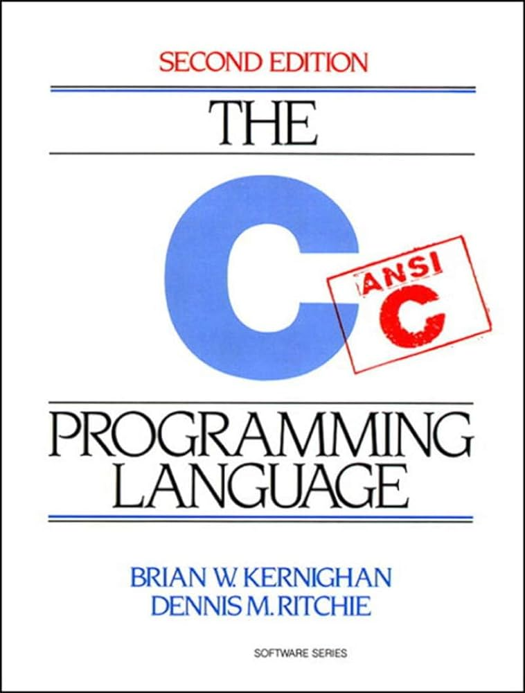
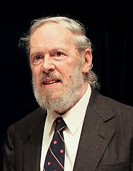

- Memset() mozna laczyc z malloc zamiast calloc
- Czy mozna uzyc bezporsrednio realloc na wskazniku wczesniej stworzonej pamieci dynamicznej za pomoca (malloc)
- Memory leaks

<!-- Zielone zrobione, czerwone na nastepne zajecia -->

---

<!-- _class: lead -->

# CSCI 112<br><br>Programming with C

- Lecture 20
- Dr. Jakub L. Pach
- Fall 2025

---


---

# Outline

- Review
- Standard C Library Overview
  - stdlib.h
  - math.h

---

# Review

---

# 1. Character Classification and Conversion (&lt;ctype.h&gt;)

Used for testing and converting characters.

|Function|Description|Example|
|---|---|---|
|isalpha(c)|Checks if character is a letter (A–Z, a–z).|if (isalpha(c)) ...|
|isdigit(c)|Checks if character is a decimal digit.|if (isdigit(c)) ...|
|isalnum(c)|Checks if character is alphanumeric.|if (isalnum(c)) ...|
|iscntrl(c)|Checks if character is a control character.|if (iscntrl(c)) ...|
|islower(c)|Checks if character is lowercase.|if (islower(c)) ...|
|isupper(c)|Checks if character is uppercase.|if (isupper(c)) ...|
|isspace(c)|Checks for whitespace (space, tab, newline, etc.).|if (isspace(c)) ...|
|isprint(c)|Checks if character is printable.|if (isprint(c)) ...|
|ispunct(c)|Checks if character is punctuation. <br>(. , ; : ! ? ( ) \[ \] { } ‚ „ + - \* / % # @ $ &amp; = ^ ~ \| &lt; &gt;)|if (ispunct(c)) ...|
|tolower(c)|Converts uppercase to lowercase.|tolower('A') → 'a'|
|toupper(c)|Converts lowercase to uppercase.|toupper('b') → 'B'|

---

# 2. String Handling (&lt;string.h&gt;)

Used for manipulating null-terminated character arrays.

|Function|Description|Example|
|---|---|---|
|strcpy(dest, src)|Copies a string.|strcpy(name, "Alice");|
|strncpy(dest, src, n)|Copies up to n characters.|strncpy(buf, input, 10);|
|strcat(dest, src)|Concatenates two strings.|strcat(full, last);|
|strncat(dest, src, n)|Concatenates up to n characters.|strncat(buf, ext, 4);|
|strcmp(a, b)|Compares two strings.|if (strcmp(a,b)==0)|
|strlen(s)|Returns string length.|len = strlen(name);|
|strchr(s, c)|Finds first occurrence of c.|p = strchr(s, 'x');|
|strrchr(s, c)|Finds last occurrence of c.|p = strrchr(s, '.');|
|strstr(hay, needle)|Finds substring.|p = strstr(text, "cat");|
|strtok(s, delim)|Splits string into tokens (destructive!).|token = strtok(str, ",");|

---

# 3. Memory Handling (&lt;string.h&gt;)

Used for working with raw memory blocks.

|Function|Description|Example|
|---|---|---|
|memcpy(dest, src, n)|Copies n bytes.|memcpy(buf2, buf1, n);|
|memmove(dest, src, n)|Safe copy (handles overlap).|memmove(a, b, 5);|
|memcmp(a, b, n)|Compares n bytes.|if (memcmp(a,b,4)==0)|
|memset(ptr, val, n)|Fills memory with byte value.|memset(buf, 0, 10);|
|memchr(ptr, val, n)|Finds a byte in memory.|p = memchr(buf, 'x', 20);|

---

# 4. Input / Output Functions (&lt;stdio.h&gt;)

Work with files and streams.

|Function|Description|Example|
|---|---|---|
|fopen(name, mode)|Opens a file.|fp = fopen("data.txt","r");|
|freopen(name, mode, fp)|Reopens an existing stream.|freopen("log.txt","w",stdout);|
|fclose(fp)|Closes file.|fclose(fp);|
|fflush(fp)|Forces buffer write to file.|fflush(stdout);|
|fread(buf, size, count, fp)|Reads from file.|fread(data,1,10,fp);|
|fwrite(buf, size, count, fp)|Writes to file.|fwrite(data,1,10,fp);|
|fseek(fp, offset, origin)|Moves file position.|fseek(fp, 0, SEEK\_SET);|
|ftell(fp)|Returns current position.|pos = ftell(fp);|
|rewind(fp)|Moves position to start.|rewind(fp);|
|remove(name)|Deletes file.|remove("old.txt");|
|rename(old, new)|Renames file.|rename("a.txt","b.txt");|
|tmpfile()|Opens temporary file.|FILE \*fp = tmpfile();|
|tmpnam(buf)|Generates unique temp name.|tmpnam(name);|
|feof(fp)|Checks end-of-file.|while(!feof(fp))...|
|ferror(fp)|Checks read/write error.|if (ferror(fp))...|
|clearerr(fp)|Clears EOF/error flags.|clearerr(fp);|
|perror(msg)|Prints system error message.|perror("File open failed");|

---

# Standard C Library Overview

- Character Classification and Conversion (&lt;ctype.h&gt;)
- String Handling (&lt;string.h&gt;)
- Memory Handling (&lt;string.h&gt;)
- Input / Output Functions (&lt;stdio.h&gt;)
- Conversion Functions (&lt;stdlib.h&gt;)
- Math Functions (&lt;math.h&gt;)
- Utility Functions (&lt;stdlib.h&gt;)
- Diagnostics and Assertions (&lt;assert.h&gt;)
- Time and Date Functions (&lt;time.h&gt;)
- Variable Argument Lists (&lt;stdarg.h&gt;)

---

# Standard C Library Overview<br> (MinGW / C Standard)

---

# 5. Conversion Functions (&lt;stdlib.h&gt;)

Convert strings to numbers.

|Function|Description|Example|
|---|---|---|
|atoi(str)|Converts to int.|x = atoi("123");|
|atol(str)|Converts to long.|y = atol("12345");|
|atof(str)|Converts to double.|z = atof("3.14");|
|strtol(str, end, base)|String → long, supports base.|val = strtol(s, NULL, 16);|
|strtoul(str, end, base)|String → unsigned long.|val = strtoul(s, NULL, 10);|
|strtod(str, end)|String → double.|d = strtod(s, NULL);|

---

# Conversion Functions

---

# atoi() – Convert string to int

- **Use case:** Reading an integer from user input or command-line argument.

```c
#include <stdio.h>
#include <string.h>

int main()
{
    char input[] = "42";
    int age = atoi(input);
    if (age > 0)
        printf("You entered age: %d\n", age);
    else
        printf("Invalid number.\n");
    return 0;
}
```

- atoi(char\*)

```text
Header: <stdlib.h>
```

**Result:**

```text
You entered age: 42
```

---

# atol() – Convert string to long

- **Use case:** Converting numeric strings representing file sizes or IDs that may exceed int range.

```c
#include <stdio.h>
#include <string.h>

int main()
{
    char file_size_str[] = "1048576";  // 1 MB in bytes
    long file_size = atol(file_size_str);


    printf("File size: %ld bytes\n", file_size);
    return 0;
}
```

- atol(char\*)

```text
Header: <stdlib.h>
```

**Result:**

```text
File size: 1048576 bytes
```

---

# atof() – Convert string to double

- **Use case:** Reading floating-point values such as temperature, weight, or price from text.

```c
#include <stdio.h>
#include <string.h>

int main()
{
    char temperature_str[] = "36.6";
    double temperature = atof(temperature_str);


    printf("Body temperature: %.1f°C\n", temperature);
    return 0;
}
```

- atof(char\*)

```text
Header: <stdlib.h>
```

**Result:**

```text
Body temperature: 36.6°C
```

---

# strtol() – Convert string to long (with base and error checking)

- **Use case:** Converting hexadecimal, octal, or binary strings into numbers, with validation.

```c
#include <stdio.h>
#include <string.h>

int main()
{
    char hex_str[] = "1A3F";
    char *endptr;
    long number = strtol(hex_str, &endptr, 16);  // base 16 (hex)
    if (*endptr == '\0')
        printf("Hex %s = %ld in decimal\n", hex_str, number);
    else
        printf("Invalid character found: %s\n", endptr);
    return 0;
}
```

- strtol(char\*)

```text
Header: <stdlib.h>
```

**Result:**

```text
Hex 1A3F = 6719 in decimal
```

---

# strtoul() – Convert string to unsigned long

- **Use case:** Safely parsing large positive numbers such as IDs or counters.

```c
#include <stdio.h>
#include <string.h>

int main()
{
    char id_str[] = "4294967295";  // Max 32-bit unsigned value
    char *endptr;
    unsigned long id = strtoul(id_str, &endptr, 10);
    if (*endptr == '\0')
        printf("Parsed ID: %lu\n", id);
    else
        printf("Invalid input: %s\n", endptr);
    return 0;
}
```

- strtoul(char\*)

```text
Header: <stdlib.h>
```

**Result:**

```text
Parsed ID: 4294967295
```

---

# strtod() – Convert string to double (with error checking)

- **Use case:** Parsing decimal values that may contain additional characters (like currency symbols or units).

```c
#include <stdio.h>
#include <string.h>

int main()
{
char price_str[] = "199.99USD";
    char *endptr;
    double price = strtod(price_str, &endptr);
    printf("Price: $%.2f\n", price);
    printf("Remaining text: %s\n", endptr);


    return 0;
}
```

- strtod(char\*)

```text
Header: <stdlib.h>
```

**Result:**

```text
Price: $199.99
Remaining text: USD
```

---

# Summary

|Function|Converts To|Error Checking|Supports Base|Common Use|
|---|---|---|---|---|
|atoi()|int|No|No|Simple integer input|
|atol()|long|No|No|Large integer input|
|atof()|double|No|No|Float input|
|strtol()|long|Yes|Yes|Hex/binary parsing|
|strtoul()|unsigned long|Yes|Yes|Large positive numbers|
|strtod()|double|Yes|No|Decimal parsing with units|

---

# Math Functions

---

# 6. Math Functions (&lt;math.h&gt;)

Convert strings to numbers.

|Function|Description|Example|
|---|---|---|
|abs(x)|Absolute value (int).|abs(-5) → 5|
|labs(x)|Absolute (long).|labs(-100L)|
|fabs(x)|Absolute (float/double).|fabs(-3.2)|
|sqrt(x)|Square root.|sqrt(9) → 3.0|
|pow(a,b)|Exponentiation.|pow(2,3) → 8.0|
|sin(x), cos(x)|Trigonometric.|sin(3.14)|
|ceil(x), floor(x), round(x)|Rounding operations.|ceil(3.2) → 4.0|
|fmod(a,b)|Floating-point remainder.|fmod(7.5,2) → 1.5|
|hypot(x,y)|√(x²+y²).|hypot(3,4) → 5.0|

---

# abs() – Absolute value (for int)

- Used to display a difference that should always be positive (e.g., temperature, distance, or balance).

```c
#include <stdio.h>
#include <string.h>

int main()
{
    int temperatureDiff = -7;
    printf("The absolute temperature difference is %d°C\n", abs(temperatureDiff));
    return 0;
}
```

- abs(int)

```text
Header: <math.h>
```

**Result:**

```text
The absolute temperature difference is 7°C
```

---

# labs() – Absolute value for long integers

- Useful for large integer calculations, such as bank transactions or file sizes.

```c
#include <stdio.h>
#include <string.h>

int main()
{
    long balanceChange = -150000L;
    printf("Account adjusted by %ld units.\n", labs(balanceChange));
    return 0;
}
```

- labs(long int)

```text
Header: <math.h>
```

**Result:**

```text
Account adjusted by 150000 units.
```

---

# sqrt() – Square root

- Used to compute geometric values or perform normalization in vector calculations.

```c
#include <stdio.h>
#include <string.h>

int main()
{
    double area = 49.0;
    double side = sqrt(area);
    printf("Square side length: %.2f\n", side);
    return 0;
}
```

- sqrt(double)

```text
Header: <math.h>
```

**Result:**

```text
Square side length: 7.00
```

---

# pow() – Exponentiation (a^b)

- Useful for financial growth models, compound interest, or physics formulas.

```c
#include <stdio.h>
#include <string.h>

int main()
{
    double principal = 1000.0;
    double rate = 0.05;
    int years = 3;


    double futureValue = principal * pow(1 + rate, years);
    printf("Future value after %d years: $%.2f\n", years, futureValue);
    return 0;
}
```

- pow(double, double)

```text
Header: <math.h>
```

**Result:**

```text
Future value after 3 years: $1157.63
```

---

# sin(), cos() – Trigonometric functions

- Used in graphics, physics simulations, and robotics for motion calculations.

```c
#include <stdio.h>
#include <string.h>

int main()
{
    double angle = 3.14159 / 6; // 30 degrees in radians
    printf("sin(30°) = %.2f, cos(30°) = %.2f\n", sin(angle), cos(angle));
    return 0;
}
```

- sin/cos(double)

```text
Header: <math.h>
```

**Result:**

```text
sin(30°) = 0.50, cos(30°) = 0.87
```

---

# ceil(x), floor(x), round(x) – Rounding operations

- Useful in pricing, measurement rounding, or converting floating-point results to integers.

```c
#include <stdio.h>
#include <string.h>

int main()
{
    double price = 12.45;
    printf("Ceil: %.0f, Floor: %.0f, Rounded: %.0f\n", ceil(price), floor(price), 	round(price));
    return 0;
}
```

- ceil/floor/round(double)

```text
Header: <math.h>
```

**Result:**

```text
Ceil: 13, Floor: 12, Rounded: 12
```

---

# But! - Integer rounding operations

```c
#include <stdio.h>
#include <string.h>

int main()
{
    int a = 17; // Numerator (e.g., items to process)
    int b = 5;  // Denominator (e.g., batch size)
    // Standard integer division (floor): 17 / 5 = 3
    int floor_result = a / b;
    // Integer division (ceiling): (17 + 5 - 1) / 5 = 21 / 5 = 4
    int ceil_result = (a + b - 1) / b;
    // Result: 4 (because 17/5 = 3.4, and the ceiling is 4)
    printf("Ceil: %d, Floor: %d\n", ceil_result, floor_result);
    return 0;
}
```

```text
Header: <math.h>
```

**Result:**

```text
Ceil: 4, Floor: 3
```

---

# fmod() – Floating-point remainder

- Used to find time or distance remainders that aren’t divisible evenly.

```c
#include <stdio.h>
#include <string.h>

int main()
{
    double price = 12.45;
    printf("Ceil: %.0f, Floor: %.0f, Rounded: %.0f\n", ceil(price), floor(price), 	round(price));
    return 0;
}
```

- fmod(double, double)

```text
Header: <math.h>
```

**Result:**

```text
Remaining hours after full shifts: 1.5
```

---

<!-- _class: long-title -->

# hypot(x, y) – √(x² + y²) “Hypotenuse” - Euclidean Distance Function - Hypotenuse Calculation Function

- Used in geometry, physics, or computer graphics to calculate distances.

```c
#include <stdio.h>
#include <string.h>

int main()
{
    double x = 3.0, y = 4.0;
    printf("Distance from origin: %.2f\n", hypot(x, y));
    return 0;
}
```

- hypot(double, double)

```text
Header: <math.h>
```

**Result:**

```text
Distance from origin: 5.00
```

---

# Thank you

- Jakub Leszek Pach
- <jpach@mtech.edu>

---

# 7. Utility Functions (&lt;stdlib.h&gt;)

Convert strings to numbers.

|Function|Description|Example|
|---|---|---|
|rand()|Returns pseudo-random number.|x = rand() % 10;|
|srand(seed)|Seeds random generator.|srand(time(NULL));|
|abort()|Terminates program abnormally.|abort();|
|exit(status)|Ends program normally.|exit(0);|
|atexit(func)|Registers cleanup function.|atexit(close\_files);|
|system(cmd)|Runs shell command.|system("cls");|
|bsearch(key, base, n, size, cmp)|Binary search.|bsearch(&amp;x, arr, n, sizeof(int), cmp);|
|qsort(base, n, size, cmp)|Sorts array.|qsort(arr, n, sizeof(int), cmp);|
|rand()|Returns pseudo-random number.|x = rand() % 10;|

---

# 8. Diagnostics and Assertions (&lt;assert.h&gt;)

Useful for debugging and safety.

|Function / Macro|Description|Example|
|---|---|---|
|assert(expr)|Stops program if condition is false.|assert(ptr != NULL);|
|\_\_FILE\_\_, \_\_LINE\_\_|Preprocessor macros with file and line info.|printf("%s:%d", \_\_FILE\_\_, \_\_LINE\_\_);|

---

# 9. Time and Date Functions (&lt;time.h&gt;)

Work with clocks and timestamps.

|Function|Description|Example|
|---|---|---|
|time(NULL)|Current time (seconds since epoch).|t = time(NULL);|
|clock()|CPU time used.|clock();|
|difftime(t1,t2)|Difference in seconds.|difftime(t1,t2);|
|mktime(&amp;tm)|Converts struct tm → time\_t.|mktime(&amp;local);|
|asctime(&amp;tm)|Converts struct tm to string.|asctime(localtime(&amp;t));|
|localtime(&amp;t)|Converts to local time struct.|localtime(&amp;t);|
|ctime(&amp;t)|Converts directly to human string.|ctime(&amp;t);|
|strftime(buf, n, fmt, &amp;tm)|Formats time as text.|strftime(s, 20, "%H:%M", &amp;tm);|

---

# 10. Variable Argument Lists (&lt;stdarg.h&gt;)

For functions that accept a variable number of parameters.

|Macro|Description|Example|
|---|---|---|
|va\_start(list, last)|Initializes argument list.|va\_start(args, n);|
|va\_arg(list, type)|Retrieves next argument.|sum += va\_arg(args, int);|
|va\_end(list)|Cleans up argument list.|va\_end(args);|

---

# 1. Character Classification and Conversion (&lt;ctype.h&gt;)

Used for testing and converting characters.

|Function|Description|Example|
|---|---|---|
|isalpha(c)|Checks if character is a letter (A–Z, a–z).|if (isalpha(c)) ...|
|isdigit(c)|Checks if character is a decimal digit.|if (isdigit(c)) ...|
|isalnum(c)|Checks if character is alphanumeric.|if (isalnum(c)) ...|
|iscntrl(c)|Checks if character is a control character.|if (iscntrl(c)) ...|
|islower(c)|Checks if character is lowercase.|if (islower(c)) ...|
|isupper(c)|Checks if character is uppercase.|if (isupper(c)) ...|
|isspace(c)|Checks for whitespace (space, tab, newline, etc.).|if (isspace(c)) ...|
|isprint(c)|Checks if character is printable.|if (isprint(c)) ...|
|ispunct(c)|Checks if character is punctuation. <br>(. , ; : ! ? ( ) \[ \] { } ‚ „ + - \* / % # @ $ &amp; = ^ ~ \| &lt; &gt;)|if (ispunct(c)) ...|
|tolower(c)|Converts uppercase to lowercase.|tolower('A') → 'a'|
|toupper(c)|Converts lowercase to uppercase.|toupper('b') → 'B'|

---

# Most Common System Libraries in Windows (WinAPI)

These headers are provided with the Windows SDK and are available in compilers such as MinGW, MSVC, and others for the Windows platform.

|Library|Description|Typical Functions|
|---|---|---|
|**windows.h**|The main gateway to the Windows API – contains basic type definitions, macros, and core system functions.|CreateFile(), ReadFile(), Sleep(), MessageBox()|
|**winuser.h**|Part of the Windows API responsible for creating and managing windows, messages, and user interface elements.|CreateWindow(), ShowWindow(), GetMessage()|
|**wincon.h**|Provides access to the Windows console (terminal) and its properties.|SetConsoleTextAttribute(), GetConsoleScreenBufferInfo()|
|**processthreadsapi.h**|Manages processes and threads.|CreateProcess(), ExitProcess(), GetCurrentThreadId()|
|**synchapi.h**|Synchronization mechanisms such as mutexes, semaphores, and events.|CreateMutex(), WaitForSingleObject()|
|**fileapi.h**|Handles file and directory operations.|CreateFile(), ReadFile(), WriteFile()|
|**timeapi.h**|Provides system time and timer-related functions.|timeGetTime(), Sleep()|
|**winsock2.h**|Networking (sockets) – TCP/IP interface for Windows.|socket(), connect(), send(), recv()|
|**shellapi.h**|Integrates applications with the Windows shell (opening files, shortcuts, icons).|ShellExecute(), ExtractIcon()|
|**commdlg.h**|Provides standard dialog boxes (open/save file, color picker, font selection).|GetOpenFileName(), ChooseColor()|

---

# Historia C

- ?

---

# Syllabus - Textbooks

- Brian W. Kernighan, Dennis M. Ritchie. C Programming Language, 2nd Edition. Prentice Hall, 1988
- Seacord, R. C. (2024). Effective C: An Introduction to Professional C Programming. No Starch Press, Inc. (Optional)





- Dennis M. Ritchie

<!-- the co-author of this book is the creator of this language!
In the past, textbooks were the primary source of knowledge in higher education. Lectures and labs were just a small supplement to the content found in textbooks. With the advancement of technology, presentations have become the primary source of information for students, and only the most curious students seek additional content in textbooks recommended by professors. -->
