<!-- _class: lead -->

# Data Structures &amp; Algorithms

## Lecture 1

---

<!-- _class: fit-90 -->

# Today’s Agenda

- Review
  - Navigating the Command Line
  - Positional notation
  - Symbolic Name
  - ASCII Table
- Process of compilation

---

# Review

Navigating the Command Line

---

# Navigating the Command Line: Windows vs. Linux<br>Slide 1: Opening the Command Prompt

- Windows:
  - Cmd: The most commonly used command to open the command prompt.
  - To obtain the username and device name, we use the whoami command.
- Linux:
  - Terminal: A generic term for the window where commands are typed.
  - To obtain the current directory path, we use the pwd command.

**Notes**:

- Up/down arrows: Browse command history.
- Tab: Autocompletes filenames, directories, and commands.

---

<!-- _class: long-title fit-50 -->

# Navigating the Command Line: Windows vs. Linux<br>Slide 1: Opening the Command Prompt - Example

```console
jacob@raspberrypi:~ $ pwd
/home/jacob
jacob@raspberrypi:~ $


```

```console
Microsoft Windows [Version 10.0.22631.4602]
(c) Microsoft Corporation. All rights reserved.

C:\Users\Jacob> whoami
notebooki7\Jacob
C:\Users\Jacob>


```

- From the Start menu:
  - Click the Start button in the lower left corner of the screen.
  - Type 'cmd' and press Enter.
- From the Run dialog box
  - Simultaneously press the Windows key and R.
  - In the opened window, type 'cmd' press Enter.
- From the Start menu:
  - Click the Start button in the lower left corner of the screen.
  - Click the Accessories.
  - Click the Terminal.
- Keyboard shortcut:
  - The most commonly used shortcut is Ctrl+Alt+T.

<!-- This shortcut is universal and works in many Linux distributions, including Raspbian. Pressing this shortcut should open a new terminal. -->

---

<!-- _class: fit-60 -->

# Differences in Command Prompt Messages Between Windows and Linux

The command prompt in different operating systems displays various information, which stems from differences in their architecture and design philosophy.

**Windows**

- Default message: Typically displays the full path to the currently open directory.
- Example: C:\Users\User\Documents Purpose: Provides the exact location of the user within the file system hierarchy.

**Linux** Default message:

- Most often presents the username and hostname (device name).
- Example: user@computer:~$ Purpose: Informs about the currently logged-in user and the machine they are working on.

```console
 C:\Users\Jacob>


```

```console
 jacob@raspberrypi:~ $


```

---

<!-- _class: long-title fit-80 -->

# Navigating the Command Line: Windows vs. Linux<br>Slide 2: Basic Navigation and Directory Management

- Windows:
  - dir:    Lists files and directories in the current directory.
  - cd:    Changes the current directory.
  - cd..:    Moves up one directory level.
- Linux:
  - ls:    Lists files and directories in the current directory.
  - cd:    Changes the current directory.
  - cd ..:    Moves up one directory level.

**Notes**:

- Both dir and ls are used to list directory contents in both different systems.
- In Linux, 'cd ..' requires a space between the dots, Windows does not.

---

<!-- _class: long-title fit-90 -->

# Navigating the Command Line: Windows vs. Linux<br>Slide 2: Basic Navigation and Directory Management – Example(dir)

- dir:    Lists files and directories in the current directory.

```console
jacob@raspberrypi:~ $ ls
Bookshelf  Desktop  Documents  Downloads  Music  Pictures  Public  Templates  Videos
jacob@raspberrypi:~ $ dir
Bookshelf  Desktop  Documents  Downloads  Music  Pictures  Public  Templates  Videos
jacob@raspberrypi:~ $


```

```console
C:\Users\Jacob>dir
12/19/2024  12:14 PM    <DIR>          .
09/05/2023  09:06 AM    <DIR>          ..
10/05/2022  11:55 PM    <DIR>          Contacts
01/04/2025  08:29 AM    <DIR>          Desktop
09/07/2024  08:51 AM    <DIR>          Documents
01/03/2025  05:47 PM    <DIR>          Downloads
10/05/2022  11:55 PM    <DIR>          Favorites
10/05/2022  11:55 PM    <DIR>          Links
07/16/2023  07:09 AM    <DIR>          Music
12/06/2024  02:21 PM    <DIR>          Pictures
12/19/2024  11:34 AM    <DIR>          Videos
               4 File(s)            818 bytes
              42 Dir(s)  62,825,164,800 bytes free
C:\Users\Jacob>ls
ls
'ls' is not recognized as an internal or external command,
operable program or batch file.
C:\Users\Jacob>


```

- ls:    Lists files and directories in the current directory.

\*Windows PowerShell supports ls, but cmd doesn’t.

---

<!-- _class: long-title -->

# Navigating the Command Line: Windows vs. Linux<br>Slide 2: Basic Navigation and Directory Management – Example(cd/cd..)

- cd:    Changes the current directory.
- cd..:    Moves up one directory level.

```console
jacob@raspberrypi:~ $ cd Desktop
jacob@raspberrypi:~/Desktop $ cd ..
jacob@raspberrypi:~ $ cd Desktop
jacob@raspberrypi:~/Desktop $ cd..
-bash: cd..: command not found
jacob@raspberrypi:~/Desktop $cd /
jacob@raspberrypi:/ $ pwd
/
jacob@raspberrypi:/ $


```

```console
C:\Users\Jacob>cd Desktop
C:\Users\Jacob\Desktop>cd..
C:\Users\Jacob>cd Desktop
C:\Users\Jacob\Desktop>cd ..
C:\Users\Jacob>cd /
C:\>


```

- cd:    Changes the current directory.
- cd ..:    Moves up one directory level.

---

- C:\
- Program Files(x86)
- Program Files
- Users
- Windows
- ...
- Jacob
- AppData
- Desktop
- Documents
- Music
- Pictures
- Videos
- ...
- Adobe
- Microsoft Office
- ...
- Microsoft Visual Studio
- Windows Defender
- Cheat Engine 7.5
- MATLAB
- Notepad++
- ...
- D:\ (ESD-USB)
- efi
- My Computer
- support
- boot
- sources
- 'System Volume Information'
- ...
- ...
- /
- bin
- dev
- etc
- home
- lib
- sys
- usr
- ...
- Jacob
- Desktop
- Documents
- Downloads
- Music
- Pictures
- Videos
- share
- ...
- vlc
- (Visual Studio Code)
- ....
- media
- Jacob
- efi
- support
- boot
- sources
- 'System Volume Information'
- ...
- ESD-USB

---

# Navigating the Command Line: Windows vs. Linux<br>Slide 3: Text Manipulation and Output

- Windows:
  - echo: Displays a message on the screen.
- Linux:
  - echo: Displays a message on the screen.

**Note**: Both echo commands have similar functionality, but there might be slight variations in options and behavior.

---

<!-- _class: long-title -->

# Navigating the Command Line: Windows vs. Linux<br>Slide 3: Text Manipulation and Output - Example

- echo: Displays a message on the screen.

```console
jacob@raspberrypi:~ $ echo Hello World!
Hello World!
jacob@raspberrypi:~ $ echo "Hello World!"
Hello World!
jacob@raspberrypi:~ $echo

jacob@raspberrypi:~ $echo.
-bash: echo.: command not found
jacob@raspberrypi:~ $


```

```console
C:\Users\Jacob>echo Hello World!
Hello World!
C:\Users\Jacob> echo "Hello World!"
"Hello World!"
C:\Users\Jacob>echo.

C:\Users\Jacob>echo
ECHO is on.
C:\Users\Jacob>


```

- echo: Displays a message on the screen.

---

# Navigating the Command Line: Windows vs. Linux<br>Slide 4: Hello, World! and Redirection

- Windows:
  - echo Hello, world!
  - To redirect output to a file: echo Hello, world! &gt; myfile.txt
- Linux:
  - echo Hello, world!
  - To redirect output to a file: echo Hello, world! &gt; myfile.txt

**Note:** Redirection works similarly in both systems, using the &gt; symbol to overwrite a file and &gt;&gt; to append to a file.

---

<!-- _class: long-title -->

# Navigating the Command Line: Windows vs. Linux<br>Slide 4: Hello, World! and Redirection - Example

- The simplest way to create a new file.
- Redirection works similarly in both systems, using the &gt; symbol to overwrite a file and &gt;&gt; to append to a file.

```console
jacob@raspberrypi:~ echo Hello world! > myfile.txt
jacob@raspberrypi:~ $


```

```console
C:\Users\Jacob>echo Hello world! > myfile.txt
C:\Users\Jacob>


```

```text
Hello world!


```

myfile.txt

---

<!-- _class: long-title -->

# Navigating the Command Line: Windows vs. Linux<br>Slide 5: Creating and Deleting Files and Directories

- Windows:
  - copy:    Copies files.
  - del:    Deletes files.
  - md:    Makes a new directory.
- Linux:
  - cp:    Copies files.
  - rm:    Removes files or directories.
  - mkdir:    Makes a new directory.

---

<!-- _class: long-title fit-80 -->

# Navigating the Command Line: Windows vs. Linux<br>Slide 5: Creating and Deleting Files and Directories – Example(copies, deletes, makes)

- copy:    Copies files.
- del:    Deletes files.
- md:    Makes a new directory.
- cp:    Copies files.
- rm:    Removes files or directories.
- mkdir:    Makes a new directory.

```console
jacob@raspberrypi:~ $ mkdir Folder
jacob@raspberrypi:~ $ ls
Bookshelf  Desktop  Documents  Downloads  Folder  Music  Pictures  Public  Templates  Videos


```

```console
jacob@raspberrypi:~ $ cd Folder
jacob@raspberrypi:~/Folder $ echo > empty.txt
jacob@raspberrypi:~/Folder $ cp empty.txt copyEmpty.txt
```

```console
jacob@raspberrypi:~/Folder $ ls
copyEmpty.txt  empty.txt


```

```console
jacob@raspberrypi:~/Folder $ rm copyEmpty.txt
jacob@raspberrypi:~/Folder $
```

```console
C:\Users\Jacob>md Folder
C:\Users\Jacob>dir
...
01/04/2025  10:06 AM    <DIR>          Folder
10/05/2022  11:55 PM    <DIR>          Links
07/16/2023  07:09 AM    <DIR>          Music
...
```

```console
C:\Users\Jacob> cd Folder
C:\Users\Jacob\Folder> echo. > empty.txt
C:\Users\Jacob\Folder> copy empty.txt copyEmpty.txt
```

```console
C:\Users\Jacob\Folder> dir
...
01/04/2025  12:22 PM    <DIR>          .
01/04/2025  10:08 AM    <DIR>          ..
01/04/2025  12:19 PM                 3 copyEmpty.txt
01/04/2025  12:19 PM                 3 empty.txt
...
```

```console
C:\Users\Jacob\Folder> del copyEmpty.txt
C:\Users\Jacob\Folder>
```

---

# Navigating the Command Line: Windows vs. Linux<br>Slide 6: Executing Compiled Programs

- Windows:
  - To run a compiled program, you usually just type the program name, followed by the .exe extension: program\_name.exe.
  - Windows will automatically add the .exe extension if it is omitted.
- Linux:
  - To run a compiled program, you typically use the following syntax: ./program\_name.
  - The ./ part specifies that the program should be executed in the current directory.

---

<!-- _class: long-title fit-80 -->

# Navigating the Command Line: Windows vs. Linux<br>Slide 6: Executing Compiled Programs – Example

- To run a compiled program, you usually just type the program name, followed by the .exe extension: program\_name.exe.

```console
jacob@raspberrypi:~ $cd /
jacob@raspberrypi:/ $ cd /usr/bin
jacob@raspberrypi:/usr/bin $ ./ping www.google.com

PING www.google.com (172.217.14.228) 56(84) bytes of data.
64 bytes from sea30s02-in-f4.1e100.net (172.217.14.228): icmp_seq=1 ttl=115 time=16.2 ms
64 bytes from sea30s02-in-f4.1e100.net (172.217.14.228): icmp_seq=2 ttl=115 time=16.0 ms
64 bytes from sea30s02-in-f4.1e100.net (172.217.14.228): icmp_seq=3 ttl=115 time=16.1 ms
64 bytes from sea30s02-in-f4.1e100.net (172.217.14.228): icmp_seq=4 ttl=115 time=16.0 ms
64 bytes from sea30s02-in-f4.1e100.net (172.217.14.228): icmp_seq=5 ttl=115 time=16.0 ms
^C
--- www.google.com ping statistics ---
5 packets transmitted, 5 received, 0% packet loss, time 4006ms
rtt min/avg/max/mdev = 16.013/16.068/16.192/0.069 ms

jacob@raspberrypi:/usr/bin $
```

```console
C:\Users\Jacob>cd C:\Windows\System32
C:\Windows\System32>ping.exe www.google.com

Pinging www.google.com [172.217.14.228] with 32 bytes of data:
Reply from 172.217.14.228: bytes=32 time=16ms TTL=113
Reply from 172.217.14.228: bytes=32 time=16ms TTL=113
Reply from 172.217.14.228: bytes=32 time=16ms TTL=113
Reply from 172.217.14.228: bytes=32 time=16ms TTL=113

Ping statistics for 172.217.14.228:
    Packets: Sent = 4, Received = 4, Lost = 0 (0% loss),
Approximate round trip times in milli-seconds:
    Minimum = 16ms, Maximum = 16ms, Average = 16ms

C:\Windows\System32>


```

- To run a compiled program, you typically use the following syntax: ./program\_name.

---

# Navigating the Command Line: Windows vs. Linux<br>Slide 7: Additional tools

```text
Windows:                             Linux:

cls                                 clear

rename                            mv

/h -h                                --h
```

- Instead of copying a file to a new name, you can use a command to rename the file. The syntax is identical to that of copying.
- To clear the console/terminal window, use the appropriate command, such as cls or clear.
- To obtain additional assistance on using the application, please type the program name followed by a space and -h or -h.

---

<!-- _class: fit-90 -->

# Navigating the Command Line: Windows vs. Linux<br>Slide 8: Basic Text Editing

- Windows:
  - notepad/notepad++:
    - A simple text editor.
- Linux:
  - nano/Vim:
    - A simple, console-based text editor (often included in Linux distributions).

**Note:** There are many other text editors available for both Windows and Linux.

---
<!-- _class: long-title -->

# Navigating the Command Line: Windows vs. Linux<br>Slide 8: Basic Text Editing

Windows: notepad/notepad++:         Linux: nano:

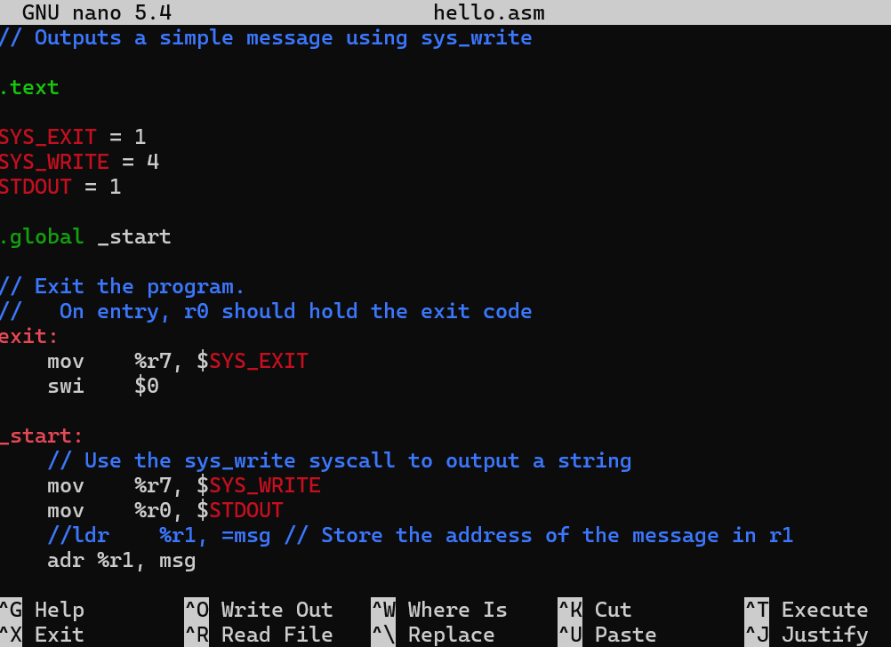


---

# Navigating the Command Line: Windows vs. Linux<br>Slide 9: IP address

An IP address is like a unique mailing address for every device connected to the internet. It allows computers to locate and communicate with each other. Think of it as a numerical label assigned to each device, making it possible for data to be sent to the correct destination.

- Windows:
  - ipconfig
- Linux:
  - ip addr

---

<!-- _class: long-title -->

# Navigating the Command Line: Windows vs. Linux<br>Slide 9: IP address – How you can get your IP address

- ipconfig

```console
jacob@raspberrypi:~ $ ip addr
1: lo: <LOOPBACK,UP,LOWER_UP> mtu 65536 qdisc noqueue state UNKNOWN group default qlen 1000
    link/loopback 00:00:00:00:00:00 brd 00:00:00:00:00:00
    inet 127.0.0.1/8 scope host lo
       valid_lft forever preferred_lft forever
    inet6 ::1/128 scope host
       valid_lft forever preferred_lft forever
2: eth0: <BROADCAST,MULTICAST,UP,LOWER_UP> mtu 1500 qdisc pfifo_fast state UP group default qlen 1000
    link/ether b8:27:eb:dc:64:a3 brd ff:ff:ff:ff:ff:ff
    inet 10.38.32.256/24 brd 10.38.32.255 scope global dynamic noprefixroute eth0
       valid_lft 525094sec preferred_lft 438694sec
    inet6 fe80::d8c5:56d0:e193:bd13/64 scope link
       valid_lft forever preferred_lft forever
3: wlan0: <NO-CARRIER,BROADCAST,MULTICAST,UP> mtu 1500 qdisc pfifo_fast state DOWN group default qlen 1000
    link/ether b8:27:eb:89:31:f6 brd ff:ff:ff:ff:ff:ff
jacob@raspberrypi:~
```

```console
C:\Users\Jacob>ipconfig
...
Ethernet adapter Ethernet 4:

   Connection-specific DNS Suffix  . : butte.campus
   Link-local IPv6 Address . . . . . : fe80::813a:b45d:4cd4:63fb%26
   IPv4 Address. . . . . . . . . . . : 10.38.32.232
   Subnet Mask . . . . . . . . . . . : 255.255.255.0
   Default Gateway . . . . . . . . . : 10.38.32.254
...
C:\Users\Jacob>


```

- ip addr

---

# Compiler

---

# … a few words about a compiler

During this semester, we will work with multiple programming languages and tools. We will start by refreshing our knowledge of the C language (the ancestor of C++, C#, Java, etc.), and then focus primarily on Python. Therefore, it is necessary to review compiler concepts, including GCC, one of the most popular C compilers.

---

<!-- _class: fit-70 -->

# Compiler vs Interpreter

- A compiler takes the entire source code and translates it into a machine code file, often called an executable. This executable file contains instructions that the computer's processor can directly execute. Once compiled, the program can run independently without the need for the original source code or a compiler.
- An interpreter translates the source code line by line as the program is running. It doesn't create a separate executable file. Instead, it uses a virtual machine to execute the translated code. The virtual machine provides an environment that mimics a real computer, allowing the program to run even if the underlying hardware architecture is different

---

# Compiler vs Interpreter

Think of a compiler as a translator who translates an entire book from one language to another before you start reading it. An interpreter, on the other hand, is a translator who translates each sentence as you read it. A compiler translates the entire program at once, while an interpreter translates it line by line.

---

<!-- _class: fit-90 -->

# How does a C program executes?

- C code
- Preprocessing
- Compiler
- Assembler
- Linker
- Loader

This is the source code you have written in the C programming language. It forms the basis of your program.

During this stage, the preprocessor processes your source code. It includes header files (e.g., stdio.h, math.h) using directives like #include and expands macros defined with #define. The output of this stage is the preprocessed source code.

The compiler takes the preprocessed source code and translates it into assembly code. This assembly code is a low-level representation of your program that is specific to the target architecture.

The assembler converts the assembly code **into object code**. Object code is a machine-readable format that contains instructions and data.

The linker combines the object code with other necessary libraries (e.g., standard C library) to create the final executable program. This process resolves external references and creates a complete program that can be run.

The loader loads the executable program into memory (RAM) so that it can be executed by the CPU. The running program is often referred to as a process.

These steps are essential for transforming your C code into an executable program that can be run on a computer.

---

# Compilers

- GCC – GNU Compiler Collection
- Microsoft Compiler C/C++
- C files are regular text files (txt), differing only by their extension, as they are plain text files in which each byte (depending on the encoding - ASCII) is represented as an element of the ASCII table.

---

<!-- _class: fit-80 -->

# GCC – GNU Compiler Collection

- GCC is a collection of compilers from the GNU Project that support various programming languages, hardware architectures and operating systems. The Free Software Foundation (FSF) distributes GCC as free software under the GNU General Public License (GNU GPL).
- GNU = ‘GNU's not Unix!’ The name was chosen intentionally to highlight the fact that although the GNU operating system draws inspiration from Unix, it is entirely self-contained and does not depend on any Unix source code.
- The GNU project releases all its software under free software licenses, granting users the liberty to use, modify, and share these programs.

---

<!-- _class: fit-70 -->

# GCC on Windows - How does it work?

- Open Source: One of the fundamental principles of the GNU project is open source. This means that anyone can download, modify, and distribute the GCC code. As a result, the GCC compiler has been adapted to work on various operating systems, including Windows.
- Compiler as a tool: GCC is primarily a tool, and tools are not usually tied to a specific operating system. Of course, there may be some dependencies and specifications for different platforms, but the core functionality of the compiler remains the same.
- Development environments: There are various development environments on Windows that allow you to use GCC.
- For example, MinGW (Minimalist GNU for Windows) is a collection of tools that enables compiling C and C++ programs on Windows using GCC.

---

# A summary

*Although GNU is primarily associated with Unix-like systems, the ideas of free software and open source have allowed GNU tools, such as GCC, to be ported to other platforms, including Windows.*

*As a result, Windows developers can use the same tools as developers working on other systems, which contributes to the unification of the development environment.*

---

# MinGW

In your personal computer

---

# Steps required to use the GCC compiler with MinGW:

- Download the MinGW archive from the course.
- Extract MinGW to the C:\ directory so that the folder structure looks like this: C:\MinGW\bin.
- Add the compiler path (C:\MinGW\bin) to the Windows system environment variables (Path).“ – next slides.

---

<!-- _class: fit-90 -->

# Steps to Add MinGW GCC to System PATH on Windows:

- Locate the MinGW bin folder
  - Typically, it’s in:
  - C:\MinGW\bin
  - Copy the full path
- Open Environment Variables settings
  - Press Win + R, type sysdm.cpl, and press Enter.
  - Go to the Advanced tab.
  - Click Environment Variables.
  - Edit the PATH variable
- Under System variables, find and select Path.
  - Click Edit.
  - Add the MinGW path
- Click New and paste the copied bin path.
  - Click OK to save.
  - Apply and close
- Click OK on all dialogs to apply changes.

---

# Steps to Add MinGW GCC to System PATH on Windows:

- Locate the MinGW bin folder
  - C:\MinGW\bin
  - Copy the full path
- Open Environment Variables settings
  - Press Win + R, type sysdm.cpl, and press Enter.
  - Go to the Advanced tab.
  - Click Environment Variables.
  - Edit the PATH variable

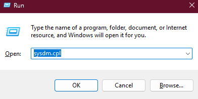

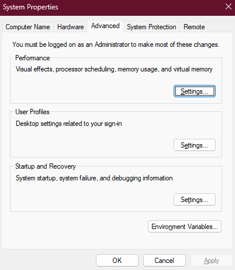

---

# Steps to Add MinGW GCC to System PATH on Windows:

- Locate the MinGW bin folder
  - C:\MinGW\bin
  - Copy the full path
- Open Environment Variables settings
  - Press Win + R, type sysdm.cpl, and press Enter.
  - Go to the Advanced tab.
  - Click Environment Variables.
  - Edit the PATH variable

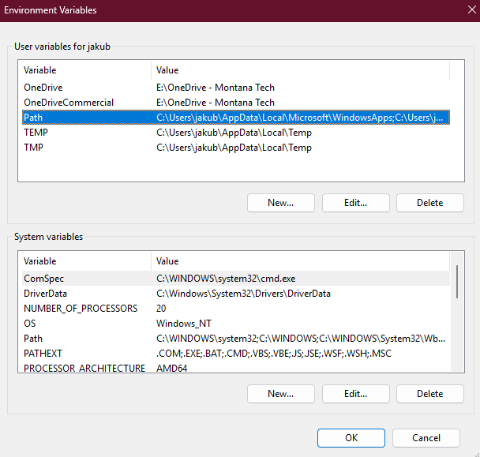

---

# Steps to Add MinGW GCC to System PATH on Windows:

- Under System variables, find and select Path.
  - Click Edit.
  - Add the MinGW path
- Click New and paste the copied bin path.
  - Click OK to save.
  - Apply and close
- Click OK on all dialogs to apply changes.

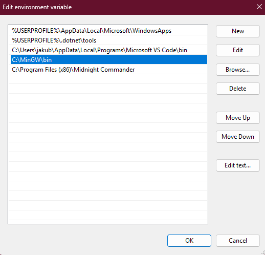

---

# MinGW

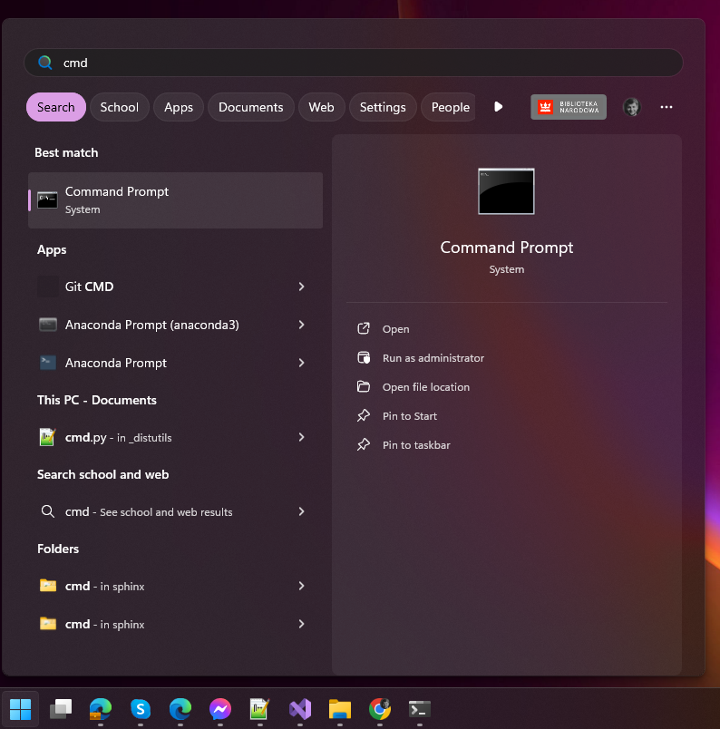

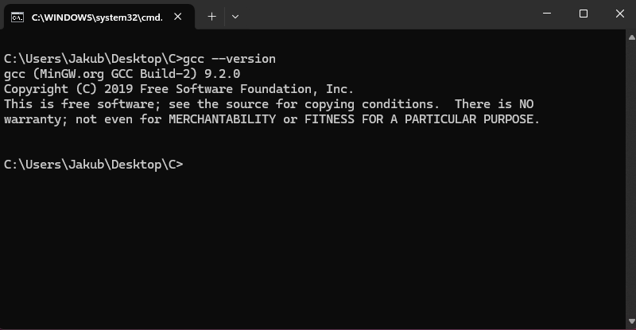

---

# Process of compilation

<!-- Aj di iii -->

---

# Steps required to prepare the C code from the course:

- Download the C code archive from the Canvas course.
- Extract the folder, for example, to your Desktop.
- Rename the folder to C for simplicity.

---

# Process of compilation

Compile main.c into an object file main.o:

```console
gcc -g -Wall -std=c99 -pedantic -c main.c -o main.o
```

```console
# 1) Compile main.c into an object file main.o (no linking).
#    Includes debug symbols (-g), enables most warnings (-Wall), uses the C99 standard (-std=c99),
#    and enforces strict standard conformance (-pedantic).
```

Link the object file main.o into an executable main.exe:

```console
gcc -g -Wall -std=c99 -pedantic -c main.c -o main.o
```

```console
# 2) Link the object file into an executable named main.exe.
```

---

<!-- _class: fit-90 -->

# How does a C program executes?

- C code
- Preprocessing
- Compiler
- Assembler
- Linker
- Loader

This is the source code you have written in the C programming language. It forms the basis of your program.

During this stage, the preprocessor processes your source code. It includes header files (e.g., stdio.h, math.h) using directives like #include and expands macros defined with #define. The output of this stage is the preprocessed source code.

The compiler takes the preprocessed source code and translates it into assembly code. This assembly code is a low-level representation of your program that is specific to the target architecture.

The assembler converts the assembly code **into object code**. Object code is a machine-readable format that contains instructions and data.

The linker combines the object code with other necessary libraries (e.g., standard C library) to create the final executable program. This process resolves external references and creates a complete program that can be run.

The loader loads the executable program into memory (RAM) so that it can be executed by the CPU. The running program is often referred to as a process.

These steps are essential for transforming your C code into an executable program that can be run on a computer.

---

<!-- _class: fit-90 -->

# How does a C program executes?

- C code
- Preprocessing
- Compiler
- Assembler
- Linker
- Loader

This is the source code you have written in the C programming language. It forms the basis of your program.

During this stage, the preprocessor processes your source code. It includes header files (e.g., stdio.h, math.h) using directives like #include and expands macros defined with #define. The output of this stage is the preprocessed source code.

The compiler takes the preprocessed source code and translates it into assembly code. This assembly code is a low-level representation of your program that is specific to the target architecture.

The assembler converts the assembly code **into object code**. Object code is a machine-readable format that contains instructions and data.

The linker combines the object code with other necessary libraries (e.g., standard C library) to create the final executable program. This process resolves external references and creates a complete program that can be run.

The loader loads the executable program into memory (RAM) so that it can be executed by the CPU. The running program is often referred to as a process.

These steps are essential for transforming your C code into an executable program that can be run on a computer.

---

# Process of compilation

Compile and link in one step (from main.c directly to main.exe):

```console
gcc -g -Wall -std=c99 -pedantic main.c -o main.exe
```

```console
# 3) Compile and link in one step: from main.c directly to main.exe,
#    with the same diagnostic/standard flags as in step 1.
```

---

# IDE

<!-- Aj di iii -->

---

# IDE (Integrated Development Environment)

An IDE combines many tools essential for a programmer's work, such as:

- **Text editor:**    Used for writing and modifying source code. It typically provides features like syntax highlighting,     automatic bracket matching, code completion, and other conveniences to facilitate code writing.
- **Compiler:**    Transforms the source code written by the programmer into a language understandable by the computer     (machine code).
- **Debugger:**    Allows you to run the program step by step, set breakpoints, check variable values, and trace the     program’s execution. A debugger helps you easily find and fix errors in your code.
- **Build tools:**    Automate the process of creating executable files from source code.
- **Version control system:**     Helps manage different versions of code, allowing you to track changes and collaborate with other     programmers.

<!-- IDE stands for Integrated Development Environment. In simpler terms, it's a software application that provides comprehensive facilities to computer programmers for software development. An IDE usually consists of at least a source code editor, build automation tools and a debugger. -->

---

<!-- _class: fit-90 -->

# IDE

- Code::Blocks
- Visual Studio Code
- Visual Studio


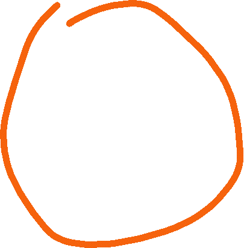

---

# Visual Studio Code – a few facts

VS Code is not a full-fledged IDE but rather a code editor. However, it is often considered an IDE because it includes a built-in file manager, and its extension system allows you to easily add features such as a debugger, compiler, or interpreter.

---

# Positional notation

---

# Bit &amp; Byte

- A **bit** is the smallest unit of data in a computer, representing a single binary value: either a **0** or a **1**.
- A **byte** is a group of eight bits. A single byte can represent a wide range of values, such as a single character (like the letter 'A' or the symbol '@') or an integer from 0 to 255.

---

<!-- _class: fit-90 -->

# Base of the numeral system

- In mathematical numeral systems the radix r is usually the number of unique digits, including zero, that a positional numeral system uses to represent numbers.
- The highest symbol of a positional numeral system usually has the value one less than the value of the radix of that numeral system. The standard positional numeral systems differ from one another only in the base they use.
- The radix is an integer that is greater than 1, since a radix of zero would not have any digits, and a radix of 1 would only have the zero digit.


---

# Binary numeral system


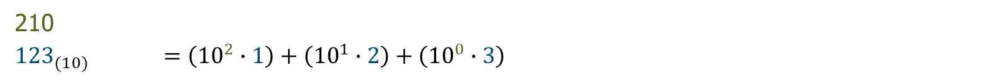

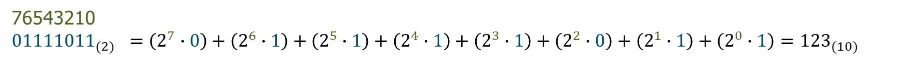

---

# Converting decimal numbers to binary

Steps:

- Divide the decimal number by 2. The remainder of the division will be either 0 or 1.
- If the remainder is 0, write down a 0.
- If the remainder is 1, write down a 1.
- Repeat steps 2 and 3 until the decimal number is 0.
- Read the numbers **from bottom to top** to get the binary number.

---

<!-- _class: fit-80 -->

# Converting decimal numbers to binary – example 12310

- 123 / 2 = 61 (remainder 1)
- Write down a 1.
- 61 / 2 = 30 (remainder 1)
- Write down a 1.
- 30 / 2 = 15 (remainder 0)
- Write down a 0.
- 15 / 2 = 7 (remainder 1)
- Write down a 1.
- 7 / 2 = 3 (remainder 1)
- Write down a 1.
- 3 / 2 = 1 (remainder 1)
- Write down a 1.
- 1 / 2 = 0 (remainder 1)
- Write down a 1.

---

# Converting binary numbers to oct – example 1111011(2)

- 001.111.011    = 1.7.3
- 0111.1011    = 7.B

|Radix|Value|Binary Value|Symbol|
|---|---|---|---|
|Octal|0|0000|0|
|Octal|1|0001|1|
|Octal|2|0010|2|
|Octal|3|0011|3|
|Octal|4|0100|4|
|Octal|5|0101|5|
|Octal|6|0110|6|
|Octal|7|0111|7|
|Hexadecimal|8|1000|8|
|Hexadecimal|9|1001|9|
|Hexadecimal|10|1010|A|
|Hexadecimal|11|1011|B|
|Hexadecimal|12|1100|C|
|Hexadecimal|13|1101|D|
|Hexadecimal|14|1110|E|
|Hexadecimal|15|1111|F|

---

<!-- _class: fit-90 -->

# Binary numeral system (Unsigned arithmetic)

|||||||||||
|---|---|---|---|---|---|---|---|---|---|
|||||||||||
|||||||||||
|-255||-127||0||127||255||

|||||||||||
|---|---|---|---|---|---|---|---|---|---|
|||||||||||
|||||||||||
|-255||-127||0||127||255||

|1|1|1|1|1|1|1|1|
|---|---|---|---|---|---|---|---|

|**S**|1|1|1|1|1|1|1|
|---|---|---|---|---|---|---|---|

most significant bit

MSB

LSB

least significant bit

**Sign-Magnitude Representation**

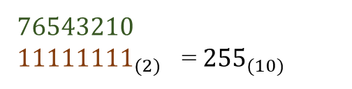

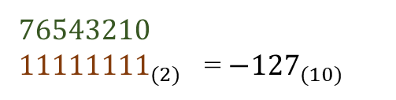

---

# Data in a computer can essentially be stored using two standards:

- integers represented in binary,
- real (floating-point) numbers stored according to the IEEE 754 standard.

Everything else is a combination or interpretation based on these two fundamental forms of representation.

---

# Symbolic Name

---

# What is an address?

**Address of University:**

1300 W Park St, Butte, MT 59701


---

# What is an address?

- Address is an identifier <br>(symbolic name) of location
- A place to locate what we refer to

**Address of University:**

1300 W Park St, Butte, MT 59701


---

# What is a name of variable?

```c
int main()
{
  char* text = "Hello world\n";

  printf(text);

    return 0;
}
```

In C:

- a variable name is a **symbolic name**, and when translating the code, the compiler will replace the variable name with the memory location of the data associate
- every **symbolic name** is an alias for a memory location (address) except for preprocessor instructions

---

# What is a name of variable?

In C:

- a variable name is a **symbolic name**, and when translating the code, the compiler will replace the variable name with the memory location of the data associate
- every **symbolic name** is an alias for a memory location (address) except for preprocessor instructions

```c
int main()
{
  char* text = "Hello world\n";

  printf(text);

    return 0;
}
```

---

<!-- _class: fit-80 -->

# Symbolic names will be used in:

- Variables:    Symbolic names will be used to identify and refer to data stored in variables. This<br>    allows for more meaningful and descriptive code compared to using arbitrary names or <br>    identifiers.
- Arrays:     Symbolic names will be used to identify collections of related data elements. Arrays can be used <br>    to store multiple values of the same data type.
- Functions:    Symbolic names will be used to identify and call functions within the program. This helps in <br>    organizing and structuring the code, making it easier to understand and maintain.
- Labels\*:    Symbolic names will be used to mark specific locations or points within the program code. <br>    These labels can be used for various purposes, such as control flow statements, data references, <br>    or error handling.

\*In Python we don’t have labels.

---

# Restrictions on symbolic name

- The first character must be a letter, underscore "\_", or special character “@, #, $”\*
- The remaining characters can be letters, digits, underscores
- cannot contain spaces
- cannot be C language keywords ( for example. for, while, etc.)

\* Only variable or function names

---

<!-- _class: fit-80 -->

# camelCase vs snake\_case for symbolic names

- camelCase starts each word with a capital letter, except for the first word.
  - For example, thisIsCamelCase.
- snake\_case uses underscores to separate words and all letters are lowercase.
  - For example, this\_is\_snake\_case.

Regardless of the specific coding style, it's common practice to start variable and function names with a lowercase letter. When using snake\_case, we use underscores to separate words, like my\_variable.

Constants, which are values that don't change, are usually written in all uppercase letters, such as MAX\_VALUE


---

<!-- _class: fit-80 -->

# Symbolic names will be used in:

- Variables:    Symbolic names will be used to identify and refer to data stored in variables. This<br>    allows for more meaningful and descriptive code compared to using arbitrary names or <br>    identifiers.

\*In Python we don’t have labels.

- Arrays:     Symbolic names will be used to identify collections of related data elements. Arrays can be used <br>    to store multiple values of the same data type.
- Functions:    Symbolic names will be used to identify and call functions within the program. This helps in <br>    organizing and structuring the code, making it easier to understand and maintain.
- Labels\*:    Symbolic names will be used to mark specific locations or points within the program code. <br>    These labels can be used for various purposes, such as control flow statements, data references, <br>    or error handling.

---

# Variables

---

# Declaring and initializing variables

```c
int main()
{
  int p;        /* Declaration of variable p with a size of 4 bytes */
  int q, r, s;  /* Simultaneous declaration of variables q, r, s using "," */
  q = 2;        /* Assignment of value to variable q - initialization */
  r = q = s;    /* Assignment of values to q and s based on r */
  int t = 3;    /* Declaration and initialization on the same line */

  return 0;
}
```

```c
int == long int
```

---

# Declaring and initializing variables

```c
int main()
{
  char v;              /* Variable v of integer type with a size of 1 byte */
  short int w;         /* Variable w of integer type with a size of 2 bytes */
  long int x;          /* Variable x of integer type with a size of 4 bytes */
  short y;             /* Shorthand declaration for short int */
  long z;              /* Shorthand declaration for long int */

  return 0;
}
```

```c
short == short int

long  == long int == int
```

---

# Declaring and initializing variables

```c
int main()
{
  float  a = 3.16f;    /* Variable a of floating-point type with a size of 4 bytes */
  double b = a * 3.0;  /* Variable b of floating-point type with a size of 8 bytes */
  				 /* Note: short float, long float, and short double do not exist in C */
  long double d;       /* Variable d of floating-point type with a size of 12 bytes */
}
```

---

# Declaring and initializing variables

- Any variable must be declared before use.
- Unlike Python, C requires explicit type declaration for variables\*
- to write integers we use the type char(1B), short integer(2B) or long integer(4B)
- write real numbers float(4B), double(8B) or long double(12B)
- An uninitialized variable takes the random value

\*there is an auto keyword, but it is not allowed in the entire programming course!

---

# Two words about floating-point representation

Operations on real numbers are recorded with only a certain degree of precision, and therefore there is a very high probability that the result of (a + b – c) will not be the same as (a - c + b) ! This means that using real numbers requires careful consideration.

<!-- but more on that in another course - namely, computer architecture. -->

---

<!-- _class: fit-70 -->

# A few words about pointers

- **POINTERS ARE TREATED AS FIRST-CLASS DATA TYPES**
- We can create a pointer to **any** data type using the \* operator between the existing data type and the symbolic name. Unary Operator &amp; returns memory locations
- A pointer in C is a reference to a specific memory location

```c
int main()
{
  short int p;        /* Declaration of variable p with a size of 2 bytes */
  short int * q = &p; /* Declaration and initialization of pointer q with a size of 4 bytes
                         (even though it points to short int) */
  float*r;            /* Declaration of pointer r to float  */
  char* s;            /* Declaration of pointer s to char  */
  int t, *v;          /* Declaration of variable t and pointer v */
  short int* w, z;    /* Declaration of pointer w to short int and variable z */

/*"Note that the variable type is determined by the position of the asterisk ('*') in the    declaration. Only the variable directly following the asterisk is considered a pointer. */
}
```

<!-- The size of a pointer is 4 bytes on 32-bit platforms
asterisk -->

---

# Summary of memory size of data types

|Type|Memory size in bytes / bits|
|---|---|
|char|01 Bytes / 08 bits|
|bool\*|01 Bytes / 08 bits|
|short int|02 Bytes / 16 bits|
|long int|04 Bytes / 32 bits|
|float|04 Bytes / 32 bits|
|double|08 Bytes / 64 bits|
|long double|12 Bytes / 96 bits|
|pointer (char\*, short\*, long\*, int\*, float\*, double\*, long double\*, void\*, …)|04 Bytes / 32 bits|
|user defined (struct, unions, etc. )|complex|

\*from C99

---

<!-- _class: fit-80 -->

# Symbolic names will be used in:

- Variables:    Symbolic names will be used to identify and refer to data stored in variables. This<br>    allows for more meaningful and descriptive code compared to using arbitrary names or <br>    identifiers.

\*In Python we don’t have labels.

- Arrays:     Symbolic names will be used to identify collections of related data elements. Arrays can be used <br>    to store multiple values of the same data type.
- Functions:    Symbolic names will be used to identify and call functions within the program. This helps in <br>    organizing and structuring the code, making it easier to understand and maintain.
- Labels\*:    Symbolic names will be used to mark specific locations or points within the program code. <br>    These labels can be used for various purposes, such as control flow statements, data references, <br>    or error handling.

---

# Arrays

---

# Arrays

This statement reserves space in memory for 10 integers and creates an 'unchanging address of memory' that points to the beginning of this array\*. You can use this symbolic name to access individual elements of the array using square brackets and the appropriate index.

The values of array will be undefined, meaning they can hold any random value.

```c
int a[10];
```

\*Array indexing starts from 0.

---

<!-- _class: fit-80 -->

# Arrays

- When you specify the size of an array in square brackets, it is created with that exact size.
- If you omit the size but provide initial values, the compiler counts them and creates an array of that size.
- If you specify the size but don't initialize all elements, the remaining ones will have indeterminate, unpredictable values.

```c
<type> symbolic_name[size];
```

```c
<type> symbolic_name[] = {value1, value2, value3};
```

```c
<type> symbolic_name[size] = {value1, value2};
```

---

# Do you remember?

- Code
- Preprocessor

```c
#include <stdio.h>


int main()
{
	char string[12] = "Hello world";
	printf("%s", string);
	return 0;
}
```

---

# Hello World

```c
#include <stdio.h>


int main()
{
	char string[12] = "Hello world";
	printf("%s", string);
	return 0;
}
```

---

# Example of an array

```c
int main()
{
    char string0[12] = "Hello world";
    char string1[]   = "Hello world";
    char string2[12] = { 72, 101, 108 ,108, 111, 32, 87, 111, 114, 108, 100, 0 };
    char string3[]   = { 72, 101, 108 ,108, 111, 32, 87, 111, 114, 108, 100, 0 };
    char string4[12] = { 'H', 'e', 'l' , 'l', 'o', ' ', 'w', 'o', 'r', 'l', 'd', '\0' };
    char string5[]   = { 'H', 'e', 'l' , 'l', 'o', ' ', 'w', 'o', 'r', 'l', 'd', '\0’ };
    char string6[12]   = { 'H', 101, 'l' , 108, 'o', ' ', 'w', 'o', 'r', 'l', 'd’, 0 };
    printf("%s\n", string0);
    printf("%s\n", string1);
    printf("%s\n", string2);
    printf("%s\n", string3);
    printf("%s\n", string4);
    printf("%s\n", string5);
    printf("%s\n", string6);
    return 0;
}
```

Result:

```text
Hello World
Hello World
Hello World
Hello World
Hello World
Hello World
Hello World
```

---

<!-- _class: fit-80 -->

# Arrays

- When you specify the size of an array in square brackets, it is created with that exact size.
- If you omit the size but provide initial values, the compiler counts them and creates an array of that size.
- If you specify the size but don't initialize all elements, the remaining ones will have indeterminate, unpredictable values.

```c
<type> symbolic_name[size];
```

```c
<type> symbolic_name[] = {value1, value2, value3};
```

```c
<type> symbolic_name[size] = {value1, value2};
```

---

# Question: How do we know which letter goes with which number?

```c
int main()
{
  char text[] = { 72, 101, 108 ,108, 111, 32, 87, 111, 114, 108, 100, 10, 13, 0 };
  printf("%s", text);
  return 0;
}
```

Result:

```text
Hello World


```

---

# ASCII Table

American Standard Code for Information Interchange

- is the most common character encoding format for text data in computers and on the Internet. In standard ASCII-encoded data, there are unique values for 128 alphabetic, numeric or special additional characters and control codes.
- \0 equals 0 (NULL)
- \n equals 10, 13 (n\ + \r)
- \t equals 11
- White\_Space equals 32

```text
 Val Char                            Val  Char     Val  Char     Val  Char
---------                            ---------     ---------     ----------
  0  NUL (null)                      32  SPACE     64  @         96  `
  1  SOH (start of heading)          33  !         65  A         97  a
  2  STX (start of text)             34  "         66  B         98  b
  3  ETX (end of text)               35  #         67  C         99  c
  4  EOT (end of transmission)       36  $         68  D        100  d
  5  ENQ (enquiry)                   37  %         69  E        101  e
  6  ACK (acknowledge)               38  &         70  F        102  f
  7  BEL (bell)                      39  '         71  G        103  g
  8  BS  (backspace)                 40  (         72  H        104  h
  9  TAB (horizontal tab)            41  )         73  I        105  i
 10  LF  (NL line feed, new line)    42  *         74  J        106  j
 11  VT  (vertical tab)              43  +         75  K        107  k
 12  FF  (NP form feed, new page)    44  ,         76  L        108  l
 13  CR  (carriage return)           45  -         77  M        109  m
 14  SO  (shift out)                 46  .         78  N        110  n
 15  SI  (shift in)                  47  /         79  O        111  o
 16  DLE (data link escape)          48  0         80  P        112  p
 17  DC1 (device control 1)          49  1         81  Q        113  q
 18  DC2 (device control 2)          50  2         82  R        114  r
 19  DC3 (device control 3)          51  3         83  S        115  s
 20  DC4 (device control 4)          52  4         84  T        116  t
 21  NAK (negative acknowledge)      53  5         85  U        117  u
 22  SYN (synchronous idle)          54  6         86  V        118  v
 23  ETB (end of trans. block)       55  7         87  W        119  w
 24  CAN (cancel)                    56  8         88  X        120  x
 25  EM  (end of medium)             57  9         89  Y        121  y
 26  SUB (substitute)                58  :         90  Z        122  z
 27  ESC (escape)                    59  ;         91  [        123  {
 28  FS  (file separator)            60  <         92  \        124  |
 29  GS  (group separator)           61  =         93  ]        125  }
 30  RS  (record separator)          62  >         94  ^        126  ~
 31  US  (unit separator)            63  ?         95  _        127  DEL
```

<!-- ASCII: abbreviated from American Standard Code for Information Interchange, is a character encoding standard for electronic communication. ASCII codes represent text in computers, telecommunications equipment, and other devices. Because of technical limitations of computer systems at the time it was invented, ASCII has just 128 code points, of which only 95 are printable characters, which severely limited its scope. Modern computer systems have evolved to use Unicode, which has millions of code points, but the first 128 of these are the same as the ASCII set.
'5' has the int value 53 if we write '5'-'0' it evaluates to 53-48, or the int 5 if we write char c = 'B'+32; then c stores 'b' -->

---

# Multi-dimensional arrays

- One dimension:
- Two dimensions:
- Three dimensions:
- etc.

```c
<type> symbolic_name[size];
```

```c
<type> symbolic_name[size1][size2];
```

```c
<type> symbolic_name[size1][size2][size3];
```

---

<!-- _class: fit-80 -->

# Symbolic names will be used in:

- Variables:    Symbolic names will be used to identify and refer to data stored in variables. This<br>    allows for more meaningful and descriptive code compared to using arbitrary names or <br>    identifiers.

\*In Python we don’t have labels.

- Arrays:     Symbolic names will be used to identify collections of related data elements. Arrays can be used <br>    to store multiple values of the same data type.
- Functions:    Symbolic names will be used to identify and call functions within the program. This helps in <br>    organizing and structuring the code, making it easier to understand and maintain.
- Labels\*:    Symbolic names will be used to mark specific locations or points within the program code. <br>    These labels can be used for various purposes, such as control flow statements, data references, <br>    or error handling.

---

# Labels

---

# Every line of code in C can have its own label.

```c
int main()
{
label1:  int x = /* inline comment */ 5;
label2:
label3:  char string[12] = "Hello world"; /* comment behind the line */
label4:  printf("%s", string);
label5:  /* a comment
		composed of
		a few lines */
label7:
label8:    return 0;
}
```

---

# Every line of code in C can have its own label.

```c
int main()
{
label1:  int x = /* inline comment */ 5;
label2:
label3:  char string[12] = "Hello world"; /* comment behind the line */
label4:  printf("%s", string);
label5:  /* a comment
		composed of
		a few lines */
label7:
label8:    return 0;
}
```

---

# Memory

---

# What is an array?

An array is a contiguous, homogeneous region of RAM whose size is determined at declaration and depends on the number of elements and the size of each element. Array elements are stored in consecutive memory cells (bytes), and access to them is done using an index that specifies the position of the element relative to the beginning of the array.

<!-- blok pamieci w na stosie, statyczna pamiec, moze wspomniec ze ta pamiec jest ograniczona, to znaczy w architekturze x86 -->

---

<!-- _class: fit-70 -->

# Size scale

- Hypothetically, 32-bit processors had the ability to use up to 4GB of RAM. However, in practice, the first 32-bit processors were introduced in the 1990s, when the standard RAM for an entire computer was between 8 MB and 16 MB. This represented only 0.001953125% of the theoretical maximum memory capacity. Since everything running—the operating system and all programs (including background tasks)—had to fit into this RAM, it’s easy to see how little space was left for our program. In the best-case scenario, our program might get a few megabytes for everything, and even less for the stack to store data.
- If one integer variable in a 32-bit architecture occupied 4 bytes, it means that an array of 1024 numbers would occupy 4096 bytes.
- For scale comparison: 1 GB is equal to 1024 MB, 1 MB is equal to 1024 KB, and 1 KB is equal to 1024 bytes.

<!-- one thousandth of a percent -->

---

<!-- _class: fit-70 -->

# What is a memory(RAM) -stack?

In reality, memory(stack) is a one-dimensional, continuous memory area that we can reference with byte-level accuracy through addresses.

While the specifics of how a stack works—the mechanism of pushing and popping data—might seem secondary, it's actually quite crucial. Don't imagine a stack as a pile of cards or plates; while that's a correct definition, instead of helping, it can hinder understanding of how RAM works at this stage of learning. Imagine a very long sequence of bytes(8 bits), and the ability to reserve a portion of this sequence to store our data, and the ability to release this reservation as freeing up this space. This sequence of bytes can be identified by the address of a specific byte of this sequence, or an index.

<!-- blok pamieci w na stosie, statyczna pamiec, moze wspomniec ze ta pamiec jest ograniczona, to znaczy w architekturze x86 -->

---

# What is a memory(RAM) -stack?

Now that you've visualized this sequence, we can reiterate that the essence of memory allocation and deallocation is similar to the concept of a stack of cards or plates. That is, we can only access the topmost element; we cannot remove cards from the middle to free up memory. We must do so sequentially.

<!-- blok pamieci w na stosie, statyczna pamiec, moze wspomniec ze ta pamiec jest ograniczona, to znaczy w architekturze x86 -->

---

<!-- _class: fit-50 -->

# A stack

- A **stack** is a region of memory that works like a stack of cards. When you add a new card to the stack, you place it on top. When you remove a card, you take it from the top. This is how a **stack** in computer memory works. When you declare a local variable in a function or call another function, information about it is "pushed" onto the top of the stack. When the function finishes executing, this information is "popped" off the stack. The stack follows a LIFO (Last In, First Out) principle, meaning the last element added is the first one removed.
- The stack is used to store local function variables, return addresses, and other data related to the program's execution.
- **To put it simply:** The stack is a temporary storage area where the program keeps information needed to perform specific tasks. Once a task is completed, the information is removed.

---

<!-- _class: fit-90 -->

# One more time

When we present the stack as a pile of plates or cards, it's actually quite misleading. In reality, the stack is a one-dimensional, continuous memory area that we can reference with byte-level accuracy through addresses. While it's true that the push and pop operations can parallel the idea of stacking or removing plates or cards, the mistake lies in assuming you can place an entire array, which could be quite large. In this case, the metaphor hinders understanding rather than helping. There's also no issue with placing a whole array on the stack and later retrieving just a portion of it rather than the entire thing.

---

# An address of memory

This is a great place to explain the concept of a memory address. Imagine RAM as a long sequence of bits. Each variable occupies a specific location in this sequence, and the address indicates exactly where it is. For the computer to know how much space to allocate for data, we need to determine the size of arrays beforehand. This is why the size of an array must be known before the program is run. The heap is another area of memory that allows for more flexible memory management.

---

<!-- _class: fit-40 -->

# Without going into details

- Computer memory is structured in a stack-oriented way. In the processor, there is a special memory cell — a register — called the Stack Pointer (SP), which holds the address of the first location in RAM. It's important to know that stack addresses decrease. This means an empty stack starts at the maximum value. The size of this number depends on the architecture, but in a 32-bit environment, it is typically a 32-bit unsigned integer.
- It’s worth mentioning that the stack is **never completely empty**. Even in a freshly initialized program, the stack contains system-level data such as return addresses, environment setup, and possibly function call frames from the runtime. This means the stack always has some structure and content, even before user-defined variables are added.
- If you declare a variable in your code, for example int x, which takes up 4 bytes, you need to subtract 4 from the SP value — that’s where the data for your variable will be stored. Everything on the stack is arranged like a deck of cards.
- I chose C99 to illustrate many mechanisms because padding is less frequent here. If you compare the addresses of initialized variables in newer versions of C++ or C#, you may notice gaps between them. This mechanism helps the compiler and operating system access variables faster, but that’s a separate topic.

---

# Good To know

---

# Function arguments

Function arguments are always **copies** of our variables, and **not** the same memory areas, a function argument, even though it has the same value, is a completely different variable!

---

# by the Value

Function arguments are always **copies** of our variables, and **not** the same memory areas, a function argument, even though it has the same value, is a completely different variable!

Result:

```text
5
5

```

```c
#include <stdio.h>

void byTheValue(int);

void byTheValue(int value)
{
    value++;
    return;
}

int main()
{
    int x = 5;
    printf("%d\n", x);
    byTheValue(x);
    printf("%d\n", x);
  return 0;
}
```

---

# by the Reference

Function arguments are always **copies** of our variables, and **not** the same memory areas, a function argument, even though it has the same value, is a completely different variable!

```c
#include <stdio.h>

void byTheReference(int*);

void byTheReference(int* ref)
{
    (*ref)++;
    return;
}

int main()
{
    int x = 5;
    printf("%d\n", x);
    byTheReference(&x);
    printf("%d\n", x);
  return 0;
}
```

Result:

```text
5
6

```

---

# Questions?

---

<!-- _class: caption-slide -->

# Thank You
