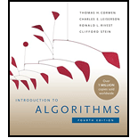

<!-- _class: lead -->

<!-- _paginate: skip -->

# CSCI 232

## 232 Algorithms & Data Structures

### Lecture: 1

J. L. Pach

---

# Outline:

- Syllabus
- Textbook
- Canvas
- Introduction

---

<!-- _class: caption-slide -->

<!-- _paginate: skip -->

# Syllabus

<!--
## Subtitle
-->

---

# Some basic facts about the course

<div class="columns">

<div class="card">

## Course Name:

- Algorithms & Data Structures (CSCI 232)

## Credit Hours:

- 3 credits
- 1 hour lecture twice a week
- 2 hours lab per week

</div>

<div class="card">

## Lecture (Mondays and Fridays)

- 09:00 – 09:50 AM.
- Chemistry & Biology Building (CBB) 001

## Lab (Wednesday)

- 03:00 – 04:50 PM.
- Chemistry & Biology Building (CBB) 001

</div>

</div>

---

# Syllabus

- Course Description

- Textbooks

- Class Rules

- Grading

- Accommodations & Academic Dishonesty

- Declaration of authorship

<!--
TUTAJ WPISZ TO, CO CHCESZ POWIEDZIEĆ:
- Przywitaj studentów CSCI 112.
- Podkreśl, że IDE to nie tylko edytor, ale cały ekosystem.
- Wspomnij o debuggerze jako narzędziu, które oszczędza godziny pracy.
-->

---

# Course Description

<div class="card justify lh-25">

Operating on large collections of data is at the core of Computer Science. In this class you will study several commonly used structures used to store data and the algorithms used to manipulate them. You will examine the types of problems that each data structure and algorithm can be applied to. Finally, you will learn ways to analyze and compare algorithms in terms of time and space efficiency. Topics include stacks, queues, general lists, trees and graphs, hashing, searching, sorting, and recursion.

</div>

---

<div class=" justify lh-20">

# ...a few words

• **The Core:** In this course, we will tackle the "meat" of computer science—learning how to solve complex programming problems using fundamental data structures and algorithms.

• **The Engineering Foundation:** Before we dive into advanced code, we will establish professional development habits. You will learn how to properly structure and build projects, use Git and GitHub for version control, write robust unit tests, and effectively use advanced debugging tools.

• **The Languages:** We will implement and compare solutions across **C, C++, and Python**. This will help you understand the trade-offs between low-level memory management and high-level abstraction.

• **The Goal:** With this modern toolkit established, when we move on to implementing stacks, queues, lists, trees, and graphs, you will have the skills to not just write working code, but to confidently test it, debug it, and analyze its efficiency.

</div>

---

# Textbooks

*Thomas H. Cormen, Charles E. Leiserson, Ronald L. Rivest, Clifford Stein. Introduction to Algorithms, third edition. MIT Press, 2009*

<div class="columns">

<div>


New Book

</div>

<div>


</div>

</div>

---

<div class="justify">

# Grading Breakdown

\*\* The final grade will be calculated based on the following components:

- **Quizzes (25%)**:
  - Entrance Quizzes: Short quizzes (5-10 minutes) may be given at the beginning of some classes to assess understanding of the previous material.
  - Two Major Quizzes: 50-minute quizzes administered throughout the semester. Each student will have one opportunity to retake each quiz at the end of the semester.
- **Assignments (75%)**: Regular, individual assignments will primarily be completed during class time;
  The final grade will be calculated as a weighted average of the scores obtained in each component.\*\*

</div>

---

<div class="justify">

# In-Person Format

This is strictly an in-person course. Regular attendance and active participation are expected.

## Attendance Policy

- Attendance at every class is required.
- Students are allowed up to two unexcused absences during the semester without penalty.

**Each additional unexcused absence beyond this two-absence allowance will result in a 1 percentage-point deduction from the final course grade.**

</div>

---

<div class="justify lh-20">

# Excused Absences & Emergencies

- Official university-excused absences, university-sanctioned activities, serious personal emergencies, and documented medical circumstances will not count toward the unexcused absence allowance.
- Students should notify the instructor as soon as reasonably possible when an emergency or officially excused absence occurs.

</div>

---

<div class="justify lh-25">

# Laboratory Rules

## Entrance Quiz

- When an entrance quiz is scheduled, it will consist of three questions.
- A score of at least 2 out of 3 is required to pass.
- A failed entrance quiz may be retaken up to two times during the semester. Only failed entrance quizzes may be retaken.

</div>

---

<div class="justify">

# Assignments & Deadline

- Students will have six calendar days to complete and submit each assignment.
- The deadline is strict. Once the six-day submission period has closed, the normal submission path will be closed and late or makeup submissions will not be accepted, except where an official University policy, documented emergency, or approved accommodation requires otherwise.
- Students are responsible for submitting their work before the deadline. Students should not wait until the final minutes before the deadline to submit an assignment.

## Brief Concluding Quiz

- When scheduled, the concluding quiz is a short summative assessment covering the material addressed during the laboratory session.

</div>

---

<div class="justify">

# Code Formatting, Authorship & Declaration

- Every submitted source file must begin with exactly four lines of comments containing the required authorship declaration.
- The following template must be used:

```c
// Your Name
// CSCI 232 Fall 2026
// Programming Assignment #1
// I declare that I am the author of this work, take full responsibility for it, and have disclosed any material external assistance.
```

</div>

---

<div class="justify">

# Authorship Requirement

- The four-line declaration is **mandatory**.
- A source file submitted without the required declaration will receive **0 points**.
- If a student submits an assignment before the deadline but accidentally omits the required declaration, the instructor may allow the student to resubmit **the same code with the declaration added** after the deadline as a correction of an administrative omission.
- This correction is limited strictly to adding the required declaration. No modification, improvement, debugging, or other change to the submitted code is permitted after the original deadline.
- Repeated failure to include the required declaration may be treated as failure to comply with the assignment requirements.

</div>

---

# Academic Integrity, Collaboration & External Resources

<div class="justify">

Students are encouraged to use appropriate external resources to learn and solve problems. Such resources may include:

- textbooks and other books;
- official programming documentation;
- technical websites and documentation;
- Stack Overflow and similar technical resources;
- ChatGPT, Gemini, GitHub Copilot, and other AI-assisted tools.

**The use of an external resource does not, by itself, constitute academic misconduct.** However, students remain fully responsible for the work they submit.

</div>

---

<div class="justify">

# Disclosure of External Assistance

- Students must disclose **material external assistance** that contributed to their submitted work.
- Such assistance may include, but is not limited to, substantial assistance from another person, technical resources, or generative AI tools.
- The disclosure should be made in an appropriate comment in the source code.

For example:

```
// I used the C standard library documentation to verify the behavior of strtok().
```

or:

```
// I used ChatGPT to help explain pointer arithmetic.
// I wrote, tested, and verified the submitted implementation myself.
```

</div>

---

# Disclosure of External Assistance

<div class="justify lh-30">

The purpose of this requirement is not to prohibit the use of external resources. Its purpose is to ensure that the origin of significant assistance is honestly acknowledged.
Students are **not required to document ordinary searches or routine consultation of documentation** that do not materially contribute to the submitted work.

</div>

---

# Responsibility for Submitted Work

- Regardless of what resources were used during the development process, each student is fully responsible for understanding the work submitted under their name.
- Assignments may be reviewed orally by the instructor.
- During such a review, the instructor may ask the student to:
  - explain specific lines of code, how an algorithm works;
  - explain why a particular implementation was chosen;
  - predict what the program will do for a particular input;
  - identify or explain an error;
  - modify part of the submitted code;
  - demonstrate the operation of the submitted program.

---

<div class="justify lh-20">

# Responsibility for Submitted Work

The purpose of such a review is to establish that the student understands and is responsible for the submitted work.
A student's inability to explain substantial portions of submitted work, particularly after reasonable questioning and clarification, may be considered as evidence when determining whether the work was genuinely authored by the student. Such evidence will be evaluated together with the other available evidence in accordance with the Montana Tech Student Code of Conduct.

</div>

---

# Declaration of Responsibility

By submitting an assignment, the student declares that:

1. I am the author of the work I am submitting.
2. I have disclosed any material external assistance used in preparing this work.
3. I understand the code and other work that I am submitting.
4. I take full responsibility for the submitted work.
5. I understand that submitting work that is not my own, or concealing material external assistance, may constitute academic misconduct and may be referred to the appropriate University authority.

**The four-line source-file declaration constitutes the student's acknowledgment of these requirements.**

---

# University Accommodations

<div class="justify lh-20">

- Students who require academic accommodations should work directly with Montana Tech Disability Services and provide the appropriate documentation to the instructor as soon as possible.
- Approved accommodations will be provided in accordance with University policy.

</div>

---

# Canvas

## Lecture & Laboratory:

### (74151) CSCI 232: Data Structures and Algorithms

## Check if you are registered for the course and have access to it!

---

# Integrated development environment


---

<!-- _class: caption-slide -->

<!-- _paginate: skip -->

# Thank

## You
