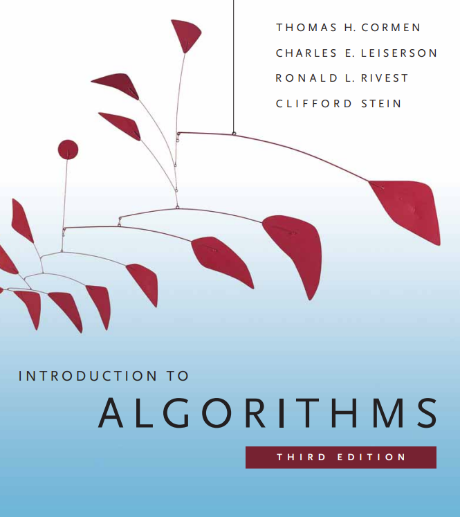
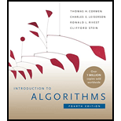

<!-- _class: compact lead -->

# Data Structures &amp; Algorithms

## Lecture 1

---

# Today’s Agenda

- Introduction
- Syllabus
- Canvas

---

<!-- _class: compact fit-70 -->

# Some basic facts about the course

- course:    Data Structures &amp; Algorithms 232
- instructor:    Dr. Jakub Leszek Pach
- email:    <jpach@mtech.edu>
- office hours:    Monday, Wednesday, Thursday 08 – 09.00 a.m.

Other times by appointment

- office location:    MUS 103
- lecture:     MF 09:00 – 09:50 a.m. in CBB 001
- laboratory:    W 03:00 – 04:50 p.m. in CBB 001

---

# Syllabus

- Point 1

---

<!-- _class: compact fit-80 -->

# Syllabus - Course Description

Operating on large collections of data is at the core of Computer Science. In this class you will study several commonly used structures used to store data and the algorithms used to manipulate them. You will examine the types of problems that each data structure and algorithm can be applied to. Finally, you will learn ways to analyze and compare algorithms in terms of time and space efficiency. Topics include stacks, queues, general lists, trees and graphs, hashing, searching, sorting, and recursion.

---

<!-- _class: compact fit-70 -->

# …a few words

- In this course, we will learn how to solve common programming problems using different data structures and algorithms. But before we dive into more complex code, we’ll take some time to review the basics—how to effectively use a debugger, how to write unit tests, how to organize a project in an IDE, and how to work with compilers and libraries.
- We’ll also revisit object-oriented programming concepts and compare different programming languages—Python, C++, C# —to better understand their strengths and weaknesses. With this foundation, when we move on to implementing structures like stacks, queues, lists, trees, and graphs, you’ll have the tools to not only write working code but also test it, analyze it, and compare its efficiency.

---

<!-- _class: compact fit-70 -->

# Syllabus - Textbook

Thomas H. Cormen, Charles E. Leiserson, Ronald L. Rivest, Clifford Stein. Introduction to Algorithms, third edition. MIT Press, 2009.

**or fourth edition**, it does not matter.





---

<!-- _class: compact fit-90 -->

# Syllabus - Grading

**The final grade will be calculated based on the following components:**

- **Quizzes**(25%):
  - **Entrance Quizzes**: Short quizzes (5-10 minutes) **may** be given at the beginning of some classes to assess understanding of the previous material.
  - **Two Major Quizzes**: 50-minute quizzes administered throughout the semester. Each student will have one opportunity to retake each quiz at the end of the semester.
- **Assignments** (75%): Regular, individual assignments will primarily be completed during class time; however, students will have an additional 6 days to finish any unfinished work. Assignments will be graded on accuracy, quality of arguments, and timeliness.

**The final grade will be calculated as a weighted average of the scores obtained in each component.**

---

<!-- _class: compact fit-90 -->

# Syllabus<br>Class Rules

**Class Rules:**

- This course is an in-person course.
- Attendance at every class is required.
- Excused Absences. If there is any medical or any other kind of emergency, please let the instructor know immediately. Makeup exams will only be given if you bring a valid medical documentation.
- Each task without a sample required comment (below) is worth **zero points**.

---

<!-- _class: compact fit-70 -->

# Syllabus<br>Declaration of authorship

*I acknowledge that I have worked on this assignment independently, except where explicitly noted and referenced. Any collaboration or use of external resources has been properly cited. I am fully aware of the consequences of academic dishonesty and agree to abide by the university's academic integrity policy. I understand the importance the consequences of plagiarism.*

---

<!-- _class: compact fit-70 -->

# Syllabus<br>Comments

Comments:

There must be 4 lines of comments at the top of each source file. This heading should include your name, the class and semester, and the assignment number, and required statement. Source file without this comment gets zero points.

Template:

```c
/*
Jakub Leszek Pach
CSCI 232 Fall 2025
Programming Assignment #1
I acknowledge that I have worked on this assignment independently, except where explicitly noted and referenced. Any collaboration or use of external resources has been properly cited. I am fully aware of the consequences of academic dishonesty and agree to abide by the university's academic integrity policy. I understand the importance the consequences of plagiarism.
*/
```

```c
/*
Jakub Leszek Pach
CSCI 255 Spring 2025
Programming Assignment #1
I acknowledge that I have worked on this assignment independently, except where explicitly noted and referenced. Any collaboration or use of external resources has been properly cited. I am fully aware of the consequences of academic dishonesty and agree to abide by the university's academic integrity policy. I understand the importance the consequences of plagiarism.
*/
```

---

# IDE<br>Visual Studio Code

---

<!-- _class: compact fit-90 -->

# IDE

- Code::Blocks
- Visual Studio Code
- Visual Studio


---

# Questions?

---

<!-- _class: compact caption-slide -->

# Thank You
