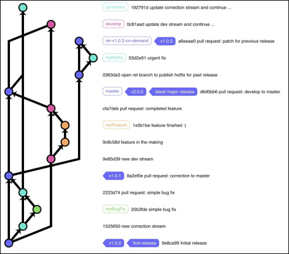

<!-- _class: lead -->

<!-- _paginate: skip -->

# CSCI 232

## 232 Algorithms & Data Structures

### Lecture: 2

J. L. Pach

---

# Outline:

- History of GIT
- GIT
- Review of Navigating the Command Line and Bash
- Git Settings
- Git Basics

---

<!-- _class: caption-slide -->

<!-- _paginate: skip -->

# History

## of GIT

---

# 1. CVS – Concurrent Versions System (c. 1990–2008)

<div class="card justify">

One of the first widely used version control systems.<br>
**Characteristics**:

- Managed versions of individual files, not entire projects.
- Centralized model – a single main repository.

**Limitations**:

- Poor branching support.
- No strong data integrity.
- Slow operations.
- Used in early open-source projects, including Linux in its early stages.

</div>

---

# 2. BitKeeper (2000–2018)

<div class="card justify">

A **commercial**, distributed version control system known for speed.<br>
From 2002, it was **free for the Linux community** under a special license.

**Why it mattered:**

- Linus Torvalds used it to manage the Linux kernel codebase.

**Crisis in 2005:**

- Andrew Tridgell created a tool called SourcePuller by reverse-engineering BitKeeper’s protocol.
- BitMover (Larry McVoy’s company) considered this a license violation and revoked free access.

</div>

---

# 2. BitKeeper (2000–2018)

<div class="card justify lh-25">

**What happened next:**

- In 2016, BitKeeper was open-sourced under the Apache 2.0 license.
- Last release: 2018.
- Today, it’s practically abandoned—Git completely replaced it.

</div>

---

# 3. The Birth of Git (2005)

<div class="card justify">

After losing BitKeeper, Linus Torvalds set requirements for a new tool:

- **Free and open source.**
- **Distributed** (every user has the full history).
- **Extremely fast** (apply a patch in \<3 seconds).
- **Resilient to corruption.**

**Timeline**:

- April 3, 2005 – development begins.
- June 2005 – first release.

</div>

---

# 3. The Birth of Git (2005)

<div class="card justify lh-25">

The name **\*Git**\*:

- *Global Information Tracker* (when it works well).
- \*Goddamn Idiotic Truckload of \*\*\*\_\_ (when it doesn’t).<br>
Officially: *the stupid content tracker.*

</div>

---

# Git - Global Information Tracker

<div class="card justify lh-20 ">

- Git is a free and open source distributed version control system designed to handle everything from small to very large projects with speed and efficiency.
- Git is easy to learn and has a tiny footprint with lightning fast performance. It outclasses SCM tools like Subversion, CVS, Perforce, and ClearCase with features like cheap local branching, convenient staging areas, and multiple workflows.

Docs: [https://git-scm.com/doc](https://git-scm.com/doc)

</div>

---

# What is Git? (Simple Definition for Beginners)

<div class="card justify">

Git is a version control system. Its main job is to track every change in your code and allow you to go back to previous versions if needed. It also lets you compare changes between versions.

But **Git** does more than that:

1. It allows multiple developers to work on the same project at the same time by creating alternative versions of the code, called branches.
2. These branches can later be merged back together. If two people changed the same part of the code, Git will show a conflict that needs to be resolved.
3. This makes Git perfect for collaborative work and for projects that evolve quickly.

</div>

---

# Git in Agile & plan-driven

<div class="card justify lh-25">

- In Agile development, where code changes often and quality can drop over time, Git helps by making refactoring and merging much easier.

- In more rigid, plan-driven approaches, branching and merging might be less frequent, but Git is still useful for tracking history and avoiding mistakes.

</div>

---

<!-- _class: caption-slide -->

<!-- _paginate: skip -->

# Windows vs Linux

## Command Conventions

---

# Windows vs Linux Command Conventions

<div class="card justify lh-20">

- In Windows command-line environments such as Command Prompt (cmd) (and the more modern PowerShell), you typically run programs by typing their name, for example:

`ping`

- This actually runs ping.exe (the operating system automatically appends the .exe or .com extension). After the command, you add parameters separated by spaces.
- In Windows, **parameters are usually preceded by / (slash) or sometimes - (hyphen/dash).**

</div>

---

# Windows vs Linux Command Conventions

<div class="card justify lh-10">

The traditional way to get help for a command is by using /? or -h or /h. For example:

`ping /?` , `dir /?`

This displays the available options for that command.

```powershell
C:\>ping /?
Usage: ping [-t] [-a] [-n count] [-l size] [-f] [-i TTL] [-v TOS]
            [-r count] [-s count] [[-j host-list] | [-k host-list]]
            [-w timeout] [-R] [-S srcaddr] [-c compartment] [-p]
            [-4] [-6] target_name
Options:
    -t             Ping the specified host until stopped.
                   To see statistics and continue - type Control-Break;
                   To stop - type Control-C.
    -a             Resolve addresses to hostnames.
    -n count       Number of echo requests to send.
```

</div>

---

# Windows vs Linux Command Conventions

<div class="card justify lh-10">

In Linux/Unix systems, a different convention is used:

- Parameters are preceded by - **(single dash)** for short options (usually one letter), and these can often be combined.
- Parameters are preceded by -- (**double dash)** for long, descriptive options, which cannot be combined.

```bash
student@pi5v:~ $ ping --help
Usage
  ping [options] <destination>
Options:
  <destination>      dns name or ip address
  -a                 use audible ping
  -A                 use adaptive ping
  -B                 sticky source address
  -c <count>         stop after <count> replies
```

</div>

---

# Why Git Works

## on Multiple Consoles in Windows

<div class="card justify lh-10">

Since Git was originally developed to manage the Linux kernel and is open source, the Windows version of Git can run in at least three different command-line environments:

- **Git Bash**: A Linux-like shell that recognizes common Linux commands such as ls, touch, mkdir, etc.
- **Command Prompt (cmd)**: The classic Windows command line, compatible with MS-DOS conventions.
- **PowerShell**: A powerful Windows shell, significantly different from cmd. It supports some Linux-like commands, but there are important differences between PowerShell and Bash, which often confuse beginners when using Git in PowerShell.

</div>

---

# Why Git Works

## on Multiple Consoles in Windows

<div class="card justify lh-10">

Regardless of which console you use, Git follows the Linux/Unix convention for command-line options:

- A single dash (-) for short, single-letter options (which can often be combined).

- A double dash (--) for long, descriptive options (which cannot be combined).

  | Console | Typical Use | Linux Commands Supported? |
  | --- | --- | --- |
  | Git Bash | Yes | Fully supported |
  | CMD | Yes | No |
  | PowerShell | Yes | Partially (aliases) |

</div>

---

# Git Settings

<div class="card justify lh-10">

Let’s start by configuring Git. Every user—whether on Windows or Linux—has their own local Git settings. Here are the key commands:

```powershell
git config --global user.name "Jacob Pach"       # Sets your name for commits
git config --global user.email "jpach@mtech.edu" # Sets your email for commits
git config --global core.editor "code --wait"    # Sets VS Code as the default editor
git config --global -e                           # Opens the global config file for editing
git config --global core.autocrlf true           # Handles line endings (important on Windows)
```

</div>

---

# git config

## `--global core.autocrlf true`

<div class="card justify lh-10">

This Git configuration command ensures consistent handling of line endings across different operating systems. When set to true, Git automatically converts Windows-style carriage return + line feed (CRLF) to Unix-style line feed (LF) when committing, and converts back to CRLF when checking out files on Windows. This helps prevent issues caused by inconsistent line endings in collaborative projects involving multiple platforms.

`CRLF <--> LF`

</div>

---

# GIT commands

<div class="card justify lh-10">

- init
- status
- add
- commit
- log
- branch
- switch / checkout
- merge

</div>

---

# GIT `init`

<div class="justify lh-10">

This command initializes a new Git repository in the current directory. It creates a hidden .git folder that stores all version control data. After running git init, you can start tracking changes, committing files, and using other Git features. It’s typically the first step when starting a new project with Git.

</div>

```powershell
.git
+---hooks
+---info
+---logs
+---objects
+---refs
|   COMMIT_EDITMSG
|   config
|   description
|   HEAD
|   index
```

---

# GIT `status`

<div class="justify lh-10">

This command displays the current state of the working directory and staging area. It shows which files have been modified, staged for commit, or are untracked. It helps developers understand what changes are pending and whether they need to add, commit, or discard changes. It’s a key tool for tracking progress and avoiding mistakes during version control.

</div>

```powershell
$ git status
On branch master

No commits yet

nothing to commit (create/copy files and use "git add" to track)
```

---

# GIT `status -s` - Short Status View

<div class="card justify lh-10">

This command shows a condensed version of git status, making it easier to quickly scan changes. It uses symbols to indicate the state of each file:

- ?? – Untracked file (not added to Git yet)
- A – File added to staging area
- M – Modified file
- D – Deleted file
- R – Renamed file

Each line shows the status and the filename, making it ideal for fast reviews during development. `git status -s` is especially useful when working with many files. It helps you stay focused and avoid clutter from long status messages.

</div>

---

# Git Workflow: Understanding the Three Main Areas

<div class="card justify lh-10">

- **Directory / Working Space**<br>
This is where you actively edit files. Changes made here are not yet tracked by Git unless added to the staging area. It reflects your current work-in-progress.
- **Staging Area**<br>
Also known as the index (“checkpoint”), this is a preparation zone where you place changes that you intend to commit. It allows you to selectively group changes before saving them to the repository.
- **Repository**<br>
This is the permanent storage area where committed changes are saved. It contains the full history of your project and allows you to track, revert, or collaborate on code over time.

</div>

---

# Adding a file to our directory

<div class="card justify lh-10">

Let's try adding a file to our directory by creating the first file, `firstFile.txt`, using the touch command. Then, we can check the status of our repository to see how Git tracks this new file.

```powershell
$ touch firstFile.txt
$ git status
On branch master
No commits yet
Untracked files:
  (use "git add <file>..." to include in what will be committed)
        firstFile.txt
nothing added to commit but untracked files present (use "git add" to track)
```

</div>

---

# Adding a file to our directory

<div class="card justify lh-10">

```powershell
$ touch firstFile.txt
$ git status
On branch master
No commits yet
Untracked files:
  (use "git add <file>..." to include in what will be committed)
        firstFile.txt
nothing added to commit but untracked files present (use "git add" to track)
```

Git has detected a new file, `firsFile.txt`, but it is untracked, meaning it is not yet being monitored by Git, and  suggests using `git add <file>` to start tracking the file and include it in the next commit.  This is a typical state right after creating a new file in a freshly initialized repository.

</div>

---

# Git Add – Wildcards and Patterns

<div class="card justify lh-20">

Git allows you to use patterns to add multiple files at once. Here’s what each one does: <br>

- `git add *.*`   - Adds all files in the current directory that have a dot in their name - typically files with extensions (e.g., .txt, .js, .py). It won’t add files without extensions.
- `git add *.txt`   - Adds only files with the .txt extension in the current directory. This is useful when you want to stage a specific type of file.
- `git add .`   - Adds all changes in the current directory and subdirectories - including new, modified, and deleted files. This is the most comprehensive option and is commonly used when you're ready to stage everything.

</div>

---

# Git Add – Be Careful with Bulk Actions

<div class="card justify lh-20">

Although Git offers graphical interfaces and many conveniences — including the ability to add multiple files at once using patterns like git add . — in practice, especially early in your Git journey (and even later as a professional), it's often safer to add files individually or in a carefully reviewed list.<br>
**Why?**<br>
Bulk adding (`git add .` or `git add *.txt`) can easily include unintended changes.<br>
Mistakes in staging can lead to confusing commits or even bugs. While it's possible to revert to a previous commit, it’s more complex than simply taking a moment to review and add files intentionally.

</div>

---

# First commit – `git commit`

<div class="card justify lh-20">

- When you run git commit, Git opens your default text editor (like Notepad or VSC) and waits for you to enter a commit message. This message should briefly describe the changes you’re saving to the repository.
- The message is important because it becomes part of the project’s history and helps others (and your future self) understand what was changed and why.

<br>

```powershell
$ git commit
hint: Waiting for your editor to close the file...
```

</div>

---

# Commit Message Conventions

<div class="card justify lh-10">

It’s important to be consistent in how you write commit messages. Two common styles are:

- **Present tense** (recommended): Fix bug in login form. Add validation to email field. This style is preferred because it describes what the commit does to the codebase.
- **Past tense**: Fixed bug in login form. Added validation to email field. This is also acceptable, but less common in collaborative projects.
- **Avoid progressive tense** (e.g., “fixing”, “adding”) because it suggests an ongoing action, not a completed change.

Use short, clear messages in the present tense to describe what your commit does. This keeps the project history clean and easy to read. Choose one style and be consistent.

</div>

---

# Git Commit – Editor Message Flow

<div class="card justify lh-10">

- When you run git commit without the `-m` flag,
  - Git opens your default text editor
  - in our case, Visual Studio Code (VSC)
  - and waits for you to write a commit message.

```powershell
Add firstFile.txt
# Please enter the commit message for your changes. Lines starting
# with '#' will be ignored, and an empty message aborts the commit.
#
# On branch master
#
# Initial commit
#
# Changes to be committed:
#	new file:   firstFile.txt
#
```

- The first line of the message should be short and descriptive
  - this is the summary that appears in logs and history.
- You can optionally add a longer description below, separated by a blank line, to explain the change in more detail.
- The rest of the file may contain comments or instructions from Git (lines starting with #). These can be left as-is or removed.
- Once you're done, save and close the file. Git will then finalize the commit and return you to the terminal.

</div>

---

# Git Commit – Editor Message Flow

```powershell
Add firstFile.txt
# ...
#
```

<div class="card justify lh-10">

- The first line of the message should be short and descriptive
  - this is the summary that appears in logs and history.
- You can optionally add a longer description below, separated by a blank line, to explain the change in more detail.

The rest of the file may contain comments or instructions from Git (lines starting with #). These can be left as-is or removed. Once you're done, save and close the file. Git will then finalize the commit and return you to the terminal.

</div>

---

# Using `git commit -m "message"`

<div class="card justify lh-10">

**Shortcut for Commit Messages**

Instead of typing git commit and opening the default editor, you can write your commit message directly in the terminal using: `$ git commit -m "Your commit message"`

- This saves time and avoids switching to the editor. The message should be short and descriptive.
- Use `-m` when your message is simple and clear. For longer or multi-line messages, it's better to use the editor to provide more context

</div>

---

# `git ls-files` – List Tracked Files

<div class="card justify lh-10">

This command displays all the files that Git is currently tracking in your repository. It shows the contents of the index (staging area), not the working directory. That means:

- Files listed by git ls-files are already added to Git using git add.
- Untracked files (new files not yet added) will not appear in this list.
- It’s useful for checking which files are under version control, especially in large projects.

```powershell
$ git ls-files
firstFile.txt
```

Use git ls-files to verify which files are being tracked by Git. If a file doesn’t appear, it’s either untracked or ignored via .gitignore.

</div>

---

# `git log`– Commit History

<div class="card justify lh-10">

This command displays the complete commit history of the repository. Each entry includes:

- The commit hash (a unique ID)
- Author name and email
- Date and time of the commit
- The full commit message
- It’s useful for reviewing detailed information about each change made to the project.

```powershell
$ git status
On branch master
nothing to commit, working tree clean
```

</div>

---

# `git log`– Example

<div class="card justify lh-20">

This command displays the complete commit history of the repository

```powershell
$ git log
commit d06aafaf2cd37f5bc7cd4015656e1ae15241c996 (HEAD -> master)
Author: Jacob Pach <jpach@mtech.edu>
Date:   Thu Aug 28 20:09:17 2025 -0600

    Add firstFile.txt

```

</div>

---

# `git log --oneline` – Simplified View

<div class="card justify lh-10">

This version shows a condensed list of commits, with:

- A shortened commit hash
- The first line of the commit message

It’s ideal for quickly scanning the history or identifying specific commits without all the extra details.

```powershell
$ git log --oneline
d06aafa (HEAD -> master) Add firstFile.txt
```

Use git log when you need full context, and git log --oneline when you want a quick overview. Both are essential tools for navigating and understanding your project’s history.

</div>

---

# Removing Committed Files in Git

## Important Note

<div class="card justify lh-20">

Be careful when removing files that have already been committed. If, for example, firstFile.txt is no longer needed in future commits, and you delete it manually from the repository folder, Git won’t automatically recognize this change.<br>
To inform Git that the file was intentionally removed, you must add the deletion using: `git add firstFile.txt`

- This may seem counterintuitive, but it tells Git: *I want this deletion to be part of the next commit.* Once committed, the file will no longer exist in the current branch.

</div>

---

# Removing Committed Files in Git

## Important Note

<div class="card justify lh-25">

Of course, you can always restore the file by checking out a previous commit where it still existed.

Git tracks changes — including deletions — only when you explicitly stage them.<br>
Use git add even for removed files to make the change part of your commit history.

</div>

---

# Renaming Files in Git

## Important Note

<div class="card justify lh-10">

When working with Git, it's important to understand how file renaming is handled. Git does not automatically detect a rename as a single action. Instead, it treats it as:

- Deletion of the old file
- Creation of a new, untracked file

So, if you rename a file manually (e.g., from `oldName.txt` to `newName.txt`), Git will see `oldName.txt` as deleted and `newName.txt` as a new file. To properly reflect this change in Git, you should:

```powershell
git add oldName.txt
git add newName.txt
git commit -m "Renamed file from oldName.txt to newName.txt"
```

Git doesn’t track file names — it tracks content. Renaming a file is treated as removing one and adding another. Always stage both the deletion and the new file to keep your history clean and understandable.

</div>

---

# Shortcut - `git commit -am "message"`

## Stage and Commit in a Single Command

<div class="card justify lh-10">

The `-am` flag combines staging (**a**dd) and committing (**m**essage) into one step:

```bash
git commit -am "Your commit message here"
```

- **Saves Time**: Eliminates the separate `git add .` step for modified files.
- **Keeps Focus**: Keeps your workflow fast when making quick, iterative changes.
- **Cleaner Terminal History**: Reduces repetitive status checks and staging commands.

**Important Note**: This flag only works for modified or deleted tracked files. Brand new (**untracked**) files still require an explicit git add `<file>`.

</div>

---

# What is .gitignore?

<div class="card justify lh-20">

The `.gitignore` file tells Git which files or directories to ignore — meaning they won’t be tracked, staged, or committed to the repository.<br>
This is useful for:

- Temporary files (e.g., .log, .tmp)
- Build artifacts (e.g., bin/, obj/)
- IDE-specific files (e.g., .vscode/, .DS\_Store)
- Secrets or configuration files (e.g., .env, config.local.json)

</div>

---

# How It Works - .gitignore?

<div class="card justify lh-10">

You create a file named `.gitignore` in the root of your repository and list patterns for files or folders you want Git to skip. Example:

```powershell
*.log
*.tmp
node_modules/
.env
```

- Git will ignore any file or folder that matches these patterns — even if they exist in your working directory.
- Use `.gitignore` to keep your repository clean and focused only on the files that matter. It helps avoid accidentally committing sensitive data or unnecessary clutter.

</div>

---

# Understanding .gitignore – File, Not a Folder

<div class="card justify lh-10">

It’s important to know that `.gitignore` is a **file**, not a folder. The naming convention comes from Linux/Unix systems, where files that start with a dot `.` are treated as hidden or configuration files. From a Windows perspective, `.gitignore` may appear as a file without a name and with an extension, or simply as a special file with no extension, starting with a dot. This can be confusing at first, but it’s a common pattern in many development environments.

Examples of similar hidden/config files in Linux:

- `.ssh/` – stores SSH keys and config
- `.vscode/` – stores VS Code workspace settings

These dot-prefixed files and folders are used to configure tools and environments without cluttering the main workspace.

</div>

---

# What Is a Git Branch?

<div class="card justify lh-20">

A branch in Git is like a separate line of development. It allows you to work on new features, bug fixes, or experiments without affecting the main codebase. The default branch is usually called main or master.



</div>

---

# What Is a Git Branch?

<div class="card justify lh-25">

- Branches help teams collaborate safely and efficiently by isolating changes until they’re ready to be merged.
- Think of branches as parallel timelines. You can develop safely in one branch, test your changes, and merge them back when everything works. This is a core concept in modern version control.

</div>

---

# `git branch` – Create a new branch

<div class="card justify lh-20">

- The command git branch shows a list of all branches in your repository. The currently active branch is marked with an asterisk (\*) `git branch new_branch`
- When working with a repository that has multiple branches, we can switch between them using two different commands. This is because modern versions of Git introduced standardized naming conventions, but the older commands were kept to ensure backward compatibility and to avoid forcing experienced users to relearn everything from scratch.<br>
`$ git switch second_branch` or `$ git checkout second_branch`

</div>

---

# `Git status` & `git branch`

```powershell
git branch
* master
  second
```

```powershell
git status
On branch master
...
```

<div class="justify lh-20">

Depending on the shell or terminal, Git can display additional information in the prompt, such as the current branch, whether all files are tracked, or if there are uncommitted changes. However, to check which branch you are on, you can always use the git status command or git branch without any parameters.

</div>

---

# `Git Merge`

<div class="card justify lh-20">

- A merge combines changes from one branch into another.
- **Typically, we merge into the main/master branch.**
- Example workflow:
  - Switch/Checkout main
  - Run git merge feature-branch
  - main now includes the changes from feature-branch

</div>

---

# `Git Merge`

<div class="card justify lh-20">

A merge creates a merge commit that keeps both branch histories visible. Useful when you want a complete history of how branches diverged and then rejoined.

## Run from main

```powershell
A---B---C---D  (main)
         \
          E---F (feature)

```

```powershell
A---B---C---D---M  (main)
         \     /
          E---F
```

</div>

---

<!-- _class: caption-slide -->

<!-- _paginate: skip -->

# Thank

## You
