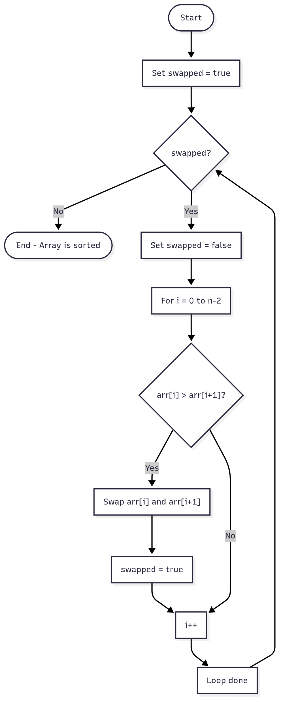

<!-- _class: lead -->

# Data Structures &amp; Algorithms

## Lecture 7
---

# In 136, we covered

- Objects and classes, Abstract Data Types – lots of coverage.  I required class and header files in most assignments
- Time and Space complexity – a discussion was included in each exercise.  Good coverage of constant time, linear, n2, n3, with loops and nested loops.  Didn’t do any of the math.
- Arrays and 2D arrays, and “2D” vectors, along with Big-O and execution time tests with larger structures.  Students had a LOT of coverage
- Linked List and Sorted Linked List – students had to write their own class/header files and driver for each
- Stack and Queue – students were given .h files, had to write the class and member functions and driver
- Maze using stack and queue in Python – students were given classes, had to write DFS and BFS with much assistance and examples
- Lecture coverage of memory allocation, memory usage, static variables, compilation, memory leaks, dangling pointers, comparison of C and C++, binary search, examples of object-oriented programming and ADT’s in C++, Python, Java
- Parameter passing, command line arguments, scope – good coverage
- Pointers – medium coverage, mostly with parameter passing.  We didn’t use them in any useful way.
- Recursion – weak coverage
- Visual Studio – all the time

---

# Today’s Agenda

- An algorithm
- NP vs P
- Bubble sort

---

# An Algorithm

---

# Meaning of words

Sometimes, when we look at the same thing, we see entirely different things. Therefore, to avoid misunderstandings, I will spend a considerable amount of time clarifying the nuances associated with translating the meanings of the concepts we will be using in our classes.


---

# Algorithm

- Informally, an **algorithm** is any well-defined computational procedure that takes some value, or set of values, as **input** and produces some value, or set of values, as **output**. An algorithm is thus a sequence of computational steps that transform the input into the output.
- We can also view an algorithm as a tool for solving a well-specified **computational problem**. The statement of the problem specifies in general terms the desired input/output relationship. The algorithm describes a specific computational procedure for achieving that input/output relationship.

---

# Algorithm

---

# Algorithm

Such an input sequence is called an **instance** of the sorting problem. In general, an **instance of a problem** consists of the input (satisfying whatever constraints are imposed in the problem statement) needed to compute a solution to the problem.

An algorithm is said to be **correct** if, for every input instance, it halts with the correct output. We say that a correct algorithm solves the given computational problem. An incorrect algorithm might not halt at all on some input instances, or it might halt with an incorrect answer.

<!-- an **instance of a problem** (egzemplarz problem sortowania) -->

---

# Practical applications of algorithms

- The Human Genome Project has made great progress toward the goals of identifying all the 100,000 genes in human DNA, determining the sequences of the 3 billion chemical base pairs that make up human DNA.
- The Internet enables people all around the world to quickly access and retrieve large amounts of information. With the aid of clever algorithms, sites on the Internet are able to manage and manipulate this large volume of data.
- Electronic commerce enables goods and services to be negotiated and exchanged electronically, and it depends on the privacy of personal information such as credit card numbers, passwords, and bank statements.

---

# Practical applications of algorithms

- Manufacturing and other commercial enterprises often need to allocate scarce resources in the most beneficial way.
- We are given a road map on which the distance between each pair of adjacent intersections is marked, and we wish to determine the shortest route from one intersection to another.

---

# Two characteristics that are common to many interesting algorithmic problems

- They have many candidate solutions, the overwhelming majority of which do not solve the problem at hand. Finding one that does, or one that is “best,” can present quite a challenge.
- They have practical applications. Of the problems in the above list, finding the shortest path provides the easiest examples. A transportation firm, such as a trucking or railroad company, has a financial interest in finding shortest paths through a road or rail network because taking shorter paths results in lower labor and fuel costs.

---

# Data structures

- We have got several data structures. **A data structure** is a way to store and organize data in order to facilitate access and modifications. No single data structure works well for all purposes, and so it is important to know the strengths and limitations of several of them.

---

# Hard problems

- Most of this course is about efficient algorithms. Our usual measure of efficiency is speed, i.e., how long an algorithm takes to produce its result. There are some problems, however, for which no efficient solution is known.
- An interesting subset of these problems, which are known as NP-complete. <br>(nondeterministic polynomial-time complete).
- Why are NP-complete problems interesting? First, although no efficient algorithm for an NP-complete problem has ever been found, nobody has ever proven that an efficient algorithm for one cannot exist.

<!-- tu za rok lub dwa, rozwinac kwestie nondeterministic polynomial-time complete, ze deterministyczne to te z ktorych korzystamy a nie deterministyczne to takie teoretyczne, ktore znaja wszystkio.... -->

---

# NP vs P

---

# NP vs P

- NP problems are those for which the correctness of a given **solution can be verified in polynomial time**.
- P problems, on the other hand, **can be solved in polynomial time**.
- Imagine having a riddle. Finding the solution to this riddle might be very difficult and time-consuming. However, if someone gives you a solution, you can quickly verify whether it is correct. This is somewhat analogous to NP problems: finding a solution can be hard, but verifying a given solution is easy.

---

# NP-complete example

- As a concrete example, consider a delivery company with a central depot. Each day, it loads up each delivery truck at the depot and sends it around to deliver goods to several addresses. At the end of the day, each truck must end up back at the depot so that it is ready to be loaded for the next day. To reduce costs, the company wants to select an order of delivery stops that yields the lowest overall distance traveled by each truck. This problem is the well-known “**traveling-salesman problem**,” and it is **NP-complete**. It has no known efficient algorithm. Under certain assumptions, however, we know of efficient algorithms that give an overall distance which is not too far above the smallest possible.

---

# Algorithm notation systems

---

# An algorithm can be represented in at least three ways

- **Flowchart:**
  - This involves breaking down the algorithm into elementary control blocks such as start, stop, data input, output, conditional statements, etc.
- **Bullet point description:**
  - The individual steps are described verbally using bullet points. The points are numbered to allow for a clear description of the method's flow.
- **Pseudocode:**
  - Pseudocode resembles a programming language like Pascal\*, but only uses keywords such as var, begin, end, for, etc."

<!-- but We will be using -->

---

# Pseudocode resembles a programming language like Pascal\*

When the C language was being born, Pascal was already a popular language. It contributed significantly—or even profoundly—to the world of programming, but it did not stand the test of time. Languages derived from C eventually replaced it entirely. Today, Python is the most popular language for describing programming concepts due to its simplicity, so pseudocode will be a mixture of natural language and a specific programming language.

---

# Flowchart

A flowchart is a graphical representation of an algorithm. It uses shapes to represent different types of operations and arrows to indicate the flow of control between them.

Use tape

**Maintenance Flowchart**

Does it move?

Should it?

Should it?

**DONE**

Use WD40

YES

NO

NO

YES

NO

YES

---

# Flowchart symbols

|**Shape**|**Name**|**Description**|
|---|---|---|
||Flowline/Arrowhead|Shows the process's order of operation. A line coming from one symbol and pointing at another.|
||Terminal|Indicates the beginning and ending of a program or sub-process.|
||Process|Represents a set of operations that changes value, form, or location of data.|
||Decision|Shows a conditional operation that determines which one of the two paths the program will take.|
||Input/Output|Indicates the process of inputting and outputting data.|

these are basic symbols

---

# Flowchart symbols

|**Shape**|**Name**|**Description**|
|---|---|---|
||Predefined Process/A Black Box|Shows named process which is defined elsewhere.|
||(On-page) Connector|Pairs of labeled connectors replace long or confusing lines on a flowchart page.|
||(Off-page) Connector|A labeled connector for use when the target is on another page.|
||Data File or Database|Data represented by a cylinder symbolizing a disk drive/any kind...|

these are basic symbols

---

# Flow diagram a C-style for loop, representing the following code:

```c
for ( i = 0; i < n; i++)
{
	printf("*");
}
```

start

end

TRUE

i = 0

i&lt;5?

printf("\*")

i++

FALSE

---

# Bullet point description

**Input:**

- N:    Number of elements in the array, integer type
- Arr:    Array of double type

**Output:**

- Maximum:    Variable of double type

**Method:**

- Initialize Maximum to the first element of the array (Arr\[0\]) and set Index to 0.
- Increment Index by 1.
- If Index is less than N, go to step 4. Otherwise, proceed to step 6.
- If Maximum is less than the element at the current index (Arr\[Index\]), <br>update Maximum to the value at Arr\[Index\].
- Go back to step 2.
- Print the Maximum value and end the program.

---

# Pseudocode (pascal\*)

```pascal
function factorial(n: integer): integer;
begin
if n = 0 then
factorial := 1
else
factorial := n * factorial(n - 1);
end;
```

---

# Advantages and Disadvantages of Flowchart Algorithm Representation

- Advantages:
  - **Visualization**:    Presents the algorithm in a graphical manner, making it easier to understand, especially for visual learners.
  - **Intuitiveness**:    Arrows and shapes clearly show the sequence of actions.
  - **Universality**:    Can be used to represent various types of algorithms, regardless of the programming language.
- Disadvantages:
  - **Complexity**:    For large and complex algorithms, the diagram can become unreadable.
  - **Time-consuming**:    Creating a detailed flowchart can be time-consuming.
  - **Limitations in expressing certain concepts**: It's not always easy to represent more abstract concepts in a flowchart.

---

# Advantages and Disadvantages of Bullet point description of Algorithm Representation

- Advantages:
  - **Simplicity**:    Easy to understand, even for beginners.
  - **Flexibility**:    Natural language can be used, allowing for more detailed explanations.
  - **Focus on the idea**:    Allows you to focus on the main idea of the algorithm, rather than implementation details.
- Disadvantages:
  - **Lack of formality**:     Not as precise as pseudocode or a flowchart.
  - **Potential ambiguity**:    Interpretation of individual points may vary depending on the reader.
  - **Limitations for complex algorithms**: For more complex algorithms, a bullet point list may be insufficient.


---

# Advantages and Disadvantages of Pseudocode of Algorithm Representation

- Advantages:
  - **Intermediate between natural language and programming language**: Easier to understand than pure code, but more formal than a bullet point description.
  - **Precision**:     Allows for a precise description of the algorithm's steps.
  - **Programming language independence**: Can be easily\* translated into any programming language.
- Disadvantages:
  - **Less intuitive than a flowchart**: Requires more effort to understand the algorithm's logic.
  - **Possibility of errors**: If the pseudocode is not written carefully, it may contain inaccuracies.

---

# Bubble sort

---

# Bubble sort

Bubble sort is a simple sorting algorithm that works by repeatedly stepping through the list, comparing adjacent elements, and swapping them if they're in the wrong order. The algorithm gets its name because smaller or larger elements "bubble" up to their correct position in the list with each pass. It's an easy-to-understand algorithm, often taught as an introductory example in computer science.

---

# Bubble sort

**Bullet Point Description (Simply Bubble Sort)**

- Start with an array of integers and its size n.
- Initialize a flag swapped = true to enter the loop.
- While swapped is true:
  - Set swapped = false at the beginning of each pass.
  - Iterate through the array from index 0 to n-2.
  - Compare each element with the next one:
    - If the current element is greater than the next, swap them.
    - Set swapped = true to indicate that a change was made.
- The process continues until a full pass occurs with no swaps (array is sorted).



---

# Bubble sort

**Bullet Point Description (Simply Bubble Sort)**

- Start with an array of integers and its size n.
- Initialize a flag swapped = true to enter the loop.
- While swapped is true:
  - Set swapped = false at the beginning of each pass.
  - Iterate through the array from index 0 to n-2.
  - Compare each element with the next one:
    - If the current element is greater than the next, swap them.
    - Set swapped = true to indicate that a change was made.
- The process continues until a full pass occurs with no swaps (array is sorted).


---

# Bubble sort - Strengths and Weaknesses

- Bubble sort's main strength is its **simplicity**. It's easy to implement and understand. It's also an **in-place algorithm**, meaning it doesn't require extra memory to perform the sort. This makes it efficient in terms of space.
- However, its weaknesses far outweigh its strengths. The most significant weakness is its poor **performance**. Bubble sort has a worst-case and average-case time complexity of O(n2), which makes it highly inefficient for large datasets. For every element in the list, it has to perform a comparison and a potential swap, which quickly becomes computationally expensive as the number of items grows. The algorithm's inefficiency means it's rarely used in real-world applications where performance is critical. It also performs many unnecessary swaps, making it less efficient than other simple sorting algorithms like insertion sort.

---

# C

```c
void simplyBubbleSort(int arr[], int n)
{
    bool swapped = true;
    while (swapped)
    {
        swapped = false;
        for (int i = 0; i < n - 1; i++)
        {
            if (arr[i] > arr[i + 1])
            {
                int temp = arr[i + 1];
                arr[i + 1] = arr[i];
                arr[i] = temp;
                swapped = true;
            }
        }
    }
}
```

---

# C/C++

```c
void bubbleSort(int arr[], int n)
{
    int temp;
    int i = 0;
    char swapped = 1;
    while (swapped)
    {
        swapped = 0;
        for (i = 0; i < n - 1; i++)
        {
            if (arr[i] > arr[i + 1])
            {
                temp = arr[i + 1];
                arr[i + 1] = arr[i];
                arr[i] = temp;
                swapped = 1;
            }
        }
        //if (swapped == 0)
        //    break;
    }
}
```

---

# C/C++

```c
void bubbleSort(int arr[], int n)
{
    int temp;
    int i = 0;
    char swapped = 1;
    while (swapped)
    {
        swapped = 0;
        for (i = 0; i < n - 1; i++)
        {
            if (arr[i] > arr[i + 1])
            {
                swap(&arr[i], &arr[i + 1]);
                swapped = 1;
            }
        }
        if (swapped == 0)
            break;
    }
}
```

```c
void swap(int* xPointer, int* yPointer)
{
    int temp =  *xPointer;
    *xPointer = *yPointer;
    *yPointer = temp;
}
```

---

# Questions?

---

<!-- _class: caption-slide -->

# Thank You

---

# Algorithm notation systems

---

# Efficiency – an example

<!-- For a concrete example -->

---

# Efficiency – an example

<!-- For a concrete example -->

---

# Efficiency – an example

By using an algorithm whose running time grows more slowly, even with a poor compiler, computer **B** runs more than 17 times faster than computer **A**! The advantage of merge sort is even more pronounced when we sort 100 million numbers: where insertion sort takes more than 23 days, merge sort takes under four hours. In general, as the problem size increases, so does the relative advantage of merge sort.

<!-- For a concrete example -->
