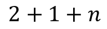
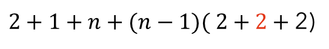
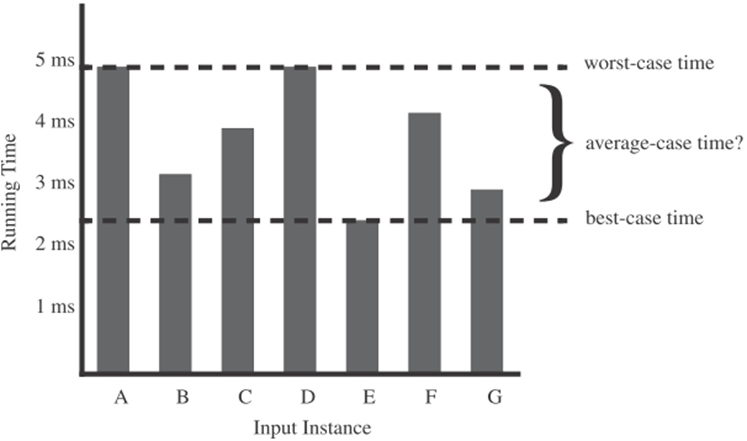

<!-- _class: lead -->

# Data Structures &amp; Algorithms

## Lecture 12

---

# Today’s Agenda

- Logarithmic and Exponential Rules
- Asymptote
- Asymptotic notation
  - Θ-notation
  - Ω-notation

---

# algorithm correctness

---

Searching for the maximum value in an array

```c
int arrayMax(int A[], int n)
{
    int currentMax = A[0];
    for (int i = 1; i < n; i++)
    {
        if( currentMax < A[i] )
            currentMax = A[i];
    }
    return currentMax;
}
```

```text
Algorithm arrayMax(A, n):
	Input: An array A storing n ≥ 1 integers.
	Output: The maximum element in A.
	currentMax ← A[0]
	for i ← 1 to n - 1 do
    	if currentMax < A[i] then
        	currentMax ← A[i]
	return currentMax
```

<!-- chooseAndSwapArrayWithLargerFirstElement(&amp;arr1, &amp;arr2); -->

---

# Curio

```c
int arrayMax(int A[], int n)
{
    int currentMax = A[0];
    for (int i = 1; i < n; i++)
        currentMax = currentMax < A[i] ? A[i] : currentMax;
    return currentMax;
}
```

```c
int arrayMax(int A[], int n)
{
    int currentMax = A[0];
    for (int i = 1; i < n; i++)
    {
        if( currentMax < A[i] )
            currentMax = A[i];
    }
    return currentMax;
}
```

<!-- chooseAndSwapArrayWithLargerFirstElement(&amp;arr1, &amp;arr2); -->

---

<!-- _class: fit-50 -->

# Using pseudo-code to prove algorithm correctness

By inspecting the pseudocode, we can argue about the correctness of algorithm arrayMax with a simple argument. Variable currentMax starts out being equal to the first element of A. We claim that at the beginning of the ith iteration of the loop, currentMax is equal to the maximum of the first i elements in A. Since we compare currentMax to A⁡\[i\] in iteration i, if this claim is true before this iteration, it will be true after it for i+1 (which is the next value of counter i). Thus, after n−1 iterations, currentMax will equal the maximum element in A. As with this example, we want our pseudocode descriptions to always be detailed enough to fully justify the correctness of the algorithm they describe, while being simple enough for human readers to understand.

.

```text
Algorithm arrayMax(A, n):
	Input: An array A storing n ≥ 1 integers.
	Output: The maximum element in A.
	currentMax ← A[0]
	for i ← 1 to n - 1 do
    	if currentMax < A[i] then
        	currentMax ← A[i]
	return currentMax
```

---

<!-- _class: fit-90 -->

# These constructs include the following:

- ***Expressions:*** We use standard mathematical symbols to express numeric and Boolean expressions. We use the left arrow sign (←) as the assignment operator in assignment statements (equivalent to the = operator in C++) and we use the equal sign (=) as the equality relation in Boolean expressions (equivalent to the "==" relation in C++).
- ***Method declarations:*** **Algorithm** name(param1, param2, ...) declares a new method "name" and its parameters.
- ***Decision structures:*** **if** condition **then** true-actions \[**else** false-actions\]. We use indentation to indicate what actions should be included in the true-actions and false-actions, and we assume Boolean operators allow for short-circuit evaluation.
- ***While-loops:*** **while** condition **do** actions. We use indentation to indicate what actions should be included in the loop actions.
- ***Repeat-loops:*** **repeat** actions **until** condition. We use indentation to indicate what actions should be included in the loop actions.
- ***For-loops:*** **for** variable-increment-definition **do** actions. We use indentation to indicate what actions should be included among the loop actions.
- ***Array indexing:*** A⁡\[i\] represents the ith cell in the array A. We usually index the cells of an array A of size n from 1 to n, as in mathematics, but sometimes we instead such an array from 0 to n−1, consistent with C, C++, and Java.
- ***Method calls:*** object.method(args) (object is optional if it is understood).
- ***Method returns:*** **return** value. This operation returns the value specified to the method that called this one.

---

<!-- _class: fit-40 -->

# The random access machine (RAM) model

If we wish to analyze a particular algorithm without performing experiments on its running time, we can take the following more analytic approach directly on the high-level code or pseudocode. We define a set of high-level **primitive operations** that are largely independent from the programming language used and can be identified also in the pseudocode. Primitive operations include the following:

- Assigning a value to a variable
- Calling a method
- Performing an arithmetic operation (for example, adding two numbers)
- Comparing two numbers
- Indexing into an array
- Following an object reference
- Returning from a method/function.

---

<!-- _class: fit-70 -->

# The random access machine (RAM) model

Specifically, a primitive operation corresponds to a low-level instruction with an execution time that depends on the hardware and software environment but is nevertheless constant. Instead of trying to determine the specific execution time of each primitive operation, we will simply count how many primitive operations are executed, and use this number ***t***  as a high-level estimate of the running time of the algorithm. This operation ***count*** will correlate to an actual running time in a specific hardware and software environment, for each primitive operation corresponds to a constant-time instruction, and there are only a fixed number of primitive operations. The implicit assumption in this approach is that the running times of different primitive operations will be fairly similar. Thus, the number, ***t*** , of primitive operations an algorithm performs will be proportional to the actual running time of that algorithm.

---

<!-- _class: fit-40 -->

# The random access machine (RAM) model

If we wish to analyze a particular algorithm without performing experiments on its running time, we can take the following more analytic approach directly on the high-level code or pseudocode. We define a set of high-level **primitive operations** that are largely independent from the programming language used and can be identified also in the pseudocode. Primitive operations include the following:

c1    Assigning a value to a variable

c2    Calling a method

c3    Performing an arithmetic operation (for example, adding two numbers)

c4    Comparing two numbers

c5    Indexing into an array

c6    Following an object reference

c7    Returning from a method.

---

<!-- _class: fit-70 -->

# RAM machine model definition

This approach of simply counting primitive operations gives rise to a computational model called the **Random Access Machine** (RAM). This model, which should not be confused with "random access memory," views a computer simply as a CPU connected to a bank of memory cells. Each memory cell stores a word, which can be a number, a character string, or an address—that is, the value of a base type. The term ***random access*** refers to the ability of the CPU to access an arbitrary memory cell with ***one primitive operation***. To keep the model simple, we do not place any specific limits on the size of numbers that can be stored in words of memory. We assume the CPU in the RAM model can perform any primitive operation in a constant number of steps, which do not depend on the size of the input. Thus, an accurate bound on the number of primitive operations an algorithm performs corresponds directly to the running time of that algorithm in the RAM model.

---

# Counting primitive operations

```text
Algorithm arrayMax(A, n):
	Input: An array A storing n ≥ 1 integers.
	Output: The maximum element in A.
	currentMax ← A[0]
	for i ← 1 to n - 1 do
    	if currentMax < A[i] then
        	currentMax ← A[i]
	return currentMax
```

**c1    Assigning a value to a variable**

**c2    Calling a method**

**c3    Performing an arithmetic operation**

**c4    Comparing two numbers**

**c5    Indexing into an array**

**c6    Following an object reference**

**c7    Returning from a method.**

<!-- I now show how to count the number of primitive operations executed by an algorithm, using as an example algorithm arrayMax. We do this analysis by focusing on each step of the algorithm and counting the primitive operations that it takes, taking into consideration that some operations are repeated, because they are enclosed in the body of a loop. -->

---

# Counting primitive operations

- Initializing the variable currentMax to A\[0\] corresponds to two primitive operations (indexing into an array and assigning a value to a variable) and is executed only once at the beginning of the algorithm. Thus, it contributes two units to the count.

```text
Algorithm arrayMax(A, n):
	Input: An array A storing n ≥ 1 integers.
	Output: The maximum element in A.
	currentMax ← A[0]
	for i ← 1 to n - 1 do
    	if currentMax < A[i] then
        	currentMax ← A[i]
	return currentMax
```

```text
currentMax ← A[0]
```

**c1    Assigning a value to a variable**

**c2    Calling a method**

**c3    Performing an arithmetic operation**

**c4    Comparing two numbers**

**c5    Indexing into an array**

**c6    Following an object reference**

**c7    Returning from a method.**


<!-- I now show how to count the number of primitive operations executed by an algorithm, using as an example algorithm arrayMax. We do this analysis by focusing on each step of the algorithm and counting the primitive operations that it takes, taking into consideration that some operations are repeated, because they are enclosed in the body of a loop. -->

---

# Counting primitive operations

- At the beginning of the for loop, counter i is initialized to 1. This action corresponds to executing one primitive operation (assigning a value to a variable).

```text
Algorithm arrayMax(A, n):
	Input: An array A storing n ≥ 1 integers.
	Output: The maximum element in A.
	currentMax ← A[0]
	for i ← 1 to n - 1 do
	if currentMax < A[i] then
	currentMax ← A[i]
	return currentMax
```

```text
i ← 1
```

**c1    Assigning a value to a variable**

**c2    Calling a method**

**c3    Performing an arithmetic operation**

**c4    Comparing two numbers**

**c5    Indexing into an array**

**c6    Following an object reference**

**c7    Returning from a method.**


<!-- I now show how to count the number of primitive operations executed by an algorithm, using as an example algorithm arrayMax. We do this analysis by focusing on each step of the algorithm and counting the primitive operations that it takes, taking into consideration that some operations are repeated, because they are enclosed in the body of a loop. -->

---

# Counting primitive operations

- Before entering the body of the for loop, condition i &lt; n is verified. This action corresponds to executing one primitive instruction (comparing two numbers). Since counter i starts at 1 and is incremented by 1 at the end of each iteration of the loop, the comparison i &lt; n is performed n  times. Thus, it contributes n units to the count.

```text
Algorithm arrayMax(A, n):
	Input: An array A storing n ≥ 1 integers.
	Output: The maximum element in A.
	currentMax ← A[0]
	for i ← 1 to n - 1 do
    	if currentMax < A[i] then
        	currentMax ← A[i]
	return currentMax
```

```text
for i ← 1 to n - 1 do
```

**c1    Assigning a value to a variable**

**c2    Calling a method**

**c3    Performing an arithmetic operation**

**c4    Comparing two numbers**

**c5    Indexing into an array**

**c6    Following an object reference**

**c7    Returning from a method.**

```c
    for (int i = 1; i < n; i++)
```



<!-- I now show how to count the number of primitive operations executed by an algorithm, using as an example algorithm arrayMax. We do this analysis by focusing on each step of the algorithm and counting the primitive operations that it takes, taking into consideration that some operations are repeated, because they are enclosed in the body of a loop. -->

---

# Counting primitive operations

- The body of the for loop is executed n-1 times (for values 1, 2, ..., n-1 of the counter).
- At each iteration, A\[*i*\] is compared with currentMax (two primitive operations, indexing and comparing).
- A\[*i*\] is possibly assigned to currentMax (two primitive operations, indexing and assigning)
- The counter *i* is incremented (two primitive operations, summing and assigning).
- Hence, at each iteration of the loop, either four or six primitive operations are performed, depending on whether A\[i\] &lt;= currentMax or A\[i\]&gt;currentMax.
- Therefore, the body of the loop contributes between 4(n-1) and 6(n-1) units to the count.

```text
Algorithm arrayMax(A, n):
	Input: An array A storing n ≥ 1 integers.
	Output: The maximum element in A.
	currentMax ← A[0]
	for i ← 1 to n - 1 do
    	if currentMax < A[i] then
        	currentMax ← A[i]
	return currentMax
```

**c1    Assigning a value to a variable**

**c2    Calling a method**

**c3    Performing an arithmetic operation**

**c4    Comparing two numbers**

**c5    Indexing into an array**

**c6    Following an object reference**

**c7    Returning from a method.**

n-1


<!-- why is n? because conditional will be one more times than everything else
normalnie jest n+1 -->

---

# Counting primitive operations

- The body of the for loop is executed n-1 times (for values 1, 2, ..., n-1 of the counter).
- At each iteration, A\[*i*\] is compared with currentMax (two primitive operations, indexing and comparing).
- A\[*i*\] is possibly assigned to currentMax (two primitive operations, indexing and assigning)
- The counter *i* is incremented (two primitive operations, summing and assigning).
- Hence, at each iteration of the loop, either four or six primitive operations are performed, depending on whether A\[i\] &lt;= currentMax or A\[i\]&gt;currentMax.
- Therefore, the body of the loop contributes between 4(n-1) and 6(n-1) units to the count.

```text
Algorithm arrayMax(A, n):
	Input: An array A storing n ≥ 1 integers.
	Output: The maximum element in A.
	currentMax ← A[0]
	for i ← 1 to n - 1 do
    	if currentMax < A[i] then
        	currentMax ← A[i]
	return currentMax
```

**c1    Assigning a value to a variable**

**c2    Calling a method**

**c3    Performing an arithmetic operation**

**c4    Comparing two numbers**

**c5    Indexing into an array**

**c6    Following an object reference**

**c7    Returning from a method.**


<!-- why is n? because conditional will be one more times than everything else
normalnie jest n+1 -->

---

# Counting primitive operations

- The body of the for loop is executed n-1 times (for values 1, 2, ..., n-1 of the counter).
- At each iteration, A\[*i*\] is compared with currentMax (two primitive operations, indexing and comparing).
- A\[*i*\] is possibly assigned to currentMax (two primitive operations, indexing and assigning)
- The counter *i* is incremented (two primitive operations, summing and assigning).
- Hence, at each iteration of the loop, either four or six primitive operations are performed, depending on whether A\[i\] &lt;= currentMax or A\[i\]&gt;currentMax.
- Therefore, the body of the loop contributes between 4(n-1) and 6(n-1) units to the count.

```text
Algorithm arrayMax(A, n):
	Input: An array A storing n ≥ 1 integers.
	Output: The maximum element in A.
	currentMax ← A[0]
	for i ← 1 to n - 1 do
    	if currentMax < A[i] then
        	currentMax ← A[i]
	return currentMax
```

**c1    Assigning a value to a variable**

**c2    Calling a method**

**c3    Performing an arithmetic operation**

**c4    Comparing two numbers**

**c5    Indexing into an array**

**c6    Following an object reference**

**c7    Returning from a method.**


<!-- why is n? because conditional will be one more times than everything else
normalnie jest n+1 -->

---

# Counting primitive operations

- The body of the for loop is executed n-1 times (for values 1, 2, ..., n-1 of the counter).
- At each iteration, A\[*i*\] is compared with currentMax (two primitive operations, indexing and comparing).
- A\[*i*\] is possibly assigned to currentMax (two primitive operations, indexing and assigning)
- The counter *i* is incremented (two primitive operations, summing and assigning).
- Hence, at each iteration of the loop, either four or six primitive operations are performed, depending on whether A\[i\] &lt;= currentMax or A\[i\]&gt;currentMax.
- Therefore, the body of the loop contributes between 4(n-1) and 6(n-1) units to the count.

```text
Algorithm arrayMax(A, n):
	Input: An array A storing n ≥ 1 integers.
	Output: The maximum element in A.
	currentMax ← A[0]
	for i ← 1 to n - 1 do
    	if currentMax < A[i] then
        	currentMax ← A[i]
	return currentMax
```

**c1    Assigning a value to a variable**

**c2    Calling a method**

**c3    Performing an arithmetic operation**

**c4    Comparing two numbers**

**c5    Indexing into an array**

**c6    Following an object reference**

**c7    Returning from a method.**



<!-- why is n? because conditional will be one more times than everything else
normalnie jest n+1 -->

---

# Counting primitive operations

- The body of the for loop is executed n-1 times (for values 1, 2, ..., n-1 of the counter).
- At each iteration, A\[*i*\] is compared with currentMax (two primitive operations, indexing and comparing).
- A\[*i*\] is possibly assigned to currentMax (two primitive operations, indexing and assigning)
- The counter *i* is incremented (two primitive operations, summing and assigning).
- Hence, at each iteration of the loop, either four or six primitive operations are performed, depending on whether A\[i\] &lt;= currentMax or A\[i\]&gt;currentMax.
- Therefore, the body of the loop contributes between 4(n-1) and 6(n-1) units to the count.

```text
Algorithm arrayMax(A, n):
	Input: An array A storing n ≥ 1 integers.
	Output: The maximum element in A.
	currentMax ← A[0]
	for i ← 1 to n - 1 do
    	if currentMax < A[i] then
        	currentMax ← A[i]
	return currentMax
```

**c1    Assigning a value to a variable**

**c2    Calling a method**

**c3    Performing an arithmetic operation**

**c4    Comparing two numbers**

**c5    Indexing into an array**

**c6    Following an object reference**

**c7    Returning from a method.**


<!-- why is n? because conditional will be one more times than everything else
normalnie jest n+1 -->

---

# Counting primitive operations

- Returning the value of variable currentMax corresponds to one primitive operation, and is executed only once.

```text
Algorithm arrayMax(A, n):
	Input: An array A storing n ≥ 1 integers.
	Output: The maximum element in A.
	currentMax ← A[0]
	for i ← 1 to n - 1 do
    	if currentMax < A[i] then
        	currentMax ← A[i]
	return currentMax
```

or

```text
Algorithm arrayMax(A, n):
	Input: An array A storing n ≥ 1 integers.
	Output: The maximum element in A.
	currentMax ← A[0]
	for i ← 1 to n - 1 d
    	if currentMax < A[i] then
        	currentMax ← A[i]
	return currentMax
```

**c1    Assigning a value to a variable**

**c2    Calling a method**

**c3    Performing an arithmetic operation**

**c4    Comparing two numbers**

**c5    Indexing into an array**

**c6    Following an object reference**

**c7    Returning from a method.**


<!-- why is n? because conditional will be one more times than everything else
normalnie jest n+1 -->

---

# Counting primitive operations

- To summarize, the number of primitive operations t(n) (or  T(n)) executed by algorithm arrayMax is at least:

```text
Algorithm arrayMax(A, n):
	Input: An array A storing n ≥ 1 integers.
	Output: The maximum element in A.
	currentMax ← A[0]
	for i ← 1 to n - 1 do
    	if currentMax < A[i] then
        	currentMax ← A[i]
	return currentMax
```

and at most:

The best case (t(n) = 5n) occurs when A\[0\] is the maximum element, so that variable currentMax is never reassigned. The worst case (t(n) = 7n-2) occurs when the elements are sorted in increasing order, so that variable currentMax is reassigned at each iteration of the for loop.


<!-- why is n? because conditional will be one more times than everything else
normalnie jest n+1 -->

---

# Average-case and worst-case analysis

- Like the arrayMax method, an algorithm may run faster on some inputs than it does on others. In such cases we may wish to express the running time of such an algorithm as an average taken over all possible inputs. Although such an **average case** analysis would often be valuable, it is typically quite challenging. It requires us to define a probability distribution on the set of inputs, which is typically a difficult task.

The figure schematically shows how, depending on the input distribution, the running time of an algorithm can be anywhere between the worst-case time and the best-case time. For example, what if inputs are really only of types "A" or "D"?



---

<!-- _class: fit-50 -->

# Average-case and worst-case analysis

- An average-case analysis also typically requires that we calculate expected running times based on a given input distribution. Such an analysis often requires heavy mathematics and probability theory.
- Therefore, except for experimental studies or the analysis of algorithms that are themselves randomized, we will, for the remainder of this book, typically characterize running times in terms of the **worst case**. We say, for example, that algorithm arrayMax executes *t(n) = 7n-2* primitive operations **in the worst case**, meaning that the maximum number of primitive operations executed by the algorithm, taken over all inputs of size n, is *7n-2*
- This type of analysis is much easier than an average-case analysis, as it does not require probability theory; it just requires the ability to identify the worst-case input, which is often straightforward. In addition, taking a worst-case approach can actually lead to better algorithms. Making the standard of success that of having an algorithm perform well in the worst case necessarily requires that it perform well on **every** input. That is, designing for the worst case can lead to stronger algorithmic "muscles," much like a track star who always practices by running uphill.

---

# Which is faster?

```c
int arrayMax(int A[], int n)
{
    int currentMax = A[0];
    for (int i = 1; i < n; i++)
    {
        if( currentMax < A[i] )
            currentMax = A[i];
    }
    return currentMax;
}
```

```c
int arrayMax(int A[], int n)
{
    int currentMax = A[0];
    for (int i = 1; i < n; i++)
        currentMax = currentMax < A[i] ? A[i] : currentMax;
    return currentMax;
}
```

---

# Questions?

---

<!-- _class: caption-slide -->

# Thank You
