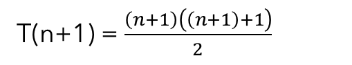
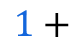
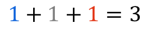
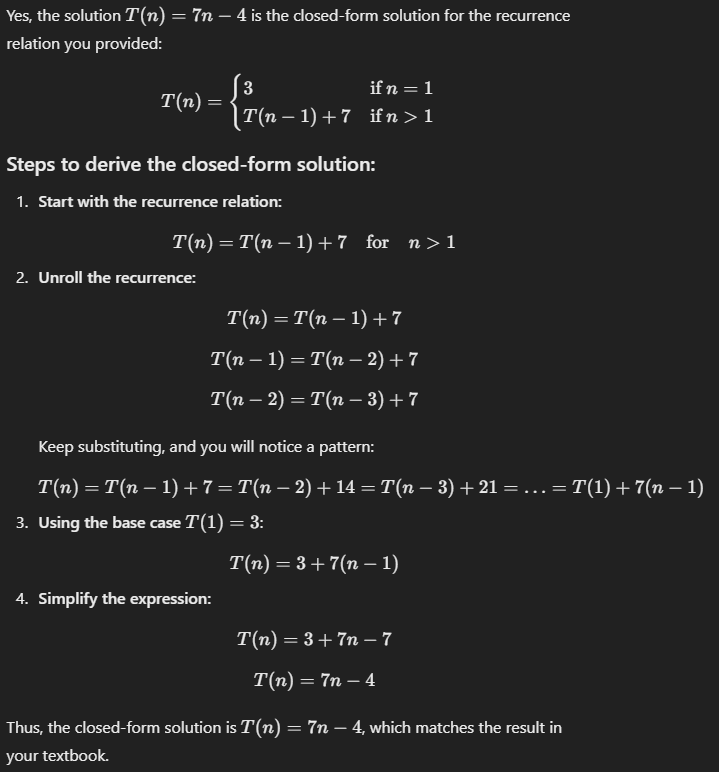
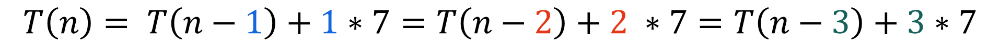

<!-- _class: lead -->

# CSCI 232 <br>Data Structures &amp; Algorithms

## Lecture 13

Dr. Jakub L. Pach

---

# Analyzing algorithms

---

- Mathematical induction - example
- hypothesis
- **Base** Case
- **n+1 step**





---

```c
int arrayMax(int A[], int n)
{
    int currentMax = A[0];
    for (int i = 1; i < n; i++)
    {
        if( currentMax < A[i] )
            currentMax = A[i];
    }
    return currentMax;
}
```

```text
Algorithm arrayMax(A, n):
	Input: An array A storing n ≥ 1 integers.
	Output: The maximum element in A.
	currentMax ← A[0]
	for i ← 1 to n - 1 do
    	if currentMax < A[i] then
        	currentMax ← A[i]
	return currentMax
```

- Searching for the maximum value in an array

<!-- chooseAndSwapArrayWithLargerFirstElement(&amp;arr1, &amp;arr2); -->

---

```c
int recursiveMax(int arr[], int n)
{
    // Base case:
    if (n == 1)
    {
        return arr[0];
    }
    return max( recursiveMax(arr, n - 1) , arr[n - 1]);
}
```

```text
Algorithm recursiveMax(A, n):
	Input: An array A storing n ≥ 1 integers.
	Output: The maximum element in A.
	if n = 1 then
		return A[0]
	return max( recursiveMax(A, n-1), A[n-1] )
```

- Analyzing recursive algorithms

<!-- chooseAndSwapArrayWithLargerFirstElement(&amp;arr1, &amp;arr2); -->

---

```text
Algorithm recursiveMax(A, n):
	Input: An array A storing n ≥ 1 integers.
	Output: The maximum element in A.
	if n = 1 then
		return A[0]
	return max( recursiveMax(A, n-1), A[n-1] )
```

- Analyzing recursive algorithms
- Iteration is not the only interesting way of solving a problem. Another useful technique, which is employed by many algorithms, is to use **recursion**.
- In this technique, we define a procedure **P** that is allowed to make calls to itself as a subroutine, provided those calls to **P**  are for solving subproblems of smaller size. The subroutine calls to **P** on smaller instances are called ***recursive calls***. A recursive procedure should always define a **base case**, which is small enough that the algorithm can solve it directly without using recursion.

<!-- chooseAndSwapArrayWithLargerFirstElement(&amp;arr1, &amp;arr2); -->

---

```text
Algorithm recursiveMax(A, n):
	Input: An array A storing n ≥ 1 integers.
	Output: The maximum element in A.
	if n = 1 then
		return A[0]
	return max( recursiveMax(A, n-1), A[n-1] )
```

- Analyzing recursive algorithms
- This algorithm first checks if the array contains just a single item, which in this case must be the maximum; hence, in this simple base case we can immediately solve the problem. Otherwise, the algorithm recursively computes the maximum of the first **n-1** elements in the array and then returns the maximum of this value and the last element in the array.

<!-- chooseAndSwapArrayWithLargerFirstElement(&amp;arr1, &amp;arr2); -->

---

```text
Algorithm recursiveMax(A, n):
	Input: An array A storing n ≥ 1 integers.
	Output: The maximum element in A.
	if n = 1 then
		return A[0]
	return max( recursiveMax(A, n-1), A[n-1] )
```

- Analyzing recursive algorithms
- As with this example, recursive algorithms are often quite elegant. Analyzing the running time of a recursive algorithm takes a bit of additional work, however. In particular, to analyze such a running time, we use a **recurrence equation**, which defines mathematical statements that the running time of a recursive algorithm must satisfy. We introduce a function *T(n)* that denotes the running time of the algorithm on an input of size *n*, and we write equations that *T(n)* must satisfy. For example, we can characterize the running time, *T(n)*, of the recursiveMax algorithm as


<!-- chooseAndSwapArrayWithLargerFirstElement(&amp;arr1, &amp;arr2); -->

---

```text
Algorithm recursiveMax(A, n):
	Input: An array A storing n ≥ 1 integers.
	Output: The maximum element in A.
	if n = 1 then
		return A[0]
	return max( recursiveMax(A, n-1), A[n-1] )
```

- Analyzing recursive algorithms
- assuming that we count each comparison, array reference, recursive call, max() calculation, or return as a single primitive operation. Ideally, we would like to characterize a recurrence equation like that above in closed form, where no references to the function T appear on the righthand side. For the recursiveMax algorithm, it isn't too hard to see that a closed form would be ***T(n) = 7(n-1) + 3 = 7n - 4***. In general, determining closed form solutions to recurrence equations can be much more challenging than this, and we study some specific examples of recurrence equations in the future.


<!-- chooseAndSwapArrayWithLargerFirstElement(&amp;arr1, &amp;arr2); -->

---

# The random access machine (RAM) model

- If we wish to analyze a particular algorithm without performing experiments on its running time, we can take the following more analytic approach directly on the high-level code or pseudocode. We define a set of high-level **primitive operations** that are largely independent from the programming language used and can be identified also in the pseudocode. Primitive operations include the following:
- **c1    Assigning a value to a variable**
- **c2    Calling a method**
- **c3    Performing an arithmetic operation**
- **c4    Comparing two numbers**
- **c5    Indexing into an array**
- **c6    Following an object reference**
- **c7    Returning from a method.**

---

# Counting primitive operations

```text
Algorithm recursiveMax(A, n):
	Input: An array A storing n ≥ 1 integers.
	Output: The maximum element in A.
	if n = 1 then
		return A[0]
	return max( recursiveMax(A, n-1), A[n-1] )
```

- n is compared with 1 (one primitive operation, comparing).
- **c1    Assigning a value to a variable**
- **c2    Calling a method**
- **c3    Performing an arithmetic operation**
- **c4    Comparing two numbers**
- **c5    Indexing into an array**
- **c6    Following an object reference**
- **c7    Returning from a method.**
- Base case



<!-- why is n? because conditional will be one more times than everything else
normalnie jest n+1 -->

---

# Counting primitive operations

```text
Algorithm recursiveMax(A, n):
	Input: An array A storing n ≥ 1 integers.
	Output: The maximum element in A.
	if n = 1 then
		return A[0]
	return max( recursiveMax(A, n-1), A[n-1] )
```

- **Returning** the value of A\[0\] is considered a single primitive operation, but given that **accessing an element of an array by index** is also a primitive operation, we can argue that there are two primitive operations involved: indexing into the array and returning the value.
- **c1    Assigning a value to a variable**
- **c2    Calling a method**
- **c3    Performing an arithmetic operation**
- **c4    Comparing two numbers**
- **c5    Indexing into an array**
- **c6    Following an object reference**
- **c7    Returning from a method.**
- Base case



<!-- why is n? because conditional will be one more times than everything else
normalnie jest n+1 -->

---

# Counting primitive operations

```text
Algorithm recursiveMax(A, n):
	Input: An array A storing n ≥ 1 integers.
	Output: The maximum element in A.
	if n = 1 then
		return A[0]
	return max( recursiveMax(A, n-1), A[n-1] )
```

- **c1    Assigning a value to a variable**
- **c2    Calling a method**
- **c3    Performing an arithmetic operation**
- **c4    Comparing two numbers**
- **c5    Indexing into an array**
- **c6    Following an object reference**
- **c7    Returning from a method.**
- *A***\[n-1\]**
- n &gt; 1 - recurrence relation


<!-- why is n? because conditional will be one more times than everything else
normalnie jest n+1 -->

---

# Counting primitive operations

```text
Algorithm recursiveMax(A, n):
	Input: An array A storing n ≥ 1 integers.
	Output: The maximum element in A.
	if n = 1 then
		return A[0]
	return max( recursiveMax(A, n-1), A[n-1] )
```

- **c1    Assigning a value to a variable**
- **c2    Calling a method**
- **c3    Performing an arithmetic operation**
- **c4    Comparing two numbers**
- **c5    Indexing into an array**
- **c6    Following an object reference**
- **c7    Returning from a method.**
- *A***\[n-1\]**
- **n-1**
- n &gt; 1 - recurrence relation


<!-- why is n? because conditional will be one more times than everything else
normalnie jest n+1 -->

---

# Counting primitive operations

```text
Algorithm recursiveMax(A, n):
	Input: An array A storing n ≥ 1 integers.
	Output: The maximum element in A.
	if n = 1 then
		return A[0]
	return max( recursiveMax(A, n-1), A[n-1] )
```

- **c1    Assigning a value to a variable**
- **c2    Calling a method**
- **c3    Performing an arithmetic operation**
- **c4    Comparing two numbers**
- **c5    Indexing into an array**
- **c6    Following an object reference**
- **c7    Returning from a method.**
- *A***\[n-1\]**
- **n-1**
- **recursiveMax()**
- n &gt; 1 - recurrence relation


<!-- why is n? because conditional will be one more times than everything else
normalnie jest n+1 -->

---

# Counting primitive operations

```text
Algorithm recursiveMax(A, n):
	Input: An array A storing n ≥ 1 integers.
	Output: The maximum element in A.
	if n = 1 then
		return A[0]
	return max( recursiveMax(A, n-1), A[n-1] )
```

- **c1    Assigning a value to a variable**
- **c2    Calling a method**
- **c3    Performing an arithmetic operation**
- **c4    Comparing two numbers**
- **c5    Indexing into an array**
- **c6    Following an object reference**
- **c7    Returning from a method.**
- *A***\[n-1\]**
- **n-1**
- **recursiveMax()**
- **max()**
- n &gt; 1 - recurrence relation


<!-- why is n? because conditional will be one more times than everything else
normalnie jest n+1 -->

---

# Counting primitive operations

```text
Algorithm recursiveMax(A, n):
	Input: An array A storing n ≥ 1 integers.
	Output: The maximum element in A.
	if n = 1 then
		return A[0]
	return max( recursiveMax(A, n-1), A[n-1] )
```

- **c1    Assigning a value to a variable**
- **c2    Calling a method**
- **c3    Performing an arithmetic operation**
- **c4    Comparing two numbers**
- **c5    Indexing into an array**
- **c6    Following an object reference**
- **c7    Returning from a method.**
- *A***\[n-1\]**
- **n-1**
- **recursiveMax()**
- **max()**
- **return**
- n &gt; 1 - recurrence relation


<!-- why is n? because conditional will be one more times than everything else
normalnie jest n+1 -->

---

# Counting primitive operations

```text
Algorithm recursiveMax(A, n):
	Input: An array A storing n ≥ 1 integers.
	Output: The maximum element in A.
	if n = 1 then
		return A[0]
	return max( recursiveMax(A, n-1), A[n-1] )
```

- **c1    Assigning a value to a variable**
- **c2    Calling a method**
- **c3    Performing an arithmetic operation**
- **c4    Comparing two numbers**
- **c5    Indexing into an array**
- **c6    Following an object reference**
- **c7    Returning from a method.**
- n &gt; 1 - recurrence relation
- *A***\[n-1\]**
- **n-1**
- **recursiveMax()**
- **max()**
- **return**
- **n = 1**


<!-- why is n? because conditional will be one more times than everything else
normalnie jest n+1 -->

---

# How?

- from **recurrence equation** to **closed form**


---





---


---





---


---

# Proof by induction for the arithmetic sum using recursive notation T(n):


---


---

<!-- _class: caption-slide -->

# Thank You
