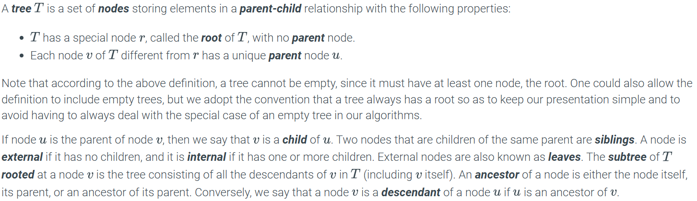
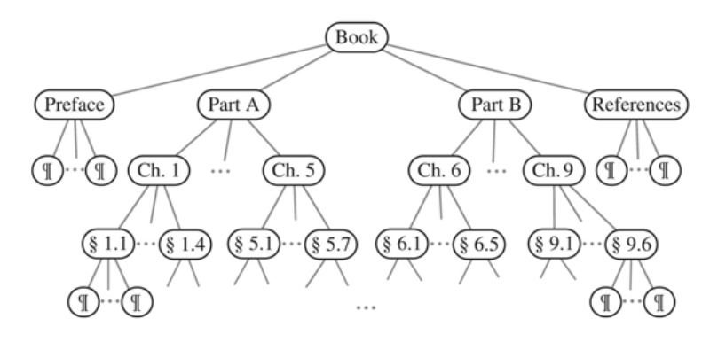

<!-- _class: compact lead -->

# CSCI 232 <br>Data Structures &amp; Algorithms

## Lecture 14

Dr. Jakub L. Pach

---

# Trees

---

# Tree

- Viewed abstractly, a tree is a data structure that stores elements hierarchically. With the exception of the top element, each element in a tree has a parent element and zero or more children elements. A tree is usually visualized by placing elements inside ovals or rectangles, and by drawing the connections between parents and children with straight lines. We typically call the top element the root of the tree, but it is drawn as the highest element, with the other elements being connected below (just the opposite of a botanical tree).

---

# Tree

```console
C:\Users\Jakub>tree C:\jpac\Dos
Folder PATH listing for volume Windows
Volume serial number is D096-8BC8
C:\JPAC\DOS
├───Classes
├───DEBUG
│   ├───a86
│   ├───AFD
│   ├───insight
│   │   ├───doc
│   │   ├───src
│   │   │   └───data
│   │   └───tools
│   ├───TD
│   └───WD
├───edit
├───Hex
│   ├───Biew
│   │   ├───skn
│   │   ├───syntax
│   │   └───xlt
│   │       └───russian
│   └───Uhex
├───nasm
│   └───rdoff
└───nc

C:\Users\Jakub>
```


- A tree representing a portion of a file system.

---

# Tree



---

# Book

- A structured document, such as a book, is hierarchically organized as a tree whose internal nodes are chapters, sections, and subsections, and whose external nodes are paragraphs, tables, figures, the bibliography, and so on. We could in fact consider expanding the tree further to show paragraphs consisting of sentences, sentences consisting of words, and words consisting of characters. In any case, such a tree is an example of an ordered tree, because there is a well-defined ordering among the children of each node.



---

<!-- _class: compact fit-90 -->

# Types of trees

- **General trees**:
- This is the most general form of trees. Each node in such a tree can have any number of children.
- There’s no restriction to two children, so a node could have three, four, or more children.
- **Binary trees**:
- This is a special case of a tree where each node has **a maximum of two children**.
- Nodes can have:
  - Two children (left and right),
  - One child (left or right),
  - No children at all (leaf nodes).
- A binary tree can take different shapes and has no requirement regarding the values of the nodes.
- **Complete binary tree**:
- This is a special case of a binary tree where all levels of the tree, except for the last one, are completely filled.
- The last level can be incomplete, but the nodes are always filled **from left to right**.
- Important: A complete binary tree refers only to the structure of the tree, not to the values of the nodes.
- **Binary Search Tree (BST)**:
- This is also a special case of a binary tree, but here, besides the structure, the **ordering of values** is important:
  - Nodes in the **left subtree** have values **smaller** than the main node.
  - Nodes in the **right subtree** have values **greater** than the main node.
- A BST allows efficient searching of elements because the ordering enables fast searching (e.g., time complexity for searching is O(log n) in the ideal case).

---

# A binary tree

- A binary tree is an ordered tree in which every node has at most two children. A binary tree is proper if each internal node has two children. For each internal node in a binary tree, we label each child as either being a left child or a right child. These children are ordered so that a left child comes before a right child. The subtree rooted at a left or right child of an internal node v is called a left subtree or right subtree, respectively, of v. Of course, even an improper binary tree is still a general tree, with the property that each internal node has at most two children. Binary trees have a number of useful applications.

---

<!-- _class: compact fit-90 -->

# Summary

- **Complete binary tree in an array**:
  - A complete binary tree can be efficiently represented in an array because each node has exactly two children (or none). Indexing can start from 0 or 1, which affects how parent-child relationships are defined:
    - **Zero-based indexing**: If a node at index i is a parent, its left child will be at index 2i + 1, and the right child at 2i + 2. The parent of the node at index i can be found at index (i - 1) / 2 (if i is odd).
    - **One-based indexing**: If a node at index i is a parent, its left child will be at index 2i, and the right child at 2i + 1. The parent of the node at index i will be at index i / 2.
- **BST**:
  - A binary search tree (BST) does not need to be complete, which means not all nodes will have two children. This makes it impossible to represent it uniquely in an array, as there are no established relationships between nodes, unlike in a complete tree.
- **Complete BST**:
  - If a BST is complete (all levels are fully filled, and the last level is filled from left to right), it can also be represented in an array, following the same rules as for a complete binary tree.
- In summary, complete binary trees can be effectively represented in arrays, while BSTs that are not complete require other data structures (e.g., pointers) for representation.
