<!-- _class: compact lead -->

# CSCI 232 <br>Data Structures &amp; Algorithms

## Lecture 15

Dr. Jakub L. Pach

---

# Analyzing algorithms

---

# arrayMax

- To summarize, the number of primitive operations t(n) (or  T(n)) executed by algorithm arrayMax is at least:

```text
Algorithm arrayMax(A, n):
	Input: An array A storing n ≥ 1 integers.
	Output: The maximum element in A.
	currentMax ← A[0]
	for i ← 1 to n - 1 do
    	if currentMax < A[i] then
        	currentMax ← A[i]
	return currentMax
```

- and at most:
- The best case (t(n) = 5n) occurs when A\[0\] is the maximum element, so that variable currentMax is never reassigned. The worst case (t(n) = 7n-2) occurs when the elements are sorted in increasing order, so that variable currentMax is reassigned at each iteration of the for loop.


<!-- why is n? because conditional will be one more times than everything else
normalnie jest n+1 -->

---

# recursiveMax

- from **recurrence equation** to **closed form**


---

<!-- _class: compact fit-90 -->

# Asymptotic notation


---

<!-- _class: compact fit-90 -->

# The O(n) "big-oh" notation

- Let f(n) and g(n) be functions mapping nonnegative integers to real numbers. We say that f(n) is O(g(n) if there is a real constant c &gt; 0 and an integer constant n0 ≥ 1 such that f(n) ≤ c\*g(n) for every integer n ≥ n0. This definition is often pronounced as "f(n) is big-Oh of g(n)" or "f(n) is order g(n)".
- **Example:**
- 7n-4 is O(n).
- Proof: We need a real constant c &gt; 0 and an integer constant n0 ≥ 1 such that 7n-2 ≤ c\*n for every integer n ≥ n0. It is easy to see that a possible choice is c=7 and n0 = 1, but there are other possibilities as well.

<!-- ≥≤ -->

---

# Example

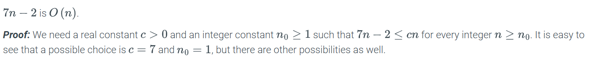


---

# Example


---

# Example

- The big-Oh notation allows us to say that a function of n is "less than or equal to" another function (by the inequality "≤" in the definition), up to a constant factor (by the constant c in the definition) and in the asymptotic sense as n grows toward infinity (by the statement "n ≥ n0" in the definition).
- The big-Oh notation is used widely to characterize running times and space bounds of algorithm in terms of a parameter, n , which represents the "size" of the problem. For example, if we are interested in finding the largest element in an array of integers ( arrayMax given ), it would be most natural to let n denote the number of elements of the array. For example, we can write the following precise statement on the running time of algorithm arrayMax.

<!-- ≥≤ -->

---

# Theorem

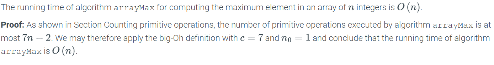

---

# Example

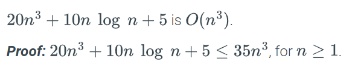

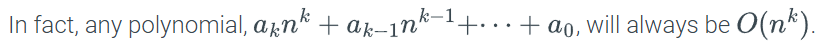

---

# Example

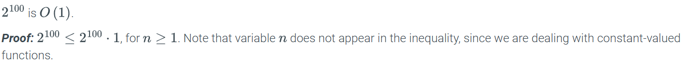

---

# Example

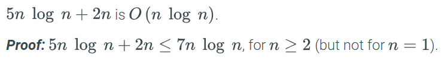

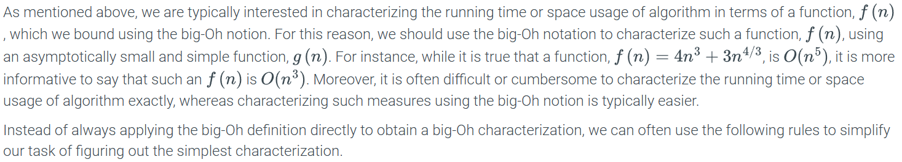

---

# Theorem – 8 rules!

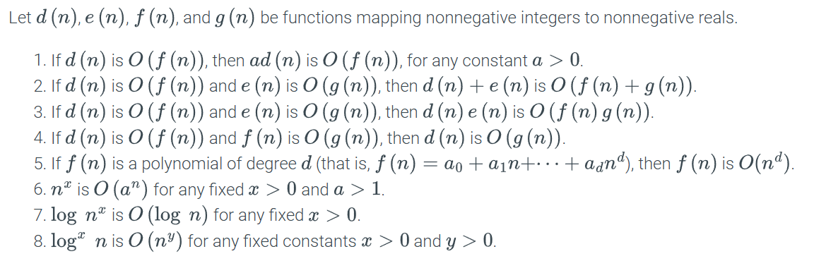

---

<!-- _class: compact long-title -->

# Analogy between the asymptotic comparison of two functions *f* and *g* and the comparison of two real numbers *a* and *b*

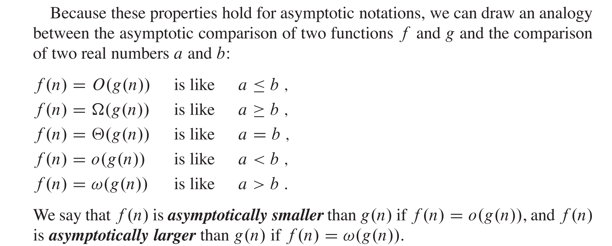

---

# 1/8 rule.

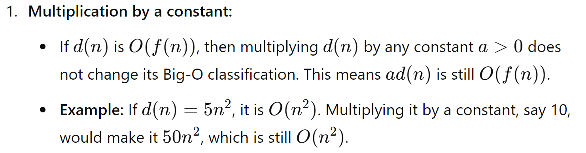


---

# 2/8 rule.

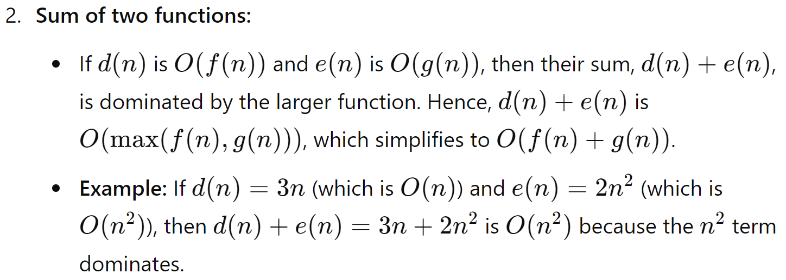


---

# 3/8 rule.

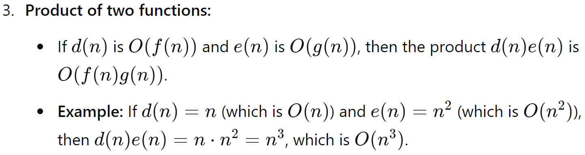


---

# 4/8 rule.

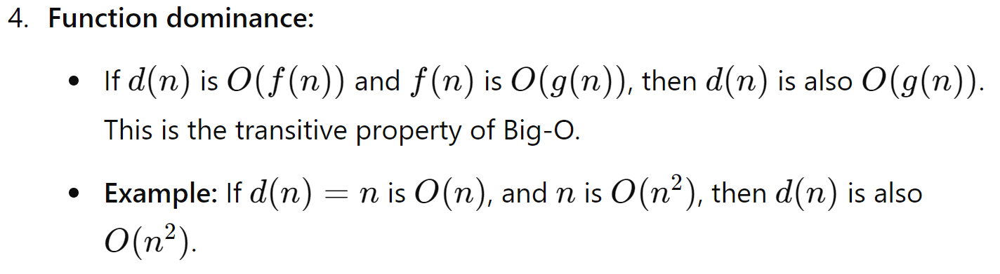


---

# 5/8 rule.

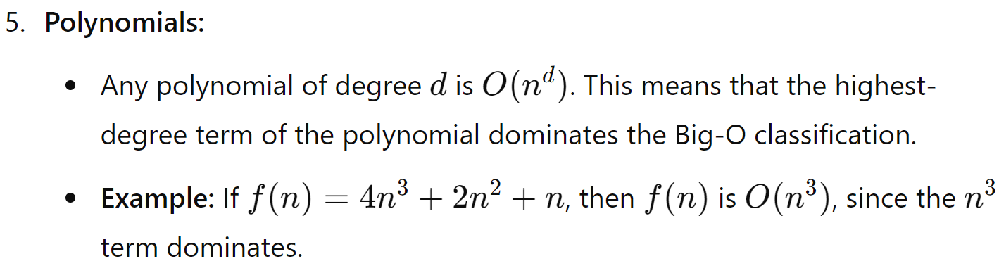


---

# 6/8 rule.

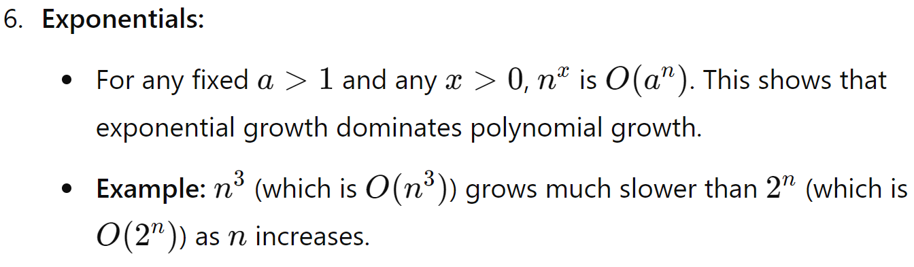

---

# 7/8 rule.

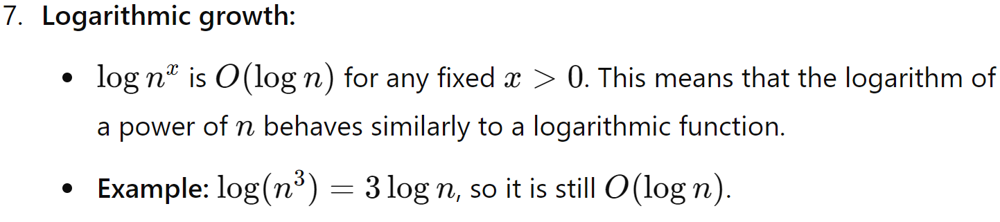

---

# 8/8 rule.

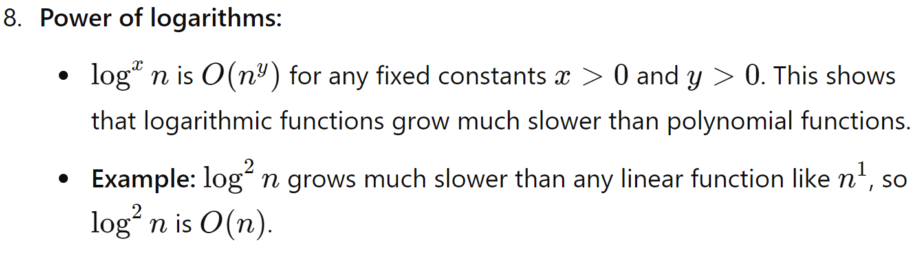

---

# Terminology for classes of functions.

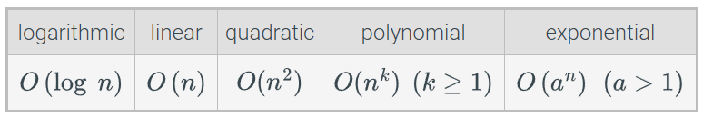

---

# Using the big-Oh notation

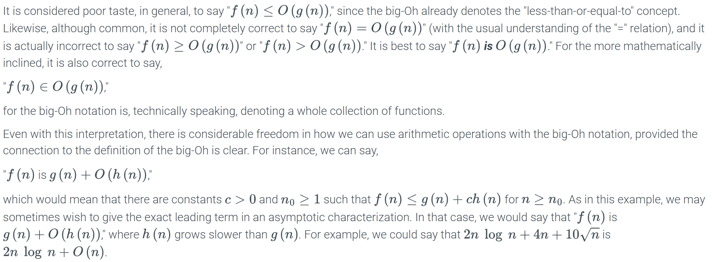

---

<!-- _class: compact caption-slide -->

# Thank You
