<!-- _class: compact lead -->

# CSCI 232  Data Structures &amp; Algorithms

## Lecture 16

Dr. Jakub L. Pach

---

# Analyzing algorithms

---

<!-- _class: compact long-title -->

# Analogy between the asymptotic comparison of two functions *f* and *g* and the comparison of two real numbers *a* and *b*

---

<!-- _class: compact long-title -->

# An ordered list of simple functions such that if a function f(n) precedes a function g(n) in the list, then f(n) is o(g(n)). Using common terminology, the function, logc n, for any c&gt;0, is also polylogarithmic, and the functions, n2 and n3, are also polynomial.

---

# Big-omega and big-theta

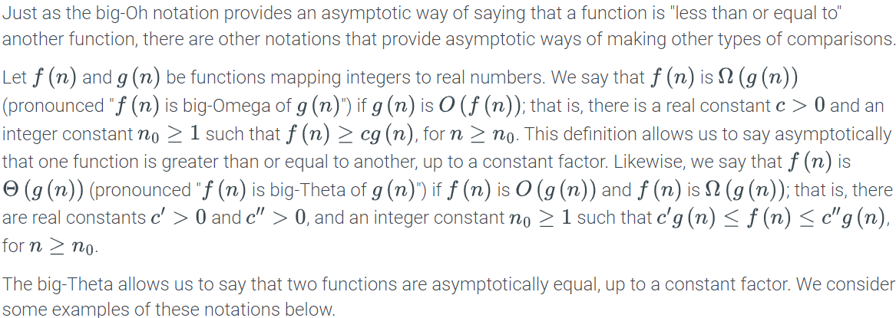

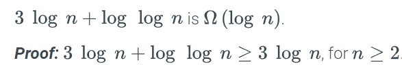

---

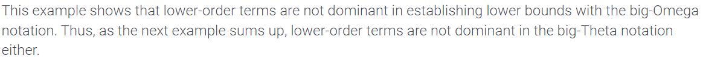

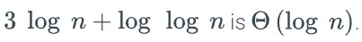

---

# Some words of caution

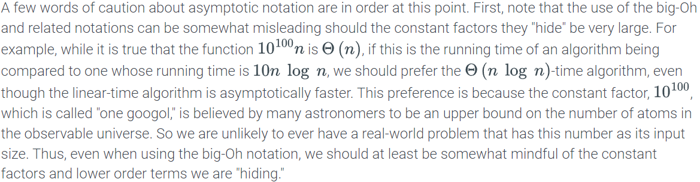

- ...
- ...

---

<!-- _class: compact long-title -->

# An ordered list of simple functions such that if a function f(n) precedes a function g(n) in the list, then f(n) is o(g(n)). Using common terminology, the function, logc n, for any c&gt;0, is also polylogarithmic, and the functions, n2 and n3, are also polynomial.

---

# Some words of caution

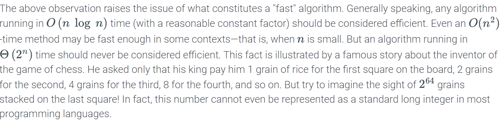

---

# Some words of caution

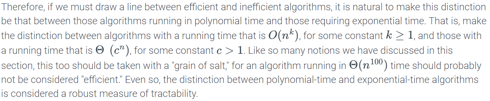

---

# Little-oh and little-omega

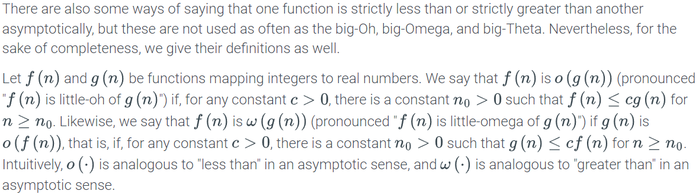

---

# Example

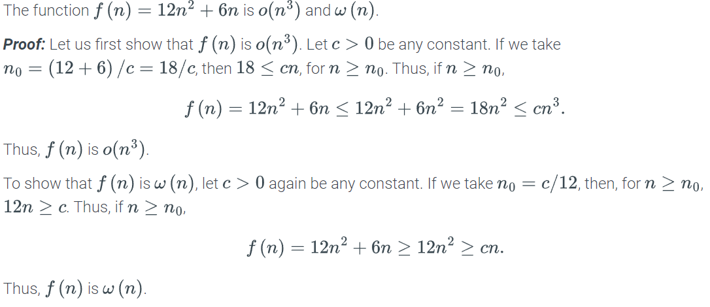

---

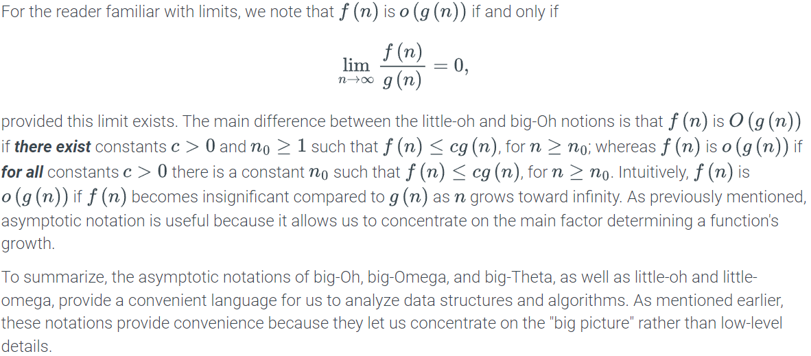

---

# The importance of asymptotic notation

- Asymptotic notation has many important benefits, which might not be immediately obvious. Specifically, we illustrate one important aspect of the asymptotic viewpoint in Table (next slide). This table explores the maximum size allowed for an input instance for various running times to be solved in 1 second, 1 minute, and 1 hour, assuming each operation can be processed in 1 microsecond (1 𝜇s). It also shows the importance of algorithm design, because an algorithm with an asymptotically slow running time (for example, one that is O(n2)) is beaten in the long run by an algorithm with an asymptotically faster running time (for example, one that is O(n log n)), even if the constant factor for the faster algorithm is worse.

---

<!-- _class: compact long-title -->

# Maximum size of a problem that can be solved in one second, one minute, and one hour, for various running times measured in microseconds.

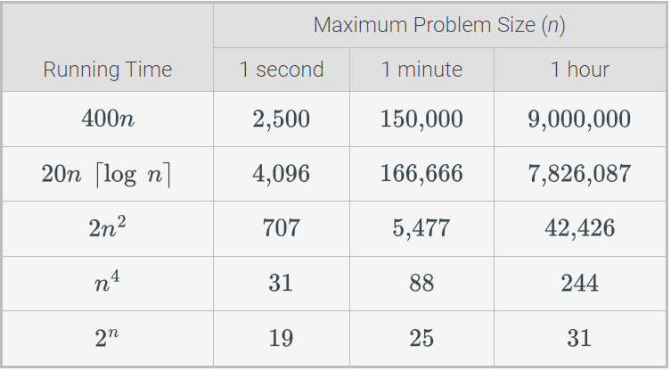

- The importance of good algorithm design goes beyond just what can be solved effectively on a given computer, however. As shown in this Table, even if we achieve a dramatic speedup in hardware, we still cannot overcome the handicap of an asymptotically slow algorithm. This table shows the new maximum problem size achievable for any fixed amount of time, assuming algorithms with the given running times are now run on a computer 256 times faster than the previous one.

---

<!-- _class: compact long-title -->

# Increase in the maximum size of a problem that can be solved in a certain fixed amount of time, by using a computer that is 256 times faster than the previous one, for various running times of the algorithm. Each entry is given as a function of m, the previous maximum problem size.

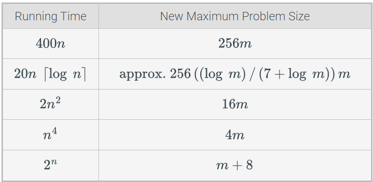

---

# Ordering functions by their growth rates

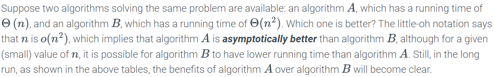

- (next slide)

---

<!-- _class: compact long-title -->

# An ordered list of simple functions such that if a function f(n) precedes a function g(n) in the list, then f(n) is o(g(n)). Using common terminology, the function, logc n, for any c&gt;0, is also polylogarithmic, and the functions, n2 and n3, are also polynomial.

---

# Growth rates of several functions. Note the point at which the function √n dominates log2n.

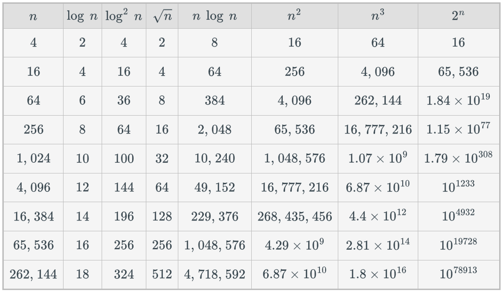

---

<!-- _class: compact caption-slide -->

# Thank You
