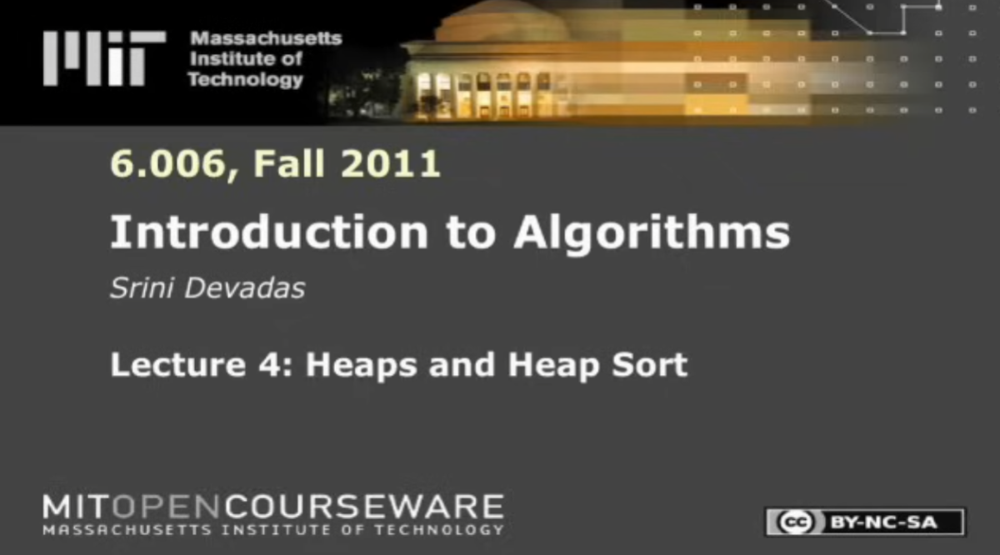

<!-- _class: lead -->

# CSCI 232 <br>Data Structures &amp; Algorithms

## Lecture 18

Dr. Jakub L. Pach

---

# heap sort

<!-- [Lecture 3: Insertion Sort, Merge Sort (youtube.com)](https://www.youtube.com/watch?v=Kg4bqzAqRBM&t=1493s&ab_channel=MITOpenCourseWare)
[Learn Merge Sort in 13 minutes 🔪 (youtube.com)](https://www.youtube.com/watch?v=3j0SWDX4AtU&t=336s&ab_channel=BroCode) -->

---

# Lecture

- [Lecture 4: Heaps and Heap Sort](https://www.youtube.com/watch?v=B7hVxCmfPtM&t=768s)
- [https://www.youtube.com/watch?v=B7hVxCmfPtM&amp;t=768s](https://www.youtube.com/watch?v=B7hVxCmfPtM&t=768s)




---

<!-- _class: fit-90 -->

# C

```c
void heapify(int arr[], int n, int i)
{
    int largest = i;         // root
    int left = 2 * i + 1;    // left child
    int right = 2 * i + 2;   // right child
    if (left < n && arr[left] > arr[largest])
        largest = left;


    if (right < n && arr[right] > arr[largest])
        largest = right;


    if (largest != i)
    {
        int temp = arr[i];
        arr[i] = arr[largest];
        arr[largest] = temp;


        heapify(arr, n, largest);
    }
}


```

```c
void heapSort(int arr[], int n)
{
    // Build max heap
    for (int i = n / 2 - 1; i >= 0; i--)
        heapify(arr, n, i);

    // Extract elements one by one
    for (int i = n - 1; i > 0; i--)
    {
        int temp = arr[0];
        arr[0] = arr[i];
        arr[i] = temp;


        heapify(arr, i, 0);
    }
}
```
