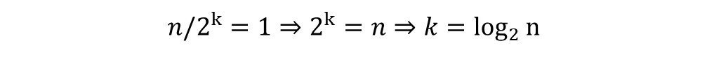

<!-- _class: compact lead -->

# CSCI 232 <br>Data Structures &amp; Algorithms

## Lecture 19

Dr. Jakub L. Pach

---

# **Analyzing Algorithm Complexity by Example**

<!-- [Lecture 3: Insertion Sort, Merge Sort (youtube.com)](https://www.youtube.com/watch?v=Kg4bqzAqRBM&t=1493s&ab_channel=MITOpenCourseWare)
[Learn Merge Sort in 13 minutes 🔪 (youtube.com)](https://www.youtube.com/watch?v=3j0SWDX4AtU&t=336s&ab_channel=BroCode) -->

---

# Analyzing Algorithm Complexity

- Review of Time Complexity
- Asymptotic Notation
- Primitive Operations

<!-- Today we’ll review how to analyze algorithms — not just theoretically, but by *counting primitive operations* and expressing the result using asymptotic notation.<br>You already know Big-O, Theta, and Omega — now let’s strengthen intuition by going through simple C examples step by step. -->

---

# Primitive Operations

|Symbol|Description|
|---|---|
|c₁|Assigning a value to a variable|
|c₂|Calling a function|
|c₃|Performing an arithmetic operation|
|c₄|Comparing two numbers|
|c₅|Indexing into an array|
|c₆|Following an object reference|
|c₇|Returning from a function|

<!-- Each of these represents one *basic operation*. When we analyze time complexity, we count how many of these are executed as a function of the input size n. -->

---

# Algorithm 1: Constant Time

- \- T(n) = c₁ + 2c₃ + c₇
- \- O(1), Θ(1), Ω(1)

```c
int sumThree(int a, int b, int c)
{
    int result = a + b + c;
    return result;
}
```

|S.|Description|
|---|---|
|c₁|Assigning a value to a variable|
|c₂|Calling a function|
|c₃|Performing an arithmetic operation|
|c₄|Comparing two numbers|
|c₅|Indexing into an array|
|c₆|Following an object reference|
|c₇|Returning from a function|

<!-- &gt; This is the simplest possible case — the algorithm doesn’t depend on input size.
&gt; No loops, no recursion. The runtime is constant regardless of \`n\`. -->

---

# Algorithm 2: Linear Time

```c
int sumArray(int A[], int n)
{
    int sum = 0;
    for (int i = 0; i < n; i++)
    {
        sum += A[i];
    }
    return sum;
}
```

- T(n)=c1​+c1​+(n+1)c4​+n(c1​+c3​)+n(c1​+c3​+c5​)+c7 =
- T(n)=(3n+3)c​+2nc​+nc​+(n+1)c​+c​​= 7nc\*5c = 7n + 5
- \- \*O(1), Θ(1), Ω(1)

|S.|Description|
|---|---|
|c₁|Assigning a value to a variable|
|c₂|Calling a function|
|c₃|Performing an arithmetic operation|
|c₄|Comparing two numbers|
|c₅|Indexing into an array|
|c₆|Following an object reference|
|c₇|Returning from a function|

|Step|Description|Count|
|---|---|---|
|int sum = 0;|Initialization|c₁|
|int i = 0;|Loop initialization|c₁|
|i &lt; n|Loop condition|(n + 1) × c₄|
|i++|Increment (assignment + addition)|n × (c₁ + c₃)|
|sum += A\[i\];|Array access + addition + assignment|n × (c₅ + c₃ + c₁)|
|return sum;|Return statement|c₇|

<!-- Each iteration does a few simple operations — comparison, indexing, and addition.<br>Because the loop runs n times, the total time grows linearly. -->

---

# Algorithm 3: Quadratic Time

```c
void printPairs(int A[], int n)
{
    for (int i = 0; i < n; i++)
    {
        for (int j = 0; j < n; j++)
        {
            printf("%d, %d\n", A[i], A[j]);
        }
    }
}
```

T(n)=c1​+(n+1)c4​+n(c1​+c3​)+n\[c1​+(n+1)c4​+n(c1​+c3​)+ n(c2+2(c5))\]

... T(n)=n2(2c5​+c2​+c3​+c4​)+n(c1​+c4​+c3​+c1​)+(c1​+c4​)

|S.|Description|
|---|---|
|c₁|Assigning a value to a variable|
|c₂|Calling a function|
|c₃|Performing an arithmetic operation|
|c₄|Comparing two numbers|
|c₅|Indexing into an array|
|c₆|Following an object reference|
|c₇|Returning from a function|

|Step|Description|Count|
|---|---|---|
|int sum = 0;|Initialization|c₁|
|int i = 0;|Loop initialization|c₁|
|i &lt; n|Loop condition|(n + 1) × c₄|
|i++|Increment (assignment + addition)|n × (c₁ + c₃)|
|sum += A\[i\];|Array access + addition + assignment|n × (c₅ + c₃ + c₁)|
|return sum;|Return statement|c₇|

<!-- Each iteration does a few simple operations — comparison, indexing, and addition.<br>Because the loop runs n times, the total time grows linearly. -->

---

# Algorithm 4: Logarithmic Time

```c
int binarySearch(int A[], int n, int key)
{
    int left = 0, right = n - 1;
    while (left <= right)
    {
        int mid = (left + right) / 2;
        if (A[mid] == key)
            return mid;
        else
            if (A[mid] < key)
                left = mid + 1;
            else
                right = mid - 1;
    }
    return -1;
}
```

T(n)=(2c1​+c3​)+(k+1)c4​+k\[(c1​+2c3​)+(c5​+c4​)+(c5​+c4​+c1​+c3​)\]+c7​

|S.|Description|
|---|---|
|c₁|Assigning a value to a variable|
|c₂|Calling a function|
|c₃|Performing an arithmetic operation|
|c₄|Comparing two numbers|
|c₅|Indexing into an array|
|c₆|Following an object reference|
|c₇|Returning from a function|

|Step|Description|Cost|
|---|---|---|
|1|Initialize left = 0|c₁|
|2|Initialize right = n - 1|c₁ + c₃|
|3|Compare left &lt;= right|c₄|
|4|Compute mid = (left + right) / 2|c₁ + 2c₃|
|5|Compare A\[mid\] == key|c₅ + c₄|
|6|Compare A\[mid\] &lt; key|c₅ + c₄|
|7|Update left = mid + 1 or right = mid - 1|c₁ + c₃|
|8|Return value|c₇|



<!-- Binary search is one of the best examples of a logarithmic-time algorithm.<br>We start with two indices — left and right — and repeatedly cut the search interval in half.<br>Each iteration performs a constant number of primitive operations: a few comparisons, arithmetic operations, and assignments.<br>Because the number of iterations grows as log₂(n), the total time complexity is Θ(log n).
Notice how the structure of the algorithm guarantees efficiency — we don’t scan every element, just a small subset that keeps shrinking -->

---

# Comparing Growth Rates

|Complexity|Example Algorithm|Growth|
|---|---|---|
|O(1)|Constant operations|Flat|
|O(log n)|Binary search|Very slow growth|
|O(n)|Summation, linear scan|Linear|
|O(n log n)|Merge sort|Moderate growth|
|O(n²)|Nested loops|Rapid growth|
|O(2ⁿ)|Recursive Fibonacci|Explosive|
