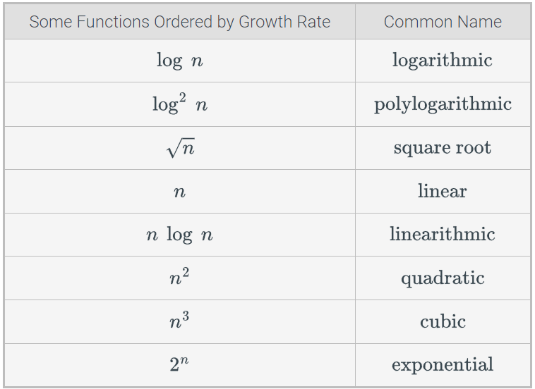

<!-- _class: lead -->

# CSCI 232 <br>Data Structures &amp; Algorithms

## Lecture 20

Dr. Jakub L. Pach

---

# Foreword

- Last quiz didn’t count. It showed me that I didn’t explain this part well enough — so we’ll go through it together and make sure everyone really gets it.
- We will repeat the test you took this Monday. Today, I’ll show you exactly how to calculate everything, and you will retake it next Monday (11/17/2025).

---

# Outline

- Review
- Theory quiz

---

# Review

```c
    //complex operators
    x += y;  // same as x = x + y; //Add and assign
    x -= y;  // same as x = x - y; //Subtract and assign
    x *= y;  // same as x = x * y; //Multiply and assign
    x /= y;  // same as x = x / y; //Divide and assign
    x %= y;  // same as x = x % y; //Modulus and assign
    x &= y;  // same as x = x & y; //Bitwise AND and assign
    x |= y;  // same as x = x | y; //Bitwise OR and assign
    x ^= y;  // same as x = x ^ y; //Bitwise XOR and assign
    x <<= 2;  // same as x = x << 2; //Left shift and assign
    x >>= 2;  // same as x = x >> 2; //Right shift and assign
    x++; //x = x + 1; //Increase the value by 1.
    x--; //x = x - 1; //Decrease the value by 1.

```

```c
    //arr[i]  ≡  *(arr + i);
    //arr[i][j] ≡ *(*(arr + i) + j);
```

- According to our notes, to remain consistent, we will assume that accessing an array corresponds to one primitive instruction per dimension, and we will stick to this convention — even though accessing an index actually involves adding an offset and performing a dereference, which should count as two operations, we simplify our calculations.

---


- 𝑇(𝑛) = 𝑛2     → O(n³) or O(n2)
- 𝑇(𝑛) = 𝑛2    → Ω(n) or Ω(n2)
- 𝑇(𝑛) = 𝑛2    → o(n³) or o(n4)
- 𝑇(𝑛) = 𝑛2    → ω(n) or ω(n log n)




Each one example illustrates the proper relationship for the given asymptotic class. The only clarification worth adding is that while both O(n³) and O(n²) are formally true, O(n²) is the tighter (more precise) bound.

<!-- Each one example illustrates the proper relationship for the given asymptotic class. The only clarification worth adding is that while both O(n³) and O(n²) are formally true, O(n²) is the tighter (more precise) bound. -->

---

# Algorithm 2: Linear Time

```c
int sumArray(int A[], int n)
{
    int sum = 0;
    for (int i = 0; i < n; i++)
    {
        sum += A[i];
    }
    return sum;
}
```

- T(n)=c1​+c1​+(n+1)c4​+n(c1​+c3​)+n(c1​+c3​+c5​)+c7=6nc\*4c = 6n + 4
- \- \*O(n), Θ(n), Ω(n)

|S.|Description|
|---|---|
|c₁|Assigning a value to a variable|
|c₂|Calling a function|
|c₃|Performing an arithmetic operation|
|c₄|Comparing two numbers|
|c₅|Indexing into an array|
|c₆|Following an object reference|
|c₇|Returning from a function|

|Step|Description|Count|
|---|---|---|
|int sum = 0;|Initialization|c₁|
|int i = 0;|Loop initialization|c₁|
|i &lt; n|Loop condition|(n + 1) × c₄|
|i++|Increment (assignment + addition)|n × (c₁ + c₃)|
|sum += A\[i\];|Array access + addition + assignment|n × (c₅ + c₃ + c₁)|
|return sum;|Return statement|c₇|

<!-- Each iteration does a few simple operations — comparison, indexing, and addition.<br>Because the loop runs n times, the total time grows linearly. -->

---

# Algorithm 2: Linear Time

```c
int sumArray(int A[], int n)
{
    int sum = 0;
    for (int i = 0; i < n; i++)
    {
        sum += A[i];
    }
    return sum;
}
```

T(n)=c1​+c1​+(n+1)c4​+n(c1​+c3​)+n(c1​+c3​+c5​)+c7 =

= 2c1+n\*c4+c4+n\*c1+n\*c3+n\*c1+n\*c3+n\*c5+c7=

=c1(2n+2)+c3(2n)+c4(n+1) +c5(n)+c7

c1-c7 = 1

T(n)=2n+2+2n+n+1+n+1 = 6n + 4

c1    Assigning a value to a variable

c2    Calling a method

c3    Performing an arithmetic operation

c4    Comparing two numbers

c5    Indexing into an array

c6    Following an object reference

c7    Returning from a method.

|c1|2n+2|
|---|---|
|c2|0|
|c3|2n|
|c4|n+1|
|c5|n|
|c6|0|
|c7|1|

|T\_best(n)|6n+4|
|---|---|
|T\_worst(n)|6n+4|
|O(n)|n|
|Ω(n)|n|

<!-- Each iteration does a few simple operations — comparison, indexing, and addition.<br>Because the loop runs n times, the total time grows linearly. -->

---

# Algorithm 2: Linear Time

```c
int sumArray(int A[], int n)
{
    int sum = 0;
    for (int i = 0; i < n; i++)
    {
        sum += A[i];
    }
    return sum;
}
```

T(n)=2n+2+2n+n+1+n+1 = 6n + 4

c1    Assigning a value to a variable

c2    Calling a method

c3    Performing an arithmetic operation

c4    Comparing two numbers

c5    Indexing into an array

c6    Following an object reference

c7    Returning from a method.

|c1|2n+2|
|---|---|
|c2|0|
|c3|2n|
|c4|n+1|
|c5|n|
|c6|0|
|c7|1|

|T\_best(n)|6n+4|
|---|---|
|T\_worst(n)|6n+4|
|O(n)|n|
|Ω(n)|n|

- The task is therefore to identify all **primitive operations** in the code, count their occurrences, fill in the corresponding fields, and then determine **T\_best(n)**, **T\_worst(n)**, **O(n)**, and **Ω(n)** as shown in this example.

<!-- Each iteration does a few simple operations — comparison, indexing, and addition.<br>Because the loop runs n times, the total time grows linearly. -->
