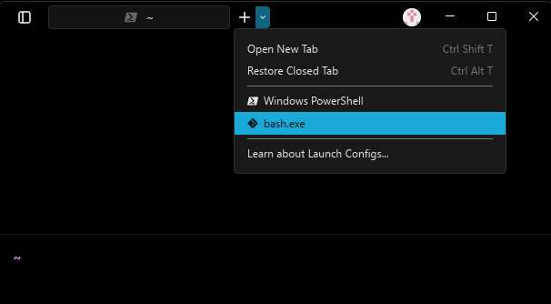
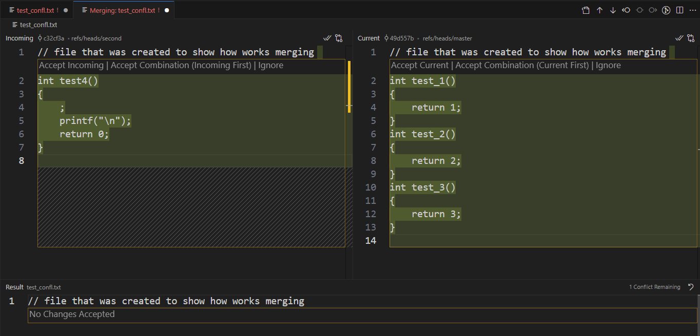

<!-- _class: compact lead -->

# Software Engineering

## Lecture 6

---

# Today’s Agenda

Git

- working with branches
- diff
- stash

---

# Gitlens?

extension

---

- Create and log in in GitHub account
- Please turn of AI



---

# Working with Branches

**Branch inheritance:**

- A newly created branch (other than main/master) inherits all files and commits that existed at the moment of its creation.
- In other words: it’s a copy of the project’s state at that time.

---

# Working with Branches

**Files created inside a branch:**

- New files committed inside a branch “live” only in that branch.
- The main branch (main/master) does not see these files unless a merge happens.

---

# Working with Branches

**Merge command:**

- The git merge &lt;branch&gt; command merges the given branch into the currently active branch.
- **Important**: the merge is always one-way – from the branch given as a parameter → into the branch you are on.

---

# Working with Branches

**What happens to the merged branch?:**

- After a merge, the merged branch is not deleted automatically.
- Whether you remove it depends on team strategy and workflow:
  - Deleting keeps the repository clean and avoids clutter.
  - Keeping old branches may obscure the project and cause confusion.
- Remember: deleting a branch is **irreversible** if its changes are not merged.

---

# Working with Branches

**Merge conflicts:**

- A merge conflict happens when the same file was modified differently in two branches.
- Conflicts are very common in collaborative projects.
- Expect them – don’t assume merging will always be automatic..

---

# Working with Branches

**Resolving merge conflicts:**

- Git will stop and inform you which files are in conflict.
- Inside the file you’ll see conflict markers like:
- The developer must manually decide which parts to keep.
- After editing and saving, run:
- to finalize the merge.

```text
<<<<<<< HEAD
your current branch content
=======
incoming branch content
>>>>>>> feature-branch
```

```bash
git add <file>
git commit
```

---

<!-- _class: compact fit-50 -->

# Summary

Let’s review what we have learned so far. We previously worked on creating new branches in Git and switching between them. One important observation is that files seem to be “hidden” when moving between branches, since each branch has its own version of the file system state.

- A newly created branch (other than main or master) inherits everything that existed at the moment it was created.
- Any new files added and committed in this branch “live” only in that branch. The main branch does not automatically have access to them.
- The merge command allows us to bring another branch into the currently active branch (never the other way around!).
- After merging, the absorbed branch is not automatically deleted. Whether to delete merged branches depends on company strategy or workflow style. It is important to remember that merging cannot be **undone** easily, and the consequences are permanent. On the other hand, in large projects, a huge number of branches may appear to allow independent development of features. This branching helps with safety and organization, but leaving unsupported or abandoned branches can create confusion and reduce clarity in the codebase.
- Merge conflicts are very common. They occur when two branches contain different versions of the same file. Hoping for no conflicts is unrealistic.
- When a conflict happens, Git will report it and show which files are affected. Inside the file, Git will mark the conflicting sections with &lt;&lt;&lt;&lt;&lt;&lt; HEAD, ======, and &gt;&gt;&gt;&gt;&gt;&gt;&gt; branch\_name. At this point, the software engineer must manually resolve the conflict: decide which parts of the code remain and which should be removed. After making the necessary edits, the file must be saved, staged (git add), and committed.

In short, branches allow safe and parallel development, merging combines work from different lines of development, and conflicts are a natural part of collaboration that every developer must learn to resolve.

---



---

<!-- _class: compact fit-90 -->

# Introduction to git diff

**What is git diff**?

- git diff is a command used to show changes between commits, branches, or your working directory and the index.
- **It does not change anything** — it only displays differences.
- Important note:
- The +++ and --- lines in the diff output do not indicate whether something was added or removed.
  - They simply represent the two versions being compared:
    - --- → the “old” version
    - +++ → the “new” version

<!-- Index = ID commita?? -->

---

# Introduction to git diff

**Example:**

- Here, the - and + at the start of lines indicate removal or addition. --- and +++ just label the files.

```diff
diff --git a/file.txt b/file.txt
--- a/file.txt
+++ b/file.txt
@@ -1,3 +1,3 @@
-Hello world
+Hello Git
```

<!-- Index = ID commita?? -->

---

# Introduction to git diff

**Comparing staged changes: --staged (or --cached)**

- By default, git diff compares your working directory with the index (staged area).
- To compare staged changes with the last commit:
- Shows changes that **are staged for the next commit**, i.e., tracked files that have been modified and added with git add.

```bash
git diff --staged
```

<!-- Index = ID commita?? -->

---

# Introduction to git diff

**Comparing specific commits:**

- You can compare changes between two commits using their commit IDs:
- Replace &lt;commit1&gt; and &lt;commit2&gt; with the **hashes** of the commits you want to compare.
- Example:
- Output shows **what changed from commit 3a5f1b2 to commit 9c7e8d0**.
- Hint: git log --oneline

```bash
git diff <commit1> <commit2>
```

```bash
git diff 3a5f1b2 9c7e8d0
```

<!-- Index = ID commita?? -->

---

# Introduction to git diff

**Order of commit IDs matters:**

- git diff A B ≠ git diff B A
- The first commit (A) is considered the “old” version.
- The second commit (B) is considered the “new” version.
- Lines starting with - were removed from A → B, lines starting with + were added in B compared to A.
- Example:

```bash
git diff A B   # shows changes to get from A to B
git diff B A   # shows changes to get from B to A (reversed)
```

<!-- Index = ID commita?? -->

---

# Summary - git diff

- git diff is a read-only comparison tool.
- +++ / --- do not indicate changes, only file versions.
- Use --staged to check what is staged for commit.
- Use commit IDs to compare specific commits.
- Order matters when comparing commits.
- git diff –staged or git diff --cached

<!-- Index = ID commita?? -->

---

# Introduction to git stash

**What is git stash?**

- git stash is a command used to temporarily save changes in your working directory and index without committing them.
- It is useful when you want to switch branches or work on something else without losing your current changes.
- Think of it as a “clipboard” for your changes.
- Basic idea:

```bash
# Save current changes to stash
git stash

# Apply stashed changes later
git stash apply
```

<!-- Index = ID commita?? -->

---

# Introduction to git stash

**How it works?**

- When you run git stash:
  - Changes in tracked files are saved to a new stash entry.
  - Working directory is reset to match HEAD (last commit).
- By default, unstaged changes are stashed.
- You can also include untracked files with -u (or --include-untracked):
- git stash -u

<!-- Index = ID commita?? -->

---

# Introduction to git stash

**Managing multiple stashes?**

- Each stash is stored in a stack-like structure.
- Commands:

```bash
git stash list	# Show all stashes
git stash apply	# Apply the most recent stash
git stash apply stash@{2}	# Apply specific stash
git stash pop	# Apply and remove the most recent stash
git stash drop stash@{1}	# Delete specific stash
git stash clear	# Delete all stashes
```

<!-- Index = ID commita?? -->

---

<!-- _class: compact fit-90 -->

# Introduction to git stash

**Important Note About the Stash Mechanism**

The stash copies all changes from the branch without committing them into a single shared list.

- This means you can stash from one branch and apply it to another branch.
- Stashes are not independent per branch — there is one global stash stack.
- You need experience to handle stashes carefully, because applying or adding changes to the wrong branch can cause issues.

Without careful management, using git stash can create more problems than it solves. Avoid just doing git add . and committing from a different branch without checking your stashes first.

<!-- Index = ID commita?? -->

---

# Introduction to git stash

**Stash naming**

- You can add a message for clarity:
- Helps to remember the purpose of each stash.

```bash
git stash save "WIP: fixing login bug"
```

<!-- Index = ID commita?? -->

---

# Introduction to git stash

**Stash and branches**

- Stashes can be applied to any branch, not just the one they were created on.
- This makes them useful for:
  - Quick context switches
  - Experimenting without committing incomplete work
  - Moving work between branches

<!-- Index = ID commita?? -->

---

# Introduction to git stash

**Quick tips**

- git stash = save + clean working directory.
- git stash pop = restore and remove from stash.
- git stash apply = restore without removing.
- Include untracked files: git stash -u.
- Stashes are temporary storage, not a substitute for commits.

<!-- Index = ID commita?? -->

---

# Summary - Introduction to git stash

- Use stash when you need to pause your work without committing.
- Remember: stash is a stack → LIFO (last in, first out).
- Always check git stash list to avoid losing changes.

---

<!-- _class: compact fit-70 -->

# Renaming Files in Git – Important Note

When working with Git, it's important to understand how file renaming is handled. Git does not automatically detect a rename as a single action. Instead, it treats it as:

- Deletion of the old file
- Creation of a new, untracked file

So, if you rename a file manually (e.g., from oldName.txt to newName.txt), Git will see oldName.txt as deleted and newName.txt as a new file.

- To properly reflect this change in Git, you should:
- Git doesn’t track file names — it tracks content. Renaming a file is treated as removing one and adding another. Always stage both the deletion and the new file to keep your history clean and understandable.

```console
$  git add oldName.txt
$  git add newName.txt
$  git commit -m "Renamed file from oldName.txt to newName.txt"
```

---

# What Is a Git Branch?

- A branch in Git is like a separate line of development. It allows you to work on new features, bug fixes, or experiments without affecting the main codebase. The default branch is usually called main or master.
- Branches help teams collaborate safely and efficiently by isolating changes until they’re ready to be merged.
- Think of branches as parallel timelines. You can develop safely in one branch, test your changes, and merge them back when everything works. This is a core concept in modern version control.

---

# git branch – Create a new branch

- The command git branch shows a list of all branches in your repository. The currently active branch is marked with an asterisk (\*).
- When working with a repository that has multiple branches, we can switch between them using two different commands. This is because modern versions of Git introduced standardized naming conventions, but the older commands were kept to ensure backward compatibility and to avoid forcing experienced users to relearn everything from scratch.

```bash
git branch new_branch
```

```console
$ git switch second_branch
```

```console
$ git checkout second_branch
```

---

# Git status &amp; git branch

Depending on the shell or terminal, Git can display additional information in the prompt, such as the current branch, whether all files are tracked, or if there are uncommitted changes. However, to check which branch you are on, you can always use the git status command or git branch without any parameters.

```console
$ git branch
* master
  second
```

```console
$ git status
On branch master
...
```

---

<!-- _class: compact caption-slide -->

# Thank You!
