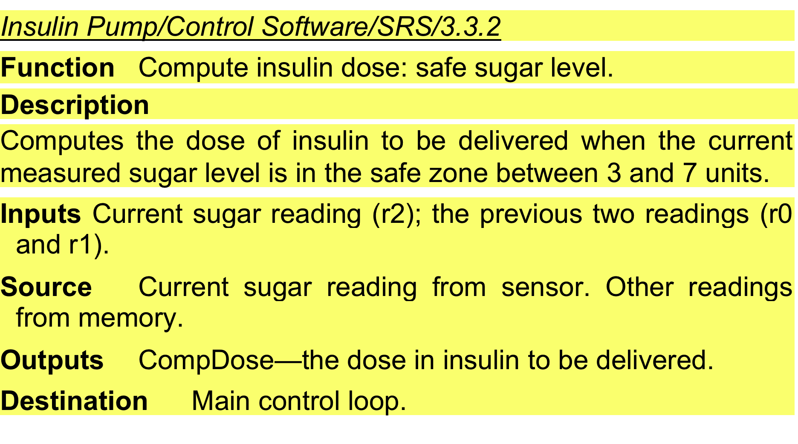
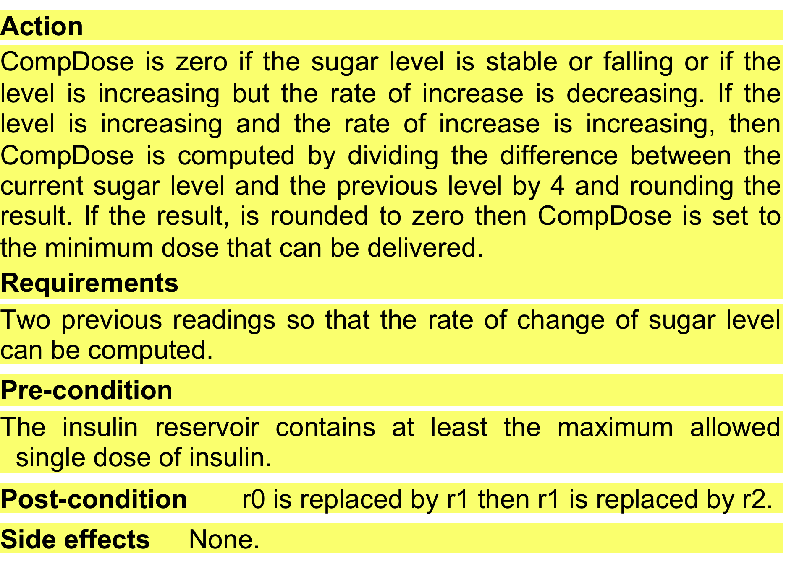

<!-- _class: lead -->

# Chapter 4 – Requirements Engineering

---

# Topics covered

- Functional and non-functional requirements
- Requirements engineering processes
- Requirements elicitation
- Requirements specification
- Requirements validation
- Requirements change

---

# Requirements engineering

- The process of establishing the services that acustomer requires from a system and the constraints under which it operates and is developed.
- The system requirements are the descriptions of the system services and constraints that are generated during the requirements engineering process.

---

# What is a requirement?

- It may range from a high-level abstract statement of a service or of a system constraint to a detailed mathematical functional specification.
- This is inevitable as requirements may serve a dual function
  - May be the basis for a bid for a contract - therefore must be open to interpretation;
  - May be the basis for the contract itself - therefore must be defined in detail;
  - Both these statements may be called requirements.

---

# Requirements abstraction (Davis)

- “If a company wishes to let a contract for a large software development project, it must define its needs in a sufficiently abstract way that a solution is not pre-defined. The requirements must be written so that several contractors can bid for the contract, offering, perhaps, different ways of meeting the client organization’s needs. Once a contract has been awarded, the contractor must write a system definition for the client in more detail so that the client understands and can validate what the software will do. Both of these documents may be called the requirements document for the system.”

---

# Types of requirement

- User requirements
  - Statements in natural language plus diagrams of the services the system provides and its operational constraints. Written for customers.
- System requirements
  - A structured document setting out detailed descriptions of the system’s functions, services and operational constraints. Defines what should be implemented so may be part of a contract between client and contractor.

---

# User and system requirements

<!-- pptx2marp: image2.emf is a EMF file; many browsers cannot render it inline. Re-export from PowerPoint as PNG/SVG if this slide looks blank. -->

---

# Readers of different types of requirements specification

<!-- pptx2marp: image3.emf is a EMF file; many browsers cannot render it inline. Re-export from PowerPoint as PNG/SVG if this slide looks blank. -->

---

# Feasibility studies

A feasibility study is a short, focused study that should take place early in the RE process. It should answer three key questions:

- Does the system contribute to the overall objectives of the organization?
- Can the system be implemented within schedule and budget using current technology? and
- Can the system be integrated with other systems that are used?

If the answer to any of these questions is no, you should probably not go ahead with the project.

---

# [The Elements of a Good Feasibility Study](https://www.projectsmart.co.uk/requirements-management/elements-of-a-good-feasibility-study.php)

- <https://www.projectsmart.co.uk/requirements-management/elements-of-a-good-feasibility-study.php>

---

# System stakeholders

- Any person or organization who is affected by the system in some way and so who has a legitimate interest
- Stakeholder types
  - End users
  - System managers
  - System owners
  - External stakeholders

---

# Stakeholders in the Mentcare system

- Patients whose information is recorded in the system.
- Doctors who are responsible for assessing and treating patients.
- Nurses who coordinate the consultations with doctors and administer some treatments.
- Medical receptionists who manage patients’ appointments.
- IT staff who are responsible for installing and maintaining the system.

---

# Stakeholders in the Mentcare system

- A medical ethics manager who must ensure that the system meets current ethical guidelines for patient care.
- Health care managers who obtain management information from the system.
- Medical records staff who are responsible for ensuring that system information can be maintained and preserved, and that record keeping procedures have been properly implemented.

---

# Agile methods and requirements

- Many agile methods argue that producing detailed system requirements is a waste of time as requirements change so quickly.
- The requirements document is therefore always out of date.
- Agile methods usually use incremental requirements engineering and may express requirements as ‘user stories’ (discussed in Chapter 3).
- This is practical for business systems but problematic for systems that require pre-delivery analysis (e.g. critical systems) or systems developed by several teams.

---

# Functional and non-functional requirements

---

# Functional and non-functional requirements

- Functional requirements
  - Statements of services the system should provide, how the system should react to particular inputs and how the system should behave in particular situations.
  - May state what the system should not do.
- Non-functional requirements
  - Constraints on the services or functions offered by the system such as timing constraints, constraints on the development process, standards, etc.
  - Often apply to the system as a whole rather than individual features or services.
- Domain requirements
  - Constraints on the system from the domain of operation

---

- Functional requirements define WHAT the system should do. Non-functional requirements define HOW WELL, UNDER WHAT CONDITIONS, and WITH WHAT CONSTRAINTS the system should do it.

but...

- Non-functional requirements don’t define new features, but they *shape* how those features are implemented. They influence architectural decisions, choice of data structures, algorithms, and technologies — often having a deeper impact on code than the functional requirements themselves.

---

# For examle

if the system is required to respond in less than 2 seconds (a non-functional requirement), it may turn out that the implementation of a search function (a functional requirement) cannot rely on simple linear search — instead, techniques like indexing, hashing, caching, or more suitable data structures must be used.

In other words, seemingly “secondary” quality requirements can completely change the way a function is implemented.

---

# Domain requirements

- Domain requirements are derived from the application domain of the system rather than from the specific needs of system users. They may be new functional requirements in their own right, constrain existing functional requirements, or set out how particular computations must be carried out.
- The problem with domain requirements is that software engineers may not understand the characteristics of the domain in which the system operates. This means that these engineers may not know whether or not a domain requirement has been missed out or conflicts with other requirements.

<https://software-engineering-book.com/web/domain-requirements/>

---

# Functional requirements

- Describe functionality or system services.
- Depend on the type of software, expected users and the type of system where the software is used.
- Functional user requirements may be high-level statements of what the system should do.
- Functional system requirements should describe the system services in detail.

---

# Example of Mentcare system: functional requirements

- A user shall be able to search the appointments lists for all clinics.
- The system shall generate each day, for each clinic, a list of patients who are expected to attend appointments that day.
- Each staff member using the system shall be uniquely identified by his or her 8-digit employee number.

The requirements show that functional requirements may be written at different levels of detail (contrast requirements 1 and 3).

---

# Requirements imprecision

- Problems arise when functional requirements are not precisely stated.
- Ambiguous requirements may be interpreted in different ways by developers and users.
- Consider the term ‘search’ in requirement 1
  - User intention – search for a patient name across all appointments in all clinics;
  - Developer interpretation – search for a patient name in an individual clinic. User chooses clinic then search.

---

Functional requirements, as the name suggests, have traditionally focused on what the system should do. However, if an organization decides that an existing off the-shelf system software product can meet its needs, then there is very little point in developing a detailed functional specification. In such cases, the focus should be on the development of information requirements that specify the information needed for people to do their work. Information requirements specify the information needed and how it is to be delivered and organized. Therefore, an information requirement for the Mentcare system might specify what information is to be included in the list of patients expected for appointments that day. Imprecision in the requirements specification can lead to disputes between custom ers and software developers. It is natural for a system developer to interpret an ambig uous requirement in a way that simplifies its implementation. Often, however, this is not what the customer wants. New requirements have to be established and changes made to the system. Of course, this delays system delivery and increases costs. For example, the first Mentcare system requirement in the above list states that a user shall be able to search the appointments lists for all clinics. The rationale for this requirement is that patients with mental health problems are sometimes confused. They may have an appointment at one clinic but actually go to a different clinic. If they have an appointment, they will be recorded as having attended, regardless of the clinic.

A medical staff member specifying a search requirement may expect “search” to mean that, given a patient name, the system looks for that name in all appointments at all clinics. However, this is not explicit in the requirement. System developers may interpret the requirement so that it is easier to implement. Their search function may require the user to choose a clinic and then carry out the search of the patients who attended that clinic. This involves more user input and so takes longer to complete the search. Ideally, the functional requirements specification of a system should be both complete and consistent. Completeness means that all services and information required by the user should be defined. Consistency means that requirements should not be contradictory. In practice, it is only possible to achieve requirements consistency and complete ness for very small software systems. One reason is that it is easy to make mistakes and omissions when writing specifications for large, complex systems. Another rea son is that large systems have many stakeholders, with different backgrounds and expectations. Stakeholders are likely to have different—and often inconsistent— needs. These inconsistencies may not be obvious when the requirements are origi nally specified, and the inconsistent requirements may only be discovered after deeper analysis or during system development.

---

# Requirements completeness and consistency

- In principle, requirements should be both complete and consistent.
- Complete
  - They should include descriptions of all facilities required.
- Consistent
  - There should be no conflicts or contradictions in the descriptions of the system facilities.
- In practice, because of system and environmental complexity, it is impossible to produce a complete and consistent requirements document.

---

# Non-functional requirements

- These define system properties and constraints e.g. reliability, response time and storage requirements. Constraints are I/O device capability, system representations, etc.
- Process requirements may also be specified mandating a particular IDE, programming language or development method.
- Non-functional requirements may be more critical than functional requirements. If these are not met, the system may be useless.

---

# Types of nonfunctional requirement

<!-- pptx2marp: image4.emf is a EMF file; many browsers cannot render it inline. Re-export from PowerPoint as PNG/SVG if this slide looks blank. -->

---

# Non-functional requirements implementation

- Non-functional requirements may affect the overall architecture of a system rather than the individual components.
  - For example, to ensure that performance requirements are met, you may have to organize the system to minimize communications between components.
- A single non-functional requirement, such as a security requirement, may generate a number of related functional requirements that define system services that are required.
  - It may also generate requirements that restrict existing requirements.

---

# Non-functional classifications

- Product requirements
  - Requirements which specify that the delivered product must behave in a particular way e.g. execution speed, reliability, etc.
- Organisational requirements
  - Requirements which are a consequence of organisational policies and procedures e.g. process standards used, implementation requirements, etc.
- External requirements
  - Requirements which arise from factors which are external to the system and its development process e.g. interoperability requirements, legislative requirements, etc.

---

# Examples of nonfunctional requirements in the Mentcare system

|**Product requirement** The Mentcare system shall be available to all clinics during normal working hours (Mon–Fri, 0830–17.30). Downtime within normal working hours shall not exceed five seconds in any one day. **Organizational requirement** Users of the Mentcare system shall authenticate themselves using their health authority identity card. **External requirement** The system shall implement patient privacy provisions as set out in HStan-03-2006-priv.|
|---|

---

# Goals and requirements

- Non-functional requirements may be very difficult to state precisely and imprecise requirements may be difficult to verify.
- Goal
  - A general intention of the user such as ease of use.
- Verifiable non-functional requirement
  - A statement using some measure that can be objectively tested.
- Goals are helpful to developers as they convey the intentions of the system users.

---

# Usability requirements

*(how a manager might express usability requirements)*

- The system should be easy to use by medical staff and should be organized in such a way that user errors are minimized. (Goal)

*(This has been rewritten to show how the goal could be expressed as a 'testable' non-functional requirement)*

- Medical staff shall be able to use all the system functions after four hours of training. After this training, the average number of errors made by experienced users shall not exceed two per hour of system use. (Testable non-functional requirement)

---

# Metrics for specifying nonfunctional requirements

|**Property**|**Measure**|
|---|---|
|Speed|Processed transactions/second User/event response time Screen refresh time|
|Size|Mbytes Number of ROM chips|
|Ease of use|Training time Number of help frames|
|Reliability|Mean time to failure Probability of unavailability Rate of failure occurrence Availability|
|Robustness|Time to restart after failure Percentage of events causing failure Probability of data corruption on failure|
|Portability|Percentage of target dependent statements Number of target systems|

---

# Card readers example

In practice, customers for a system often find it difficult to translate their goals into measurable requirements. For some goals, such as maintainability, there are no sim ple metrics that can be used. In other cases, even when quantitative specification is possible, customers may not be able to relate their needs to these specifications. They don’t understand what some number defining the reliability (for example) means in terms of their everyday experience with computer systems. Furthermore, the cost of objectively verifying measurable, non-functional requirements can be very high, and the customers paying for the system may not think these costs are justified. Non-functional requirements often conflict and interact with other functional or non-functional requirements. For example, the identification requirement in Figure 4.4 requires a card reader to be installed with each computer that connects to the system. However, there may be another requirement that requests mobile access to the system from doctors’ or nurses’ tablets or smartphones. These are not normally equipped with card readers so, in these circumstances, some alternative identification method may have to be supported. It is difficult to separate functional and non-functional requirements in the requirements document. If the non-functional requirements are stated separately from the functional requirements, the relationships between them may be hard to understand. However, you should, ideally, highlight requirements that are clearly related to emergent system properties, such as performance or reliability. You can do this by putting them in a separate section of the requirements document or by distin guishing them, in some way, from other system requirements.

---

It's valuable to group stakeholders so that each group represents a consistent viewpoint regarding the system's requirements.

---

# Requirements engineering processes

---

# Requirements engineering processes

- The processes used for RE vary widely depending on the application domain, the people involved and the organisation developing the requirements.
- However, there are a number of generic activities common to all processes
  - Requirements elicitation;
  - Requirements analysis;
  - Requirements validation;
  - Requirements management.
- In practice, RE is an iterative activity in which these processes are interleaved.

---

# A spiral view of the requirements engineering process

<!-- pptx2marp: image5.emf is a EMF file; many browsers cannot render it inline. Re-export from PowerPoint as PNG/SVG if this slide looks blank. -->

<!-- Early in the process, most effort will be spent on understanding high-level business and non-functional requirements, and the user requirements for the system. Later in the process, in the outer rings of the spiral, more effort will be devoted to eliciting and understanding the non-functional requirements and more detailed system requirements. This spiral model accommodates approaches to development where the require ments are developed to different levels of detail. The number of iterations around the spiral can vary so that the spiral can be exited after some or all of the user require ments have been elicited. Agile development can be used instead of prototyping so that the requirements and the system implementation are developed together. In virtually all systems, requirements change. The people involved develop a bet ter understanding of what they want the software to do; the organization buying the system changes; and modifications are made to the system’s hardware, software, and organizational environment. Changes have to be managed to understand the impact on other requirements and the cost and system implications of making the change. -->

---

Agile development can be used instead of prototyping so that the requirements and the system implementation are developed together.

---

# Requirements elicitation (extraction)

---

# Requirements elicitation and analysis

- Sometimes called requirements elicitation or requirements discovery.
- Involves technical staff working with customers to find out about the application domain, the services that the system should provide and the system’s operational constraints.
- May involve end-users, managers, engineers involved in maintenance, domain experts, trade unions, etc. These are called *stakeholders.*

---

# Requirements elicitation

---

# Requirements elicitation

- Software engineers work with a range of system stakeholders to find out about the application domain, the services that the system should provide, the required system performance, hardware constraints, other systems, etc.
- Stages include:
- Requirements discovery and understanding,
- Requirements classification and organization,
- Requirements prioritization and negotiation,
- Requirements specification (documentation).

---

# Problems of requirements elicitation

- Stakeholders don’t know what they really want.
- Stakeholders express requirements in their own terms.
- Different stakeholders may have conflicting requirements.
- Organisational and political factors may influence the system requirements.
- The requirements change during the analysis process. New stakeholders may emerge and the business environment may change.

---

# The requirements elicitation and analysis process

<!-- pptx2marp: image6.emf is a EMF file; many browsers cannot render it inline. Re-export from PowerPoint as PNG/SVG if this slide looks blank. -->

---

# Process activities

- Requirements discovery
  - Interacting with stakeholders to discover their requirements. Domain requirements are also discovered at this stage.
- Requirements classification and organisation
  - Groups related requirements and organises them into coherent clusters.
- Prioritisation and negotiation
  - Prioritising requirements and resolving requirements conflicts.
- Requirements specification
  - Requirements are documented and input into the next round of the spiral.

<!-- Requirements discovery and understanding This is the process of interacting with stakeholders of the system to discover their requirements. Domain requirements from stakeholders and documentation are also discovered during this activity.
Requirements classification and organization This activity takes the unstructured collection of requirements, groups related requirements and organizes them into coherent clusters.
Requirements prioritization and negotiation Inevitably, when multiple stake holders are involved, requirements will conflict. This activity is concerned with prioritizing requirements and finding and resolving requirements conflicts through negotiation. Usually, stakeholders have to meet to resolve differences and agree on compromise requirements.
Requirements documentation The requirements are documented and input into the next round of the spiral. An early draft of the software requirements docu ments may be produced at this stage, or the requirements may simply be main tained informally on whiteboards, wikis, or other shared spaces. -->

---

# Viewpoints

A viewpoint is a way of collecting and organizing a set of requirements from a group of stakeholders who have something in common. Each viewpoint therefore includes a set of system requirements. Viewpoints might come from end-users, managers, or others. They help identify the people who can provide information about their requirements and structure the requirements for analysis.

<http://www.software-engineering-book.com/web/viewpoints/>

---

# Requirements discovery

- The process of gathering information about the required and existing systems and distilling the user and system requirements from this information.
- Interaction is with system stakeholders from managers to external regulators.
- Systems normally have a range of stakeholders.

---

# Interviewing

- Formal or informal interviews with stakeholders are part of most RE processes.
- Types of interview
  - Closed interviews based on pre-determined list of questions
  - Open interviews where various issues are explored with stakeholders.
- Effective interviewing
  - Be open-minded, avoid pre-conceived ideas about the requirements and are willing to listen to stakeholders.
  - Prompt the interviewee to get discussions going using a springboard question, a requirements proposal, or by working together on a prototype system.

<!-- To be an effective interviewer, you should bear two things in mind:
You should be open-minded, avoid preconceived ideas about the requirements, and willing to listen to stakeholders. If the stakeholder comes up with surprising requirements, then you should be willing to change your mind about the system.
You should prompt the interviewee to get discussions going by using a spring board question or a requirements proposal, or by working together on a proto type system. Saying to people “tell me what you want” is unlikely to result in useful information. They find it much easier to talk in a defined context rather than in general terms. -->

---

# Interviews in practice

- Normally a mix of closed and open-ended interviewing.
- Interviews are good for getting an overall understanding of what stakeholders do and how they might interact with the system.
- Interviewers need to be open-minded without pre-conceived ideas of what the system should do
- You need to prompt the use to talk about the system by suggesting requirements rather than simply asking them what they want.

---

# Problems with interviews

- Application specialists may use language to describe their work that isn’t easy for the requirements engineer to understand.
- Interviews are not good for understanding domain requirements
  - Requirements engineers cannot understand specific domain terminology;
  - Some domain knowledge is so familiar that people find it hard to articulate or think that it isn’t worth articulating.

For example. Some domain knowledge is so familiar to stakeholders that they either find it difficult to explain or they think it is so fundamental that it isn’t worth mentioning. For example, for a librarian, it goes without saying that all acquisitions are catalogued before they are added to the library. However, this may not be obvious to the interviewer, and so it isn’t taken into account in the requirements.

---

# Why "Ethnography" in Software Engineering?

In the context you cited, which is **"Observation or ethnography, when we observe people at work to see what artifacts they use, how they use them, etc."**, the authors of the book are using the term "ethnography" in its **broad and methodological sense**, not in the strict, academic anthropological understanding.

This refers to applying the **research techniques and principles** characteristic of ethnography, namely:

- **Long-term, in-depth observation:** Instead of a one-time interview, ethnography in SE suggests immersing oneself in the user's environment to understand their daily work, context, customs, and challenges.
- **Understanding "unwritten" rules:** People often perform their work in ways they aren't consciously aware of or use informal processes. Direct observation allows us to capture these nuances that can't be obtained in an interview. For example, how they collaborate, what workarounds they use, what "artifacts" (documents, tools, software) are actually used and how.
- **Contextualization:** Ethnography emphasizes the importance of understanding the entire context in which the system is to operate. This includes not just technical requirements, but also the work culture, organizational structure, and interpersonal relationships.
- **Work "artifacts":** The reference to "artifacts" is crucial. An ethnographer studies objects produced by a given culture to understand its functioning. In SE, "artifacts" could be forms, reports, software, physical tools—anything used in the work process. Observing how they are used provides valuable information about user needs.

---

# In Other Words

- Using "ethnography" in this context is shorthand for a **research approach based on in-depth, direct observation of users in their natural work environment**. The goal is to capture not only what people *say* they do, but primarily what they **actually do**, how they cope with challenges, and what their real needs and pain points are.
- This is particularly valuable because people often can't verbalize all their requirements, either due to being accustomed to current solutions or because certain aspects of their work are so obvious to them that they don't see the need to describe them. Observation helps uncover these hidden needs and facilitates the design of more useful and effective systems.
- Although the word sounds foreign in an IT context, in literature concerning UX (User Experience) and requirements engineering, **ethnographic/observational studies** are a recognized and valuable technique for eliciting requirements.

---

# A Historical Example

- A classic example illustrating this problem is the **"Confirm" system (American Airlines, 1990s).**
- **Context:** American Airlines (AA) had great success with its proprietary airline reservation system, Sabre, which was highly innovative and crucial to its business. In the 1990s, AA attempted to create a new, even more advanced and flexible reservation system, allowing travel agents and airline employees to comprehensively manage bookings, fares, and connections. It was named "Confirm.“
- **The Problem:** Despite massive investments (reportedly hundreds of millions of dollars) and IBM's involvement as a partner, the project ended in spectacular failure and was never fully implemented or widely used. Why?
- **Overly Complex and Unintuitive:** The system was incredibly complex and tried to handle every possible scenario. As a result, it was difficult for agents to learn and use, as they were accustomed to faster, albeit less flexible, existing systems (including Sabre).
- **Lack of Understanding of Workflow:** The designers failed to consider how agents *actually* worked, their habits, and what was crucial for them in quickly serving a customer. The system imposed new, complicated processes that slowed down work instead of facilitating it.
- **Resistance to Change and Organizational Culture:** Agents had well-established routines and were reluctant to learn something they perceived as less efficient. Insufficient involvement of end-users during the design and testing phases led to the system not meeting their actual needs.
- **Integration Issues:** Despite its technological sophistication, the system struggled with seamless integration with existing systems and processes, creating additional barriers.
- **The Outcome:** Confirm was ultimately abandoned, and AA incurred massive financial and reputational losses. This is a textbook example of how advanced technology that fails to consider **social, organizational, and human interaction factors** can lead to failure, even if it is technically functional. The system was "delivered" but not "used," precisely for the reasons the author describes.

---

# Cultural Clash in UI Design: A Hidden Pitfall

**The Problem:** Software developed by teams from **Left-to-Right (LTR)** reading cultures (e.g., Europe) often defaults to LTR interface design. When this software is deployed for users in **Right-to-Left (RTL)** reading cultures (e.g., Middle East), it creates a significant usability barrier.

**Why it Matters:**

- **Intuition vs. Reality:** Users in RTL cultures expect menus on the right, text flowing right-to-left, and reversed navigation. An LTR interface feels unnatural and increases cognitive load.
- **User Frustration:** This leads to frustration, errors, and a perception that the system is clunky, regardless of its technical functionality.
- **System Rejection:** As a result, the software, though "delivered," is often **never truly "used,"** leading to wasted investment.
- **The Lesson:** This highlights the critical importance of considering **socio-cultural factors (localization)** in requirements engineering. Ignoring these deeply ingrained habits and expectations means building technically sound software that is **impractical and unusable** for its target audience.

---

Windows and the Start Menu

---

# Windows and the Start Menu: Evolution with Resistance

The Original Start Menu (Windows 95 - XP):

- This was a revolutionary interface that, in a sense, did take into account the ethnography of its time. Users were accustomed to folder structures but wanted quick access to programs and documents. The Start Menu was an intuitive, hierarchical solution that consolidated these needs. It quickly became a habit for millions of users.

---

# Windows and the Start Menu: Evolution with Resistance

The Change in Windows 8 (and the lack of a Start Menu):

- This is a perfect example of a design decision that went against the established "ethnography" of desktop usage. Microsoft, seeing the growing popularity of tablets and touch interfaces, tried to impose a tile-based (Metro UI) paradigm onto the traditional desktop.
- The Problem: Desktop users had a deeply ingrained habit of working with a mouse and keyboard, with a visible desktop and quick access to the hierarchical Start Menu. Removing it and replacing it with a full-screen "Start Screen" was a huge shock for them. It was like forcing someone to drive a car without a steering wheel because the designer thought a joystick was "modern.“
- The Result: Massive resistance, frustration, and widespread criticism. Many companies held off on updating, and users sought third-party programs to restore the Start Menu. Microsoft was forced to partially backtrack, restoring the Start Menu in Windows 8.1 and then significantly evolving it in Windows 10, where tiles were integrated with the traditional menu.
- Ethnographic Analysis: If Microsoft had conducted in-depth ethnographic research on desktop users, they would have understood how deeply ingrained their work habits and processes were tied to the Start Menu and desktop. The attempt to impose a new "ethos" without sufficient understanding of the existing one was a costly mistake.

---

The Ribbon in MS Office: Innovation with a Learning Curve

---

# The Ribbon in MS Office: Innovation with a Learning Curve

The Ribbon Concept (from Office 2007 onwards):

- The introduction of the Ribbon was an attempt to solve the problem of "feature creep" and the difficulty of finding necessary tools in traditional menus and toolbars. Microsoft argued that users only used a fraction of features, and the ones they needed were often hidden. The Ribbon was designed to be contextual and visually expose the most important options.
- Initial Resistance: Similar to Windows 8, the Ribbon faced significant resistance from long-time Office users. People were accustomed to the "ethnography" of dropdown menus and icons. Changing their habits was difficult because they had to re-learn where everything was.

---

# The Ribbon in MS Office: Innovation with a Learning Curve

Difference from Windows 8: Despite initial resistance, the Ribbon was eventually accepted and is now standard. Why?

- Gradual Acceptance: Although the learning curve was painful, many users eventually recognized its benefits, especially in terms of quick access to frequently used and contextual features.
- Lack of Alternative: Unlike Windows 8, where users could simply choose not to update, Office updates were often mandated by corporate environments.
- Less Fundamental Change: The Start Menu is a critical entry point to the entire operating system. The Ribbon, while significant, only changed the interface of one application (albeit a very popular one).

---

# How Does This Relate to Ethnography?

In both cases, Microsoft attempted to **change the "ethos" (customs, habits, character) of software usage** on a massive scale:

- **In Windows 8:** The attempt was **too radical** and failed to account for the strength of ingrained desktop work habits. It was like trying to impose a new culture on an existing one without adequately understanding its core. Ethnography would have warned against such an interface "culture shock."
- **In Office's Ribbon:** This was a **change that required adaptation**, but over time, it proved more effective for most users. Initial resistance could have been predicted through ethnographic studies, but ultimately, the innovation brought benefits. This shows that sometimes a new approach can become the new "ethos" if the benefits outweigh the learning cost.

---

# Summary

Ethnography doesn't say never change the interface or never innovate. Rather, it says: **"Deeply understand how people** ***truly*** **work and what their** ***deep-seated habits*** **are before introducing fundamental changes."** Ignoring this leads to failures, like Windows 8, while carefully managing change and demonstrating clear benefits can lead to success, as in the case of the Ribbon.

---

Ethnography is helpful to understand existing systems, but this understanding does not always help with innovation. Innovation is particularly relevant for new product development. Commentators have suggested that Nokia used ethnography to discover how people used their phones and developed new phone models on that basis; Apple, on the other hand, ignored current use and revolutionized the mobile phone industry with the introduction of the iPhone.

---

# Ethnography

- A social scientist spends a considerable time observing and analysing how people actually work.
- People do not have to explain or articulate their work.
- Social and organisational factors of importance may be observed.
- Ethnographic studies have shown that work is usually richer and more complex than suggested by simple system models.

---

# Scope of ethnography

- Requirements that are derived from the way that people actually work rather than the way I which process definitions suggest that they ought to work.
- Requirements that are derived from cooperation and awareness of other people’s activities.
  - Awareness of what other people are doing leads to changes in the ways in which we do things.

Ethnography is effective for understanding existing processes but cannot identify new features that should be added to a system.

---

# Focused ethnography

- Developed in a project studying the air traffic control process
- Combines ethnography with prototyping
- Prototype development results in unanswered questions which focus the ethnographic analysis.
- The problem with ethnography is that it studies existing practices which may have some historical basis which is no longer relevant.

---

# Ethnography and prototyping for requirements analysis

<!-- pptx2marp: image7.emf is a EMF file; many browsers cannot render it inline. Re-export from PowerPoint as PNG/SVG if this slide looks blank. -->

---

# Stories and scenarios

- Scenarios and user stories are real-life examples of how a system can be used.
- Stories and scenarios are a description of how a system may be used for a particular task.
- Because they are based on a practical situation, stakeholders can relate to them and can comment on their situation with respect to the story.

---

# Photo sharing in the classroom (iLearn)

- Jack is a primary school teacher in Ullapool (a village in northern Scotland). He has decided that a class project should be focused around the fishing industry in the area, looking at the history, development and economic impact of fishing. As part of this, pupils are asked to gather and share reminiscences from relatives, use newspaper archives and collect old photographs related to fishing and fishing communities in the area. Pupils use an iLearn wiki to gather together fishing stories and SCRAN (a history resources site) to access newspaper archives and photographs. However, Jack also needs a photo sharing site as he wants pupils to take and comment on each others’ photos and to upload scans of old photographs that they may have in their families.  Jack sends an email to a primary school teachers group, which he is a member of to see if anyone can recommend an appropriate system. Two teachers reply and both suggest that he uses KidsTakePics, a photo sharing site that allows teachers to check and moderate content. As KidsTakePics is not integrated with the iLearn authentication service, he sets up a teacher and a class account. He uses the iLearn setup service to add KidsTakePics to the services seen by the pupils in his class so that when they log in, they can immediately use the system to upload photos from their mobile devices and class computers.

---

# Scenarios

- A structured form of user story
- Scenarios should include
  - A description of the starting situation;
  - A description of the normal flow of events;
  - A description of what can go wrong;
  - Information about other concurrent activities;
  - A description of the state when the scenario finishes.

---

# Uploading photos iLearn)

- **Initial assumption**: A user or a group of users have one or more digital photographs to be uploaded to the picture sharing site. These are saved on either a tablet or laptop computer. They have successfully logged on to KidsTakePics.
- **Normal**:  The user chooses upload photos and they are prompted to select the photos to be uploaded on their computer and to select the project name under which the photos will be stored. They should also be given the option of inputting keywords that should be associated with each uploaded photo. Uploaded photos are named by creating a conjunction of the user name with the filename of the photo on the local computer.
- On completion of the upload, the system automatically sends an email to the project moderator asking them to check new content and generates an on-screen message to the user that this has been done.

---

# Uploading photos

- **What can go wrong**:
- No moderator is associated with the selected project. An email is automatically generated to the school administrator asking them to nominate a project moderator. Users should be informed that there could be a delay in making their photos visible.
- Photos with the same name have already been uploaded by the same user.  The user should be asked if they wish to re-upload the photos with the same name, rename the photos or cancel the upload. If they chose to re-upload the photos, the originals are overwritten. If they chose to rename the photos, a new name is automatically generated by adding a number to the existing file name.
- **Other activities:**  The moderator may be logged on to the system and may approve photos as they are uploaded.
- **System state on completion**: User is logged on. The selected photos have been uploaded and assigned a status ‘awaiting moderation’.  Photos are visible to the moderator and to the user who uploaded them.

---

# Requirements specification

---

# Requirements specification

- The process of writing down the user and system requirements in a requirements document.
- User requirements have to be understandable by end-users and customers who do not have a technical background.
- System requirements are more detailed requirements and may include more technical information.
- The requirements may be part of a contract for the system development
  - It is therefore important that these are as complete as possible.

---

# System requirements

System requirements are expanded versions of the user requirements that soft ware engineers use as the starting point for the system design. They add detail and explain how the system should provide the user requirements. They may be used as part of the contract for the implementation of the system and should therefore be a complete and detailed specification of the whole system.

---

# Ways of writing a system requirements specification

|**Notation**|**Description**|
|---|---|
|**Natural language**|The requirements are written using numbered sentences in natural language. Each sentence should express one requirement.|
|Structured natural language|The requirements are written in natural language on a standard form or template. Each field provides information about an aspect of the requirement.|
|Design description languages|This approach uses a language like a programming language, but with more abstract features to specify the requirements by defining an operational model of the system. This approach is now rarely used although it can be useful for interface specifications.|
|Graphical notations|Graphical models, supplemented by text annotations, are used to define the functional requirements for the system; UML use case and sequence diagrams are commonly used.|
|Mathematical specifications|These notations are based on mathematical concepts such as finite-state machines or sets. Although these unambiguous specifications can reduce the ambiguity in a requirements document, most customers don’t understand a formal specification. They cannot check that it represents what they want and are reluctant to accept it as a system contract|

---

# Requirements and design

- In principle, requirements should state what the system should do and the design should describe how it does this.
- In practice, requirements and design are inseparable
  - A system architecture may be designed to structure the requirements;
  - The system may inter-operate with other systems that generate design requirements;
  - The use of a specific architecture to satisfy non-functional requirements may be a domain requirement.
  - This may be the consequence of a regulatory requirement.

---

# Natural language specification

- Requirements are written as natural language sentences supplemented by diagrams and tables.
- Used for writing requirements because it is expressive, intuitive and universal. This means that the requirements  can be understood by users and customers.

---

# Guidelines for writing requirements

- Invent a standard format and use it for all requirements.
- Use language in a consistent way. Use shall for mandatory requirements, should for desirable requirements.
- Use text highlighting to identify key parts of the requirement.
- Avoid the use of computer jargon.
- Include an explanation (rationale) of why a requirement is necessary.

---

# Guidelines for writing requirements

- Invent a standard format and ensure that all requirement definitions adhere to that format. Standardizing the format makes omissions less likely and requirements easier to check. I suggest that, wherever possible, you should write the requirement in one or two sentences of natural language.
- Use language consistently to distinguish between mandatory and desirable requirements. Mandatory requirements are requirements that the system must support and are usually written using “shall/must/have to.” Desirable requirements are not essential and are written using “should.”
- Use text highlighting (bold, italic, or color) to pick out key parts of the requirement.

---

# Guidelines for writing requirements

- Do not assume that readers understand technical, software engineering language. It is easy for words such as “architecture” and “module” to be misunderstood. Wherever possible, you should avoid the use of jargon, abbreviations, and acronyms.
- Whenever possible, you should try to associate a rationale with each user requirement. The rationale should explain why the requirement has been included and who proposed the requirement (the requirement source), so that you know whom to consult if the requirement has to be changed. Requirements rationale is particularly useful when requirements are changed, as it may help decide what changes would be undesirable.

---

# Problems with natural language

- Lack of clarity
  - Precision is difficult without making the document difficult to read.
- Requirements confusion
  - Functional and non-functional requirements tend to be mixed-up.
- Requirements amalgamation
  - Several different requirements may be expressed together.

---

# Problems with using natural language for requirements specification

The flexibility of natural language, which is so useful for specification, often causes problems. There is scope for writing unclear requirements, and readers (the designers) may misinterpret requirements because they have a different background to the user. It is easy to amalgamate several requirements into a single sentence, and structuring natural language requirements can be difficult.

<http://software-engineering-book.com/web/natural-language/>

---

# Example requirements for the insulin pump software system

|3.2 The system shall\* measure the blood sugar and deliver insulin, if required, every 10 minutes. *(Changes in blood sugar are relatively slow so more frequent measurement is unnecessary; less frequent measurement could lead to unnecessarily high sugar levels.)* 3.6 The system shall\* run a self-test routine every minute with the conditions to be tested and the associated actions defined in Table 1. *(A self-test routine can discover hardware and software problems and alert the user to the fact the normal operation may be impossible.)*|
|---|

---

# Example requirements for the insulin pump software system

|3.2 The system must/has to measure the blood sugar and deliver insulin, if required, every 10 minutes. *(Changes in blood sugar are relatively slow so more frequent measurement is unnecessary; less frequent measurement could lead to unnecessarily high sugar levels.)* 3.6 The system must/has to run a self-test routine every minute with the conditions to be tested and the associated actions defined in Table 1. *(A self-test routine can discover hardware and software problems and alert the user to the fact the normal operation may be impossible.)*|
|---|

---

# Structured specifications

- An approach to writing requirements where the freedom of the requirements writer is limited and requirements are written in a standard way.
- This works well for some types of requirements e.g. requirements for embedded control system but is sometimes too rigid for writing business system requirements.

---

# Form-based specifications

- Definition of the function or entity(object).
- Description of inputs and where they come from.
- Description of outputs and where they go to.
- Information about the information needed for the computation and other entities used.
- Description of the action to be taken.
- Pre and post conditions (if appropriate).
- The side effects (if any) of the function.

---

# Entity - Philosophy and Ontology

**I**n philosophy, especially in ontology (the branch of philosophy studying beings and their existence), "entity" is used as a synonym for **being** or an **existing object**.

It refers to something that has a distinct existence, regardless of whether it is a material or an abstract being.

---

# Entity

- An entity:
  - is a clearly defined object, concept, or thing in the system or its environment that is relevant to the software being developed. It usually has a name, identity, and some associated data or behavior.
- An entity is something we care about because:
  - the system needs to store information about it, or
  - the system needs to interact with it in some way.
- If you can point at it in the real world or describe it as a thing with data — it might be an entity.

---

# Examples of entities

|**Domain (Field)**|**Example Entity**|**Description**|
|---|---|---|
|University System|Student|Has name, ID, courses, grades|
|Library App|Book|Has title, author, ISBN, availability|
|Banking System|Account|Has balance, account number, owner|
|Game Engine|Player or Enemy|Has health, position, inventory, etc.|
|E-Commerce|Order or Product|Has price, ID, quantity, description|

---

# Entity - Relation to Other Concepts

- In databases, entities usually become tables.
- In object-oriented programming, entities often become classes.
- In UML modeling, entities are the things shown as boxes in class diagrams or actors in use case diagrams.
- In requirements specs, entities are the “things” the system deals with — the noun concepts in user stories or scenarios.

---

# A structured specification of a requirement for an insulin pump

---

# A structured specification of a requirement for an insulin pump

---

# A structured specification of a requirement for an insulin pump

---

# A structured specification of a requirement for an insulin pump

---

The Robertsons (Robertson and Robertson 2013), in their book on the VOLERE requirements engineering method, recommend that user requirements be initially written on cards, one requirement per card. They suggest a number of fields on each card, such as the requirements rationale, the dependencies on other requirements, the source of the requirements, and supporting materials. This is similar to the approach used in the example of a structured specification.

---

# Tabular specification

- Used to supplement natural language.
- Particularly useful when you have to define a number of possible alternative courses of action.
- For example, the insulin pump systems bases its computations on the rate of change of blood sugar level and the tabular specification explains how to calculate the insulin requirement for different scenarios.

---

# Tabular specification of computation for an insulin pump

|**Condition**|**Action**|
|---|---|
|Sugar level falling (r2 &lt; r1)|CompDose = 0|
|Sugar level stable (r2 = r1)|CompDose = 0|
|Sugar level increasing and rate of increase decreasing  ((r2 – r1) &lt; (r1 – r0))|CompDose = 0|
|Sugar level increasing and rate of increase stable or increasing  ((r2 – r1) ≥ (r1 – r0))|CompDose =        round ((r2 – r1)/4) If rounded result = 0 then  CompDose = MinimumDose|

---

# Use cases

- Use-cases are a kind of scenario that are included in the UML.
- Use cases identify the actors in an interaction and which describe the interaction itself.
- A set of use cases should describe all possible interactions with the system.
- High-level graphical model supplemented by more detailed tabular description (see Chapter 5).
- UML sequence diagrams may be used to add detail to use-cases by showing the sequence of event processing in the system.

---

# Use cases for the Mentcare system

<!-- pptx2marp: image10.emf is a EMF file; many browsers cannot render it inline. Re-export from PowerPoint as PNG/SVG if this slide looks blank. -->

---

# Use cases for the Mentcare system

<!-- pptx2marp: image10.emf is a EMF file; many browsers cannot render it inline. Re-export from PowerPoint as PNG/SVG if this slide looks blank. -->

---

# Use cases for the Mentcare system

*Setup consultation allows two or more doctors, working in different offices, to view the same patient record at the same time. One doctor initiates the consul tation by choosing the people involved from a dropdown menu of doctors who are online. The patient record is then displayed on their screens, but only the initiating doctor can edit the record. In addition, a text chat window is created to help coordinate actions. It is assumed that a phone call for voice communication can be separately arranged.*

---

# Use cases – conclusion from the author

Stakeholders don’t understand the term use case; they don’t find the graphical model to be useful, and they are often not interested in a detailed description of each and every system interaction.

Consequently, I find use cases to be more helpful in systems design than in requirements engineering.

I discuss use cases fur ther in Chapter 5, which shows how they are used alongside other system models to document a system design.

---

# The software requirements document

- The software requirements document is the official statement of what is required of the system developers.
- Should include both a definition of user requirements and a specification of the system requirements.
- It is NOT a design document. As far as possible, it should set of WHAT the system should do rather than HOW it should do it.

---

# Users of a requirements document

<!-- pptx2marp: image11.emf is a EMF file; many browsers cannot render it inline. Re-export from PowerPoint as PNG/SVG if this slide looks blank. -->

---

# Requirements document variability

- Information in requirements document depends on type of system and the approach to development used.
- Systems developed incrementally will, typically, have less detail in the requirements document.
- Requirements documents standards have been designed e.g. IEEE (1998) standard. These are mostly applicable to the requirements for large systems engineering projects.

---

# The structure of a requirements document

|**Chapter**|**Description**|
|---|---|
|Preface|This should define the expected readership of the document and describe its version history, including a rationale for the creation of a new version and a summary of the changes made in each version.|
|Introduction|This should describe the need for the system. It should briefly describe the system’s functions and explain how it will work with other systems. It should also describe how the system fits into the overall business or strategic objectives of the organization commissioning the software.|
|Glossary|This should define the technical terms used in the document. You should not make assumptions about the experience or expertise of the reader.|
|User requirements definition|Here, you describe the services provided for the user. The nonfunctional system requirements should also be described in this section. This description may use natural language, diagrams, or other notations that are understandable to customers. Product and process standards that must be followed should be specified.|
|System architecture|This chapter should present a high-level overview of the anticipated system architecture, showing the distribution of functions across system modules. Architectural components that are reused should be highlighted.|
|System requirements specification|This should describe the functional and nonfunctional requirements in more detail. If necessary, further detail may also be added to the nonfunctional requirements. Interfaces to other systems may be defined.|
|System models|This might include graphical system models showing the relationships between the system components and the system and its environment. Examples of possible models are object models, data-flow models, or semantic data models.|
|System evolution|This should describe the fundamental assumptions on which the system is based, and any anticipated changes due to hardware evolution, changing user needs, and so on. This section is useful for system designers as it may help them avoid design decisions that would constrain likely future changes to the system.|
|Appendices|These should provide detailed, specific information that is related to the application being developed; for example, hardware and database descriptions. Hardware requirements define the minimal and optimal configurations for the system. Database requirements define the logical organization of the data used by the system and the relationships between data.|
|Index|Several indexes to the document may be included. As well as a normal alphabetic index, there may be an index of diagrams, an index of functions, and so on.|

- Preface
- Introduction
- Glossary
- User requirements definition
- System architecture
- System requirements specification
- System models
- System evolution
- Appendices
- Index

---

# The structure of a requirements document

|**Chapter**|**Description**|
|---|---|
|1. Preface|This should define the expected readership of the document and describe its version history, including a rationale for the creation of a new version and a summary of the changes made in each version.|
|2. Introduction|This should describe the need for the system. It should briefly describe the system’s functions and explain how it will work with other systems. It should also describe how the system fits into the overall business or strategic objectives of the organization commissioning the software.|
|3. Glossary|This should define the technical terms used in the document. You should not make assumptions about the experience or expertise of the reader.|
|4. User requirements definition|Here, you describe the services provided for the user (functional system requirements). The nonfunctional system requirements should also be described in this section. This description may use natural language, diagrams, or other notations that are understandable to customers. Product and process standards that must be followed should be specified.|
|5. System architecture|This chapter should present a high-level overview of the anticipated system architecture, showing the distribution of functions across system modules. Architectural components that are reused should be highlighted.|

---

# The structure of a requirements document

|Chapter|Description|
|---|---|
|6. System requirements specification|This should describe the functional and nonfunctional requirements in more detail. If necessary, further detail may also be added to the nonfunctional requirements. Interfaces to other systems may be defined.|
|7. System models|This might include graphical system models showing the relationships between the system components and the system and its environment. Examples of possible models are object models, data-flow models, or semantic data models.|
|8. System evolution|This should describe the fundamental assumptions on which the system is based, and any anticipated changes due to hardware evolution, changing user needs, and so on. This section is useful for system designers as it may help them avoid design decisions that would constrain likely future changes to the system.|
|9. Appendices|These should provide detailed, specific information that is related to the application being developed; for example, hardware and database descriptions. Hardware requirements define the minimal and optimal configurations for the system. Database requirements define the logical organization of the data used by the system and the relationships between data.|
|10. Index|Several indexes to the document may be included. As well as a normal alphabetic index, there may be an index of diagrams, an index of functions, and so on.|

---

- moze moje doswiadczenie z praca z historykami

---

# Requirements document standards

A number of large organizations, such as the U.S. Department of Defense and the IEEE, have defined standards for requirements documents. These are usually very generic but are nevertheless useful as a basis for developing more detailed organizational standards. The U.S. Institute of Electrical and Electronic Engineers (IEEE) is one of the best-known standards providers, and they have developed a standard for the structure of requirements documents. This standard is most appropriate for systems such as military command and control systems that have a long lifetime and are usually developed by a group of organizations.

<http://software-engineering-book.com/web/requirements-standard/>

---

# Requirements validation

---

# Requirements validation

- Concerned with demonstrating that the requirements define the system that the customer really wants.
- Requirements error costs are high so validation is very important
  - Fixing a requirements error after delivery may cost up to 100 times the cost of fixing an implementation error.

<!-- Requirements validation is the process of checking that requirements define the sys tem that the customer really wants. It overlaps with elicitation and analysis, as it is concerned with finding problems with the requirements. Requirements validation is critically important because errors in a requirements document can lead to extensive rework costs when these problems are discovered during development or after the system is in service. -->

---

# Requirements checking

- **Validity checks** These check that the requirements reflect the real needs of system users. Because of changing circumstances, the user requirements may have changed since they were originally elicited.
- **Consistency checks** Requirements in the document should not conflict. That is, there should not be contradictory constraints or different descriptions of the same system function.
- **Completeness checks** The requirements document should include requirements that define all functions and the constraints intended by the system user.
- **Realism checks** By using knowledge of existing technologies, the requirements should be checked to ensure that they can be implemented within the proposed budget for the system. These checks should also take account of the budget and schedule for the system development.
- **Verifiability** To reduce the potential for dispute between customer and contractor, system requirements should always be written so that they are verifiable. This means that you should be able to write a set of tests that can demonstrate that the delivered system meets each specified requirement.

---

# Requirements checking

- Validity. Does the system provide the functions which best support the customer’s needs?
- Consistency. Are there any requirements conflicts?
- Completeness. Are all functions required by the customer included?
- Realism. Can the requirements be implemented given available budget and technology
- Verifiability. Can the requirements be checked?

<!-- Validity checks These check that the requirements reflect the real needs of system users. Because of changing circumstances, the user requirements may have changed since they were originally elicited.
Consistency checks Requirements in the document should not conflict. That is, there should not be contradictory constraints or different descriptions of the same system function.
Completeness checks The requirements document should include requirements that define all functions and the constraints intended by the system user.
Realism checks By using knowledge of existing technologies, the requirements should be checked to ensure that they can be implemented within the proposed budget for the system. These checks should also take account of the budget and schedule for the system development.
Verifiability To reduce the potential for dispute between customer and contractor, system requirements should always be written so that they are verifiable. This means that you should be able to write a set of tests that can demonstrate that the delivered system meets each specified requirement. -->

---

# Requirements validation techniques

- Requirements reviews
  - Systematic manual analysis of the requirements.
- Prototyping
  - Using an executable model of the system to check requirements. Covered in Chapter 2.
- Test-case generation
  - Developing tests for requirements to check testability.

<!-- Requirements reviews The requirements are analyzed systematically by a team of reviewers who check for errors and inconsistencies.
Prototyping This involves developing an executable model of a system and using this with end-users and customers to see if it meets their needs and expec tations. Stakeholders experiment with the system and feed back requirements changes to the development team.
Test-case generation Requirements should be testable. If the tests for the requirements are devised as part of the validation process, this often reveals requirements problems. If a test is difficult or impossible to design, this usually means that the requirements will be difficult to implement and should be recon sidered. Developing tests from the user requirements before any code is written is an integral part of test-driven development. -->

---

# Requirements validation techniques

- **Requirements reviews** The requirements are analyzed systematically by a team of reviewers who check for errors and inconsistencies.
- **Prototyping** This involves developing an executable model of a system and using this with end-users and customers to see if it meets their needs and expectations. Stakeholders experiment with the system and feed back requirements changes to the development team.
- **Test-case generation** Requirements should be testable. If the tests for the requirements are devised as part of the validation process, this often reveals requirements problems. If a test is difficult or impossible to design, this usually means that the requirements will be difficult to implement and should be reconsidered. **Developing tests from the user requirements before any code is written is an integral part of test-driven development.**

<!-- Requirements reviews The requirements are analyzed systematically by a team of reviewers who check for errors and inconsistencies.
Prototyping This involves developing an executable model of a system and using this with end-users and customers to see if it meets their needs and expec tations. Stakeholders experiment with the system and feed back requirements changes to the development team.
Test-case generation Requirements should be testable. If the tests for the requirements are devised as part of the validation process, this often reveals requirements problems. If a test is difficult or impossible to design, this usually means that the requirements will be difficult to implement and should be recon sidered. Developing tests from the user requirements before any code is written is an integral part of test-driven development. -->

---

# Requirements reviews

- Regular reviews should be held while the requirements definition is being formulated.
- Both client and contractor staff should be involved in reviews.
- Reviews may be formal (with completed documents) or informal. Good communications between developers, customers and users can resolve problems at an early stage.

---

# Requirements reviews

A requirements review is a process in which a group of people from the system customer and the system developer read the requirements document in detail and check for errors, anomalies, and inconsistencies. Once these have been detected and recorded, it is then up to the customer and the developer to negotiate how the identified problems should be solved.

<http://software-engineering-book.com/web/requirements-reviews/>

---

# Review checks

- Verifiability
  - Is the requirement realistically testable?
- Comprehensibility
  - Is the requirement properly understood?
- Traceability
  - Is the origin of the requirement clearly stated?
- Adaptability
  - Can the requirement be changed without a large impact on other requirements?

---

# Requirements change

---

# Changing requirements

- The business and technical environment of the system always changes after installation.
  - New hardware may be introduced, it may be necessary to interface the system with other systems, business priorities may change (with consequent changes in the system support required), and new legislation and regulations may be introduced that the system must necessarily abide by.
- The people who pay for a system and the users of that system are rarely the same people.
  - System customers impose requirements because of organizational and budgetary constraints. These may conflict with end-user requirements and, after delivery, new features may have to be added for user support if the system is to meet its goals.

<!-- The requirements for large software systems are always changing. One reason for the frequent changes is that these systems are often developed to address “wicked” problems—problems that cannot be completely defined (Rittel and Webber 1973). Because the problem cannot be fully defined, the software requirements are bound to be incomplete. During the software development process, the stakeholders’ understanding of the problem is constantly changing (Figure 4.18). The system requirements must then evolve to reflect this changed problem understanding. Once a system has been installed and is regularly used, new requirements inevitably emerge. This is partly a consequence of errors and omissions in the original requirements that have to be corrected. -->

---

# Changing requirements

- Large systems usually have a diverse user community, with many users having different requirements and priorities that may be conflicting or contradictory.
  - The final system requirements are inevitably a compromise between them and, with experience, it is often discovered that the balance of support given to different users has to be changed.

---

# Requirements evolution

<!-- pptx2marp: image12.emf is a EMF file; many browsers cannot render it inline. Re-export from PowerPoint as PNG/SVG if this slide looks blank. -->

---

# Requirements management

- Requirements management is the process of managing changing requirements during the requirements engineering process and system development.
- New requirements emerge as a system is being developed and after it has gone into use.
- You need to keep track of individual requirements and maintain links between dependent requirements so that you can assess the impact of requirements changes. You need to establish a formal process for making change proposals and linking these to system requirements.

---

# Enduring and volatile requirements

Some requirements are more susceptible to change than others. Enduring requirements are the requirements that are associated with the core, slow-to-change activities of an organization. Enduring requirements are associated with fundamental work activities. Volatile requirements are more likely to change. They are usually associated with supporting activities that reflect how the organization does its work rather than the work itself.

<http://software-engineering-book.com/web/changing-requirements/>

---

# Requirements management planning

- Establishes the level of requirements management detail that is required.
- Requirements management decisions:
  - *Requirements identification* Each requirement must be uniquely identified so that it can be cross-referenced with other requirements.
  - *A change management process* This is the set of activities that assess the impact and cost of changes. I discuss this process in more detail in the following section.
  - *Traceability policies* These policies define the relationships between each requirement and between the requirements and the system design that should be recorded.
  - *Tool support* Tools that may be used range from specialist requirements management systems to spreadsheets and simple database systems.

---

# Requirements change management

- Deciding if a requirements change should be accepted
  - *Problem analysis and change specification*
    - During this stage, the problem or the change proposal is analyzed to check that it is valid. This analysis is fed back to the change requestor who may respond with a more specific requirements change proposal, or decide to withdraw the request.
  - *Change analysis and costing*
    - The effect of the proposed change is assessed using traceability information and general knowledge of the system requirements. Once this analysis is completed, a decision is made whether or not to proceed with the requirements change.
  - Change execution!  implementation
    - The requirements document and, where necessary, the system design and implementation, are modified. Ideally, the document should be organized so that changes can be easily implemented.

---

# Requirements change management

<!-- pptx2marp: image13.emf is a EMF file; many browsers cannot render it inline. Re-export from PowerPoint as PNG/SVG if this slide looks blank. -->

---

# Requirements traceability

You need to keep track of the relationships between requirements, their sources, and the system design so that you can analyze the reasons for proposed changes and the impact that these changes are likely to have on other parts of the system. You need to be able to trace how a change ripples its way through the system. Why?

<http://software-engineering-book.com/web/traceability/>

---

# Key points

- Requirements for a software system set out what the system should do and define constraints on its operation and implementation.
- Functional requirements are statements of the services that the system must provide or are descriptions of how some computations must be carried out.
- Non-functional requirements often constrain the system being developed and the development process being used.
- They often relate to the emergent properties of the system and therefore apply to the system as a whole.

---

# Key points

- The requirements engineering process is an iterative process that includes requirements elicitation, specification and validation.
- Requirements elicitation is an iterative process that can be represented as a spiral of activities – requirements discovery, requirements classification and organization, requirements negotiation and requirements documentation.
- You can use a range of techniques for requirements elicitation including interviews and ethnography. User stories and scenarios may be used to facilitate discussions.

---

# Key points

- Requirements specification is the process of formally documenting the user and system requirements and creating a software requirements document.
- The software requirements document is an agreed statement of the system requirements. It should be organized so that both system customers and software developers can use it.

---

# Key points

- Requirements validation is the process of checking the requirements for validity, consistency, completeness, realism and verifiability.
- Business, organizational and technical changes inevitably lead to changes to the requirements for a software system. Requirements management is the process of managing and controlling these changes.
