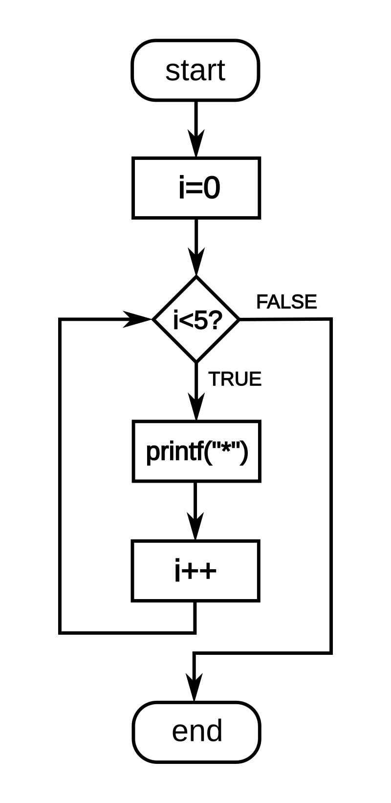
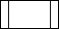
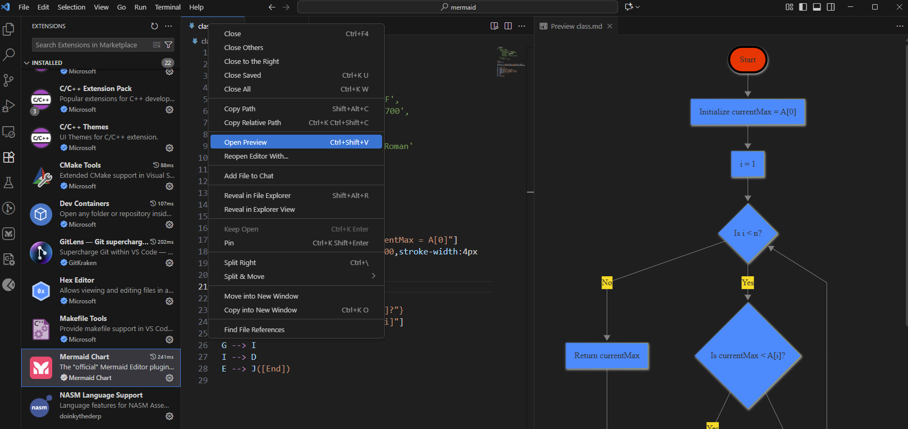
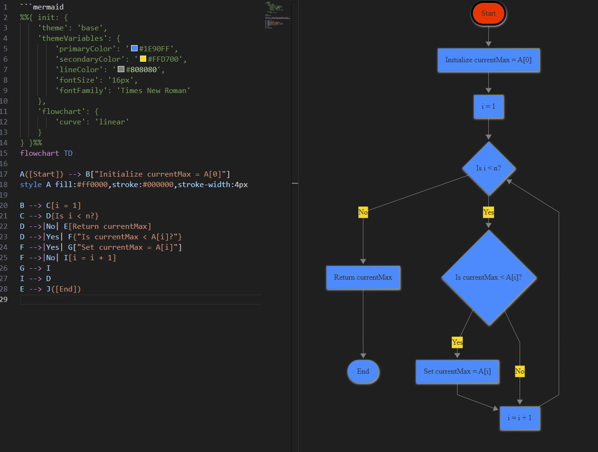

<!-- _class: lead -->

# Software Engineering

## Lecture 20
---

# Today’s Agenda

- Flowchart
- Mermaid

---

# Flowchart

---

# What is a Flowchart?

- A **flowchart** (or process diagram) is a graphical representation of a process or algorithm, showing how data or control flows between steps.
- Each step is represented by a **symbol** (such as rectangles for actions or diamonds for decisions), and arrows indicate the **direction of flow**.
- In Mermaid, a flowchart is described as a **graph** consisting of:
  - **Nodes** — representing actions, decisions, or data;
  - **Edges (connections)** — showing the relationships and flow between nodes.
- Flowcharts in Mermaid are compliant with **ANSI** and **ISO 5807:2019** standards. In UML terminology, this type corresponds to **Activity Diagrams**.



---

# Flowchart

|**Name/ ANSI/ISO Shape**|**Description**|
|---|---|
|Flowline (arrowhead)|Shows the process's order of operation. A line coming from one symbol and pointing at another. Arrowheads are added if the flow is not the standard top-to-bottom, left-to right.|
|Terminal|Indicates the beginning and ending of a program or sub-process. Represented as a stadium, oval or rounded (fillet) rectangle. They usually contain the word "Start" or "End", or another phrase signaling the start or end of a process, such as "submit inquiry" or "receive product".|
|Process|Represents a set of operations that changes value, form, or location of data. Represented as a rectangle.|
|Decision|Shows a conditional operation that determines which one of the two paths the program will take. The operation is commonly a yes/no question or true/false test. Represented as a diamond (rhombus).|
|Input/output|Indicates the process of inputting and outputting data, as in entering data or displaying results. Represented as a rhomboid.|
|Annotation (comment)|Indicating additional information about a step in the program. Represented as an open rectangle with a dashed or solid line connecting it to the corresponding symbol in the flowchart.|
|Predefined process|Shows named process which is defined elsewhere. Represented as a rectangle with double-struck vertical edges.|
|On-page connector|Pairs of labeled connectors replace long or confusing lines on a flowchart page. Represented by a small circle with a letter inside.|
|Off-page connector|A labeled connector for use when the target is on another page. Represented as a home plate-shaped pentagon.|





- <https://en.wikipedia.org/wiki/Flowchart>

---

# Mermaid

---

# What is Mermaid?

- Mermaid is a text-based diagramming and charting tool created by **Knut Sveidqvist** in 2014. It was designed to make it easier for developers to create and maintain diagrams directly in text files — especially within Markdown documents and version control systems like Git.
- Mermaid allows you to describe diagrams in plain text using a simple markup syntax, and then automatically generates diagrams such as flowcharts, sequence diagrams, class diagrams, state diagrams, and more.

---

# Using Mermaid in Visual Studio Code

- To render Mermaid diagrams in Visual Studio Code, you can use the official extension “Mermaid Chart”. There are two important notes when using it:
- The first line of your file must start with \`\`\`mermaid otherwise, VS Code will not recognize the content as a Mermaid diagram.
- The file must have the **.md** extension (Markdown format).<br>Although the Mermaid standard uses .mmd files, VS Code recognizes Mermaid syntax only in Markdown files.
- To preview a diagram, right-click inside the editor and choose **“Preview Mermaid Diagram”**.

---



---

# Exporting Diagrams to PNG or SVG

- If you want to export diagrams as image files (PNG or SVG), follow these steps:
- **Install Node.js** – download and install it from [https://nodejs.org](https://nodejs.org/).
- **Install the Mermaid CLI tool** using PowerShell:

```console
npm install -g @mermaid-js/mermaid-cli
```

- **Generate the output file**:

```console
mmdc -i input.mmd -o output.svg
```

- **Important notes:**
  - The input file **must** use the .mmd extension.
  - If your file contains the VS Code marker \`\`\`mermaid at the top, you must **comment it out** using:

````text
%%```mermaid
````

Otherwise, the CLI will not process the file correctly.

---

# Mermaid Toolset: Supported Diagram Families

- Logic and Process Modeling (Flow &amp; State)
- Structure and Architecture Modeling (UML &amp; Requirements)
- Project Management and Data Charts
- Specialized and Network Diagrams

---

# Mermaid Toolset: Supported Diagram Types

- **Logic and Process Modeling (Flow &amp; State)**
  - **Flowchart** (Flow Diagram) / **Graph** (Dependency Graph)
  - **Sequence** (Sequence Diagram)
  - **State** (State Diagram)
  - **Activity** (Activity Diagram)
  - **Block** (Block Diagram – often implemented via Flowchart)

---

# Mermaid Toolset: Supported Diagram Types

- **Structure and Architecture Modeling (UML &amp; Requirements)**
  - **Class** (Class Diagram)
  - **Entity Relationship (ER)** (Entity Relationship Diagram)
  - **C4** (C4 Model for distributed system architecture)
  - **Architecture** (Architecture Diagram)
  - **Requirement** (Requirement Diagram)
  - **User Journey** (User Journey Map)

---

# Mermaid Toolset: Supported Diagram Types

- **Project Management and Data Charts**
  - **Gantt** (Gantt Chart)
  - **Timeline** (Timeline)
  - **Mindmap** (Mind Map)
  - **Pie chart** (Pie Chart)
  - **Quadrant** (Quadrant Chart)
  - **XY Chart** (XY Chart)
  - **Kanban** (Kanban Board)

---

# Mermaid Toolset: Supported Diagram Types

- **Specialized and Network Diagrams**
  - **Gitgraph** (Git Repository History)
  - **Sankey** (Sankey Diagram – flow of resources/values)
  - **Packet** (Network Packet Diagram)
  - **Radar** (Radar Chart)

---

# Flowchart in Mermaid

---

# Flowchart Shapes in Mermaid

|Shape|Description|Mermaid Notation|
|---|---|---|
|**Oval**|Start/End|(\[text\]) or ((text))|
|**Rectangle**|Process or action|\[text\]|
|**Parallelogram**|Input/Output|\[/text/\] or \[\\text\\\]|
|**Diamond**|Decision|{text}|
|**Circle**|Connector|((A)) (used to connect flow lines)|
|**Subroutine (rectangle with double borders)**|Function/Procedure|\[\[text\]\]|

---

# Syntax of a Mermaid Flowchart

- Node Definition
  - Each node has a **unique identifier (ID)** and a **label** displayed in a shape defined by brackets.
  - ID\[Label\] You can think of ID as a variable name — it cannot contain spaces.<br>It is used later to connect nodes with arrows.
- Defining Connections
  - Connections (edges) describe the flow between nodes. (ID1 --&gt; ID2)

---

# Arrows can be styled in several ways

|Symbol|Type|Description|
|---|---|---|
|--&gt;|Solid arrow|Normal flow|
|---|Solid line (no arrow)|Logical or data connection|
|-- text --&gt;|Arrow with label|Flow labeled with a condition or action|
|-.-&gt;|Dashed arrow|Optional or indirect flow|
|==&gt;|Thick arrow|Emphasized or strong connection|
|-. text .-&gt;|Dashed with label|Optional flow with description|

---

# Recommended Practice: IDs and Separate Connections

````
```mermaid
graph TD
A[Start] --> B{Is data valid?}
B -- Yes --> C[Process data]
B -- No --> D[Show error]
C ==> E([End])
D -. Retry .-> A
````


````
```mermaid
graph TD
A[Start]
B{Is data valid?}
C[Process data]
D[Show error]
E([End])


A --> B
B -- Yes --> C
B -- No --> D
C ==> E
D -. Retry .-> A
````

- Although Mermaid allows defining nodes and connections in one line (e.g. A\[Start\] --&gt; B\[Process\]), it is often clearer to **separate definitions**:
- This approach improves clarity, maintainability, and consistency — particularly in larger diagrams.
- Labels describe the condition or reason for a flow, especially for decision nodes.

---

# Mermaid File Structure and Flow Direction

- Each Mermaid diagram starts with a **type definition** and an optional **direction** parameter. For example: graph TD means a **flowchart (graph)** drawn from **Top to Down**.
- Other directions include:
  - TD – Top → Down (default)
  - LR – Left → Right
  - BT – Bottom → Top
  - RL – Right → Left

---

# Customizing Styles

- Mermaid allows you to modify the **global diagram style** using an **initialization directive**, for example:
- The init directive is written in JSON format. You can customize fonts, colors, background, and more.
- It is also possible to style **individual nodes** using the style command:

```
%%{init: {'themeVariables': { 'fontFamily': 'Arial', 'fontSize': '16px'}}}%%
graph TD
A[Start] --> B[Process]
B --> C[End]
```

```
graph TD
A[Start] --> B[Process]
style B fill:#f9f,stroke:#333,stroke-width:2px
```

---



---

# Practical Lesson: Dealing with Special Characters and Vague Errors

- Many characters, such as **brackets** (\[\]), **curly braces** ({}), and **parentheses** (()), have a special structural function in Mermaid (defining node shapes, subgraphs, etc.). If you need to use these characters as **plain text** within a node's label (e.g., "arr\[i\]" or "Function(arg)"), you **must** enclose the entire label in **double quotes**.

**The Pitfall: Misleading Error Messages**

- Despite using double quotes correctly, you will often find that if a parsing error occurs due to a complex or unusual character combination, the resulting error message from the Mermaid parser is frequently **vague, cryptic, or misleading** (e.g., Expecting 'SQE', got 'SQS'). The error usually points to the wrong line or suggests an incorrect fix.

**The Solution: Divide and Conquer (Debugging Strategy)**

- When encountering cryptic rendering errors, the most reliable debugging strategy is the "Divide and Conquer" approach:

- **Comment Out Half:** Use the %% syntax to temporarily comment out approximately **half of the diagram's code**.

- **Test:** Attempt to render the remaining half.

---

# Summary

- Mermaid is a lightweight, text-based tool for generating diagrams in Markdown and code repositories.
- It supports UML-like notation but remains general enough to describe any kind of process or relationship.
- While its aesthetic limitations make it less elegant than tools like **Visio**, its **integration with Git, Markdown, and automation pipelines** makes it an excellent choice for software engineers documenting workflows, algorithms, or system structures.

---

# Summary of Flowchart Syntax

|Concept|Example|Description|
|---|---|---|
|Declare graph|graph TD|Start a flowchart (top-down)|
|Define node|A\[Start\]|Create labeled shape|
|Connect nodes|A --&gt; B|Draw arrow|
|Labeled connection|A -- Yes --&gt; B|Add edge label|
|Dashed line|A -.-&gt; B|Optional flow|
|Strong connection|A ==&gt; B|Emphasized arrow|
|Comment\*|%% comment|Ignore during rendering|
|Direction|TD, BT, LR, RL|Controls layout orientation|

- In Mermaid, comments must occupy the entire line; **nothing else can precede the comment marker** on that line.

---

<!-- _class: caption-slide -->

# Thank You!
