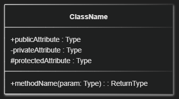
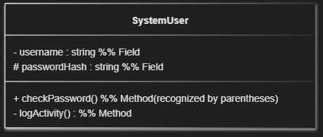
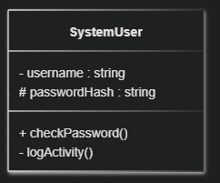
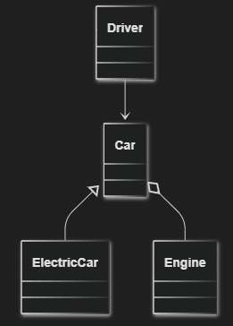
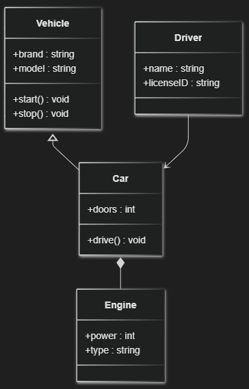
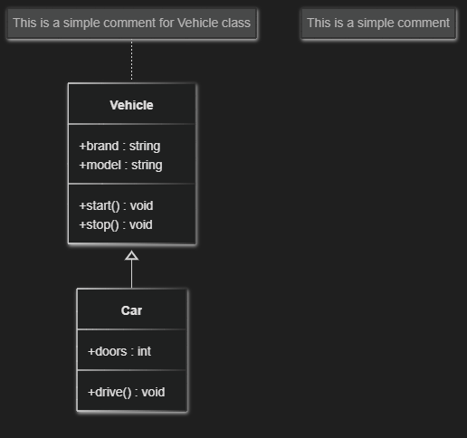

<!-- _class: lead -->

# Software Engineering

## Lecture 21

---

# Today’s Agenda

- Composition vs Aggregation
- UML Class Diagram

---

# Composition vs Aggregation

---

# Composition vs Aggregation

- The difficulty students face in distinguishing between Composition and Aggregation stems from their **foreign etymology** and lack of use in everyday language to describe object relationships.
- Since both words imply a **"Whole–Part" (Has-a)** relationship, the key to technical differentiation lies in the crucial concept of **object lifecycle dependence**.

The Core Concept: Lifetime Dependency

|**Term**|**Etymological Context**|**Technical Focus**|
|---|---|---|
|**Composition**|From Latin *componere* <br>(to put together).|**Strong Ownership**; the lifetime of the Part is **Dependent** on the Whole.|
|**Aggregation**|From Latin *aggregare* <br>(to flock together).|**Weak Ownership**; the lifetime of the Part is **Independent** of the Whole.|

---

<!-- _class: fit-70 -->

# Composition vs Aggregation

**Composition (Dependent Ownership)**

- **Definition**: The Part object cannot exist without the Container object. The Container is responsible for the Part's creation and destruction.
- **Analogy**: An Engine within a specific Car. If the Car object is destroyed, the Engine instance, being an integral component, is also logically terminated with it.

**Aggregation (Independent Ownership)**

- **Definition**: The Part object exists independently of the Container object. The Container merely holds a reference (pointer) to the Part, which was created externally and may be shared by other objects.
- **Analogy**: A Driver in a Car. The Car (container) uses the Driver (part). If the Car object is destroyed, the Driver object continues to exist and can be associated with another vehicle.

---

# The Decisive Question for Students:

**If the Whole is destroyed, does the Part still exist?**

- If the answer is **NO**, it is **COMPOSITION** (Strong Ownership).
- If the answer is **YES**, it is **AGGREGATION** (Weak/No Ownership).

---

# UML Class Diagram

---

# What Is a UML Class Diagram?

A **Class Diagram** describes the *static structure* of an object-oriented system.<br>It shows:

- **Classes** (blueprints of objects)
- **Attributes** (fields, properties)
- **Methods** (functions, behaviors)
- **Relationships** (how classes interact or depend on each other)

In simple words, it’s a **map of the system’s architecture** — what entities exist and how they’re connected.

---

# Mermaid Class Diagram Syntax

- All class diagrams must start with this directive.
- For vsc

````
```mermaid
classDiagram
````

````
```mermaid
classDiagram
class ClassName {
    +publicAttribute : Type
    -privateAttribute : Type
    #protectedAttribute : Type
    +methodName(param: Type) : ReturnType
}
````



- Mermaid often enforces a strict, single-line syntax for certain block definitions (like a node's label or flow control). **If the opening brace or bracket of a structure is placed on a new line, Mermaid's parser will typically throw an error.**

Unlike the **Graph** (Flowchart) diagram, you cannot change the rendering direction for a **Class Diagram**.

---

<!-- _class: fit-90 -->

# Mermaid Class Diagram Syntax

**Visibility Modifiers:**

\+ public

\-  private

\# protected

- In **Class Diagrams**, methods (functions defined within the object) are recognized and distinguished from fields (attributes) by the **parentheses** (()) following the name.
- While Mermaid has no problem mixing fields and methods in any order, **good practice dictates defining methods separately from fields for better readability and adherence to UML conventions.**

````
```mermaid
classDiagram
class ClassName {
    +publicAttribute : Type
    -privateAttribute : Type
    #protectedAttribute : Type
    +methodName(param: Type) : ReturnType
}
````


---

# Example of error from GPT/Gemini

````
```mermaid
classDiagram
    class SystemUser{
        - username : string    %% Field
        # passwordHash : string %% Field
        + checkPassword()      %% Method (recognized by parentheses)
        - logActivity()        %% Method
    }
````

````
```mermaid
classDiagram
    class SystemUser{
        - username : string
		%% Field
        # passwordHash : string
		%% Field
        + checkPassword()
		%% Method (recognized by parentheses)
        - logActivity()
		%% Method
    }
````





---

# Relationships Between Classes

|Relationship|Mermaid Syntax|Meaning|
|---|---|---|
|Association|A --&gt; B|A uses or knows B|
|Inheritance (Generalization)|\`A &lt;-- B\`||
|Composition|A \*-- B|B is a *part* of A (strong ownership)|
|Aggregation|A o-- B|B is *contained* in A (weak ownership)|
|Dependency|A ..&gt; B|A depends on B temporarily|
|Realization (Interface Implementation)|\`A &lt;\|.. B\`||

---

# Example



````
```mermaid
classDiagram
Car <|-- ElectricCar
Car o-- Engine
Driver --> Car
````

|Relationship|Mermaid Syntax|Meaning|
|---|---|---|
|Association|A --&gt; B|A uses or knows B|
|Inheritance (Generalization)|\`A &lt;-- B\`||
|Composition|A \*-- B|B is a *part* of A (strong ownership)|
|Aggregation|A o-- B|B is *contained* in A (weak ownership)|
|Dependency|A ..&gt; B|A depends on B temporarily|
|Realization (Interface Implementation)|\`A &lt;\|.. B\`||

---

# Example: A Simple UML Model



````
```mermaid
classDiagram
class Vehicle {
    +brand : string
    +model : string
    +start() void
    +stop() void
}
class Car {
    +doors : int
    +drive() void
}
class Engine {
    +power : int
    +type : string
}
class Driver {
    +name : string
    +licenseID : string
}
Vehicle <|-- Car
Car *-- Engine
Driver --> Car
````

This example includes:

- Inheritance (Car inherits from Vehicle)
- Composition (Car *contains* Engine)
- Association (Driver *uses* Car)

---

# Notes

````
```mermaid
classDiagram
class Vehicle {
    +brand : string
    +model : string
    +start() void
    +stop() void
}
class Car {
    +doors : int
    +drive() void
}
Vehicle <|-- Car
note for Vehicle "This is a simple comment for Vehicle class"
note "This is a simple comment"
````



---

<!-- _class: fit-90 -->

# Hints and Best Practices

- Keep diagrams small and readable. Split large systems into several smaller diagrams.
- Use meaningful names. Both class and relationship names should describe their purpose clearly.
- Avoid mixing logic with relationships. Class diagrams show structure, not behavior (that’s for activity or sequence diagrams).
- Define relationships first, labels later. Like in flowcharts, it’s easier to first map how things connect, then refine names and details.
- Use comments and notes. You can add notes in Mermaid using:
  - note for ClassName "This is a simple comment"

---

<!-- _class: caption-slide -->

# Thank You!
